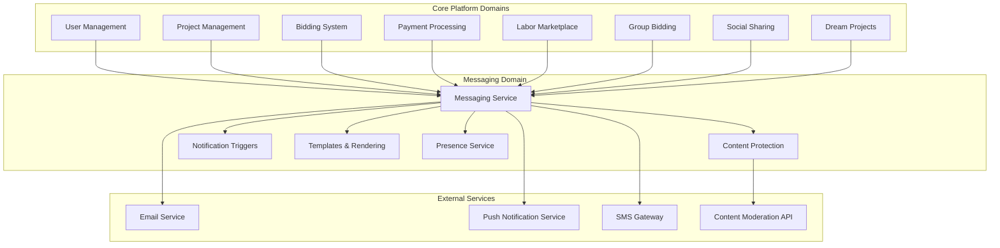
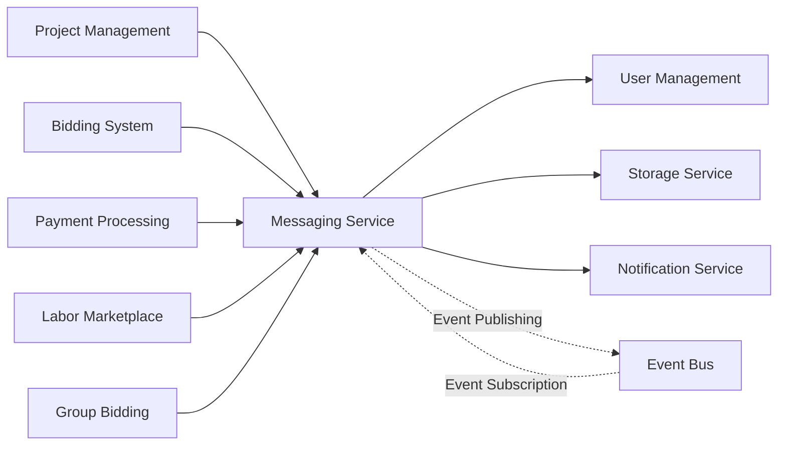

# Messaging System Integration Map

This document outlines how the Messaging system integrates with other domains and external systems within the InstaBids platform. It defines the integration points, data flows, dependencies, and communication patterns between the Messaging domain and other components.

## Integration Overview

The Messaging system serves as a central communication hub that connects users across multiple domains and provides contextual communication capabilities throughout the platform's workflows.



## Key Integration Points

### 1. User Management Integration

The Messaging system integrates with the User Management domain to authenticate users, manage permissions, and access user profiles for communication.

| Integration Point | Direction | Data/Events | Purpose |
|------------------|-----------|------------|---------|
| User Authentication | Inbound | User identity, session data | Verify message sender identity |
| User Profiles | Inbound | Profile data, contact info | Display user information in messages |
| User Presence | Bidirectional | Online status, activity | Show user availability for messaging |
| User Permissions | Inbound | Role-based permissions | Control messaging capabilities |
| User Relationships | Inbound | Connections, teams, blocks | Determine messaging access between users |

#### Implementation Details

```typescript
// Example: User Management integration for messaging permissions
export interface UserMessagingPermissions {
  canSendMessages: boolean;
  canCreateGroupChats: boolean;
  canAttachFiles: boolean;
  canSendTemplates: boolean;
  maxFileSize: number; // in bytes
  maxGroupSize: number;
  messagingRestrictions?: 'none' | 'contacts_only' | 'team_only' | 'restricted';
}

// User service integration
export interface UserMessagingService {
  // Get messaging permissions for a specific user
  getUserMessagingPermissions(userId: string): Promise<UserMessagingPermissions>;
  
  // Get user profile data for messaging display
  getUserProfileForMessaging(userId: string): Promise<UserMessagingProfile>;
  
  // Check if user can message another user
  canUserMessageUser(senderId: string, recipientId: string): Promise<boolean>;
  
  // Get users that can be messaged by this user
  getMessageableUsers(userId: string, filters?: UserFilters): Promise<UserMessagingProfile[]>;
}
```

### 2. Project Management Integration

The Messaging system integrates with Project Management to provide contextual communication around projects, tasks, and milestones.

| Integration Point | Direction | Data/Events | Purpose |
|------------------|-----------|------------|---------|
| Project Conversations | Bidirectional | Project context, thread linking | Enable project-specific discussions |
| Milestone Updates | Inbound | Milestone status changes | Trigger milestone-related messages |
| Task Discussion | Bidirectional | Task context, thread linking | Enable task-specific discussions |
| Project Members | Inbound | Team membership | Control access to project conversations |
| Project Timeline | Inbound | Deadlines, schedule | Reference timeline in messages |

#### Implementation Details

```typescript
// Example: Project Management integration for contextual messaging
export interface ProjectMessageContext {
  projectId: string;
  projectName: string;
  messageScope: 'project' | 'milestone' | 'task';
  contextId?: string; // milestone or task ID if applicable
  contextName?: string; // milestone or task name if applicable
  accessRoles: string[]; // roles with access to this conversation
  participants: string[]; // userIds of participants
}

// Project service integration
export interface ProjectMessagingService {
  // Get project context for messaging
  getProjectMessageContext(projectId: string): Promise<ProjectMessageContext>;
  
  // Create or get a conversation thread for a project context
  getProjectConversation(
    projectId: string, 
    scope: 'project' | 'milestone' | 'task',
    contextId?: string
  ): Promise<ConversationThread>;
  
  // Link a message to project timeline
  addMessageToProjectTimeline(projectId: string, messageId: string): Promise<void>;
  
  // Check if user has access to project conversation
  canAccessProjectConversation(
    userId: string, 
    projectId: string,
    scope: 'project' | 'milestone' | 'task',
    contextId?: string
  ): Promise<boolean>;
}
```

### 3. Bidding System Integration

The Messaging system integrates with the Bidding System to facilitate communication around bids, clarifications, and negotiations.

| Integration Point | Direction | Data/Events | Purpose |
|------------------|-----------|------------|---------|
| Bid Inquiries | Bidirectional | Bid context, inquiry linking | Enable bid clarification discussions |
| Quote Requests | Bidirectional | RFQ context, thread linking | Facilitate quote discussions |
| Negotiation Channel | Bidirectional | Negotiation context | Private bid negotiation communication |
| Bid Updates | Inbound | Bid status changes | Trigger bid-related notifications |
| Group Bid Coordination | Bidirectional | Group bid context | Coordinate among group bidders |

#### Implementation Details

```typescript
// Example: Bid messaging context integration
export interface BidMessagingContext {
  bidId: string;
  projectId: string;
  bidStatus: BidStatus;
  bidderUserId: string;
  projectOwnerUserId: string;
  isGroupBid: boolean;
  groupBidMembers?: string[]; // userIds of group members if applicable
  inquiryMode: 'public' | 'private'; // visibility setting for bid questions
}

// Bidding service integration
export interface BidMessagingService {
  // Get bid messaging context
  getBidMessagingContext(bidId: string): Promise<BidMessagingContext>;
  
  // Create or retrieve a bid inquiry thread
  getBidInquiryThread(bidId: string): Promise<ConversationThread>;
  
  // Send a bid clarification request
  sendBidClarificationRequest(
    bidId: string, 
    requestingUserId: string,
    question: string
  ): Promise<Message>;
  
  // Link message to bid documentation
  addMessageToBidDocumentation(bidId: string, messageId: string): Promise<void>;
}
```

### 4. Payment Processing Integration

The Messaging system integrates with Payment Processing to support communication around payment disputes, milestone releases, and payment-related inquiries.

| Integration Point | Direction | Data/Events | Purpose |
|------------------|-----------|------------|---------|
| Payment Disputes | Bidirectional | Dispute context, thread linking | Facilitate dispute resolution |
| Milestone Release | Inbound | Release requests, approvals | Coordinate milestone payment communication |
| Payment Notifications | Inbound | Payment status changes | Trigger payment-related messages |
| Invoice Discussion | Bidirectional | Invoice context, thread linking | Enable invoice-specific discussions |
| Payment Terms | Inbound | Terms reference, documentation | Reference payment terms in messages |

#### Implementation Details

```typescript
// Example: Payment dispute messaging integration
export interface PaymentDisputeMessageContext {
  disputeId: string;
  projectId: string;
  milestoneId?: string;
  disputeStatus: DisputeStatus;
  disputeAmount: number;
  currency: string;
  initiatorUserId: string;
  respondentUserId: string;
  mediatorUserId?: string;
  evidenceRequired: boolean;
}

// Payment service integration for messaging
export interface PaymentMessagingService {
  // Get payment dispute conversation
  getDisputeConversation(disputeId: string): Promise<ConversationThread>;
  
  // Submit evidence via messaging system
  submitDisputeEvidence(
    disputeId: string, 
    userId: string,
    messageId: string,
    evidenceType: 'text' | 'document' | 'photo' | 'video'
  ): Promise<void>;
  
  // Get milestone communication context
  getMilestoneMessageContext(milestoneId: string): Promise<MilestoneContext>;
  
  // Notify payment status change
  notifyPaymentStatusChange(
    paymentId: string,
    newStatus: PaymentStatus,
    recipientUserIds: string[]
  ): Promise<void>;
}
```

### 5. Labor Marketplace Integration

The Messaging system integrates with the Labor Marketplace to enable communication between contractors, helpers, and homeowners regarding labor assignments, scheduling, and qualifications.

| Integration Point | Direction | Data/Events | Purpose |
|------------------|-----------|------------|---------|
| Helper Inquiries | Bidirectional | Helper context, inquiry linking | Communication about helper roles |
| Worker Assignment | Inbound | Assignment status, notifications | Coordinate worker assignments |
| Skill Verification | Bidirectional | Skill assessment context | Discuss skill verification |
| Schedule Coordination | Bidirectional | Schedule context, availability | Coordinate scheduling with workers |
| Work Completion | Inbound | Completion verification | Verify work completion via messaging |

#### Implementation Details

```typescript
// Example: Labor integration with messaging
export interface LaborMessageContext {
  workerUserId: string;
  contractorUserId: string;
  projectId?: string;
  assignmentId?: string;
  assignmentType?: 'one_time' | 'recurring' | 'on_demand';
  skillCategory?: string;
  discussionTopic: 'scheduling' | 'skills' | 'assignment' | 'payment' | 'general';
}

// Labor service integration
export interface LaborMarketplaceMessagingService {
  // Get labor-specific conversation
  getLaborConversation(
    contractorId: string,
    workerId: string,
    contextType: 'assignment' | 'inquiry' | 'verification',
    contextId?: string
  ): Promise<ConversationThread>;
  
  // Log communication about scheduling
  logSchedulingCommunication(
    conversationId: string, 
    messageId: string,
    schedulingDetails: SchedulingDetails
  ): Promise<void>;
  
  // Link message to worker verification
  linkMessageToVerification(
    workerId: string,
    verificationId: string,
    messageId: string
  ): Promise<void>;
}
```

### 6. External Communication Services Integration

The Messaging system integrates with external communication channels to deliver messages through multiple channels and provide a unified messaging experience.

| Integration Point | Direction | Data/Events | Purpose |
|------------------|-----------|------------|---------|
| Email Gateway | Outbound | Email content, attachments | Deliver messages via email |
| SMS Gateway | Outbound | SMS content, formatting | Deliver urgent notifications via SMS |
| Push Notification | Outbound | Push content, delivery config | Deliver mobile push notifications |
| Content Moderation | Outbound | Message content | Verify message content compliance |
| Media Storage | Bidirectional | Media files, attachments | Store and retrieve message attachments |

#### Implementation Details

```typescript
// Example: External channel delivery services
export interface ExternalDeliveryOptions {
  channels: {
    email?: {
      priority: 'normal' | 'high';
      template?: string;
      attachments?: Attachment[];
    };
    sms?: {
      priority: 'normal' | 'high';
      urgent: boolean;
    };
    push?: {
      priority: 'normal' | 'high';
      badge?: number;
      sound?: string;
      action?: string;
    };
  };
  deliveryPolicy: 'all_channels' | 'until_confirmed' | 'primary_only';
  trackingOptions?: DeliveryTrackingOptions;
}

// External communication service
export interface ExternalCommunicationService {
  // Deliver message to external channels
  deliverToExternalChannels(
    message: Message,
    recipients: string[],
    options: ExternalDeliveryOptions
  ): Promise<DeliveryResults>;
  
  // Check delivery status
  checkDeliveryStatus(deliveryId: string): Promise<DeliveryStatus>;
  
  // Update external channel preferences
  updateUserChannelPreferences(
    userId: string,
    preferences: ChannelPreferences
  ): Promise<void>;
}
```

## Event-Driven Integration Model

The Messaging system follows an event-driven integration model that allows loose coupling between domains while maintaining consistent communication capabilities.

### 1. Published Events

Events published by the Messaging domain for consumption by other domains:

| Event | Description | Data Payload | Consumers |
|-------|-------------|--------------|-----------|
| `message.created` | New message created | `{ messageId, conversationId, senderId, messageType, timestamp, context }` | User Management, Project Management, Bidding, etc. |
| `message.read` | Message read by recipient | `{ messageId, conversationId, readerId, timestamp }` | User Management, Analytics |
| `message.replied` | Message replied to | `{ messageId, conversationId, replyId, originalMessageId, senderId, timestamp }` | Original domain context |
| `conversation.created` | New conversation started | `{ conversationId, creatorId, participants, context, timestamp }` | User Management, context domain |
| `conversation.updated` | Conversation updated | `{ conversationId, updaterId, changes, timestamp }` | User Management, context domain |
| `attachment.uploaded` | File attached to message | `{ attachmentId, messageId, uploaderId, fileType, fileSize, timestamp }` | Storage service, context domain |

### 2. Subscribed Events

Events consumed by the Messaging domain from other domains:

| Event | Description | Publisher | Handler Action |
|-------|-------------|-----------|---------------|
| `user.status_changed` | User online status changed | User Management | Update presence information |
| `project.created` | New project created | Project Management | Create default project conversation |
| `project.member_added` | User added to project | Project Management | Add user to project conversations |
| `bid.submitted` | New bid submitted | Bidding System | Create bid conversation thread |
| `bid.updated` | Bid status changed | Bidding System | Send bid status notification |
| `milestone.completed` | Milestone marked complete | Project Management | Create milestone review thread |
| `payment.disputed` | Payment dispute created | Payment Processing | Create dispute resolution thread |
| `helper.assigned` | Helper assigned to project | Labor Marketplace | Create helper communication thread |

## Integration Implementation

### 1. Dependency Graph



### 2. API Boundary Definitions

The Messaging system exposes the following API boundaries to other domains:

#### Conversation Management API

```typescript
// Create a new conversation
POST /api/v1/conversations
{
  "participants": ["user-123", "user-456"],
  "contextType": "project", // or "bid", "milestone", "dispute", etc.
  "contextId": "project-789",
  "metadata": {
    // Context-specific metadata
  }
}

// Get conversations for a user
GET /api/v1/users/{userId}/conversations?contextType=project&contextId=project-789

// Get conversation messages
GET /api/v1/conversations/{conversationId}/messages?limit=20&before=message-456
```

#### Message Sending API

```typescript
// Send a message
POST /api/v1/conversations/{conversationId}/messages
{
  "senderId": "user-123",
  "content": {
    "text": "When can we schedule the inspection?",
    "format": "text" // or "html", "markdown"
  },
  "attachments": [
    {
      "type": "image",
      "url": "https://storage.instabids.com/attachments/image-123.jpg",
      "name": "Site photo",
      "metadata": {
        "width": 1200,
        "height": 800,
        "size": 256000
      }
    }
  ],
  "contextData": {
    // Domain-specific context data
  }
}
```

#### Notification API

```typescript
// Send a notification via messaging system
POST /api/v1/notifications
{
  "recipients": ["user-123", "user-456"],
  "content": {
    "title": "Bid accepted",
    "body": "Your bid for Project XYZ has been accepted"
  },
  "contextType": "bid",
  "contextId": "bid-789",
  "urgency": "normal", // or "high", "low"
  "channels": ["in_app", "email", "sms"],
  "actions": [
    {
      "name": "View Bid",
      "url": "/bids/bid-789"
    }
  ]
}
```

### 3. Integration Configuration

The Messaging system uses the following configuration for domain integration:

```json
{
  "integrations": {
    "userManagement": {
      "serviceEndpoint": "${USER_SERVICE_URL}/api/v1",
      "eventSubscriptions": ["user.created", "user.updated", "user.deleted", "user.status_changed"],
      "cacheConfig": {
        "userProfileTtl": 300,
        "userPermissionsTtl": 60
      }
    },
    "projectManagement": {
      "serviceEndpoint": "${PROJECT_SERVICE_URL}/api/v1",
      "eventSubscriptions": ["project.created", "project.updated", "project.member_added", "project.member_removed", "milestone.created", "milestone.completed"],
      "conversationTypes": ["project", "milestone", "task"]
    },
    "biddingSystem": {
      "serviceEndpoint": "${BIDDING_SERVICE_URL}/api/v1",
      "eventSubscriptions": ["bid.submitted", "bid.updated", "bid.accepted", "bid.rejected", "inquiry.created"],
      "conversationTypes": ["bid", "inquiry", "negotiation"]
    },
    "paymentProcessing": {
      "serviceEndpoint": "${PAYMENT_SERVICE_URL}/api/v1",
      "eventSubscriptions": ["payment.initiated", "payment.completed", "payment.failed", "dispute.created", "dispute.updated", "dispute.resolved"],
      "conversationTypes": ["dispute", "milestone_release", "invoice"]
    },
    "laborMarketplace": {
      "serviceEndpoint": "${LABOR_SERVICE_URL}/api/v1",
      "eventSubscriptions": ["helper.assigned", "helper.removed", "skill.verified", "schedule.updated"],
      "conversationTypes": ["helper_assignment", "skill_verification", "scheduling"]
    },
    "externalDelivery": {
      "email": {
        "serviceEndpoint": "${EMAIL_SERVICE_URL}/api/v1",
        "maxAttachmentSize": 10485760, // 10MB
        "rateLimit": 100 // per minute
      },
      "sms": {
        "serviceEndpoint": "${SMS_SERVICE_URL}/api/v1",
        "maxMessageLength": 160,
        "rateLimit": 10 // per minute
      },
      "push": {
        "serviceEndpoint": "${PUSH_SERVICE_URL}/api/v1",
        "maxPayloadSize": 4096, // 4KB
        "rateLimit": 60 // per minute
      }
    },
    "contentModeration": {
      "serviceEndpoint": "${MODERATION_SERVICE_URL}/api/v1",
      "moderationLevel": "standard", // or "strict", "minimal"
      "enabledFor": ["text", "image"]
    }
  }
}
```

## Integration Testing Strategy

The following testing strategy ensures reliable integration between the Messaging system and other domains:

1. **Contract Tests**: Verify that the messaging API adheres to its contract with consumers
2. **Event Flow Tests**: Validate the flow of events between domains and proper message creation
3. **End-to-End Tests**: Test complete workflows involving messaging across domain boundaries
4. **Fault Injection**: Test system resilience when dependent services are unavailable
5. **Performance Tests**: Validate messaging performance under various integration loads

### Example: Bid Communication Integration Test

```typescript
describe('Bid Communication Integration', () => {
  it('should create a conversation when bid is submitted', async () => {
    // 1. Create a test project
    const project = await testUtils.createTestProject();
    
    // 2. Submit a bid as a contractor
    const bid = await bidService.submitBid({
      projectId: project.id,
      contractorId: testContractor.id,
      amount: 5000,
      description: 'Test bid description'
    });
    
    // 3. Verify conversation was created
    const conversations = await messagingService.getConversations({
      contextType: 'bid',
      contextId: bid.id
    });
    
    expect(conversations).toHaveLength(1);
    expect(conversations[0].participants).toContain(testContractor.id);
    expect(conversations[0].participants).toContain(project.ownerId);
    
    // 4. Verify initial message was sent
    const messages = await messagingService.getMessages(conversations[0].id);
    expect(messages).toHaveLength(1);
    expect(messages[0].systemGenerated).toBe(true);
    expect(messages[0].content.text).toContain('Bid submitted');
  });
});
```

## Security Considerations

The following security considerations are important for messaging integration:

1. **Access Control**: Ensure proper authorization checks when accessing messages across domain boundaries
2. **Data Segregation**: Maintain proper separation of messaging data between different projects and contexts
3. **Secure Event Flow**: Properly validate and sanitize event data received from other domains
4. **Audit Logging**: Log all cross-domain message access for security audit purposes
5. **Context Validation**: Verify that users have access to the referenced context before allowing messaging

### Example: Security Validation

```typescript
// Example of security validation for cross-domain message access
async function validateMessageAccess(userId: string, messageId: string): Promise<boolean> {
  // 1. Get the message
  const message = await messageRepository.findById(messageId);
  if (!message) {
    return false;
  }
  
  // 2. Get the conversation
  const conversation = await conversationRepository.findById(message.conversationId);
  if (!conversation) {
    return false;
  }
  
  // 3. Check direct conversation membership
  if (conversation.participants.includes(userId)) {
    return true;
  }
  
  // 4. Check context-based access if applicable
  if (conversation.contextType && conversation.contextId) {
    // 5. Validate access through the appropriate domain service
    switch (conversation.contextType) {
      case 'project':
        return projectService.hasAccess(userId, conversation.contextId);
      case 'bid':
        return bidService.hasAccess(userId, conversation.contextId);
      case 'dispute':
        return paymentService.hasDisputeAccess(userId, conversation.contextId);
      // Other context types
      default:
        return false;
    }
  }
  
  return false;
}
```

## Integration Monitoring

The following metrics are tracked to monitor the health of messaging integration with other domains:

1. **Cross-Domain Message Volume**: Track message volume between different domains
2. **Integration Latency**: Measure time from domain event to message creation
3. **Event Processing Errors**: Track failures in event processing
4. **API Boundary Metrics**: Monitor performance and errors at integration points
5. **Conversation Context Distribution**: Track usage patterns across different context types

## Future Integration Roadmap

### Phase 1: Core Domain Integration
- Complete bidirectional integration with Project Management
- Establish secure event flow with User Management
- Implement basic Bidding System integration

### Phase 2: Enhanced Domain Integration
- Implement Payment Processing dispute resolution integration
- Develop Labor Marketplace communication channels
- Add Group Bidding coordination features

### Phase 3: Advanced Integration Features
- Implement cross-domain search capabilities
- Add AI-powered context-aware suggestions
- Develop advanced analytics across domain boundaries
