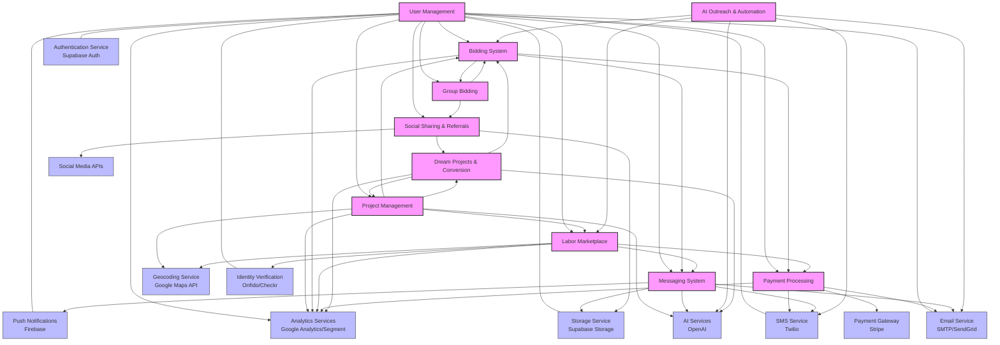
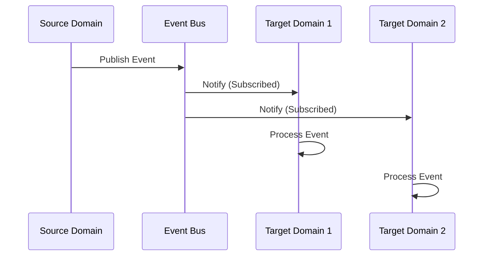
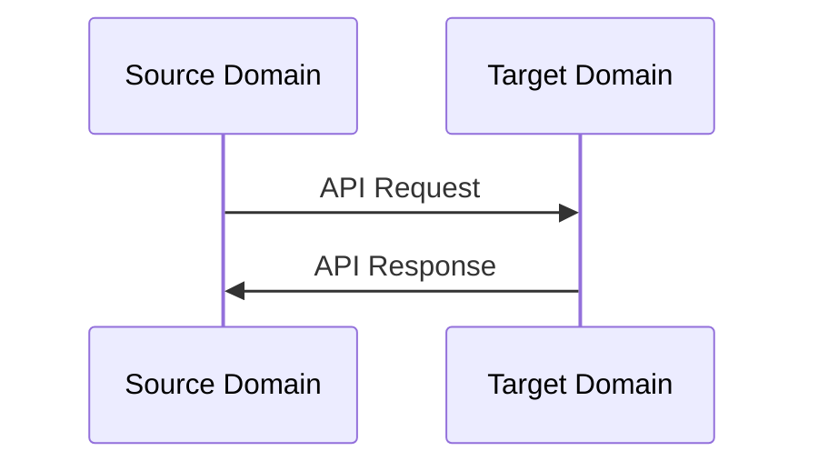
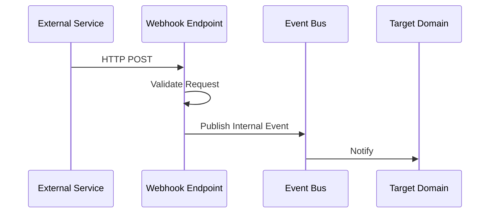
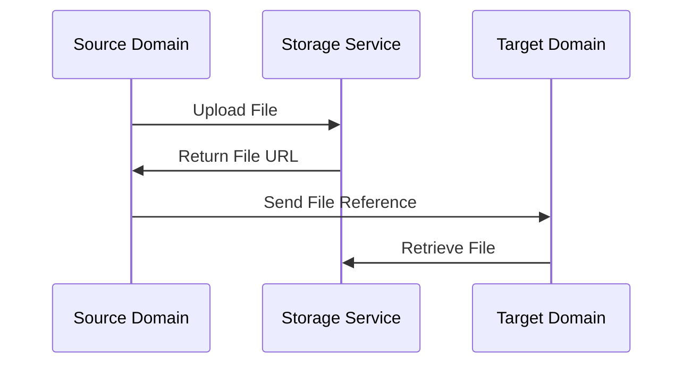

# InstaBids System Integration Map

This document provides a comprehensive overview of the system integration architecture for the InstaBids platform. It illustrates how different domains interact with each other and with external services, highlighting the data flows, integration patterns, and key touchpoints.

## System Architecture Integration Diagram

The following diagram shows the high-level system architecture and how the different domains interact with each other and external services:

## Domain Integration Details

### User Management Domain Integrations

| Integration Target | Integration Type | Description | Data Flow |
|-------------------|-----------------|-------------|-----------|
| Authentication Service | External API | User authentication, registration, password management | Bidirectional |
| Storage Service | External API | User profile photos, document storage | Outbound |
| Verification Services | External API | Identity verification, background checks | Bidirectional |
| Bidding System | Domain API | User permissions, profile data | Outbound |
| Project Management | Domain API | User permissions, profile data | Outbound |
| Labor Marketplace | Domain API | User permissions, profile data | Outbound |
| Messaging System | Domain API | User permissions, contact information | Outbound |
| Payment Processing | Domain API | User billing information, payment methods | Outbound |
| Email/SMS Services | External API | User notifications, verification codes | Outbound |

### Project Management Domain Integrations

| Integration Target | Integration Type | Description | Data Flow |
|-------------------|-----------------|-------------|-----------|
| User Management | Domain API | User profile data, permissions | Inbound |
| Bidding System | Domain API | Project requirements, timelines | Outbound |
| Labor Marketplace | Domain API | Project requirements, job postings | Outbound |
| Dream Projects | Domain API | Project templates, conversion | Bidirectional |
| Geocoding Service | External API | Project location data | Outbound |
| AI Services | External API | Project planning, recommendations | Bidirectional |
| Storage Service | External API | Project files, photos, documents | Outbound |

### Bidding System Domain Integrations

| Integration Target | Integration Type | Description | Data Flow |
|-------------------|-----------------|-------------|-----------|
| User Management | Domain API | Contractor profiles, permissions | Inbound |
| Project Management | Domain API | Project requirements, timelines | Inbound |
| Payment Processing | Domain API | Bid amounts, payment terms | Outbound |
| Messaging System | Domain API | Bid clarifications, negotiations | Outbound |
| Group Bidding | Domain API | Bid aggregation, group discounts | Bidirectional |
| AI Outreach | Domain API | Automated contractor outreach | Inbound |

### Labor Marketplace Domain Integrations

| Integration Target | Integration Type | Description | Data Flow |
|-------------------|-----------------|-------------|-----------|
| User Management | Domain API | Helper profiles, permissions | Inbound |
| Project Management | Domain API | Work requirements, job postings | Inbound |
| Payment Processing | Domain API | Payment for services, escrow | Outbound |
| Messaging System | Domain API | Work coordination, status updates | Outbound |
| Verification Services | External API | Identity verification, background checks | Bidirectional |
| Geocoding Service | External API | Worker location, job sites | Outbound |

### Payment Processing Domain Integrations

| Integration Target | Integration Type | Description | Data Flow |
|-------------------|-----------------|-------------|-----------|
| User Management | Domain API | Billing information, payment methods | Inbound |
| Bidding System | Domain API | Bid amounts, payment schedules | Inbound |
| Labor Marketplace | Domain API | Work payments, milestone releases | Inbound |
| Payment Gateway | External API | Payment processing, escrow management | Bidirectional |
| Email/SMS Services | External API | Payment notifications, receipts | Outbound |

### Messaging System Domain Integrations

| Integration Target | Integration Type | Description | Data Flow |
|-------------------|-----------------|-------------|-----------|
| User Management | Domain API | Contact information, permissions | Inbound |
| Bidding System | Domain API | Bid-related communications | Inbound |
| Labor Marketplace | Domain API | Work coordination communications | Inbound |
| Email Service | External API | Email notifications, message forwarding | Outbound |
| SMS Service | External API | Text notifications, alerts | Outbound |
| Push Notification Service | External API | Mobile notifications | Outbound |
| Storage Service | External API | Message attachments, images | Outbound |
| AI Services | External API | Message filtering, content protection | Bidirectional |

### Group Bidding Domain Integrations

| Integration Target | Integration Type | Description | Data Flow |
|-------------------|-----------------|-------------|-----------|
| User Management | Domain API | Group member profiles | Inbound |
| Bidding System | Domain API | Collective bid creation, discounts | Bidirectional |
| Social Sharing | Domain API | Group invitations, social sharing | Outbound |

### Social Sharing & Referrals Domain Integrations

| Integration Target | Integration Type | Description | Data Flow |
|-------------------|-----------------|-------------|-----------|
| User Management | Domain API | User profiles, referral data | Inbound |
| Group Bidding | Domain API | Group invitation sharing | Inbound |
| Dream Projects | Domain API | Project inspiration sharing | Bidirectional |
| Social Media APIs | External API | Social platform sharing | Outbound |
| Storage Service | External API | Shared media, content | Outbound |

### Dream Projects & Conversion Domain Integrations

| Integration Target | Integration Type | Description | Data Flow |
|-------------------|-----------------|-------------|-----------|
| User Management | Domain API | User profiles, preferences | Inbound |
| Project Management | Domain API | Project creation, specifications | Bidirectional |
| Bidding System | Domain API | Initial bid estimates | Outbound |
| Social Sharing | Domain API | Inspiration sharing | Bidirectional |
| AI Services | External API | Project visualization, suggestions | Bidirectional |

### AI Outreach & Automation Domain Integrations

| Integration Target | Integration Type | Description | Data Flow |
|-------------------|-----------------|-------------|-----------|
| Bidding System | Domain API | Contractor discovery, bid requests | Outbound |
| Labor Marketplace | Domain API | Helper discovery, job matching | Outbound |
| Email Service | External API | Automated outreach emails | Outbound |
| SMS Service | External API | Automated outreach texts | Outbound |
| AI Services | External API | Message personalization, optimization | Bidirectional |

## Integration Patterns

The InstaBids system implements the following integration patterns:

### 1. Event-Driven Integration

The system uses an event-driven architecture for cross-domain communication:

Key characteristics:
- Loose coupling between domains
- Asynchronous communication
- Domain event publishing/subscribing
- Event correlation and tracking
- Event persistence for reliability

### 2. API-Based Integration

Direct API calls are used for synchronous integrations:

Key characteristics:
- Strong typing through contracts (TypeScript interfaces)
- RESTful principles for external APIs
- Domain-specific internal APIs
- Versioning for backward compatibility
- Error handling and fallback strategies

### 3. Webhook Integration

For external services that need to push data to InstaBids:

Key characteristics:
- Signature verification for security
- Idempotent processing with event IDs
- Retry mechanisms for failed deliveries
- Payload validation and transformation

### 4. File-Based Integration

For handling document and media exchanges:

Key characteristics:
- URL-based file references
- Content-type handling
- Access control for sensitive files
- Temporary URLs for time-limited access

## External Service Integration Details

### Authentication Service (Supabase Auth)

- **Integration Method**: REST API, SDK
- **Authentication Flow**:
  - JWT-based authentication
  - Refresh token rotation
  - Password recovery workflows
  - Social login providers
- **Security Measures**:
  - HTTPS for all communications
  - Token expiration and refresh
  - IP-based rate limiting

### Storage Service (Supabase Storage)

- **Integration Method**: REST API, SDK
- **Key Capabilities**:
  - Upload/download files
  - Generate signed URLs
  - Manage access permissions
  - Organize files by buckets

### Payment Gateway (Stripe)

- **Integration Method**: REST API, SDK, Webhooks
- **Key Capabilities**:
  - Payment processing
  - Subscription management
  - Escrow account management
  - Connect platform for marketplace
  - Dispute management
- **Webhook Events**:
  - Payment succeeded/failed
  - Dispute created/resolved
  - Account updates

### Geocoding Service (Google Maps API)

- **Integration Method**: REST API
- **Key Capabilities**:
  - Address geocoding
  - Distance calculations
  - Location autocomplete
  - Map rendering (frontend)

### Email Service (SMTP/SendGrid)

- **Integration Method**: SMTP, REST API
- **Key Capabilities**:
  - Transactional emails
  - Email templates
  - Delivery tracking

### SMS Service (Twilio)

- **Integration Method**: REST API
- **Key Capabilities**:
  - SMS notifications
  - Verification codes
  - Delivery status tracking

### Push Notification Service (Firebase)

- **Integration Method**: REST API, SDK
- **Key Capabilities**:
  - Cross-platform push notifications
  - Topic-based messaging
  - Message analytics

### Identity Verification Services (Onfido/Checkr)

- **Integration Method**: REST API, Webhooks
- **Key Capabilities**:
  - ID document verification
  - Background checks
  - Address verification
  - Criminal record checks
- **Webhook Events**:
  - Verification completed
  - Check status updates

### AI Services (OpenAI)

- **Integration Method**: REST API
- **Key Capabilities**:
  - Content generation and enhancement
  - Natural language processing
  - Content moderation
  - Project planning assistance
  - Message personalization

### Social Media APIs

- **Integration Method**: REST API, SDK, OAuth
- **Key Capabilities**:
  - Social sharing
  - Content publishing
  - Auth via social accounts

## Fallback Strategies

The system implements the following fallback strategies for handling integration failures:

### Service Degradation

When non-critical external services are unavailable:

1. **Functionality Degradation**: System continues with reduced functionality
2. **User Notification**: Clear messaging about limited features
3. **Alternative Workflows**: Offer manual alternatives where possible

### Retry Management

For temporary service outages:

1. **Exponential Backoff**: Increasing delays between retry attempts
2. **Circuit Breaker**: Temporarily disable integration after multiple failures
3. **Fallback Cache**: Use cached data when available

### Asynchronous Processing

For performance-critical operations:

1. **Queue-Based Processing**: Enqueue operations for background processing
2. **Status Updates**: Provide status tracking for long-running operations
3. **Notification on Completion**: Alert users when processing completes

## Monitoring and Reliability

The system includes the following monitoring for integration health:

1. **Health Checks**: Regular probing of service endpoints
2. **Latency Tracking**: Monitor response times for external services
3. **Error Rate Monitoring**: Track failed requests and error types
4. **Dependency Graphs**: Visualize service dependencies for impact analysis
5. **SLA Monitoring**: Track compliance with service level agreements

## Data Consistency Strategies

The system implements these strategies for maintaining data consistency across integrations:

1. **Event Sourcing**: Record all changes as a sequence of events
2. **Eventual Consistency**: Accept temporary inconsistencies with reconciliation
3. **SAGA Pattern**: Coordinate distributed transactions with compensating actions
4. **Idempotent Operations**: Ensure operations can be retried safely

## Security Considerations

The following security measures are implemented for all integrations:

1. **API Authentication**: All API calls require authentication
2. **Request Signing**: Sign requests to external services for verification
3. **Data Encryption**: Encrypt sensitive data in transit and at rest
4. **Rate Limiting**: Prevent abuse through request limiting
5. **Input Validation**: Validate all input data before processing
6. **Audit Logging**: Record all integration events for audit trails
