# Payment Processing Integration Map

This document outlines the integration points, event flows, and service dependencies for the Payment Processing domain of the InstaBids platform. It provides developers with a comprehensive guide to understanding how the payment system interacts with other domains and external services.

## Integration Overview

The Payment Processing domain serves as the financial core of the InstaBids platform, handling all monetary transactions between homeowners, contractors, helpers, and the platform itself. It integrates with multiple internal domains and external services to provide secure, compliant, and reliable payment capabilities.

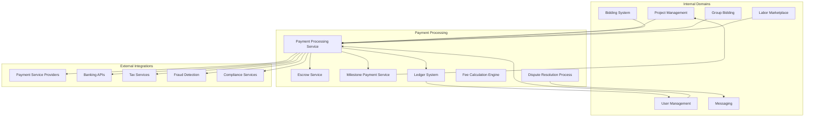

## Event-Driven Integration Model

The Payment Processing domain uses an event-driven architecture to integrate with other parts of the platform, ensuring loose coupling and high resilience.

### Published Events

| Event | Description | Publishing Service | Consuming Services | Payload Example |
|-------|-------------|-------------------|-------------------|-----------------|
| `payment.initiated` | Payment process has started | Payment Service | Project Management, User Management | `{ "paymentId": "pay_123", "amount": 1000.00, "currency": "USD", "projectId": "proj_456", "payerId": "user_789", "payeeId": "user_101" }` |
| `payment.processed` | Payment has been successfully processed | Payment Service | Project Management, User Management, Notifications | `{ "paymentId": "pay_123", "status": "succeeded", "processingDetails": { "processor": "stripe", "transactionId": "tx_456" } }` |
| `payment.failed` | Payment processing failed | Payment Service | Project Management, User Management, Notifications | `{ "paymentId": "pay_123", "status": "failed", "errorCode": "insufficient_funds", "errorMessage": "Card has insufficient funds" }` |
| `milestone.funded` | Milestone escrow has been funded | Escrow Service | Project Management, User Management | `{ "milestoneId": "ms_123", "projectId": "proj_456", "amount": 500.00, "fundedAt": "2025-03-18T15:30:00Z" }` |
| `milestone.released` | Milestone payment has been released from escrow | Milestone Service | Project Management, User Management, Notifications | `{ "milestoneId": "ms_123", "projectId": "proj_456", "releasedAmount": 500.00, "recipientId": "user_101", "releasedAt": "2025-03-20T09:45:00Z" }` |
| `dispute.created` | Payment dispute has been created | Dispute Service | Project Management, User Management, Messaging | `{ "disputeId": "disp_123", "paymentId": "pay_123", "projectId": "proj_456", "initiatorId": "user_789", "reason": "work_quality", "createdAt": "2025-03-21T14:20:00Z" }` |
| `dispute.resolved` | Payment dispute has been resolved | Dispute Service | Project Management, User Management, Messaging, Notifications | `{ "disputeId": "disp_123", "resolution": "refund_partial", "refundAmount": 200.00, "resolutionNote": "Partial refund for incomplete work", "resolvedAt": "2025-03-25T16:10:00Z" }` |
| `fee.calculated` | Platform fee has been calculated | Fee Service | Payment Service, Ledger Service | `{ "feeId": "fee_123", "paymentId": "pay_123", "feeAmount": 50.00, "feeType": "platform_standard", "calculatedAt": "2025-03-18T15:32:00Z" }` |

### Subscribed Events

| Event | Description | Publishing Service | Handler | Action |
|-------|-------------|-------------------|---------|--------|
| `project.created` | New project has been created | Project Management | Payment Configuration Handler | Create payment configuration for project |
| `bid.accepted` | Bid has been accepted | Bidding System | Payment Initialization Handler | Initialize payment structure based on bid |
| `milestone.created` | New milestone has been created | Project Management | Escrow Configuration Handler | Create escrow account for milestone |
| `milestone.completed` | Milestone marked as complete | Project Management | Milestone Payment Handler | Initiate milestone payment release process |
| `user.verified` | User verification level changed | User Management | Payment Limits Handler | Update user payment limits based on verification level |
| `groupbid.payment_share_defined` | Group bid payment distribution defined | Group Bidding | Payment Distribution Handler | Configure split payment for contractor team |
| `helper.hired` | Helper hired for project | Labor Marketplace | Payment Configuration Handler | Add helper to payment recipients list |

## Service Interface Integration

### Project Management Integration

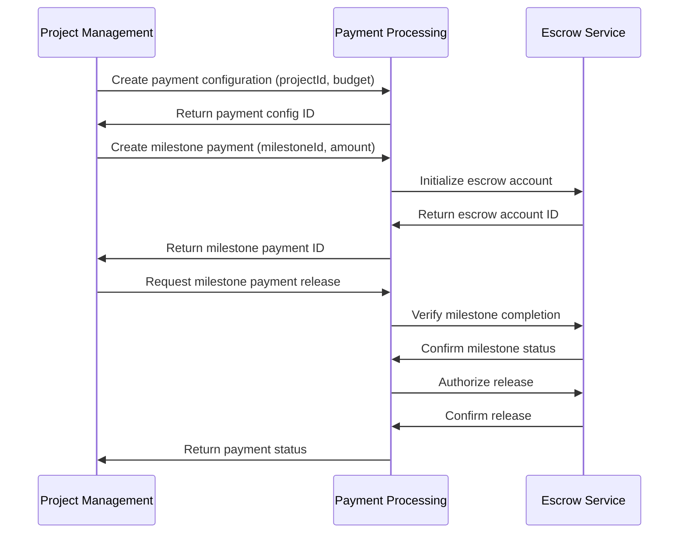

#### Interface Definition

```typescript
// Project Management -> Payment Processing
interface ProjectPaymentConfigRequest {
  projectId: string;
  budget: {
    amount: number;
    currency: string;
  };
  paymentStructure: 'milestone' | 'fixed' | 'hourly';
  ownerId: string;
  contractorId?: string; // Optional if not assigned yet
}

interface MilestonePaymentRequest {
  projectId: string;
  milestoneId: string;
  name: string;
  description: string;
  amount: number;
  dueDate?: Date;
  dependencies?: string[]; // IDs of dependent milestones
}

interface MilestoneReleaseRequest {
  projectId: string;
  milestoneId: string;
  completionProof?: {
    documentIds: string[];
    completionNotes: string;
  };
}

// Payment Processing -> Project Management
interface PaymentStatusUpdate {
  projectId: string;
  milestoneId?: string;
  status: 'pending' | 'processing' | 'completed' | 'failed' | 'disputed';
  amount: number;
  processedAt: Date;
  transactionId: string;
}
```

### User Management Integration

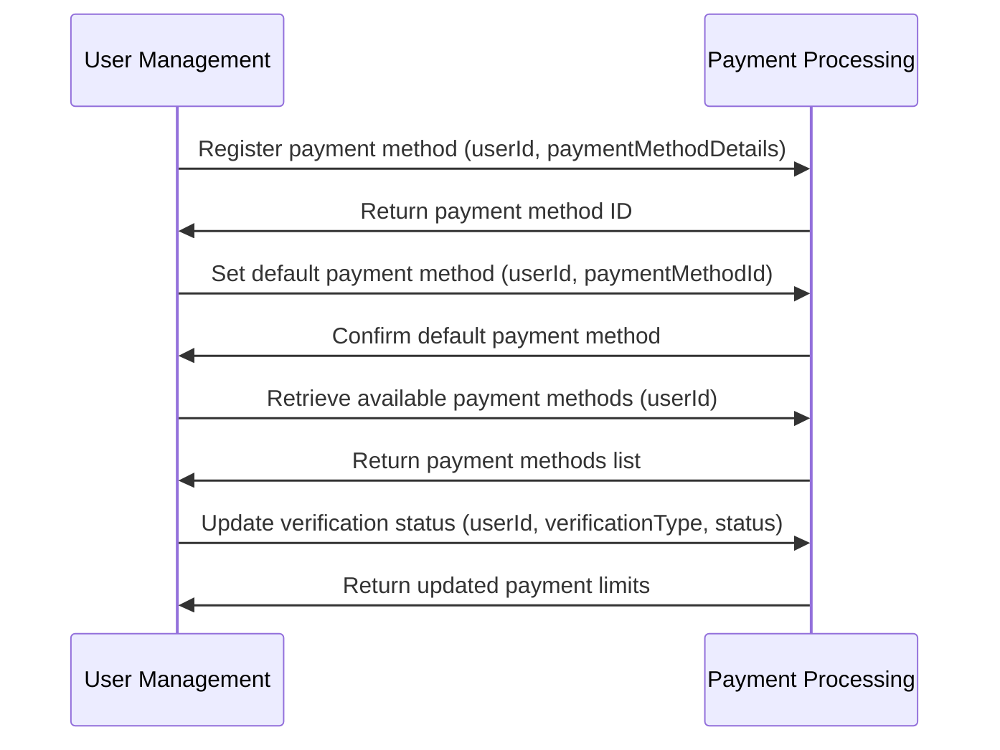

#### Interface Definition

```typescript
// User Management -> Payment Processing
interface PaymentMethodRegistrationRequest {
  userId: string;
  type: 'credit_card' | 'bank_account' | 'digital_wallet';
  details: CreditCardDetails | BankAccountDetails | DigitalWalletDetails;
  billingAddress?: Address;
  isDefault?: boolean;
}

interface VerificationStatusUpdate {
  userId: string;
  verificationType: 'identity' | 'address' | 'professional_license';
  status: 'pending' | 'verified' | 'rejected';
  verificationProofIds?: string[];
}

// Payment Processing -> User Management
interface PaymentLimitsUpdate {
  userId: string;
  limits: {
    singleTransactionLimit: number;
    dailyLimit: number;
    monthlyLimit: number;
    escrowEnabled: boolean;
    instantPayoutsEnabled: boolean;
  };
  updatedAt: Date;
}
```

### Bidding System Integration

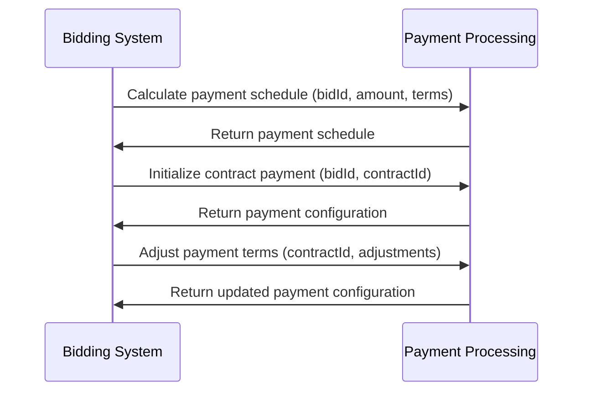

#### Interface Definition

```typescript
// Bidding System -> Payment Processing
interface PaymentScheduleRequest {
  bidId: string;
  projectId: string;
  amount: number;
  currency: string;
  terms: {
    paymentStructure: 'milestone' | 'fixed' | 'hourly';
    depositPercentage?: number;
    milestones?: {
      name: string;
      percentOfTotal: number;
      estimatedDate?: Date;
    }[];
  };
}

interface ContractPaymentInitRequest {
  bidId: string;
  contractId: string;
  projectId: string;
  homeownerId: string;
  contractorId: string;
  startDate: Date;
  endDate?: Date;
}

// Payment Processing -> Bidding System
interface PaymentScheduleResponse {
  scheduleId: string;
  milestones: {
    id: string;
    name: string;
    amount: number;
    estimatedDate?: Date;
    status: 'pending' | 'active' | 'completed' | 'paid';
  }[];
  deposit: {
    amount: number;
    dueDate: Date;
  };
  totalAmount: number;
  currency: string;
}
```

### Group Bidding Integration

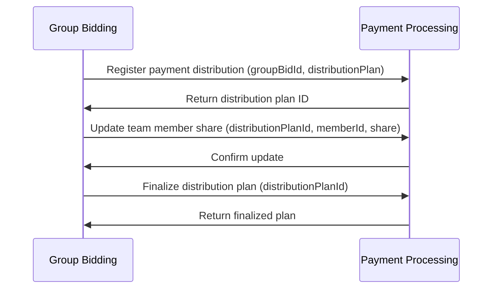

#### Interface Definition

```typescript
// Group Bidding -> Payment Processing
interface PaymentDistributionRequest {
  groupBidId: string;
  projectId: string;
  teamLeadId: string;
  members: {
    userId: string;
    role: string;
    sharePercentage: number;
    components: string[]; // IDs of bid components
  }[];
  totalAmount: number;
  currency: string;
}

interface MemberShareUpdateRequest {
  distributionPlanId: string;
  memberId: string;
  updatedSharePercentage: number;
  reason: string;
  approvedBy: string[];
}

// Payment Processing -> Group Bidding
interface DistributionPlanResponse {
  planId: string;
  status: 'draft' | 'finalized' | 'in_progress' | 'completed';
  members: {
    userId: string;
    sharePercentage: number;
    estimatedAmount: number;
    paymentMethod?: string;
    paymentStatus: 'pending' | 'paid' | 'failed';
  }[];
  platformFee: number;
  netTotalAmount: number;
}
```

### Labor Marketplace Integration

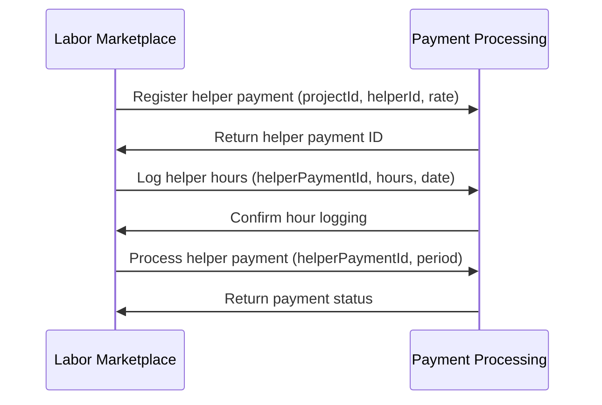

#### Interface Definition

```typescript
// Labor Marketplace -> Payment Processing
interface HelperPaymentRegistrationRequest {
  projectId: string;
  contractorId: string;
  helperId: string;
  rate: {
    amount: number;
    currency: string;
    per: 'hour' | 'day' | 'week' | 'fixed';
  };
  estimatedHours?: number;
  startDate: Date;
  endDate?: Date;
}

interface HelperHoursLogRequest {
  helperPaymentId: string;
  hours: number;
  date: Date;
  description: string;
  taskIds?: string[];
  approvedBy?: string; // Contractor ID
}

interface HelperPaymentProcessRequest {
  helperPaymentId: string;
  periodStart: Date;
  periodEnd: Date;
  totalHours?: number;
  adjustments?: {
    amount: number;
    reason: string;
  }[];
}

// Payment Processing -> Labor Marketplace
interface HelperPaymentStatusUpdate {
  helperPaymentId: string;
  helperId: string;
  contractorId: string;
  amount: number;
  status: 'pending' | 'processing' | 'completed' | 'failed';
  processedAt: Date;
  periodCovered: {
    start: Date;
    end: Date;
  };
}
```

## External Service Integration

### Payment Service Providers

The InstaBids platform integrates with multiple payment service providers to ensure flexibility, redundancy, and global coverage. The primary integrations include:

1. **Stripe**
   - Primary provider for credit card processing
   - ACH transfers in the United States
   - Support for 135+ currencies

2. **PayPal**
   - Alternative payment option for users
   - Digital wallet support
   - International payments

3. **Plaid**
   - Bank account verification and linking
   - Account information retrieval
   - Identity verification support

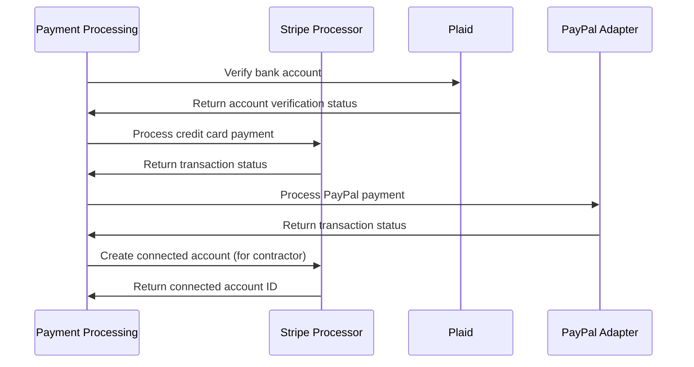

### Integration Strategy

The Payment Processing service uses an adapter pattern to abstract payment provider implementations, allowing for:

1. **Provider Switching**: Seamlessly switch between providers based on:
   - Transaction type
   - Geographic region
   - Pricing optimization
   - Availability and performance

2. **Redundancy**: Fall back to alternative providers during outages

3. **Optimal Routing**: Select the most cost-effective provider for each transaction type

```typescript
// Generic payment provider interface
interface PaymentProviderAdapter {
  processPayment(request: PaymentRequest): Promise<PaymentResponse>;
  refundPayment(transactionId: string, amount: number): Promise<RefundResponse>;
  createAccount(userDetails: UserAccountDetails): Promise<AccountResponse>;
  verifyAccount(accountId: string, verificationType: string): Promise<VerificationResponse>;
  getPaymentStatus(transactionId: string): Promise<PaymentStatusResponse>;
}

// Provider factory for runtime selection
class PaymentProviderFactory {
  static getProvider(
    transactionType: TransactionType,
    region: string,
    amount: number
  ): PaymentProviderAdapter {
    // Logic to select optimal provider
    if (isStripePreferred(transactionType, region, amount)) {
      return new StripeAdapter();
    } else if (isPayPalPreferred(transactionType, region, amount)) {
      return new PayPalAdapter();
    } else {
      return new FallbackAdapter();
    }
  }
}
```

### Banking API Integration

For direct bank transfers, escrow services, and financial institution verification, the platform integrates with banking APIs:

1. **Account Verification**
   - Verify account ownership
   - Confirm account details and status

2. **Direct Transfers**
   - ACH transfers in the US
   - SEPA transfers in Europe
   - Wire transfers internationally

3. **Escrow Services**
   - Dedicated escrow accounts for milestone payments
   - Interest-bearing options for long-term projects

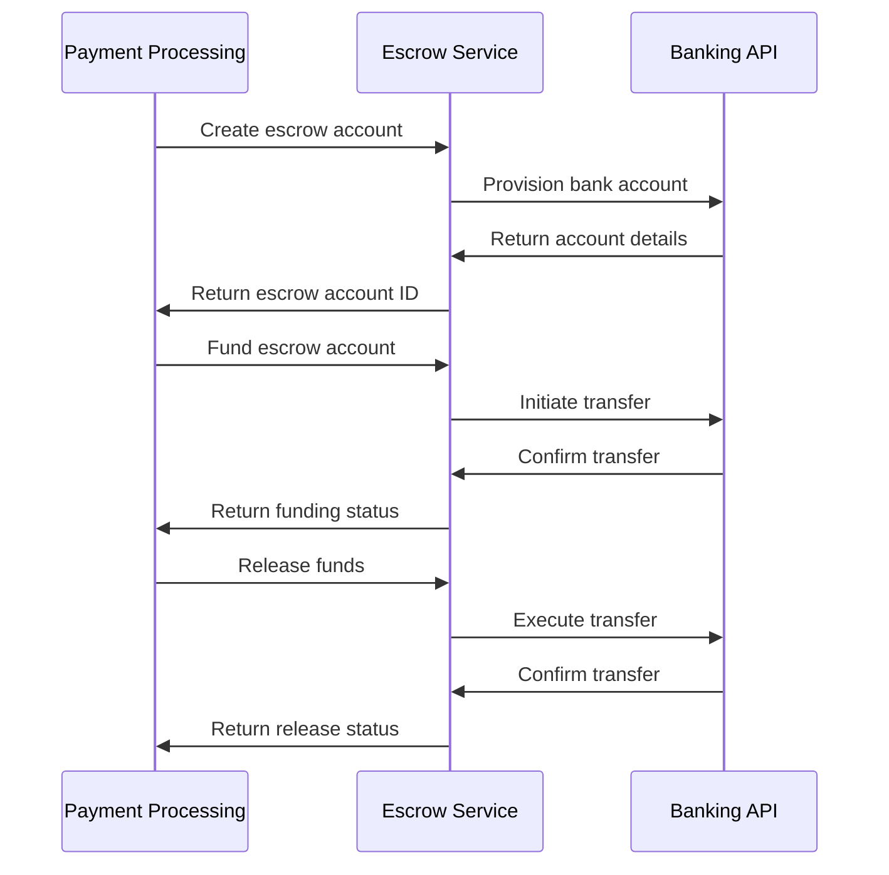

### Tax Services Integration

The platform integrates with tax services to ensure compliance with tax regulations across different jurisdictions:

1. **Tax Calculation**
   - Automatically calculate applicable taxes based on:
     - Transaction type
     - Geographic location
     - User classification (business vs. individual)

2. **Tax Document Generation**
   - Generate 1099 forms for contractors in the US
   - Create VAT invoices for European transactions
   - Issue tax receipts as required by local regulations

3. **Tax Reporting**
   - Automated tax reporting to relevant authorities
   - User tax summary generation

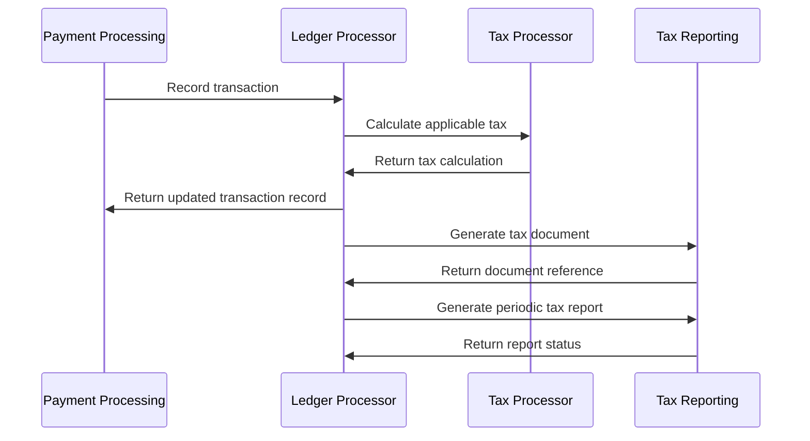

### Fraud Detection Integration

To protect users and the platform, comprehensive fraud detection services are integrated:

1. **Transaction Monitoring**
   - Real-time risk scoring of transactions
   - Anomaly detection based on user history
   - Geographic and behavioral patterns analysis

2. **Identity Verification**
   - Multi-factor authentication for high-risk transactions
   - Document verification for high-value accounts
   - Device fingerprinting and recognition

3. **Dispute Management**
   - Automated evidence collection
   - Standardized dispute resolution workflows
   - Chargeback prevention mechanisms

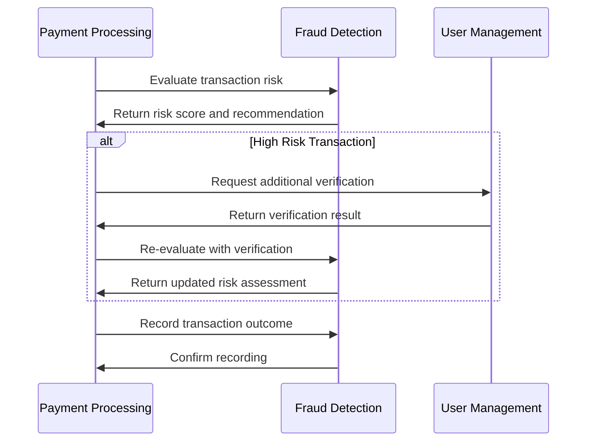

## Compliance and Regulatory Integration

The payment system integrates with compliance services to ensure adherence to financial regulations:

1. **AML (Anti-Money Laundering)**
   - Transaction monitoring
   - Suspicious activity reporting
   - User risk profiling

2. **KYC (Know Your Customer)**
   - Identity verification requirements
   - Enhanced due diligence for high-risk users
   - Periodic re-verification

3. **Payment Card Industry (PCI) Compliance**
   - Tokenization of card data
   - Secure vault for payment information
   - Compliance with PCI-DSS standards

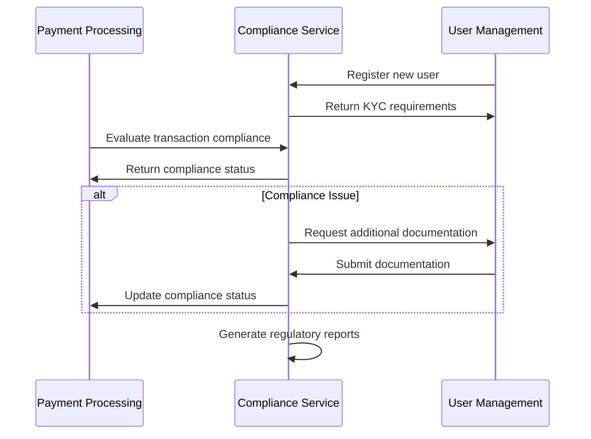

## Error Handling and Resilience

### Transactional Consistency

To maintain consistency across distributed services, the payment system implements:

1. **Saga Pattern** for multi-step payment processes
   - Separate compensation transactions for rollback
   - Guaranteed eventual consistency

2. **Outbox Pattern** for reliable event publishing
   - Events stored in outbox table
   - Background process for event delivery
   - Retry mechanisms with exponential backoff

3. **Idempotent Operations**
   - Unique idempotency keys for all requests
   - Detection and handling of duplicate requests
   - Safe retry mechanisms

```typescript
// Example of idempotent payment processing
interface IdempotentPaymentRequest {
  idempotencyKey: string; // UUID generated by client
  projectId: string;
  amount: number;
  currency: string;
  payerId: string;
  payeeId: string;
  paymentMethodId: string;
  description: string;
}

// Example of saga implementation
class PaymentSaga {
  async execute(paymentRequest: PaymentRequest): Promise<PaymentResult> {
    const sagaId = uuidv4();
    const saga = await this.sagaRepository.create({
      id: sagaId,
      type: 'payment',
      status: 'started',
      data: paymentRequest
    });
    
    try {
      // Step 1: Reserve funds
      await this.executeStep(sagaId, 'reserve_funds', 
        () => this.paymentService.reserveFunds(paymentRequest));
      
      // Step 2: Update ledger
      await this.executeStep(sagaId, 'update_ledger',
        () => this.ledgerService.recordTransaction(paymentRequest));
      
      // Step 3: Notify stakeholders
      await this.executeStep(sagaId, 'send_notifications',
        () => this.notificationService.sendPaymentNotifications(paymentRequest));
      
      // Mark saga as completed
      await this.sagaRepository.update(sagaId, { status: 'completed' });
      return { success: true };
    } catch (error) {
      // Execute compensation transactions
      await this.compensate(sagaId);
      return { success: false, error };
    }
  }
  
  async compensate(sagaId: string): Promise<void> {
    const saga = await this.sagaRepository.findById(sagaId);
    const completedSteps = saga.steps.filter(s => s.status === 'completed');
    
    // Execute compensation in reverse order
    for (const step of completedSteps.reverse()) {
      switch (step.name) {
        case 'reserve_funds':
          await this.paymentService.releaseFunds(saga.data);
          break;
        case 'update_ledger':
          await this.ledgerService.reverseTransaction(saga.data);
          break;
        // Other compensations...
      }
    }
    
    await this.sagaRepository.update(sagaId, { status: 'compensated' });
  }
}
```

### Error Recovery Processes

For handling various failure scenarios, the following recovery processes are implemented:

| Failure Scenario | Detection Method | Recovery Process | Data Consistency Approach |
|-----------------|------------------|------------------|--------------------------|
| Payment Provider Outage | Health check, timeout | Automatic failover to alternate provider | Transaction log reconciliation |
| Incomplete Transaction | Periodic reconciliation job | Manual review queue, automated retry | Compare local records with provider records |
| Database Failure | Exception handling, connection monitoring | Fallback to read-only mode, circuit breaker | Event sourcing from transaction events |
| Network Partition | Timeout detection, heartbeat | Retry with exponential backoff | Eventual consistency with reconciliation |
| Inconsistent State | Data validation, business rule checks | Automated correction for known patterns, alert for manual review | Compensating transactions |

## Deployment and Runtime Dependencies

### Service Dependencies

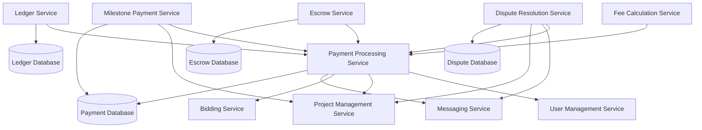

### Third-Party Dependencies

| Dependency | Purpose | Alternative | Fallback Strategy |
|------------|---------|-------------|-------------------|
| Stripe API | Primary payment processing | PayPal API | Automatic failover with transaction retry |
| Plaid API | Bank account verification | Manual verification process | Degraded functionality with manual approval |
| AWS S3 | Document storage for payment proofs | Local file storage | Local caching with delayed upload |
| Redis | Rate limiting, distributed locking | In-memory cache | Degraded performance, single-node locking |
| RabbitMQ | Event distribution | Database-backed queue | Polling-based event distribution |

### Health Monitoring

The payment system implements comprehensive health monitoring to ensure reliability:

1. **Service Health Checks**
   - Periodic ping/echo checks
   - Dependency health verification
   - Circuit breaker status monitoring

2. **Transaction Monitoring**
   - Success/failure rate tracking
   - Processing time metrics
   - Volume and velocity monitoring

3. **System Alerts**
   - Threshold-based alerting
   - Anomaly detection
   - On-call notification routing

```typescript
// Example of health check implementation
interface ServiceHealth {
  service: string;
  status: 'healthy' | 'degraded' | 'unhealthy';
  timestamp: Date;
  dependencies: {
    name: string;
    status: 'healthy' | 'degraded' | 'unhealthy';
    latency: number;
  }[];
  metrics: {
    requestRate: number;
    errorRate: number;
    p95Latency: number;
  };
}

// Example health check endpoint
app.get('/health', async (req, res) => {
  const dependencies = await Promise.all([
    checkDependencyHealth('stripe-api'),
    checkDependencyHealth('payment-database'),
    checkDependencyHealth('user-service'),
    checkDependencyHealth('project-service')
  ]);
  
  const allHealthy = dependencies.every(d => d.status === 'healthy');
  const anyUnhealthy = dependencies.some(d => d.status === 'unhealthy');
  
  const status = anyUnhealthy ? 'unhealthy' : 
                 allHealthy ? 'healthy' : 'degraded';
  
  const health: ServiceHealth = {
    service: 'payment-service',
    status,
    timestamp: new Date(),
    dependencies,
    metrics: await getServiceMetrics()
  };
  
  res.status(status === 'healthy' ? 200 : 
             status === 'degraded' ? 200 : 503)
     .json(health);
});
```

## Integration Testing Strategy

### Test Scenarios

| Test Type | Description | Components Involved | Validation Criteria |
|-----------|-------------|---------------------|---------------------|
| End-to-End Payment Flow | Complete payment lifecycle from initiation to settlement | Project Management, Payment Processing, User Management | Successful fund transfer, accurate project status updates, correct notifications |
| Milestone Release Process | Process of releasing funds from escrow upon milestone completion | Project Management, Payment Processing, Escrow Service | Escrow account properly debited, contractor receives correct amount, project milestone marked paid |
| Payment Dispute Resolution | Full dispute process from initiation to resolution | Payment Processing, Dispute Service, Messaging | Dispute correctly recorded, resolution process followed, appropriate funds movement based on outcome |
| Multi-currency Payment | Payment using different currencies with conversion | Payment Processing, External Currency Service | Correct conversion rates applied, appropriate fees, accurate settlement amounts |
| Group Payment Distribution | Payment distribution among team members for group bid | Group Bidding, Payment Processing | Correct split according to distribution plan, proper notifications to all parties |

### Integration Test Implementation

```typescript
// Example of an integration test for milestone payment release
describe('Milestone Payment Release Integration', () => {
  beforeEach(async () => {
    // Set up test data
    await setupTestProject();
    await setupTestUsers();
    await setupTestMilestone();
    await fundEscrowAccount();
  });
  
  it('should successfully release milestone payment when completed', async () => {
    // Simulate milestone completion in Project Management
    const completionResult = await project
