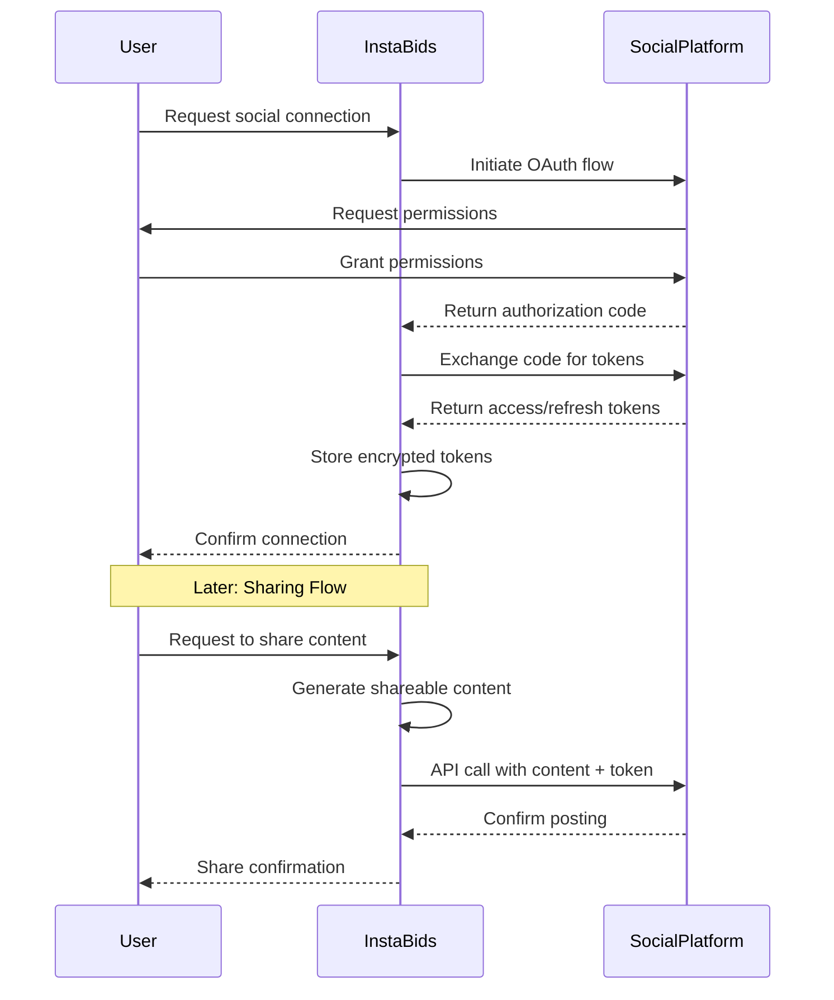

# Social Sharing & Referrals Integration Map

This document outlines how the Social Sharing & Referrals domain integrates with other InstaBids domains and external systems. It provides developers with a comprehensive understanding of all integration points, data flows, and dependencies.

## Integration Overview

The Social Sharing & Referrals domain serves as a bridge between the InstaBids platform and external social networks, while also connecting multiple internal domains to enable viral growth and community building. 

```mermaid
graph TD
    SS[Social Sharing & Referrals] 
    
    %% Internal Domain Integration
    UM[User Management]
    PM[Project Management]
    BID[Bidding System]
    PAY[Payment Processing]
    MSG[Messaging]
    DP[Dream Projects]
    CORE[Core Services]
    
    %% External Integrations
    FB[Facebook]
    TW[Twitter]
    IG[Instagram]
    PIN[Pinterest]
    LI[LinkedIn]
    EMAIL[Email Providers]
    GA[Google Analytics]
    
    %% Internal Domain Connections
    SS <-->|User identity & profiles| UM
    SS <-->|Shareable project content| PM
    SS <-->|Bid collaborators & referrals| BID
    SS <-->|Reward distribution| PAY
    SS <-->|Share conversation elements| MSG
    SS <-->|Dream project sharing| DP
    SS <-->|Event bus & notifications| CORE
    
    %% External Connections
    SS <-->|OAuth & content sharing| FB
    SS <-->|OAuth & content sharing| TW
    SS <-->|OAuth & content sharing| IG
    SS <-->|Project imagery sharing| PIN
    SS <-->|Professional networking| LI
    SS <-->|Referral emails & newsletters| EMAIL
    SS -->|Tracking & attribution| GA
    
    classDef domain fill:#f9f,stroke:#333,stroke-width:2px
    classDef external fill:#bbf,stroke:#333,stroke-width:1px
    class SS,UM,PM,BID,PAY,MSG,DP,CORE domain
    class FB,TW,IG,PIN,LI,EMAIL,GA external
```



## Key Integration Points

### Internal Domain Integrations

#### User Management Domain

| Integration Point | Direction | Description | Data Elements | Events |
|------------------|-----------|-------------|--------------|--------|
| User Profile | Bidirectional | Access user profile information for sharing and attributing referrals | User ID, Display Name, Profile Image, Contact Info | `user.profile.updated`, `user.preferences.changed` |
| Social Connections | Inbound | Retrieve user's social connections for targeting referrals | Social Network IDs, Friend Lists | `user.social_connections.updated` |
| Referral Account Linking | Outbound | Link referred users to referring users | Referral Code, User IDs | `user.referred`, `user.referral_converted` |
| Authorization | Inbound | Verify permissions for social actions | User Roles, Permission Sets | `user.permissions.changed` |

#### Project Management Domain

| Integration Point | Direction | Description | Data Elements | Events |
|------------------|-----------|-------------|--------------|--------|
| Project Content | Inbound | Access project details for sharing | Project ID, Title, Description, Images, Status | `project.created`, `project.updated` |
| Project Privacy Settings | Inbound | Respect project privacy when sharing | Visibility Settings, Owner Preferences | `project.privacy_changed` |
| Project Sharing Options | Outbound | Provide configurable sharing options | Share Targets, Custom Messages | `project.shared` |
| Dream-to-Real Conversion | Bidirectional | Support dream project conversion via sharing | Project Type, Conversion Status | `project.dream_shared`, `project.converted` |

#### Bidding System Domain

| Integration Point | Direction | Description | Data Elements | Events |
|------------------|-----------|-------------|--------------|--------|
| Bid Collaborators | Bidirectional | Enable contractor team formation via referrals | Bid ID, Collaborator List | `bid.collaborator_invited`, `bid.collaborator_joined` |
| Group Bidding | Outbound | Support group bid formation via social channels | Group Bid ID, Member List | `group_bid.created`, `group_bid.member_added` |
| Bid Sharing | Inbound | Access bid details for sharing with potential collaborators | Bid ID, Summary, Requirements | `bid.shareable_created` |

#### Payment Processing Domain

| Integration Point | Direction | Description | Data Elements | Events |
|------------------|-----------|-------------|--------------|--------|
| Reward Distribution | Outbound | Trigger payments for successful referrals | User ID, Reward Amount, Reward Type | `referral.reward_earned` |
| Commission Tracking | Bidirectional | Track and process referral commissions | Referral ID, Commission Rate, Project Value | `project.commission_calculated`, `payment.commission_processed` |
| Payment History | Inbound | Access payment history for referral validation | Transaction IDs, Payment Status | `payment.completed` |

#### Messaging Domain

| Integration Point | Direction | Description | Data Elements | Events |
|------------------|-----------|-------------|--------------|--------|
| Referral Messages | Outbound | Send automated referral messages | Message Content, Recipient, Template ID | `message.referral_sent` |
| Testimonial Collection | Inbound | Gather user testimonials from messages | Conversation ID, Message Content | `message.testimonial_candidate` |
| Notification Delivery | Bidirectional | Process social and referral notifications | Notification Type, Content, Target User | `notification.social_action`, `notification.referral_status` |

#### Core Services Domain

| Integration Point | Direction | Description | Data Elements | Events |
|------------------|-----------|-------------|--------------|--------|
| Event Bus | Bidirectional | Publish and subscribe to platform events | Event Type, Payload, Timestamp | Multiple event types |
| Configuration | Inbound | Access system configuration for sharing features | Feature Flags, Limits, Settings | `system.config.updated` |
| Analytics Events | Outbound | Emit events for analytics processing | Event Name, Properties, User Context | `analytics.event.emitted` |
| User Preferences | Bidirectional | Respect and update user sharing preferences | Preference Keys, Values | `preferences.updated` |

### External System Integrations

#### Social Media Platforms

| Platform | Integration Type | Authentication | Capabilities | Configuration |
|----------|-----------------|----------------|--------------|---------------|
| Facebook | OAuth 2.0 + Graph API | App ID + Secret, User Token | Profile connection, Feed posting, Friend invites, Page interactions | Scope: `email`, `public_profile`, `user_friends` |
| Twitter | OAuth 2.0 + API v2 | API Key + Secret, Access Token | Tweet posting, Profile connection, Direct messages | Scope: `tweet.read`, `tweet.write`, `users.read` |
| Instagram | OAuth 2.0 + Graph API | App ID + Secret, User Token | Media sharing, Story posting, Profile connection | Scope: `user_profile`, `user_media` |
| LinkedIn | OAuth 2.0 + REST API | Client ID + Secret, User Token | Professional sharing, Profile connection, Company page posting | Scope: `r_liteprofile`, `w_member_social` |
| Pinterest | OAuth 2.0 + API v5 | App ID + Secret, Access Token | Pin creation, Board management, Image sharing | Scope: `pins:read`, `pins:write`, `boards:read` |

Integration implementation details:



#### Email Service Integration

The Social Sharing & Referrals domain integrates with email services to send referral invitations, program updates, and promotional content.

| Integration Point | Description | Implementation |
|------------------|-------------|----------------|
| Transactional Emails | Sending referral invitations and status updates | SendGrid API with templated messages |
| Email Tracking | Monitoring email opens and link clicks | UTM parameters + tracking pixels |
| List Management | Managing referral program mailing lists | API integration with segmentation |

#### Analytics & Attribution

| Integration Point | Description | Implementation |
|------------------|-------------|----------------|
| Google Analytics | Track sharing events and conversions | GA4 events via dataLayer + measurement protocol |
| Attribution Modeling | Credit user acquisition to referral sources | Custom attribution parameters + session tracking |
| Conversion Tracking | Monitor referral-driven conversions | First-touch and last-touch attribution models |

## Integration Authentication & Security

### Authentication Methods

| Integration Type | Authentication Method | Token Storage | Refresh Strategy |
|-----------------|----------------------|--------------|------------------|
| Internal Services | JWT with service accounts | N/A (short-lived tokens) | Service-to-service auth |
| Social Platforms | OAuth 2.0 with PKCE | Encrypted in database | Scheduled refresh before expiry |
| Analytics Services | API keys | Environment variables | Manual rotation schedule |
| Email Services | API keys + webhook signatures | Environment variables | Manual rotation schedule |

### Security Considerations

1. **Data Privacy**
   - User consent required before any social sharing
   - PII never included in shared content parameters
   - Token scopes limited to minimum required permissions

2. **Rate Limiting**
   - Implement backoff strategies for external API calls
   - Queue and batch social sharing requests
   - Monitor usage against platform-specific limits

3. **Error Handling**
   - Graceful degradation when social platforms unavailable
   - Retry logic with exponential backoff
   - Fallback options for critical sharing functions

## Event-Driven Integration

The Social Sharing & Referrals domain uses an event-driven architecture to maintain loose coupling with other domains.

### Published Events

| Event Name | Trigger | Payload | Consumers |
|------------|---------|---------|-----------|
| `social.account.connected` | User connects social account | User ID, Platform, Connected Status | User Management, Analytics |
| `referral.code.generated` | New referral code created | User ID, Code, Program ID | Analytics, Notifications |
| `referral.invitation.sent` | Referral invitation delivered | Sender ID, Channel, Target, Content | Analytics, Notifications |
| `referral.converted` | Referred user completes qualifying action | Referrer ID, Referee ID, Program ID, Reward Status | Payment Processing, Analytics, Notifications |
| `content.shared` | User shares platform content | User ID, Content Type, Content ID, Platform, Share ID | Analytics, Project Management |
| `testimonial.submitted` | User submits testimonial | User ID, Content, Rating, Status | Analytics, Project Management |

### Subscribed Events

| Event Name | Source Domain | Action |
|------------|---------------|--------|
| `user.registered` | User Management | Check for referral code, attribute if valid |
| `user.deleted` | User Management | Clean up referral relationships, anonymize data |
| `project.created` | Project Management | Generate sharing suggestions |
| `project.completed` | Project Management | Request testimonials, suggest sharing |
| `payment.completed` | Payment Processing | Trigger referral reward if applicable |
| `bid.accepted` | Bidding System | Track collaborative bid success |

## Implementation Considerations

### Failure Modes & Recovery

| Failure Scenario | Impact | Mitigation Strategy |
|------------------|--------|---------------------|
| Social API unavailable | Unable to post content to platform | Queue for retry, offer alternative sharing options |
| Token expiration | Authentication failure with social platform | Proactive token refresh, clear user feedback on reconnection need |
| Rate limit exceeded | Temporary API lockout | Implement backoff, prioritize sharing requests, provide user feedback |
| Referral attribution failure | Lost reward opportunity | Implement manual recovery process, maintain audit trail for verification |

### Versioning Strategy

1. **API Versioning**
   - Maintain compatibility with multiple social platform API versions
   - Version internal integration endpoints explicitly
   - Document version deprecation timelines

2. **Data Compatibility**
   - Support backward compatibility for referral codes
   - Implement data migration for format changes
   - Maintain schema version metadata

### Performance Considerations

1. **Caching Strategy**
   - Cache social content templates
   - Cache user social connections
   - Cache sharing eligibility rules

2. **Batch Processing**
   - Batch social analytic events
   - Process referral rewards in scheduled batches
   - Bulk update referral status changes

## Integration Testing

| Test Type | Scope | Implementation |
|-----------|-------|----------------|
| Unit Tests | Individual integration adapters | Mock external dependencies |
| Integration Tests | Domain-to-domain flows | Test endpoints with stubbed responses |
| Contract Tests | API specifications | Validate against OpenAPI schemas |
| End-to-End Tests | Complete user journeys | Sandbox environment with test accounts |
| Chaos Testing | Failure scenarios | Simulate API failures and latency |

## Deployment & Configuration

Integration configurations are externalized to allow for environment-specific settings:

```yaml
# Example configuration structure
socialSharing:
  platforms:
    facebook:
      appId: ${FB_APP_ID}
      appSecret: ${FB_APP_SECRET}
      apiVersion: "v16.0"
      defaultScope: "email,public_profile"
    twitter:
      apiKey: ${TW_API_KEY}
      apiSecret: ${TW_API_SECRET}
      apiVersion: "2"
  
  referrals:
    codeLength: 8
    expirationDays: 30
    rewardRules:
      defaultReward: "credit"
      defaultAmount: 50.00
      tieredRewards: true
  
  security:
    tokenEncryptionKey: ${TOKEN_ENCRYPTION_KEY}
    refreshScheduleMinutes: 60
    maxRetryAttempts: 3
```

## Monitoring & Observability

| Metric Type | Examples | Implementation |
|-------------|----------|----------------|
| Performance Metrics | API latency, Token refresh time | Prometheus metrics |
| Business Metrics | Shares per user, Conversion rate | Custom events to analytics |
| Error Rates | Failed API calls, Authentication failures | Error aggregation & alerting |
| Integration Health | Platform availability, Rate limit status | Health checks & dashboards |

## Documentation & Resources

1. **External API Documentation**
   - [Facebook Graph API](https://developers.facebook.com/docs/graph-api/)
   - [Twitter API v2](https://developer.twitter.com/en/docs/twitter-api)
   - [Instagram Graph API](https://developers.facebook.com/docs/instagram-api/)
   - [LinkedIn API](https://developer.linkedin.com/docs/)
   - [Pinterest API](https://developers.pinterest.com/docs/api/overview/)

2. **Internal Resources**
   - Service Interface Documentation: `interfaces_social_sharing.ts`
   - API Specifications: `api_social_sharing.yaml`
   - Database Schema: `schema_social_sharing.sql`
   - Security Documentation: `security_social_sharing.md`
