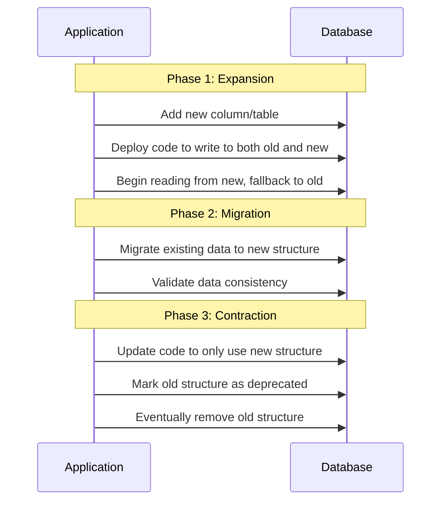
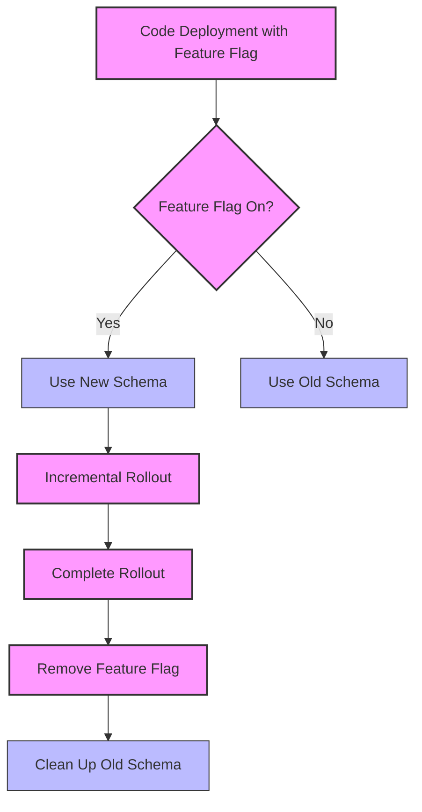
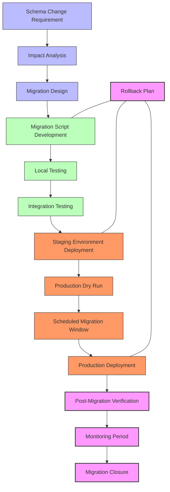
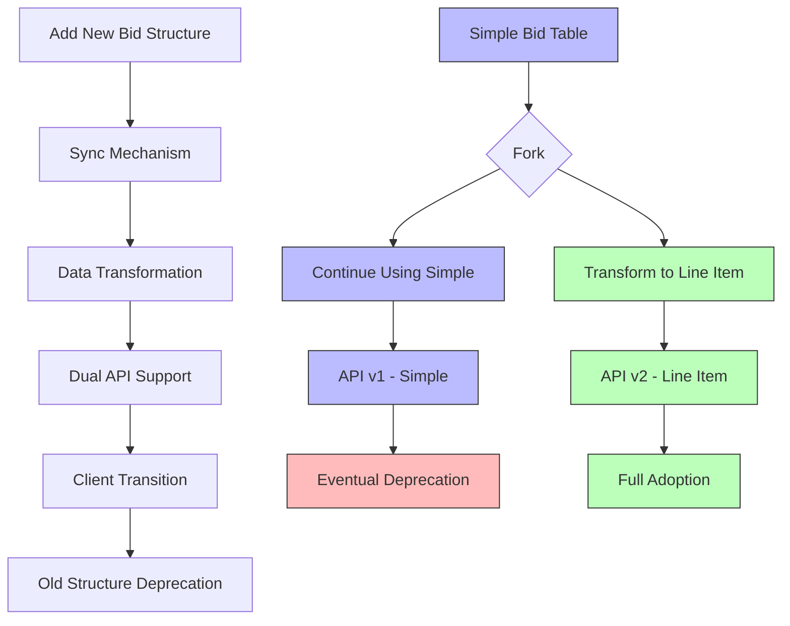
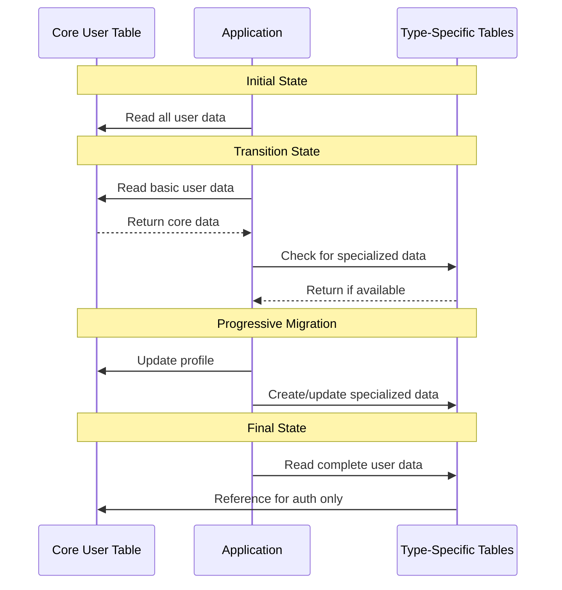

# Data Migration & Versioning Strategy

This document outlines the comprehensive strategy for data migration and schema evolution for the InstaBids platform. As the system evolves through its development phases, a robust approach to managing schema changes, data transitions, and version compatibility is essential for maintaining system integrity and ensuring smooth upgrades.

## Data Migration Philosophy

The InstaBids data migration strategy is guided by the following principles:

1. **Zero-Downtime Migrations**: Minimize or eliminate service interruptions during migrations
2. **Data Integrity Preservation**: Ensure data consistency and prevent loss during schema changes
3. **Backward Compatibility**: Maintain support for existing clients during transition periods
4. **Progressive Implementation**: Apply changes incrementally rather than in large, risky batches
5. **Automated Verification**: Validate data integrity before, during, and after migrations
6. **Rollback Capability**: Support reversing migrations if issues are encountered

## Schema Evolution Approach

### Schema Versioning

InstaBids will implement explicit schema versioning to track database changes:

1. **Database Level Versioning**
   - Major version: Significant structural changes requiring full migration
   - Minor version: Compatible schema additions or non-breaking modifications
   - Patch version: Bug fixes and minimal schema adjustments

2. **Table Level Versioning**
   - Tables requiring compatibility across versions will include version columns
   - Temporal tables for tracking historical schema states
   - Version metadata stored in dedicated versioning tables

3. **API-Schema Alignment**
   - API versions directly mapped to compatible schema versions
   - Client requests tagged with API version to determine schema interaction

### Schema Change Categories

| Change Type | Description | Migration Complexity | Backward Compatibility |
|-------------|-------------|----------------------|------------------------|
| Additive | Adding new tables or columns | Low | High |
| Renaming | Changing table or column names | Medium | Medium (via views) |
| Structural | Changing relationships or constraints | High | Medium |
| Data Type | Altering column types | Medium-High | Varies by change |
| Removal | Dropping tables or columns | Low | Low |

### Schema Evolution Patterns

1. **Expand and Contract Pattern**



2. **Blue-Green Schema Migration**

```mermaid
graph TD
    A[Current Schema - "Blue"] --> B[Application with Dual Support]
    C[New Schema - "Green"] --> B
    B --> D{Migration Complete?}
    D -->|No| B
    D -->|Yes| E[Application with New Schema Only]
    E --> F[Decommission Old Schema]
    
    classDef current fill:#bbf,stroke:#333,stroke-width:1px;
    classDef new fill:#bfb,stroke:#333,stroke-width:1px;
    classDef app fill:#f96,stroke:#333,stroke-width:2px;
    
    class A current;
    class C,F new;
    class B,E app;
```

3. **Feature Flags for Schema Changes**



## Data Migration Implementation

### Migration Tools and Technologies

1. **Core Migration Infrastructure**
   - [Flyway](https://flywaydb.org/) for SQL migration management
   - Custom Supabase migration utilities
   - PostgreSQL transactional DDL capabilities
   - Temporary staging tables for complex migrations

2. **Migration Development Tools**
   - Version-controlled migration scripts
   - Database schema differencing tools
   - Test database generation with synthetic data
   - Migration simulation environment

3. **Monitoring and Validation Tools**
   - Real-time migration progress tracking
   - Data integrity validation framework
   - Performance impact monitoring
   - Rollback trigger system

### Migration Workflow



### Migration Implementation Details

For each major domain, specialized migration strategies will be implemented:

#### User Management Migration Approach

- Incremental profile enrichment without disrupting authentication
- Role and permission expansion through additive changes
- User preference and settings version mapping
- Identity provider integration compatibility

#### Project Management Migration Approach

- Project metadata expansion with backward compatibility
- Milestone and timeline schema evolution
- Document and attachment storage transitions
- Project state machine versioning

#### Bidding System Migration Approach

- Bid component structure evolution
- Pricing model enhancements
- Bid status and workflow versioning
- Historical bid data preservation

#### Group Bidding Migration Approach

- Group structure and relationship evolution
- Role and permission adjustments
- Multi-party agreement versioning
- Financial allocation schema updates

#### Payment Processing Migration Approach

- Payment provider integration changes
- Transaction history preservation
- Financial record compliance requirements
- Escrow and milestone payment evolution

#### Messaging Migration Approach

- Conversation threading model changes
- Message content storage evolution
- Notification delivery schema updates
- Message search indexing adjustments

#### AI Outreach & Automation Migration Approach

- AI model integration and versioning
- Campaign structure evolution
- Prospect data schema enhancements
- Analytics data warehousing changes

## Schema Version Control

### Database Change Management

1. **Migration Script Standards**
   - Descriptive, timestamp-based naming convention
   - Transactional implementation where possible
   - Clear documentation of purpose and impact
   - Corresponding rollback scripts

   Example naming convention:
   ```
   V20250401_1432__add_contractor_verification_levels.sql
   R20250401_1432__rollback_contractor_verification_levels.sql
   ```

2. **Change Script Categories**
   - Structural scripts (DDL changes)
   - Data migration scripts (data transformation)
   - Reference data scripts (lookup data updates)
   - Constraint and index management
   - Permissions and security updates

3. **Migration Metadata**
   - Version tracking table with applied migrations
   - Execution timestamp and duration
   - Executing user and environment
   - Checksum validation for script integrity

### Version Compatibility Matrix

The system will maintain a compatibility matrix to ensure proper client-server interaction:

| Client Version | Backend v1.0 | Backend v1.1 | Backend v2.0 | Backend v2.1 |
|----------------|--------------|--------------|--------------|--------------|
| App v1.0 | Full | Full | Partial | Partial |
| App v1.1 | Full | Full | Partial | Partial |
| App v2.0 | No | No | Full | Full |
| App v2.1 | No | No | Full | Full |

### API Versioning Strategy

1. **URL Path Versioning**
   - Major version in URL: `/api/v1/projects`
   - Ensures clear distinction between incompatible versions

2. **Header-Based Versioning for Minor Changes**
   - Accept-Version header for minor/patch versions
   - Maintains URL stability for compatible changes

3. **Deprecation Process**
   - Explicit deprecation notices in responses
   - Grace period before removing deprecated endpoints
   - Documentation of migration paths for clients

## Data Migration Scenarios

### Complex Migration Examples

#### Example 1: Bidding Model Evolution

**Current State**:
- Simple bid structure with total amount
- Limited customization options

**Target State**:
- Line-item based bidding
- Multiple pricing models
- Detailed material and labor breakdown

**Migration Strategy**:
1. Add new bid structure tables alongside existing
2. Create bidirectional sync mechanism during transition
3. Develop data transformation for existing bids to new format
4. Update API to support both formats with version detection
5. Gradually transition clients to new format
6. Deprecate old structure after adoption threshold reached



#### Example 2: User Profile Enhancement

**Current State**:
- Basic profile with limited contractor information
- Single table structure for all user types

**Target State**:
- Rich profiles with type-specific attributes
- Separate tables for different user specializations
- Enhanced verification and credential storage

**Migration Strategy**:
1. Create new specialized profile tables
2. Add linking identifiers to existing profile table
3. Incrementally migrate users based on activity
4. Update user authentication flow to check multiple profile sources
5. Consolidate to new structure once migration complete



### Data Integrity Protection

During migrations, data integrity is protected through:

1. **Pre-Migration Validation**
   - Data quality checks before migration
   - Constraint validation
   - Referential integrity verification
   - Business rule compliance checking

2. **Transaction Safety**
   - Transactional DDL where supported
   - Point-in-time recovery capability
   - Commit/rollback decision points
   - Atomicity for related changes

3. **Post-Migration Verification**
   - Row count validation
   - Sampling-based data comparison
   - Statistical analysis of data patterns
   - End-to-end system validation

## Phased Migration Approach

### Phase 1: Foundation (Months 1-3)

- Establish migration infrastructure
- Implement version tracking tables
- Create baseline schema snapshot
- Develop initial migration scripts
- Set up monitoring and alerting

### Phase 2: Core Migration Capabilities (Months 4-6)

- Implement blue-green migration capability
- Develop data transformation utilities
- Create automated testing for migrations
- Establish migration governance process
- Deploy schema change monitoring

### Phase 3: Advanced Features (Months 7-9)

- Implement online schema change capabilities
- Develop performance-optimized migration patterns
- Create domain-specific migration utilities
- Establish cross-domain data consistency checks
- Implement migration impact forecasting

### Phase 4: Optimization (Months 10-12)

- Performance tuning for large-scale migrations
- Enhanced rollback mechanisms
- Automated schema documentation generation
- Compliance audit trail for schema changes
- Machine learning for migration impact prediction

## Data Migration Testing

### Test Strategy

1. **Unit Testing**
   - Individual migration script validation
   - Data transformation function testing
   - Schema constraint verification
   - Performance benchmark testing

2. **Integration Testing**
   - Cross-domain data integrity validation
   - Application-database interaction testing
   - API version compatibility verification
   - Multi-service integration testing

3. **Performance Testing**
   - Migration duration measurement
   - System performance during migration
   - Lock contention assessment
   - Resource utilization monitoring

4. **Disaster Recovery Testing**
   - Rollback script validation
   - Mid-migration recovery testing
   - Corrupted data recovery scenarios
   - High-availability testing during migration

### Migration Validation Framework

A comprehensive validation framework will verify:

1. **Data Completeness**: All records properly migrated
2. **Data Accuracy**: Values correctly transformed
3. **Referential Integrity**: Relationships preserved
4. **Business Rules**: Domain logic remains valid
5. **Performance Impact**: System responsiveness maintained
6. **Security Controls**: Access controls correctly migrated

## Governance and Documentation

### Migration Governance

1. **Change Review Process**
   - Schema change approval workflow
   - Impact assessment requirements
   - Technical peer review
   - Business stakeholder approval

2. **Migration Calendar**
   - Scheduled migration windows
   - Blackout periods
   - Dependency management
   - Resource allocation

3. **Post-Migration Review**
   - Success criteria validation
   - Lessons learned documentation
   - Performance impact analysis
   - Technical debt assessment

### Documentation Requirements

For each significant schema change:

1. **Migration Specification**
   - Purpose and business drivers
   - Technical design and approach
   - Risk assessment and mitigation
   - Rollback procedure

2. **Schema Documentation**
   - Updated entity relationship diagrams
   - Table and column specifications
   - Constraint and index documentation
   - Version compatibility notes

3. **Operational Documentation**
   - Execution procedure
   - Monitoring guidelines
   - Troubleshooting procedures
   - Support escalation path

## Domain-Specific Considerations

### User Management Domain Considerations

- Authentication continuity during profile changes
- Permission and role transition strategies
- User session handling during migrations
- Identity provider integration versioning

### Project Management Domain Considerations

- Project state consistency during schema changes
- Document and attachment migration strategies
- Timeline and milestone data preservation
- Project template versioning

### Bidding System Domain Considerations

- Bid data accuracy during pricing model changes
- Historical bid data accessibility
- Contract data migration approach
- Bid status workflow transitions

### Labor Marketplace Domain Considerations

- Skill and specialization taxonomy evolution
- Verification status preservation during changes
- Rating and review data migration
- Matching algorithm data dependencies

### Payment Processing Domain Considerations

- Financial data integrity requirements
- Audit trail preservation
- Regulatory compliance during migrations
- Payment provider integration versioning

### Messaging Domain Considerations

- Conversation continuity during schema changes
- Message search reindexing strategy
- Notification delivery during migrations
- Message threading model changes

### AI Outreach & Automation Domain Considerations

- AI model version compatibility
- Training data schema evolution
- Campaign configuration migration
- Analytics data warehousing approach

## Conclusion

This comprehensive data migration and schema evolution strategy provides the foundation for managing InstaBids' database structure through its development lifecycle and beyond. By implementing these practices, the platform can evolve while maintaining data integrity, system performance, and user experience consistency.

The strategy emphasizes minimizing risk through incremental changes, robust testing, and built-in rollback capabilities. As the system grows, this approach will enable the technical team to confidently implement necessary schema changes to support new features and improvements while protecting existing data and functionality.
