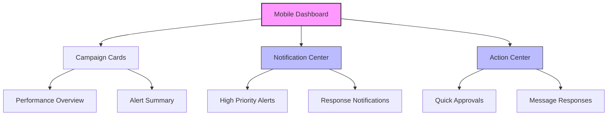
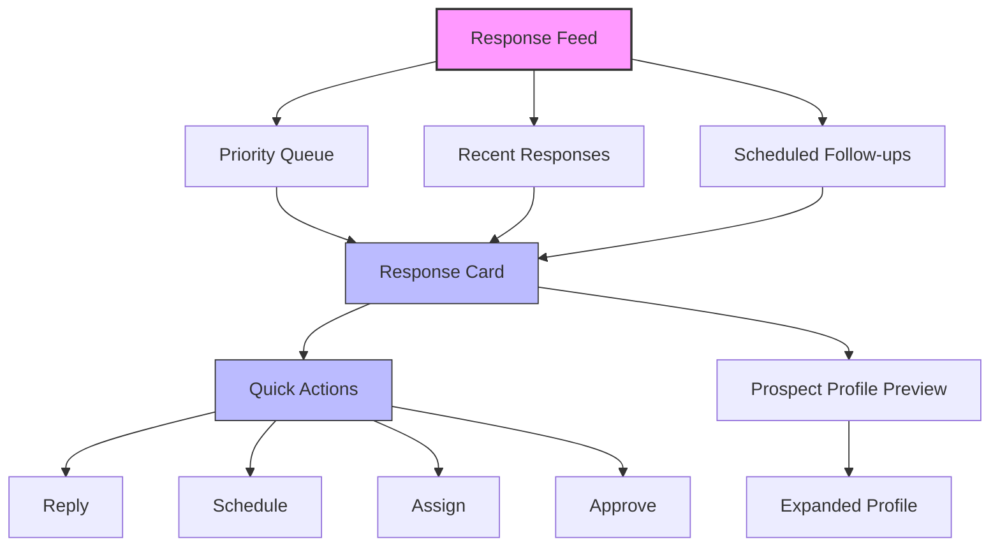
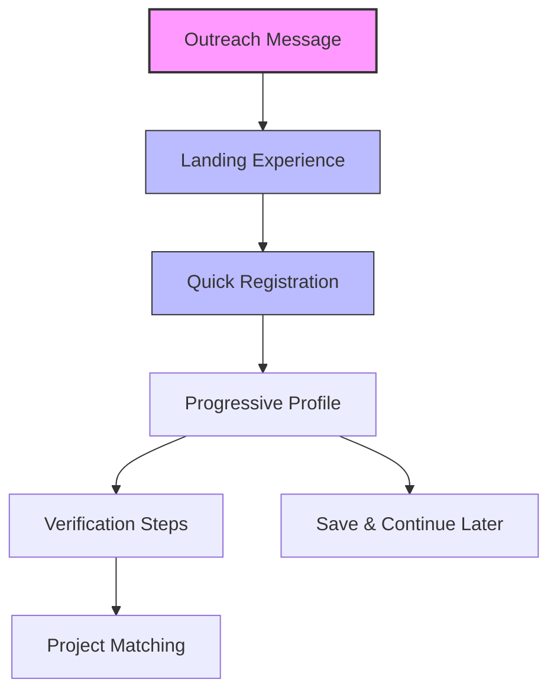
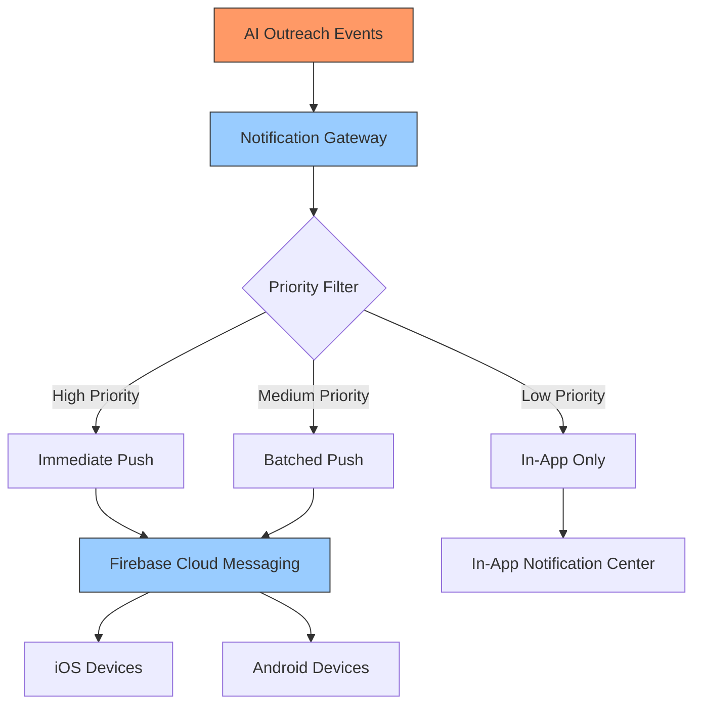

# Mobile Strategy: AI Outreach & Automation

This document outlines the mobile strategy for the AI Outreach & Automation domain of the InstaBids platform, detailing how contractor discovery, outreach, and conversion processes will function on mobile devices.

## Overview

The mobile strategy for AI Outreach & Automation focuses on enabling platform administrators, sales teams, and contractors to participate in the outreach and acquisition process through mobile interfaces. While most discovery and campaign management activities occur on desktop interfaces, mobile capabilities are critical for real-time alerts, response management, and contractor engagement.

## User Personas and Mobile Use Cases

### Platform Administrators

**Primary Mobile Use Cases:**
- Receive real-time campaign performance alerts
- Review and approve high-priority outreach messages
- Monitor campaign metrics through mobile dashboards
- Adjust campaign parameters on-the-go

**Mobile-Specific Features:**
- Push notifications for critical campaign events
- Simplified campaign management controls
- Condensed performance dashboards
- Quick-action responses to urgent situations

### Sales and Outreach Teams

**Primary Mobile Use Cases:**
- Receive notifications about high-value prospect responses
- Review and respond to contractor inquiries
- Manage prospect pipelines while in the field
- Track conversion metrics

**Mobile-Specific Features:**
- Prospect response notifications with sentiment analysis
- One-tap follow-up options
- Mobile-optimized prospect profiles
- Voice-to-text response capabilities

### Contractors (Prospects)

**Primary Mobile Use Cases:**
- Receive personalized outreach messages
- Respond to platform invitations
- Complete registration and onboarding steps
- Access initial project opportunities

**Mobile-Specific Features:**
- Streamlined mobile registration flows
- Progressive profile completion
- Mobile-optimized verification steps
- Quick-response templates

## Mobile User Experience Strategy

### Responsive vs. Native Approach

The AI Outreach & Automation domain will implement a hybrid approach:

1. **Progressive Web App (PWA)** for administrative functions:
   - Campaign monitoring dashboards
   - Performance analytics
   - Configuration settings

2. **Native Mobile Components** for time-sensitive interactions:
   - Push notifications
   - Quick responses
   - Offline capabilities
   - Deep linking to specific actions

### Mobile Design Principles

1. **Priority-Based Information Hierarchy**
   - Critical alerts and high-value prospects appear prominently
   - Secondary information accessible through expanding sections
   - Progressive disclosure of complex campaign data

2. **Context-Aware Interactions**
   - Location-aware prospect filtering
   - Time-sensitive notification throttling
   - Connectivity-aware functionality

3. **One-Handed Operation**
   - Essential actions accessible in thumb-reach zones
   - Swipe gestures for common actions
   - Minimized text input requirements

4. **Bandwidth and Battery Optimization**
   - Efficient data synchronization
   - Background processing minimization
   - Optimized image and asset loading

## Mobile UI Components

### Outreach Campaign Monitor

**Key Features:**
- Real-time performance metrics with visual indicators
- Collapsible campaign cards with critical KPIs
- Pull-to-refresh for latest data
- Interactive charts optimized for touch interfaces

### Prospect Response Manager

**Key Features:**
- AI-sorted response feed prioritizing high-value prospects
- Sentiment analysis indicators
- Swipe gestures for common actions
- Voice input for message responses
- Template-based quick replies

### Contractor Mobile Onboarding

**Key Features:**
- Minimal-step registration process
- Native device integration (camera, location, contacts)
- Progress-saving between sessions
- Contextual help and guidance
- Offline form completion capability

## Technical Implementation

### Mobile Push Notification Architecture

**Implementation Notes:**
- Event-based notification triggers from AI Outreach domain
- Intelligent notification throttling and bundling
- Rich notification support with quick actions
- Deep linking to specific application contexts
- Offline notification queueing

### Mobile Data Synchronization

The mobile application will implement an efficient synchronization strategy:

1. **Real-time Data**
   - WebSocket connections for live dashboard updates
   - Event-sourced updates for critical changes
   - Server-Sent Events for unidirectional streams

2. **Background Synchronization**
   - Periodic pull for non-critical data
   - Delta synchronization to minimize bandwidth
   - Conflict resolution strategies for offline changes

3. **Caching Strategy**
   - Time-based cache for reference data
   - LRU (Least Recently Used) cache for prospect profiles
   - Persistent storage for in-progress operations

### Offline Capabilities

The mobile application will support the following offline capabilities:

1. **Read Operations**
   - Cached prospect data and profiles
   - Recent campaign performance metrics
   - Queued notifications and alerts

2. **Write Operations**
   - Message composition and queued sending
   - Form data collection with background sync
   - Action queueing with conflict resolution

3. **Recovery Mechanisms**
   - Automatic retry for failed operations
   - Manual sync triggering
   - Conflict visualization and resolution UI

## Integration with Other Mobile Domains

### User Management Domain

- Shared authentication and session management
- Profile access and permission verification
- Cross-domain user journey tracking

### Messaging Domain

- Unified notification infrastructure
- Shared conversation history
- Consistent messaging UI components

### Project Management Domain

- Seamless transition from contractor acquisition to project matching
- Shared project reference data
- Consistent project visualization components

## Mobile-Specific AI Features

### On-Device AI Capabilities

1. **Message Response Analysis**
   - On-device sentiment analysis for quick response prioritization
   - Text classification for routing and categorization
   - Entity extraction for context-aware actions

2. **Content Personalization**
   - Context-aware message composition assistance
   - Adaptive content based on user behavior
   - Smart reply suggestions

3. **Offline Intelligence**
   - Downloaded lightweight models for offline operation
   - Incremental learning from user interactions
   - Synchronization of learning data when online

### Edge AI Implementation

For performance-critical and privacy-sensitive features, the mobile application will leverage Edge AI capabilities:

1. **Performance Optimization**
   - TensorFlow Lite models for on-device inference
   - Model quantization for size and speed optimization
   - Selective execution based on device capabilities

2. **Privacy Enhancement**
   - Local processing of sensitive communications
   - Differential privacy techniques for uploaded data
   - Federated learning for model improvement without raw data sharing

## Performance Considerations

### Network Efficiency

1. **Payload Optimization**
   - GraphQL for precise data requests
   - JSON compression techniques
   - Binary protocols for repeated data structures

2. **Connection Management**
   - Connection pooling and reuse
   - Selective real-time connections
   - Adaptive polling based on user activity

### Battery Impact Mitigation

1. **Background Processing**
   - Batched background operations
   - Scheduled synchronization during charging
   - Coalesced network requests

2. **Sensor Usage**
   - Minimized location tracking
   - Efficient use of device sensors
   - Background restriction compliance

### Storage Management

1. **Data Lifecycle**
   - TTL (Time-to-Live) policies for cached data
   - Automatic cleanup of obsolete information
   - User-controllable storage limits

2. **Media Optimization**
   - Progressive image loading
   - Adaptive media quality based on connection
   - Lazy loading of non-critical assets

## Security Considerations

### Mobile-Specific Security Measures

1. **Authentication**
   - Biometric authentication support
   - Secure credential storage
   - Session timeout controls
   - Stepped-up authentication for sensitive operations

2. **Data Protection**
   - At-rest encryption of local data
   - Secure key management
   - Ephemeral storage for sensitive information

3. **Transmission Security**
   - Certificate pinning
   - TLS configuration hardening
   - Network security monitoring

### Privacy Controls

1. **User Consent**
   - Granular permission controls
   - Clear purpose explanation
   - Revocable consent management

2. **Data Minimization**
   - Collection limitation to necessary data
   - Automated data aging and deletion
   - Anonymous analytics where possible

## Accessibility Considerations

The mobile application will comply with WCAG 2.1 AA standards and implement:

1. **Visual Accessibility**
   - Dynamic text sizing
   - High contrast modes
   - Screen reader optimization

2. **Motor Accessibility**
   - Configurable touch targets
   - Voice command capabilities
   - Reduced motion options

3. **Cognitive Accessibility**
   - Simplified interface options
   - Step-by-step guidance
   - Error prevention and recovery

## Implementation Roadmap

### Phase 1: Core Mobile Capabilities (Month 1-2)

- Mobile push notification infrastructure
- Basic campaign monitoring dashboard
- Essential prospect response handling
- Simplified contractor registration experience

### Phase 2: Enhanced Interaction (Month 3-4)

- Rich mobile dashboards with filtering
- Advanced response management tools
- Complete offline capabilities
- Deep integration with messaging domain

### Phase 3: AI-Powered Features (Month 5-6)

- On-device intelligence implementation
- Advanced personalization features
- Voice-based interaction
- Predictive analytics on mobile

## Testing Strategy

### Mobile-Specific Testing

1. **Device Compatibility**
   - Testing across iOS/Android versions
   - Screen size and resolution testing
   - OEM customization compatibility

2. **Network Condition Testing**
   - Variable bandwidth simulation
   - Connection interruption testing
   - Offline mode verification

3. **User Experience Testing**
   - Touch heatmap analysis
   - Session recording and analysis
   - A/B testing of mobile interfaces

## Analytics and Measurement

### Mobile KPIs

1. **Engagement Metrics**
   - Notification open rates
   - Feature utilization by platform
   - Session duration and frequency
   - User journey completion rates

2. **Performance Metrics**
   - Crash-free session rates
   - API response times
   - UI rendering performance
   - Battery consumption

3. **Business Impact Metrics**
   - Mobile-originated conversions
   - Response time to prospect inquiries
   - Campaign adjustment frequency
   - Cross-device user journeys

## Conclusion

The mobile strategy for AI Outreach & Automation focuses on extending critical functionality to mobile contexts while optimizing for the constraints and opportunities of mobile devices. By implementing a hybrid approach with responsive web interfaces and native mobile components, InstaBids can deliver a seamless experience across devices while maintaining the sophisticated functionality needed for effective contractor outreach and acquisition.

The strategy prioritizes real-time awareness, quick response capabilities, and efficient prospect engagement while ensuring that the full power of the AI-driven outreach system remains accessible regardless of the user's device or location.
