# Group Bidding Mobile Strategy

This document outlines the mobile strategy for the Group Bidding domain of the InstaBids platform. It covers mobile-specific features, user experience considerations, technical implementation, and synchronization patterns to enable effective team collaboration on mobile devices.

## Overview

The Group Bidding mobile strategy enables contractors to form teams, collaborate on complex bids, and make consensus-driven decisions from their mobile devices. Mobile access is critical for this domain as contractors are often on job sites with limited access to desktop computers.

## Mobile User Journeys

### 1. Team Formation & Management

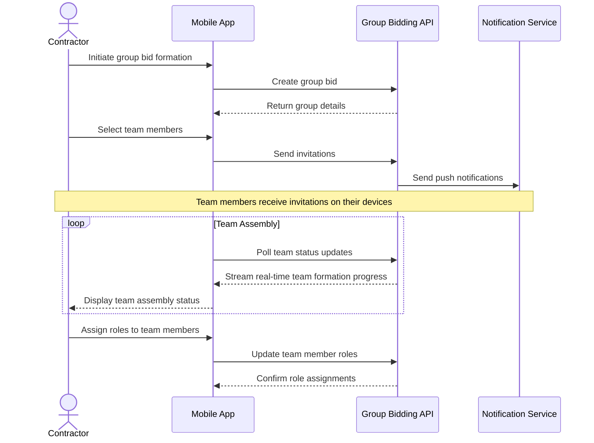

### 2. Component Management

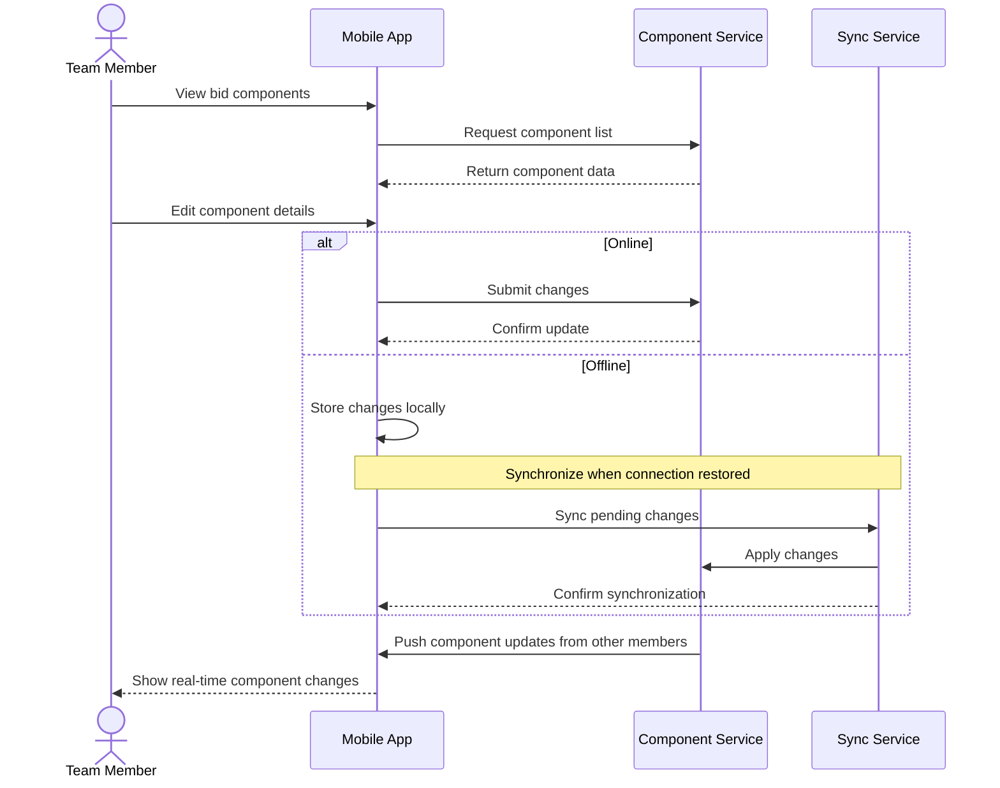

### 3. Decision Making

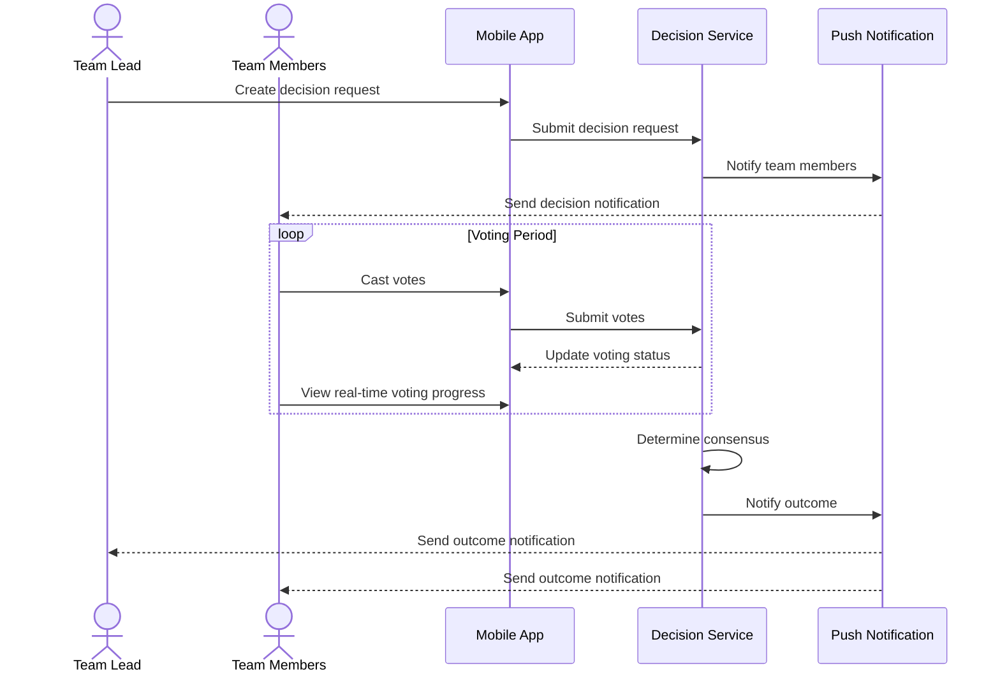

## Mobile-First Features

### 1. Context-Aware Interface

| Feature | Description | Implementation Priority |
|---------|-------------|-------------------------|
| Location-Based Team Suggestions | Suggest nearby contractors for team formation based on GPS data | Medium |
| On-Site Component Documentation | Easily capture photos and notes while on-site to supplement bid components | High |
| Time-Zone Aware Scheduling | Adjust meeting times and decision deadlines based on team members' local time zones | Medium |
| Environmental Adaptability | Automatically switch between light/dark modes based on ambient lighting conditions | Low |
| Proximity Notifications | Alert when team members are physically near each other to facilitate in-person collaboration | Low |

### 2. Optimized Input Methods

| Feature | Description | Implementation Priority |
|---------|-------------|-------------------------|
| Voice Input for Components | Dictate component descriptions and notes | High |
| Photo Annotation | Directly annotate photos to highlight component details | High |
| Quick Response Templates | Pre-defined response templates for common team communications | Medium |
| Gesture-Based Navigation | Swipe patterns for common actions like approval/rejection | Medium |
| Scan-to-Import | Scan paper documents or whiteboards to import into bid components | Medium |

### 3. Network-Aware Operation

| Feature | Description | Implementation Priority |
|---------|-------------|-------------------------|
| Offline Component Editing | Full edit capabilities for bid components while offline | High |
| Background Synchronization | Automatic sync when connectivity is restored | High |
| Bandwidth-Optimized Media | Adaptive media resolution based on network conditions | Medium |
| Conflict Resolution | Smart merging of changes made by multiple team members | High |
| Prioritized Sync Queue | Critical data synced first when connection is limited | Medium |

### 4. Mobile-Specific Collaboration

| Feature | Description | Implementation Priority |
|---------|-------------|-------------------------|
| Push-to-Talk Team Chat | Walkie-talkie style communication for team members | Medium |
| Mobile Whiteboard | Collaborative drawing space for bid planning | Medium |
| Calendar Integration | Seamless integration with device calendar for team events | High |
| Contact Sharing | Share contractor contacts directly to device address book | Low |
| One-Tap Conferencing | Single tap to join team conference calls | High |

## UI/UX Design Principles

### 1. One-Handed Operation

The Group Bidding mobile interface is designed for one-handed operation whenever possible, recognizing that contractors often need their other hand free while on job sites.

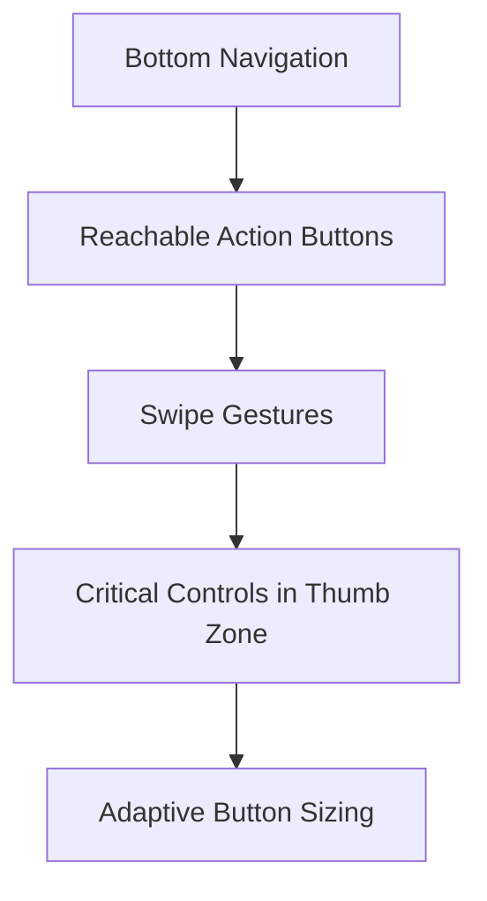

Key implementations:
- Primary action buttons positioned within thumb reach
- Swipe gestures for common actions like approving components
- Bottom navigation bar with essential functions
- Pull-down refresh and contextual actions

### 2. Glanceable Information

Information is presented in a way that contractors can quickly understand while on the move or in bright outdoor conditions.

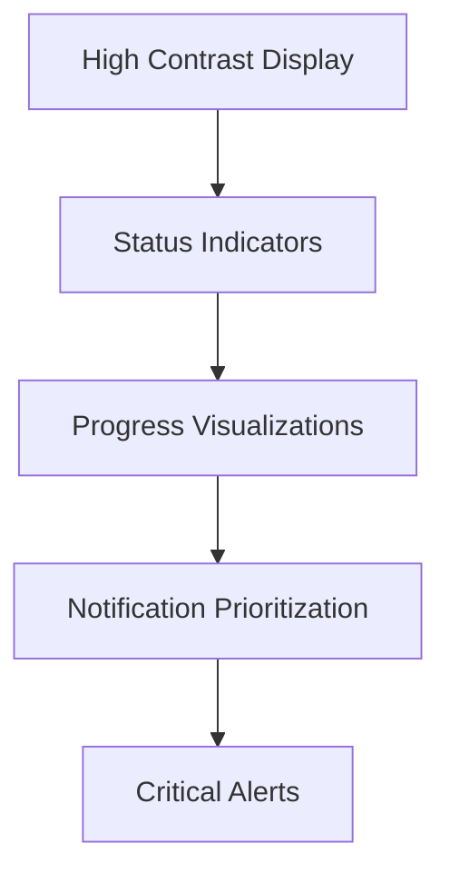

Key implementations:
- Color-coded status indicators for team and component states
- Progress bars for team formation and decision consensus
- Priority-based notification system
- Large touch targets for essential functions

### 3. Progressive Disclosure

Interface complexity scales based on the user's context and current task.

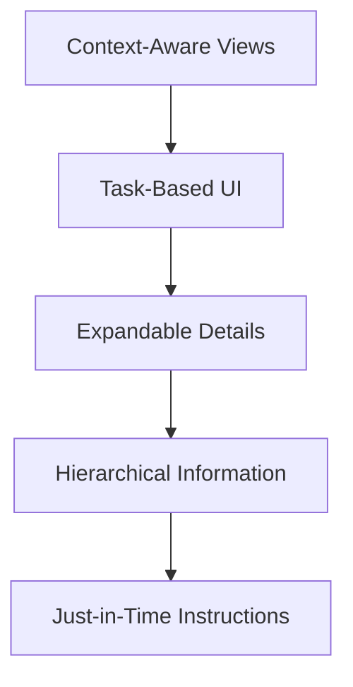

Key implementations:
- Primary views show essential information only
- Details accessible through expandable sections
- Step-by-step wizards for complex processes
- Contextual help based on current task

### 4. Consistent Cross-Platform Experience

While optimized for mobile, the experience maintains consistency with desktop for contractors who switch between devices.

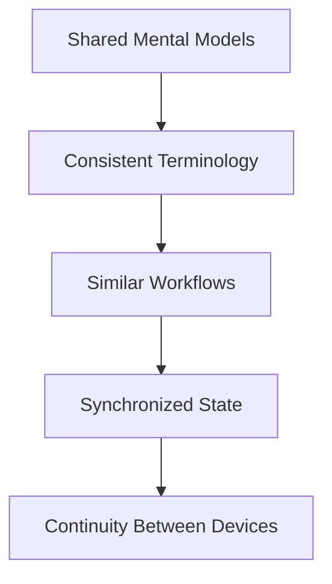

Key implementations:
- Seamless transition between mobile and desktop interfaces
- Consistent visual language and interaction patterns
- Reliable synchronization across devices
- Ability to start tasks on one device and continue on another

## Responsive Design Strategy

The Group Bidding mobile interface adapts to different device sizes and orientations:

### Phone (Portrait)

```
+---------------------------+
|       App Header          |
+---------------------------+
|                           |
|                           |
|     Primary Content       |
|     (Team/Components)     |
|                           |
|                           |
|                           |
+---------------------------+
|    Quick Action Bar       |
+---------------------------+
|    Bottom Navigation      |
+---------------------------+
```

### Phone (Landscape)

```
+----------------------------------------------+
|       App Header          |   Context Panel  |
+----------------------------------------------+
|                           |                  |
|     Primary Content       |  Action Panel    |
|     (Team/Components)     |  or              |
|                           |  Detail View     |
|                           |                  |
+----------------------------------------------+
|    Bottom Navigation                         |
+----------------------------------------------+
```

### Tablet

```
+----------------------------------------------+
|       App Header                             |
+----------------------------------------------+
|                           |                  |
|                           |                  |
|                           |                  |
|     Primary Content       |  Secondary Panel |
|     (Team/Components)     |  (Details,       |
|                           |   Actions,       |
|                           |   Analytics)     |
|                           |                  |
|                           |                  |
+----------------------------------------------+
|    Bottom Navigation      |  Context Actions |
+----------------------------------------------+
```

## Technical Implementation

### 1. Offline Architecture

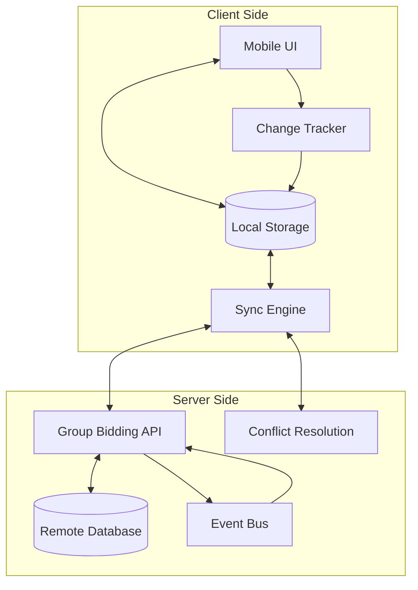

The offline architecture uses:

1. **Local Data Store**:
   - Bidirectional sync with server when online
   - Complete CRUD operations against local store
   - SQLite database for structured data
   - File-based storage for media assets

2. **Change Tracking**:
   - Event sourcing approach to track all changes
   - Timestamp and vector clock for change ordering
   - Unique device identifier for change attribution

3. **Conflict Resolution**:
   - Automated resolution for non-conflicting changes
   - Three-way merge for conflicting text changes
   - Last-writer-wins with notification for simple fields
   - Manual resolution option for complex conflicts

4. **Sync Prioritization**:
   - Critical data synced first (decisions, team changes)
   - Background sync for large media assets
   - Configurable sync policies based on network type

### 2. Real-time Collaboration

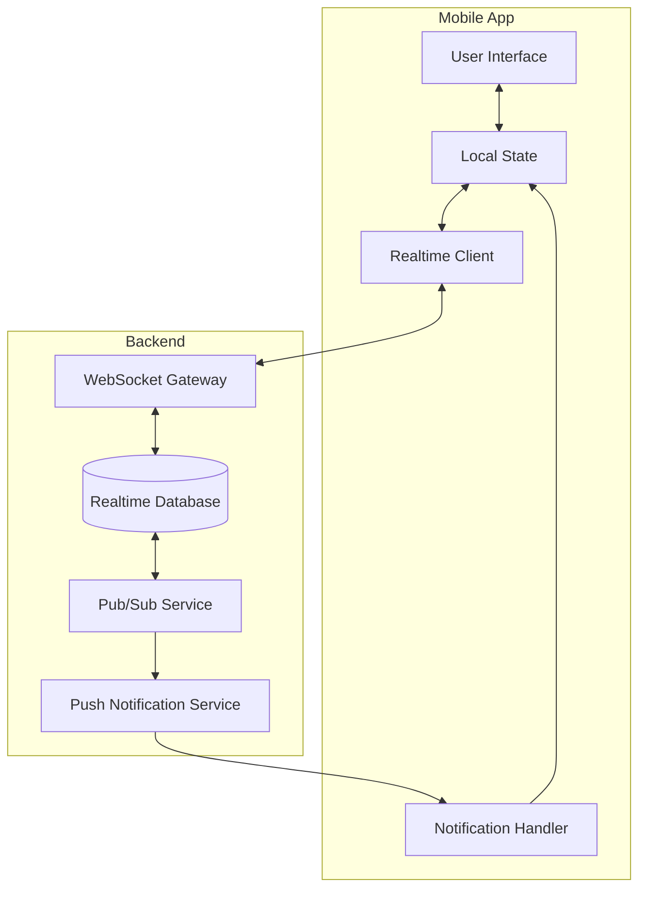

The real-time system implements:

1. **WebSocket Connection**:
   - Persistent connection when app is in foreground
   - Automatic reconnection with exponential backoff
   - Heartbeat mechanism to detect connection issues

2. **State Synchronization**:
   - Real-time component editing with operational transforms
   - Optimistic UI updates with server confirmation
   - Delta-based updates to minimize bandwidth

3. **Push Notification Fallback**:
   - Critical updates delivered via push when app is in background
   - Notification triage based on user preferences
   - Deep linking from notifications to relevant app section

4. **Presence Awareness**:
   - Team member online/offline status
   - "Currently editing" indicators for components
   - Last seen timestamp for offline members

### 3. Performance Optimizations

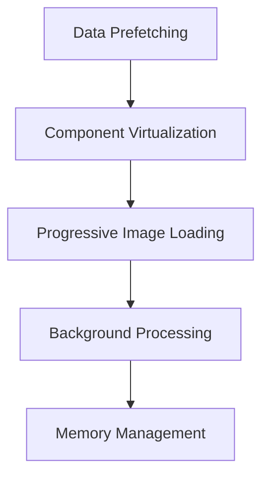

1. **Efficient Data Loading**:
   - Predictive prefetching based on user behavior
   - Incremental loading of large component lists
   - Data pagination with infinite scroll

2. **Resource Management**:
   - Aggressive image compression for site photos
   - On-demand loading of non-critical assets
   - Cache eviction policies based on usage patterns

3. **Battery Optimization**:
   - Reduced polling frequency when on battery
   - Batched network requests
   - Optimized location services usage

4. **Memory Efficiency**:
   - Component recycling in long lists
   - Memory-conscious image handling
   - State management optimized for mobile constraints

### 4. Security Considerations

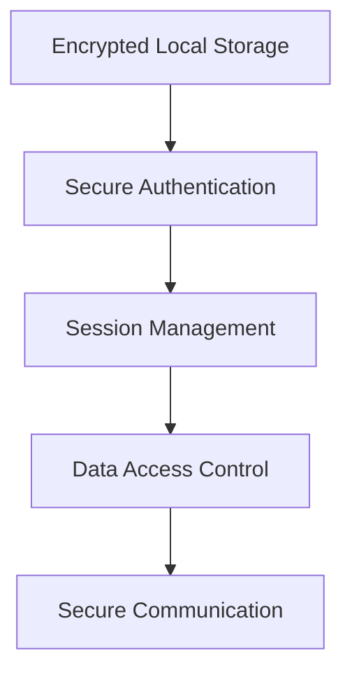

1. **Local Data Protection**:
   - Encrypted SQLite database
   - Secure file storage for component assets
   - Automatic data purging based on retention policy

2. **Authentication & Authorization**:
   - Biometric authentication option
   - OAuth 2.0 with PKCE for API access
   - Role-based access control for team resources

3. **Secure Communication**:
   - Certificate pinning for API connections
   - Encrypted WebSocket connections
   - Signed API requests

## Device-Specific Optimizations

### 1. iOS-Specific Features

| Feature | Description | Implementation |
|---------|-------------|----------------|
| iCloud Backup | Backup local group bid data to iCloud | Storage configuration with proper encryption |
| Handoff Support | Continue group bid work across Apple devices | NSUserActivity integration |
| Siri Shortcuts | Create voice commands for common actions | SiriKit intent handling |
| Haptic Feedback | Tactile feedback for important actions | UIFeedbackGenerator integration |
| ShareSheet Integration | Share bid components via iOS share sheet | UIActivityViewController implementation |

### 2. Android-Specific Features

| Feature | Description | Implementation |
|---------|-------------|----------------|
| Material Design Components | Follow Material 3 design language | MaterialComponents theme and widgets |
| Widget Support | Home screen widget for quick team status | AppWidgetProvider implementation |
| Notification Channels | Categorized notification preferences | NotificationChannel configuration |
| Split-Screen Support | Side-by-side app usage | Activity resize handling |
| Back Gesture Compatibility | Support for Android gesture navigation | Edge-to-edge content with gesture detection |

## Accessibility Considerations

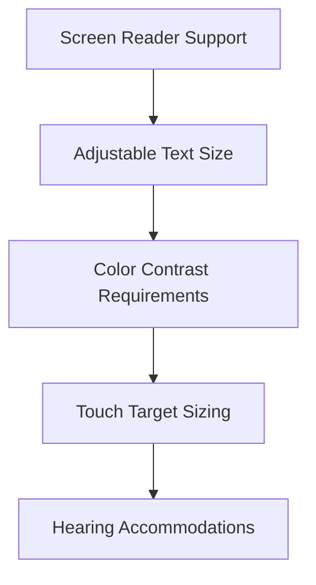

1. **Vision Accommodations**:
   - TalkBack/VoiceOver compatibility for all screens
   - Semantic content structure for screen readers
   - Dynamic text sizing with layout adaptation
   - High contrast mode for outdoor visibility

2. **Motor Accommodations**:
   - Large touch targets (minimum 48x48dp)
   - Voice command alternatives for critical actions
   - Reduced motion option for animations
   - Adjustable touch sensitivity

3. **Hearing Accommodations**:
   - Visual alternatives for all audio cues
   - Captioning for video content
   - Vibration patterns as alternative notifications
   - Transcripts for voice messages

## Testing Strategy

### 1. Device Coverage

| Device Category | Testing Approach | Priority Devices |
|-----------------|------------------|------------------|
| iOS Phones | Automated + Manual | Latest iPhone, iPhone Mini, iPhone Plus |
| iOS Tablets | Automated + Manual | Latest iPad, iPad Pro, iPad Mini |
| Android Phones | Automated + Manual | Google Pixel, Samsung Galaxy S, Budget Phone |
| Android Tablets | Automated + Manual | Samsung Tab S, Budget Tablet |

### 2. Network Condition Testing

| Condition | Testing Method | Success Criteria |
|-----------|---------------|------------------|
| Offline Operation | Airplane mode testing | Full functionality for cached data, appropriate error handling |
| Poor Connectivity | Network throttling | Graceful degradation, appropriate loading states |
| Network Transitions | Connection switching | Seamless recovery when transitioning between networks |
| Background Sync | Background app refresh | Successful data synchronization when app returns to foreground |

### 3. Field Testing

Real-world testing with contractors at construction sites is conducted to validate:

- Usability in bright sunlight
- Performance with dirty/gloved hands
- Battery consumption during full workday
- Functionality in areas with poor coverage
- Integration with real-world workflows

## Phased Implementation

### Phase 1: Core Mobile Experience

| Feature | Timeline | Dependencies |
|---------|----------|--------------|
| Team Viewer | Q2 2025 | User Management Services |
| Basic Component Management | Q2 2025 | Bidding System Core |
| Push Notification Integration | Q2 2025 | Notification Service |
| Offline Data Access | Q2 2025 | Sync Service |

### Phase 2: Collaborative Features

| Feature | Timeline | Dependencies |
|---------|----------|--------------|
| Real-time Component Editing | Q3 2025 | WebSocket Infrastructure |
| Team Chat Integration | Q3 2025 | Messaging Service |
| Decision Tracking & Voting | Q3 2025 | Consensus Service |
| Media Capture & Annotation | Q3 2025 | Storage Service |

### Phase 3: Advanced Mobile Capabilities

| Feature | Timeline | Dependencies |
|---------|----------|--------------|
| Voice Input & Dictation | Q4 2025 | Speech Recognition Service |
| AR Component Visualization | Q4 2025 | AR Framework |
| Advanced Offline Workflows | Q4 2025 | Enhanced Sync Service |
| Mobile Analytics Dashboard | Q4 2025 | Analytics Service |

### Phase 4: Optimization & Integration

| Feature | Timeline | Dependencies |
|---------|----------|--------------|
| Cross-Platform Continuity | Q1 2026 | State Synchronization Service |
| Advanced Conflict Resolution | Q1 2026 | Enhanced Merge Service |
| Performance Optimization | Q1 2026 | Monitoring Data |
| Third-Party Integration | Q1 2026 | Integration Framework |

## Success Metrics

### 1. Engagement Metrics

| Metric | Target | Measurement Method |
|--------|--------|-------------------|
| Mobile Sessions per User | >10 weekly | Analytics tracking |
| Mobile Session Duration | >5 minutes | Analytics tracking |
| Feature Adoption Rate | >80% of desktop features used | Feature usage tracking |
| Offline Usage Rate | >30% of total usage | Sync event tracking |
| Component Creation Rate | >25% of all components created on mobile | Creation source tracking |

### 2. Performance Metrics

| Metric | Target | Measurement Method |
|--------|--------|-------------------|
| App Launch Time | <2 seconds | Performance monitoring |
| Component List Load Time | <1 second | Performance monitoring |
| Offline Sync Completion | <30 seconds on WiFi | Sync timing tracking |
| Battery Impact | <5% per hour of active use | Battery usage monitoring |
| App Size | <50MB initial download | Build size tracking |

### 3. Business Impact Metrics

| Metric | Target | Measurement Method |
|--------|--------|-------------------|
| Mobile Conversion Rate | >40% of group bids include mobile interaction | Process tracking |
| Time to Consensus | <12 hours (vs. 24 hours on desktop) | Process timing tracking |
| Team Formation Speed | >30% faster than desktop-only | Process timing tracking |
| User Satisfaction | >4.5/5 star rating | In-app feedback |
| App Store Rating | >4.5 stars | App Store metrics |

## Integration with Other Mobile Domains

### Bidding System Mobile Integration

The Group Bidding mobile experience coordinates with the broader Bidding System mobile features to ensure:

- Seamless transition from individual to group bidding
- Consistent bid management interface
- Shared component libraries and templates
- Unified notification system for bid status updates

### Project Management Mobile Integration

Group Bidding connects with Project Management mobile functionality for:

- Project requirement reference during bid preparation
- Automatic transfer of awarded group bids to project phase
- Timeline synchronization between bid milestones and project schedules
- Shared document repositories between bidding and execution phases

### Labor Marketplace Mobile Integration

Integration with Labor Marketplace mobile features enables:

- Team member search and selection from the marketplace
- Skill and certification verification during team formation
- Availability checking for team scheduling
- Reputation and history review for potential team members

## Conclusion

The Group Bidding mobile strategy delivers a robust, field-ready experience that enables contractors to collaborate effectively from anywhere. By prioritizing offline capabilities, real-time collaboration, and contextual interfaces, the mobile implementation ensures that team-based bidding is accessible and efficient regardless of location or connectivity.

The phased implementation approach balances immediate value with long-term innovation, while the comprehensive testing strategy ensures reliability across devices and real-world conditions.
