# Messaging System Mobile Strategy

This document outlines the mobile strategy for the Messaging domain of the InstaBids platform. It defines the approach, architecture, features, patterns, and implementation guidelines for delivering a robust messaging experience across mobile devices.

## Mobile Strategy Overview

The Messaging System mobile strategy focuses on providing a seamless, responsive, and context-aware communication experience across all mobile devices while maintaining feature parity with the web platform.

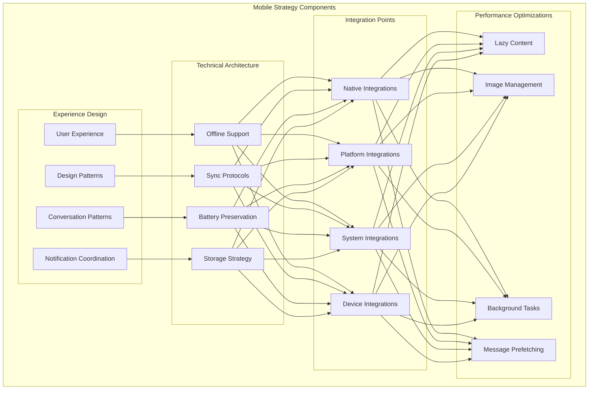

## Mobile Experience Design

### 1. User Experience Principles

The messaging experience on mobile devices follows these key principles:

1. **Context-Aware Messaging**
   - Adapt the messaging interface based on the user's context (project, bid, payment, etc.)
   - Show relevant information and actions based on the conversation type
   - Maintain consistency with the web experience while optimizing for mobile

2. **Conversation-First Design**
   - Focus on the conversation as the primary interaction
   - Minimize UI chrome to maximize message visibility
   - Enable quick access to conversation context and related information

3. **Interaction Optimization**
   - Optimize tap targets for mobile interaction
   - Provide haptic feedback for key actions
   - Support gesture-based navigation and actions

4. **Accessibility Focus**
   - Support screen readers and voice control
   - Implement high-contrast mode
   - Enable font size adjustments
   - Support reduced motion preferences

### 2. Mobile Messaging Patterns

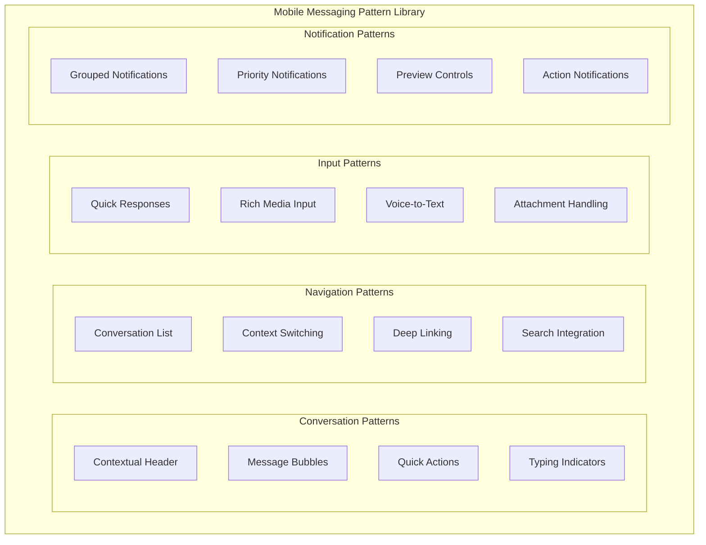

**Conversation Patterns:**

1. **Contextual Headers**
   - Dynamic headers that show conversation context
   - Quick access to related project, bid, or payment information
   - Status indicators for context-related information
   - Action buttons for common context-specific tasks

2. **Responsive Message Bubbles**
   - Clear sender identification
   - Timestamp visibility controls
   - Read status indicators
   - Content-optimized layouts

3. **In-Context Quick Actions**
   - Swipe actions for common tasks
   - Long-press menus for advanced options
   - Context-specific action buttons
   - Reaction support

### 3. User Type Adaptations

The mobile messaging experience is tailored to different user types:

| User Type | Mobile Messaging Adaptations |
|-----------|------------------------------|
| Homeowner | - Project-centric conversation organization<br>- Emphasis on bid review and contractor communication<br>- Payment milestone notifications<br>- Photo sharing optimizations for project updates |
| Contractor | - Job-centric conversation organization<br>- Bid management and negotiation tools<br>- Team coordination features<br>- Document handling optimizations<br>- Calendar integration for scheduling |
| Helper | - Task-focused messaging interfaces<br>- Quick status update tools<br>- Location sharing for on-site coordination<br>- Simplified document access |
| Property Manager | - Multi-project conversation management<br>- Batch communication tools<br>- Administrative controls and oversight features<br>- Portfolio-level messaging organization |
| System Admin | - System notification management<br>- Support conversation monitoring<br>- Automated messaging configuration<br>- Analytics dashboards |

### 4. Mobile Entry Points

The messaging system is accessible from multiple entry points in the mobile application:

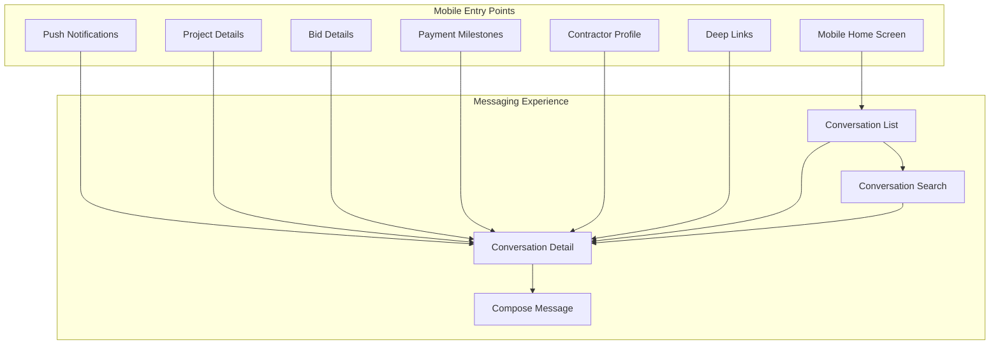

**Implementation Details:**

1. **Push Notification Entry**
   - Direct access to the specific message
   - Context preservation in notification payload
   - Background data pre-loading
   - Conversation state restoration

2. **Context-Based Entry**
   - From project details to project conversation
   - From bid details to bid-specific messages
   - From payment details to payment-related discussions
   - Context parameter passing between screens

## Technical Architecture

### 1. Offline Capabilities

The messaging system implements robust offline support to ensure usability in low or no connectivity scenarios:

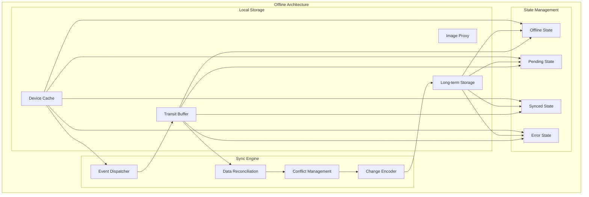

**Implementation Details:**

1. **Message Queue Management**
   - Offline message composition and queuing
   - Background sync when connectivity returns
   - Retry strategy with exponential backoff
   - Message priority for sync order

2. **Data Synchronization**
   - Incremental sync for bandwidth efficiency
   - Differential sync for message content
   - Attachment resumable uploads
   - Read state synchronization

3. **Conflict Resolution**
   - Timestamp-based resolution for simple conflicts
   - Three-way merge for complex conflicts
   - User notification for manual resolution when needed
   - Conflict avoidance strategies

### 2. Notification Strategy

The mobile notification strategy for messaging ensures timely delivery while respecting user preferences:

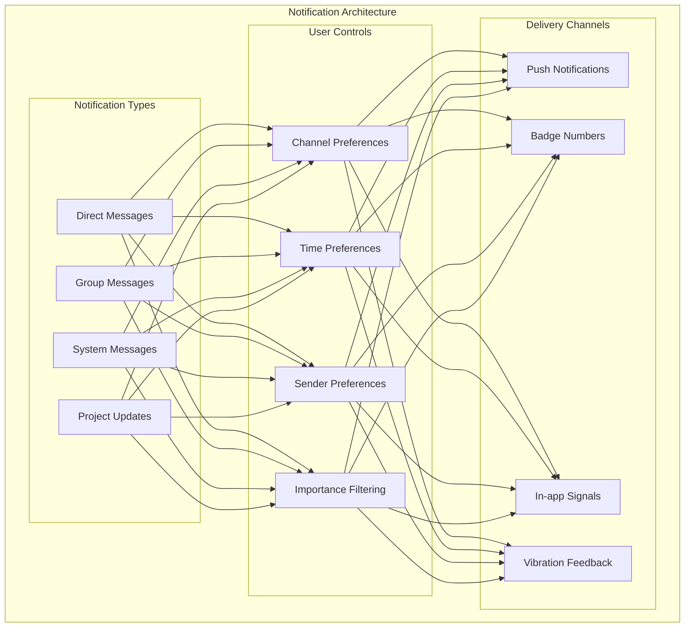

**Implementation Details:**

1. **Notification Grouping**
   - Conversation-based grouping
   - Context-based grouping (project, bid, etc.)
   - Smart summary generation
   - Count indicators for multiple messages

2. **Notification Actions**
   - Quick reply support
   - Mark as read action
   - Context-specific actions
   - Mute conversation option

3. **Delivery Optimization**
   - User activity awareness
   - Time zone consideration
   - Do Not Disturb integration
   - Battery state awareness

### 3. Battery & Data Optimization

The messaging system implements several strategies to minimize battery and data usage:

| Strategy | Implementation | Benefit |
|----------|----------------|---------|
| Connection Pooling | Batch API requests for messaging operations | Reduces radio usage |
| Adaptive Sync | Adjust sync frequency based on app usage patterns | Balances freshness and battery usage |
| Compression | Compress message content and metadata | Reduces data usage |
| Image Optimization | Progressive loading and on-device resizing | Reduces transfer size and memory usage |
| Background Limitations | Strict background task scheduling | Prevents excessive background activity |
| Push Notification Efficiency | Payload optimization and batching | Minimizes wake cycles |
| Lazy Loading | Load conversation content on demand | Reduces initial load time and memory usage |
| Attachment Strategy | Smart download decisions based on connection and storage | Optimizes data usage for large files |

**Implementation Examples:**

```typescript
// Example: Battery-aware sync scheduling
export class BatteryAwareSyncScheduler {
  private batteryLevel: number = 100;
  private isCharging: boolean = false;
  
  constructor(
    private syncService: MessagingSyncService,
    private batteryService: DeviceBatteryService,
    private connectivityService: NetworkConnectivityService
  ) {
    this.batteryService.onBatteryChanged.subscribe(
      (batteryInfo) => this.updateBatteryInfo(batteryInfo)
    );
  }
  
  private updateBatteryInfo(batteryInfo: BatteryInfo): void {
    this.batteryLevel = batteryInfo.level;
    this.isCharging = batteryInfo.isCharging;
    this.adjustSyncStrategy();
  }
  
  private adjustSyncStrategy(): void {
    // When battery is low and not charging, reduce sync frequency
    if (this.batteryLevel < 15 && !this.isCharging) {
      this.syncService.setSyncInterval(SyncInterval.CONSERVATIVE);
      this.syncService.setPrioritizationStrategy(SyncPriority.ESSENTIAL_ONLY);
    } 
    // When charging or high battery, use normal sync
    else if (this.isCharging || this.batteryLevel > 50) {
      this.syncService.setSyncInterval(SyncInterval.NORMAL);
      this.syncService.setPrioritizationStrategy(SyncPriority.BALANCED);
    } 
    // Middle ground for moderate battery levels
    else {
      this.syncService.setSyncInterval(SyncInterval.REDUCED);
      this.syncService.setPrioritizationStrategy(SyncPriority.IMPORTANT_ONLY);
    }
  }
  
  public scheduleNextSync(): void {
    const networkType = this.connectivityService.getCurrentNetworkType();
    const syncConfig: SyncConfig = {
      batterySaver: this.batteryLevel < 30 && !this.isCharging,
      allowMeteredConnection: networkType !== NetworkType.METERED || this.isHighPriorityPending(),
      allowFullSync: this.isCharging || this.batteryLevel > 70,
      includeAttachments: this.shouldSyncAttachments(networkType)
    };
    
    this.syncService.scheduleSync(syncConfig);
  }
  
  private isHighPriorityPending(): boolean {
    return this.syncService.getPendingOperations().some(
      op => op.priority === OperationPriority.HIGH
    );
  }
  
  private shouldSyncAttachments(networkType: NetworkType): boolean {
    // Only sync attachments on WiFi unless charging
    return networkType === NetworkType.WIFI || this.isCharging;
  }
}
```

### 4. Storage Strategy

The messaging system implements a tiered storage strategy for efficient data management:

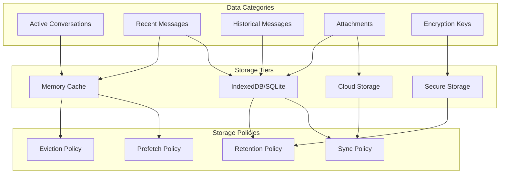

**Implementation Details:**

1. **Message Storage Hierarchy**
   - In-memory cache for active conversations
   - SQLite/IndexedDB for persistent storage
   - Secure storage for encryption keys
   - Tiered attachment storage

2. **Storage Optimization**
   - Conversation-based pruning
   - Time-based message retention
   - Attachment lifecycle management
   - Selective sync for historical messages

3. **Security Considerations**
   - Encryption at rest for all message data
   - Secure deletion procedures
   - Authentication for storage access
   - Biometric protection options

## Platform-Specific Implementations

### 1. iOS Implementation

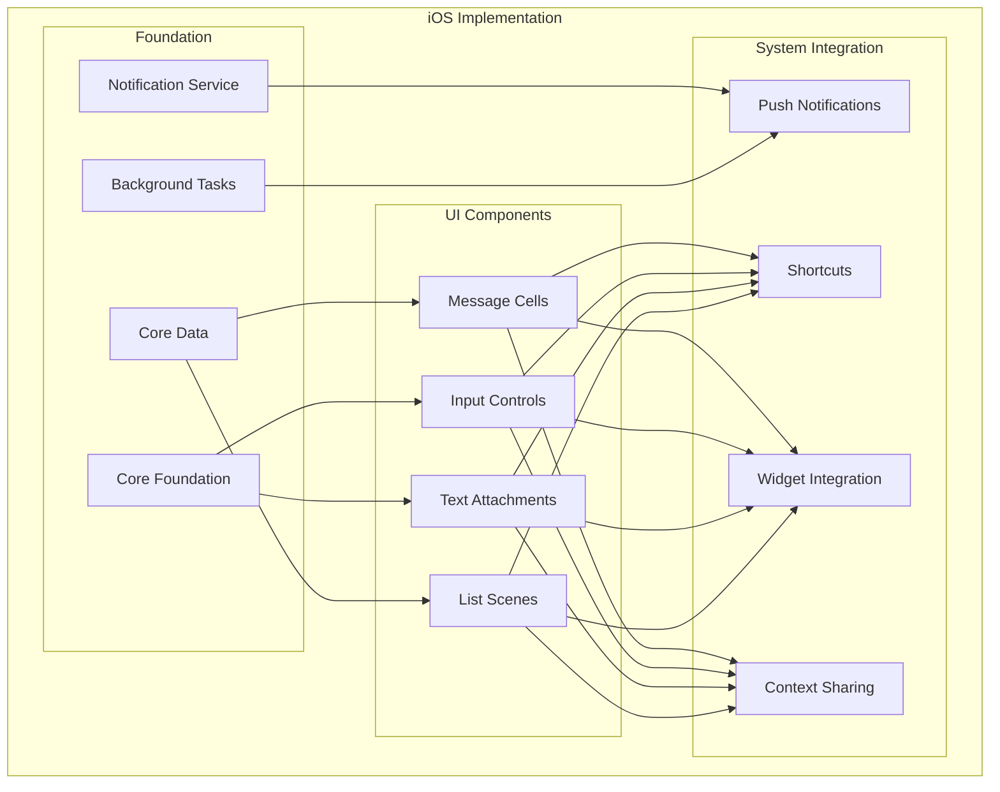

**iOS-Specific Features:**

1. **iMessage Integration**
   - Share message content to iMessage
   - Deep links from iMessage to conversations
   - Rich link previews for shared content

2. **iOS Widgets**
   - Recent conversations widget
   - Priority message widget
   - Project conversation shortcuts
   - Unread count widgets

3. **Shortcuts Integration**
   - "Message Team" shortcut
   - "Share Update" shortcut
   - "Check Project Messages" shortcut
   - Custom shortcuts for frequent conversations

4. **iCloud Backup**
   - Secure message backup
   - Cross-device message sync
   - Keychain integration for secure storage
   - Backup exclusion options for sensitive content

### 2. Android Implementation

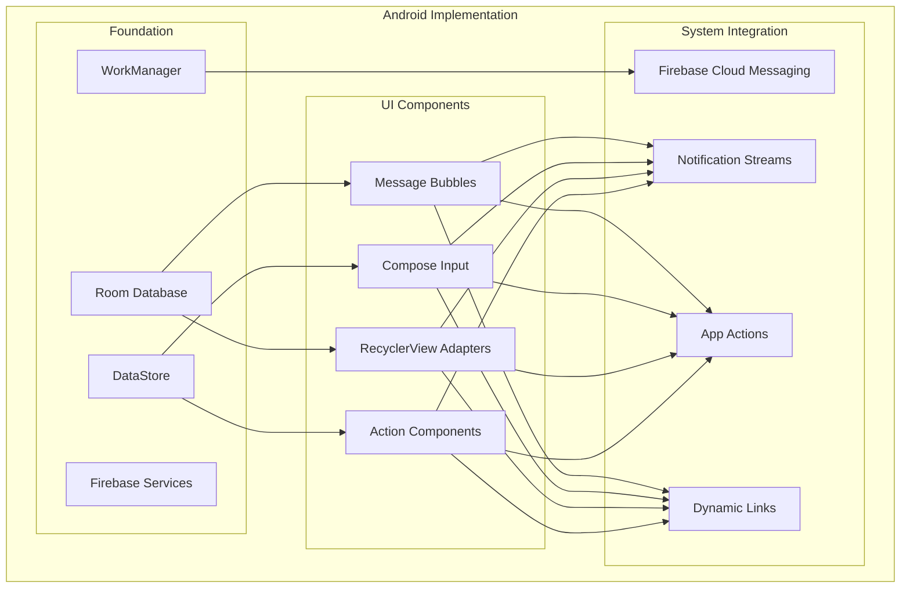

**Android-Specific Features:**

1. **Conversation Notifications**
   - Person-to-person conversation styling
   - Bubble notifications for active conversations
   - Direct reply from notifications
   - Conversation shortcuts on launcher

2. **Home Screen Integration**
   - Conversation shortcuts
   - Project message widgets
   - Dynamic shortcuts for recent conversations
   - Glance widgets for message previews

3. **System Integration**
   - Share sheet integration
   - Content provider for shared attachments
   - Android for Work profile support
   - Assistant integration for messaging

4. **Background Optimizations**
   - WorkManager for reliable sync
   - Foreground service for critical messaging
   - Doze mode optimization
   - Battery optimization exceptions management

### 3. Cross-Platform Considerations

Strategies for maintaining consistency while leveraging platform-specific capabilities:

1. **Core Experience Consistency**
   - Shared business logic across platforms
   - Consistent conversation data model
   - Standard message rendering rules
   - Common offline capabilities

2. **Platform-Specific Extensions**
   - Leverage platform notifications optimally
   - Adapt to platform-specific UI paradigms
   - Implement OS-specific optimizations
   - Follow platform design guidelines

3. **Feature Capability Detection**
   - Graceful fallbacks for unsupported features
   - Feature detection for platform capabilities
   - Adaptive UI for platform constraints
   - Staged feature rollout by platform

## Mobile User Flows

### 1. Conversation Management Flow

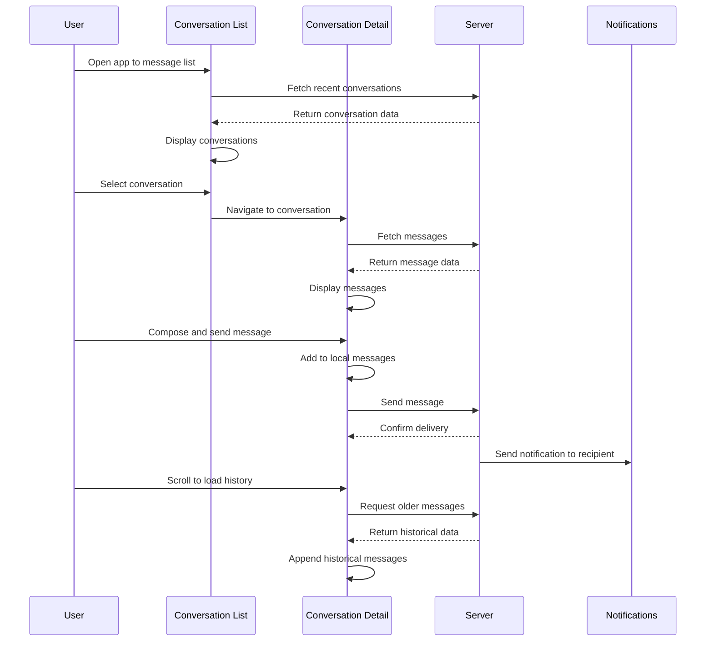

### 2. Attachment Handling Flow

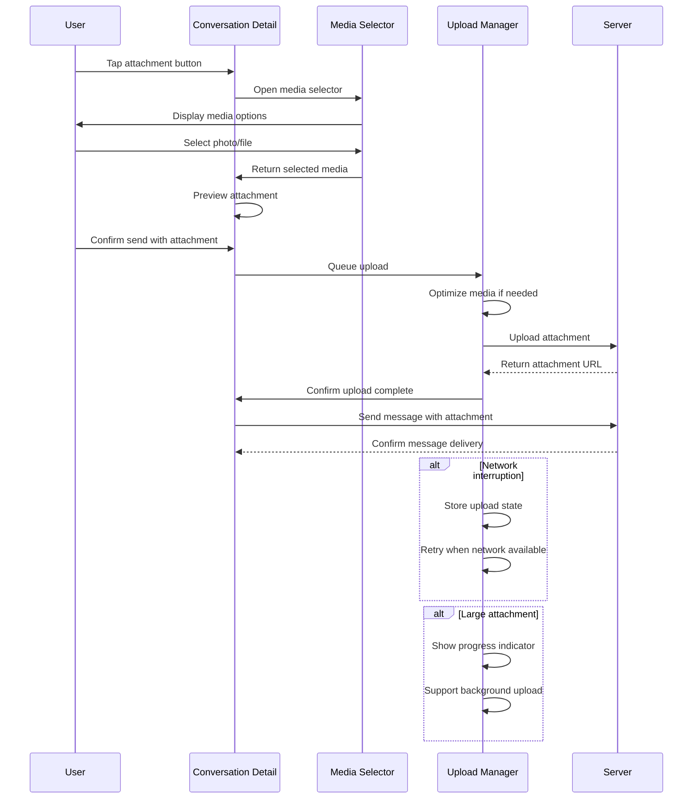

### 3. Project Context Messaging Flow

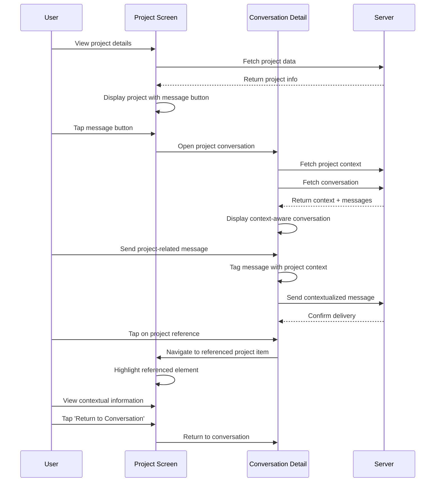

## Mobile Implementation Patterns

### 1. Message Rendering Pipeline

The message rendering pipeline optimizes for performance and flexibility:

```typescript
// Example: Message rendering pipeline
export class MessageRenderingPipeline {
  constructor(
    private messageRepository: MessageRepository,
    private renderingQueue: RenderingQueue,
    private messageProcessors: MessageProcessor[],
    private renderCache: RenderCache
  ) {}
  
  public processMessage(messageId: string): MessageViewModel {
    // Try to get from cache first
    const cachedView = this.renderCache.getMessageView(messageId);
    if (cachedView) {
      return cachedView;
    }
    
    // Get message data
    const message = this.messageRepository.getMessage(messageId);
    
    // Create base view model
    let viewModel = this.createBaseViewModel(message);
    
    // Run through processing pipeline
    for (const processor of this.messageProcessors) {
      viewModel = processor.process(viewModel, message);
    }
    
    // Cache the result
    this.renderCache.cacheMessageView(messageId, viewModel);
    
    return viewModel;
  }
  
  public renderMessageBatch(messageIds: string[]): void {
    // Queue rendering for smooth scrolling
    this.renderingQueue.enqueue(() => {
      const viewModels = messageIds.map(id => this.processMessage(id));
      return viewModels;
    });
  }
  
  private createBaseViewModel(message: Message): MessageViewModel {
    return {
      id: message.id,
      text: message.content.text,
      senderId: message.senderId,
      timestamp: message.timestamp,
      status: message.status,
      attachments: [],
      isOwn: message.senderId === this.userService.currentUserId,
      reactions: [],
      // Other base properties
    };
  }
}

// Example processor: Link detection
export class LinkProcessor implements MessageProcessor {
  process(viewModel: MessageViewModel, message: Message): MessageViewModel {
    if (!message.content.text) {
      return viewModel;
    }
    
    // Extract links from message text
    const links = this.extractLinks(message.content.text);
    
    // If links found, enrich the view model
    if (links.length > 0) {
      return {
        ...viewModel,
        links,
        hasLinks: true,
        // For each link, we might want to add preview data
        linkPreviews: links.map(link => this.generateLinkPreview(link))
      };
    }
    
    return viewModel;
  }
  
  private extractLinks(text: string): string[] {
    // Link extraction logic
    const urlRegex = /(https?:\/\/[^\s]+)/g;
    return text.match(urlRegex) || [];
  }
  
  private generateLinkPreview(link: string): LinkPreview {
    // Create placeholder preview that can be loaded asynchronously
    return {
      url: link,
      title: '',
      description: '',
      imageUrl: null,
      isLoading: true
    };
  }
}
```

### 2. Lazy Loading Strategy

The messaging system implements efficient lazy loading for optimal performance:

```typescript
// Example: Conversation lazy loading strategy
export class ConversationLazyLoader {
  private loadedMessageIds: Set<string> = new Set();
  private isLoadingMore: boolean = false;
  private reachedStart: boolean = false;
  private reachedEnd: boolean = false;
  
  constructor(
    private conversationId: string,
    private messageRepository: MessageRepository,
    private renderingPipeline: MessageRenderingPipeline,
    private initialLoadCount: number = 20,
    private pageSize: number = 15
  ) {}
  
  public async loadInitialMessages(): Promise<MessageViewModel[]> {
    // Get most recent messages first
    const messages = await this.messageRepository.getRecentMessages(
      this.conversationId,
      this.initialLoadCount
    );
    
    // Mark as loaded
    messages.forEach(msg => this.loadedMessageIds.add(msg.id));
    
    // Check if we've reached the start
    this.reachedStart = messages.length < this.initialLoadCount;
    
    // Pre-load one page in each direction
    this.preloadOlderMessages();
    
    // Process and return view models
    return messages.map(msg => 
      this.renderingPipeline.processMessage(msg.id)
    );
  }
  
  public async loadOlderMessages(): Promise<MessageViewModel[]> {
    if (this.isLoadingMore || this.reachedStart) {
      return [];
    }
    
    this.isLoadingMore = true;
    
    try {
      // Get the oldest loaded message as reference
      const oldestMessageId = this.getOldestLoadedMessageId();
      
      // Load messages before this one
      const olderMessages = await this.messageRepository.getMessagesBefore(
        this.conversationId,
        oldestMessageId,
        this.pageSize
      );
      
      // Mark as loaded
      olderMessages.forEach(msg => this.loadedMessageIds.add(msg.id));
      
      // Check if we've reached the start
      this.reachedStart = olderMessages.length < this.pageSize;
      
      // Pre-fetch next page if needed
      if (!this.reachedStart) {
        this.preloadOlderMessages();
      }
      
      // Process and return view models
      return olderMessages.map(msg => 
        this.renderingPipeline.processMessage(msg.id)
      );
    } finally {
      this.isLoadingMore = false;
    }
  }
  
  private getOldestLoadedMessageId(): string {
    // Implementation to find oldest message ID
    const loadedMessages = Array.from(this.loadedMessageIds)
      .map(id => this.messageRepository.getMessage(id))
      .filter(Boolean);
    
    if (loadedMessages.length === 0) {
      return null;
    }
    
    // Sort by timestamp and get oldest
    loadedMessages.sort((a, b) => 
      new Date(a.timestamp).getTime() - new Date(b.timestamp).getTime()
    );
    
    return loadedMessages[0].id;
  }
  
  private preloadOlderMessages(): void {
    // Preload next page in background without rendering
    const oldestId = this.getOldestLoadedMessageId();
    if (oldestId) {
      this.messageRepository.getMessagesBefore(
        this.conversationId,
        oldestId,
        this.pageSize
      ).then(messages => {
        // Just cache the data without rendering
        messages.forEach(msg => {
          // Cache the raw data
          this.messageRepository.cacheMessage(msg);
        });
      });
    }
  }
}
```

### 3. Offline State Management

The messaging system manages offline state transitions gracefully:

```typescript
// Example: Offline state manager
export enum ConnectionState {
  ONLINE,
  OFFLINE,
  RECONNECTING
}

export class OfflineStateManager {
  private currentState: ConnectionState = ConnectionState.ONLINE;
  private pendingOperations: Operation[] = [];
  private stateListeners: ((state: ConnectionState) => void)[] = [];
  
  constructor(
    private networkService: NetworkService,
    private syncService: SyncService,
    private messageRepository: MessageRepository,
    private uiStateManager: UIStateManager
  ) {
    // Listen for network changes
    this.networkService.onConnectivityChanged.subscribe(
      isConnected => this.handleConnectivityChange(isConnected)
    );
  }
  
  public addStateListener(listener: (state: ConnectionState) => void): void {
    this.stateListeners.push(listener);
  }
  
  public getCurrentState(): ConnectionState {
    return this.currentState;
  }
  
  public queueOperation(operation: Operation): void {
    // Add to pending operations
    this.pendingOperations.push(operation);
    
    // Try to execute immediately if online
    if (this.currentState === ConnectionState.ONLINE) {
      this.processOperations();
    }
  }
  
  private handleConnectivityChange(isConnected: boolean): void {
    const previousState = this.currentState;
    
    if (isConnected) {
      // We're back online
      this.currentState = ConnectionState.ONLINE;
      
      // Process any pending operations
      this.processOperations();
      
      // Sync with server
      this.syncService.performSync();
    } else {
      // We're offline
      this.currentState = ConnectionState.OFFLINE;
      
      // Update UI to show offline state
      this.uiStateManager.showOfflineIndicator();
    }
    
    // Notify listeners if state changed
    if (previousState !== this.currentState) {
      this.notifyStateChange();
    }
  }
  
  private async processOperations(): Promise<void> {
    if (this.pendingOperations.length === 0) {
      return;
    }
    
    // Process operations in order
    const operationsToProcess = [...this.pendingOperations];
    this.pendingOperations = [];
    
    for (const operation of operationsToProcess) {
      try {
        await this.executeOperation(operation);
      } catch (error) {
        // If failed due to network, requeue
        if (this.isNetworkError(error)) {
          this.pendingOperations.push(operation);
          
          // Update state to offline
          this
