# Payment Processing Mobile Strategy

This document outlines the mobile strategy, implementation approach, and best practices for the Payment Processing domain of the InstaBids platform. It defines how payment functionality will be delivered across mobile devices while ensuring security, usability, and compliance.

## Mobile Strategy Overview

The Payment Processing mobile strategy aims to provide secure, seamless, and reliable payment experiences across all mobile devices, with special consideration for the unique constraints and opportunities of mobile environments in the construction industry.

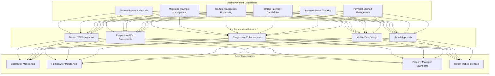

## Mobile Payment Experiences by User Type

### Contractor Mobile Experience

Contractors often require robust payment capabilities while on job sites or moving between projects:

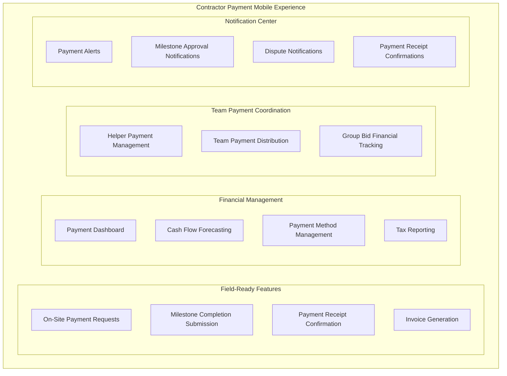

**Key Mobile Features:**

1. **On-Site Milestone Management**
   - Mark milestones as complete with photo/video evidence
   - Submit completion evidence directly from the job site
   - Receive real-time updates on milestone verification
   - Generate on-site documentation for completed work

2. **Financial Dashboard**
   - View upcoming payments with timeline visualization
   - Track pending, processing, and completed payments
   - Monitor payment status across multiple projects
   - Analyze historical payment data with mobile-optimized charts

3. **Team Payment Management**
   - Distribute payments to team members/helpers
   - Track team member payment statuses
   - Approve helper hour submissions
   - Manage group bid payment distributions

### Homeowner Mobile Experience

Homeowners need convenient yet secure payment capabilities for funding projects and approving milestone payments:

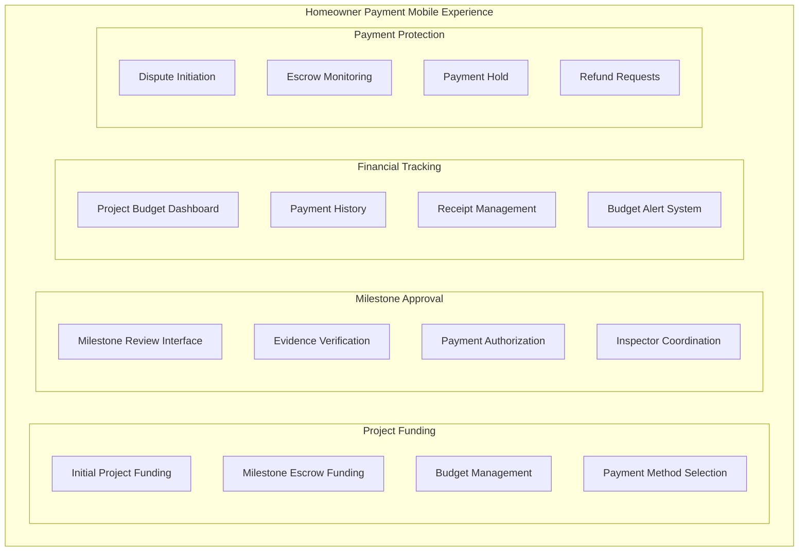

**Key Mobile Features:**

1. **Milestone Verification & Payment**
   - Review submitted milestone completion evidence
   - Conduct mobile video inspections when needed
   - Authorize milestone payments with biometric confirmation
   - Schedule in-person inspections through the app

2. **Project Financial Management**
   - Track project spending against budget
   - Receive alerts before funding requirements
   - Review payment history with detailed breakdowns
   - Manage payment methods securely

3. **Payment Protection**
   - Initiate payment disputes with evidence submission
   - Monitor escrow balances and status
   - Place payment holds when necessary
   - Provide feedback on contractor financial interactions

### Property Manager Mobile Experience

Property managers need specialized tools to manage payments across multiple properties and projects:

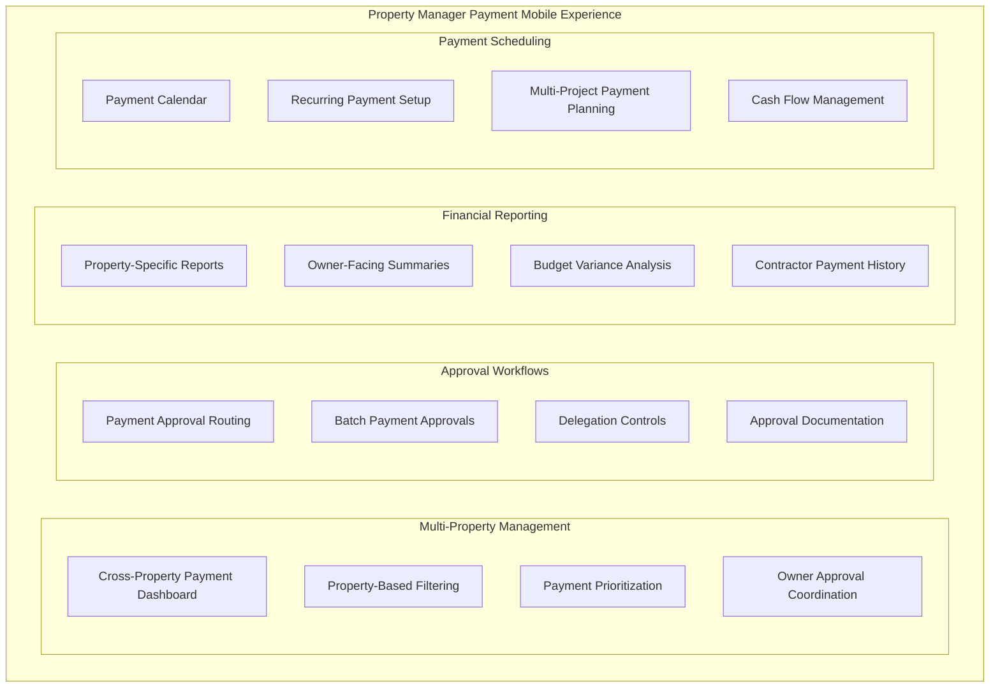

**Key Mobile Features:**

1. **Multi-Property Payment Dashboard**
   - Toggle between properties with unified payment view
   - Filter payments by property, project, or contractor
   - Prioritize urgent payment approvals
   - Track payment status across property portfolio

2. **Approval Workflow Management**
   - Route payment approvals to property owners when required
   - Batch approve similar payments across properties
   - Delegate approval authority with constraints
   - Document approval decisions with mobile audit trail

3. **Payment Scheduling & Forecasting**
   - View upcoming payment calendar across properties
   - Schedule recurring payments for maintenance
   - Plan payment timing for optimal cash flow
   - Generate owner-ready payment reports

## Mobile Implementation Strategy

### 1. Mobile Payment UI Patterns

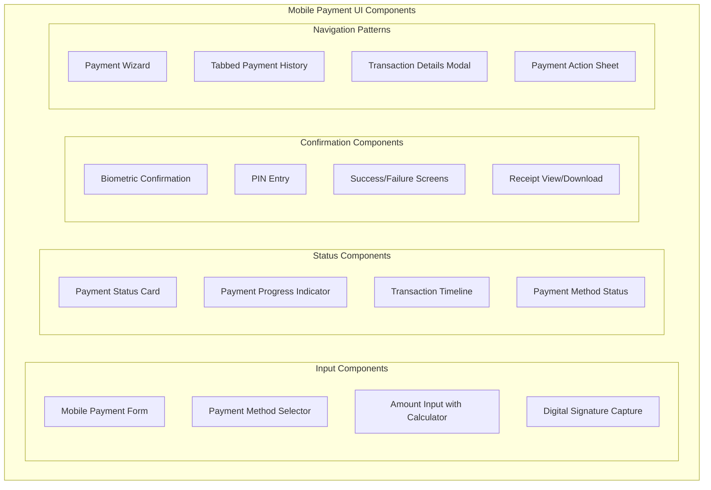

**Key UI Considerations:**

1. **One-Handed Operation**
   - Position critical payment actions within thumb reach
   - Support landscape and portrait payment flows
   - Implement swipe gestures for common payment operations
   - Minimize text entry with alternatives (scanning, saving, suggestions)

2. **Progressive Disclosure**
   - Reveal payment details as needed through expandable sections
   - Stack payment form fields with clear sequential steps
   - Provide contextual help for payment fields
   - Present summary information first with drill-down capability

3. **Error Prevention**
   - Validate payment information in real-time
   - Provide clear, actionable error messages
   - Include visual cues for payment field requirements
   - Offer guided correction for payment errors

### 2. Mobile Payment Security

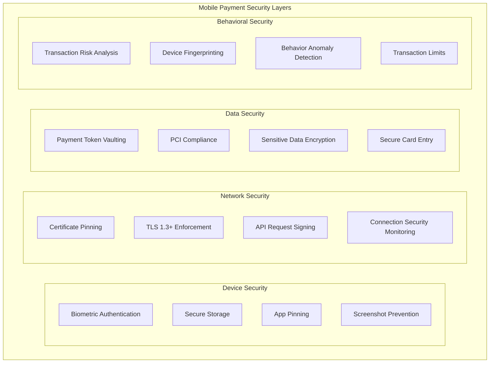

**Key Security Implementations:**

1. **Mobile-Specific Authentication**
   - Multi-factor authentication for high-value transactions
   - Biometric verification for payment authorizations
   - Secure PIN entry with randomized keypad
   - Session-based authentication with timeout

2. **Secure Payment Data Storage**
   - Tokenization of payment methods
   - Device-level encryption for cached payment data
   - Secure element utilization where available
   - Payment data isolation with containerization

3. **Fraud Prevention on Mobile**
   - Device binding for payment methods
   - Location validation for transaction approval
   - Behavioral analysis for unusual payment patterns
   - Stepped verification for high-risk mobile transactions

### 3. Offline Payment Capabilities

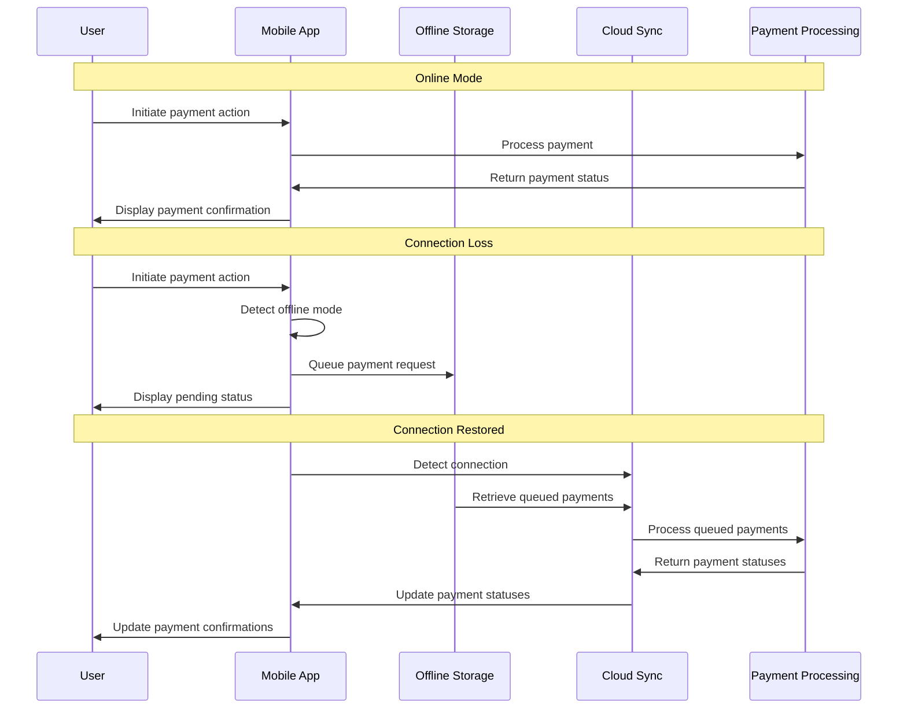

**Key Offline Strategies:**

1. **Queued Transaction Management**
   - Secure local storage of pending transactions
   - Priority-based processing when connection restores
   - Conflict resolution for offline-initiated payments
   - Transaction expiration rules for stale requests

2. **Offline Documentation**
   - Local storage of payment receipts and confirmations
   - Offline access to payment history
   - Cached payment method information (tokenized)
   - Digital signature capture in offline mode

3. **Field-Ready Payment Features**
   - Milestone completion documentation without connectivity
   - Transaction initiation with delayed processing
   - Local validation of payment requests
   - QR-code based offline payment verification

### 4. Cross-Platform Implementation

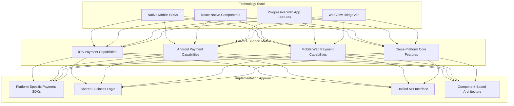

**Cross-Platform Strategy:**

1. **Native SDK Integration**
   - iOS: Apple Pay integration with PassKit framework
   - Android: Google Pay integration with Pay API
   - Native camera access for document/evidence capture
   - Platform-specific biometric authentication

2. **Shared Payment Logic**
   - Core payment validation in shared JavaScript
   - Common payment state management
   - Cross-platform analytics and reporting
   - Unified payment error handling

3. **Platform Feature Adaptation**
   - Feature detection for advanced payment capabilities
   - Graceful fallback for unsupported payment features
   - Progressive enhancement for newer devices
   - Platform-specific UI adaptations

## Mobile Payment Flows

### 1. Mobile Milestone Payment Flow

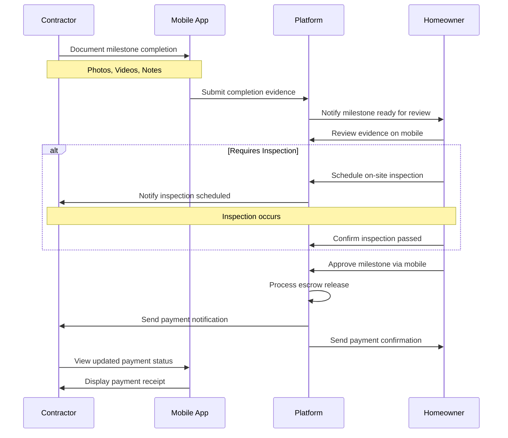

**Key Mobile Considerations:**

1. **Evidence Capture Optimization**
   - Optimized photo/video capture for construction evidence
   - Automatic quality adjustment based on connection
   - Offline evidence collection with queued submission
   - Location tagging for verification

2. **Mobile Review Experience**
   - Swipe-based evidence review interface
   - One-tap approval for straightforward milestones
   - Mobile-optimized inspection scheduling
   - AR-enhanced verification for complex milestones

### 2. Mobile Payment Method Management

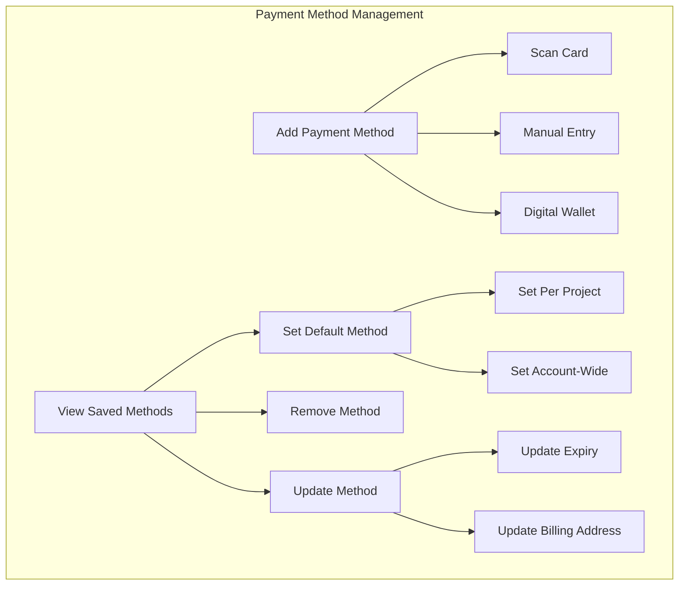

**Key Mobile Features:**

1. **Streamlined Method Addition**
   - Card scanning with mobile camera
   - QR code linking for bank accounts
   - Digital wallet integration (Apple Pay, Google Pay)
   - Secure manual entry with field validation

2. **Method Management**
   - Quick-access to saved payment methods
   - Visual card representation with last 4 digits
   - Default method selection with visual indicator
   - Payment method health monitoring

### 3. On-Site Payment Authorization

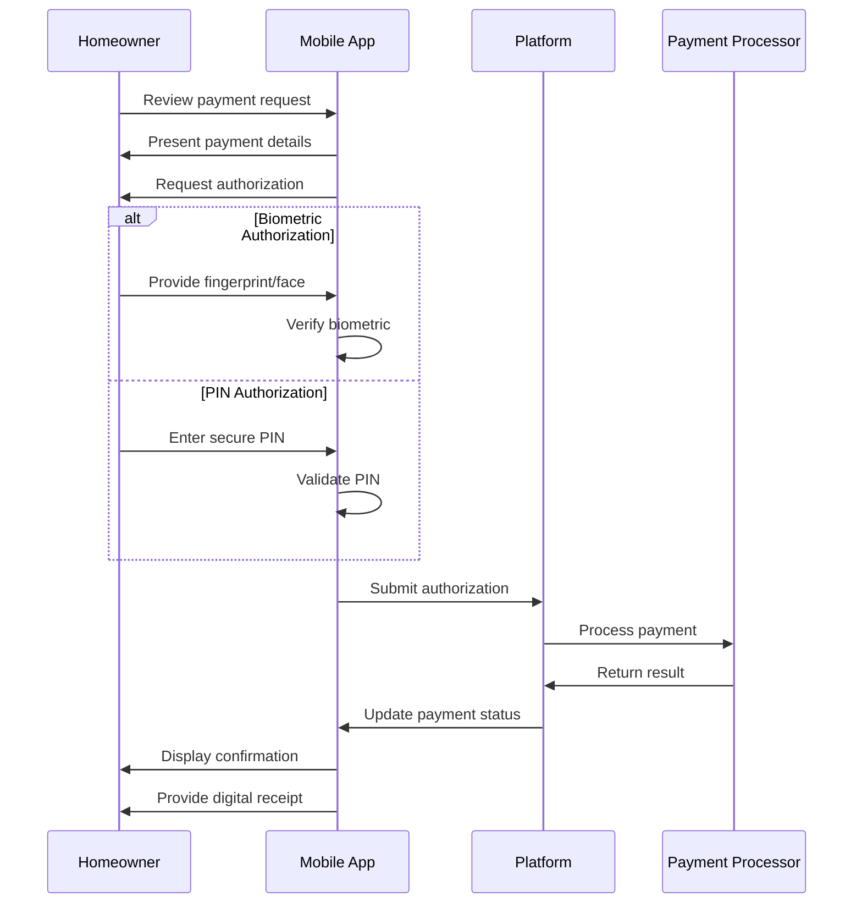

**Key Mobile Considerations:**

1. **Secure Authorization Methods**
   - Biometric authentication integration
   - Device-bound authorization keys
   - Secure PIN entry with timeout
   - Step-up authentication for high-value payments

2. **On-Site Payment Experience**
   - Clear payment summary with key details
   - Visual confirmation of successful payments
   - Offline-capable receipt generation
   - Location-verified payment authorization

## Mobile Payment Testing Strategy

### 1. Mobile Payment Test Matrix

| Test Category | iOS | Android | Mobile Web | Offline |
|---------------|-----|---------|------------|---------|
| Payment Method Addition | All supported methods | All supported methods | Limited methods | N/A |
| Transaction Processing | Full flow | Full flow | Full flow | Queue only |
| Milestone Approval | Full capabilities | Full capabilities | Limited capabilities | Evidence only |
| Receipt Generation | Native + sharing | Native + sharing | Download | Local storage |
| Biometric Auth | Face ID + Touch ID | Fingerprint + Face | N/A | PIN fallback |
| Offline Capabilities | Full offline mode | Full offline mode | Limited offline | Full test suite |
| Network Conditions | Excellent to poor | Excellent to poor | Excellent to poor | No connectivity |
| Device Compatibility | Last 4 iOS versions | 95% of active devices | All modern browsers | All supported |

### 2. Mobile-Specific Test Scenarios

1. **Connectivity Testing**
   - Payment initiation during connectivity loss
   - Transition between wifi and cellular during payment
   - Low-bandwidth payment processing
   - Intermittent connectivity during milestone approval

2. **Device Integration Testing**
   - Biometric authentication failures
   - Camera access for evidence/card capture
   - Storage constraints for offline data
   - Battery optimization impact on background sync

3. **Mobile Context Testing**
   - Interruption handling (calls, notifications)
   - Background/foreground transitions during payment
   - Device orientation changes during payment flow
   - Memory constraints on older devices

## Mobile Metrics and Analytics

### 1. Mobile-Specific Payment Metrics

| Metric Category | Key Metrics | Target | Alert Threshold |
|-----------------|------------|--------|-----------------|
| Performance | Mobile payment time to completion | <15 seconds | >30 seconds |
| | Payment form render time | <2 seconds | >5 seconds |
| | API response time on mobile | <1 second | >3 seconds |
| Usability | Payment form completion rate | >90% | <75% |
| | Payment error rate on mobile | <3% | >8% |
| | Form field correction rate | <10% | >25% |
| Connectivity | Offline mode activation rate | <5% | >15% |
| | Offline queue sync success | >95% | <80% |
| | Connection errors during payment | <2% | >10% |
| Adoption | Mobile vs desktop payment ratio | Growing mobile | Declining mobile |
| | Payment method save rate | >60% | <40% |
| | Digital wallet adoption | >30% | <15% |

### 2. Mobile Payment Funnel Analysis

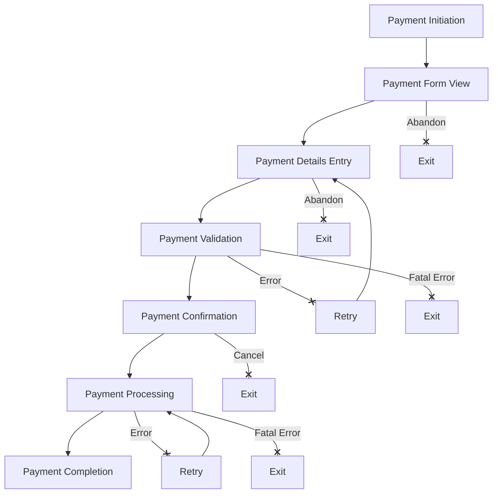

**Key Analytics Focus Areas:**

1. **Abandonment Analysis**
   - Step-specific abandonment rates
   - Device/OS correlation with abandonment
   - Connection quality impact on completion
   - Form field friction identification

2. **Error Pattern Detection**
   - Most common mobile payment errors
   - Device-specific error patterns
   - Recovery success after payment errors
   - Field-specific validation failure rates

3. **Performance Correlation**
   - Impact of performance on conversion
   - Device capability correlation with success
   - Network quality effect on completion
   - App version impact on payment metrics

## Mobile Payment Roadmap

### Phase 1: Core Mobile Payment Experience

- Basic milestone payment capabilities on mobile
- Secure payment method management
- Mobile receipt generation and history
- Essential offline capabilities for evidence capture

### Phase 2: Enhanced Mobile Experiences

- Advanced payment authorization (biometrics)
- Comprehensive offline payment capabilities
- Cross-platform payment method synchronization
- Mobile-optimized financial dashboards

### Phase 3: Advanced Mobile Payment Features

- AR-enhanced payment verification
- Mobile dispute resolution with evidence capture
- Voice-guided payment processes for job sites
- Advanced payment analytics on mobile

## Implementation Guidelines

### 1. Mobile Development Standards

```typescript
// Example: Mobile payment form component with validation
export class MobilePaymentForm extends React.Component<Props, State> {
  // Component state
  state = {
    paymentMethod: null,
    amount: '',
    description: '',
    isProcessing: false,
    validationErrors: {},
    isOffline: false,
  };

  // Lifecycle methods
  componentDidMount() {
    // Check connectivity status
    NetInfo.addEventListener(state => {
      this.setState({ isOffline: !state.isConnected });
    });
    
    // Initialize payment methods from secure storage
    this.loadSavedPaymentMethods();
  }
  
  // Mobile-optimized validation
  validateForm = (): boolean => {
    const errors = {};
    
    // Simple validation with helpful mobile errors
    if (!this.state.amount) {
      errors.amount = 'Payment amount is required';
    } else if (isNaN(parseFloat(this.state.amount))) {
      errors.amount = 'Please enter a valid amount';
    }
    
    if (!this.state.paymentMethod) {
      errors.paymentMethod = 'Please select a payment method';
    }
    
    this.setState({ validationErrors: errors });
    return Object.keys(errors).length === 0;
  };
  
  // Offline-aware submission
  handleSubmit = async () => {
    if (!this.validateForm()) {
      // Show errors with haptic feedback for mobile
      Haptics.notificationAsync(Haptics.NotificationFeedbackType.Error);
      return;
    }
    
    this.setState({ isProcessing: true });
    
    if (this.state.isOffline) {
      // Queue for later processing
      await this.queueOfflinePayment({
        amount: parseFloat(this.state.amount),
        paymentMethodId: this.state.paymentMethod.id,
        description: this.state.description,
        timestamp: new Date().toISOString(),
      });
      
      // Provide offline confirmation
      this.props.onOfflinePaymentQueued();
    } else {
      // Process online
      try {
        const result = await this.paymentService.processPayment({
          amount: parseFloat(this.state.amount),
          paymentMethodId: this.state.paymentMethod.id,
          description: this.state.description,
        });
        
        // Provide success feedback for mobile
        Haptics.notificationAsync(Haptics.NotificationFeedbackType.Success);
        this.props.onPaymentComplete(result);
      } catch (error) {
        // Error handling with retry options
        Haptics.notificationAsync(Haptics.NotificationFeedbackType.Error);
        this.setState({ 
          isProcessing: false,
          error: error.message 
        });
      }
    }
  };
  
  // Mobile-optimized render
  render() {
    return (
      <SafeAreaView style={styles.container}>
        {/* Mobile-optimized form layout */}
        <KeyboardAvoidingView behavior="padding">
          {this.state.isOffline && (
            <OfflineBanner message="You're offline. Payment will be queued." />
          )}
          
          <PaymentMethodSelector
            methods={this.state.savedMethods}
            selectedMethod={this.state.paymentMethod}
            onSelect={method => this.setState({ paymentMethod: method })}
            error={this.state.validationErrors.paymentMethod}
          />
          
          <AmountInput
            value={this.state.amount}
            onChange={amount => this.setState({ amount })}
            error={this.state.validationErrors.amount}
            keyboardType="decimal-pad"
          />
          
          <DescriptionInput
            value={this.state.description}
            onChange={description => this.setState({ description })}
            multiline
          />
          
          <Button
            title={this.state.isOffline ? "Queue Payment" : "Process Payment"}
            onPress={this.handleSubmit}
            isLoading={this.state.isProcessing}
            style={styles.submitButton}
          />
        </KeyboardAvoidingView>
      </SafeAreaView>
    );
  }
}

// Mobile-optimized styles
const styles = StyleSheet.create({
  container: {
    padding: 16,
    flex: 1,
    backgroundColor: '#ffffff',
  },
  submitButton: {
    marginTop: 20,
    paddingVertical: 16, // Larger touch target for mobile
    borderRadius: 8,
  },
  // Other mobile-optimized styles...
});
```

### 2. Mobile Security Guidelines

```typescript
// Example: Secure payment data handling
class SecurePaymentStorage {
  // Store payment token securely
  static async storePaymentToken(userId: string, paymentMethodId: string, token: string): Promise<void> {
    try {
      // Use device secure storage
      await SecureStore.setItemAsync(
        `payment_token_${userId}_${paymentMethodId}`,
        token,
        {
          // Security options
          keychainAccessible: SecureStore.WHEN_UNLOCKED_THIS_DEVICE_ONLY, // iOS
          keychainService: 'com.instabids.payment', // iOS
          requireAuthentication: true, // Biometric or PIN when available
        }
      );
    } catch (error) {
      console.error('Failed to securely store payment token', error);
      throw new Error('Unable to securely store payment information');
    }
  }
  
  // Retrieve token with authentication when needed
  static async getPaymentToken(userId: string, paymentMethodId: string): Promise<string | null> {
    try {
      // For sensitive operations, require fresh authentication
      const authResult = await LocalAuthentication.authenticateAsync({
        promptMessage: 'Authenticate to access payment methods',
        fallbackLabel: 'Use PIN',
        disableDeviceFallback: false,
      });
      
      if (!authResult.success) {
        throw new Error('Authentication required to access payment information');
      }
      
      return await SecureStore.getItemAsync(`payment_token_${userId}_${paymentMethodId}`);
    } catch (error) {
      console.error('Failed to retrieve payment token', error);
      return null;
    }
  }
  
  // Clear sensitive data on logout
  static async clearPaymentData(userId: string): Promise<void> {
    try {
      // Get all keys for this user
      const allKeys = await this.getAllKeys();
      const userKeys = allKeys.filter(key => key.startsWith(`payment_token_${userId}`));
      
      // Remove all user payment tokens
      await Promise.all(userKeys.map(key => SecureStore.deleteItemAsync(key)));
    } catch (error) {
      console.error('Error clearing payment data', error);
    }
  }
}
```

### 3. Offline Capability Implementation

```typescript
// Example: Offline payment queue management
class OfflinePaymentQueue {
  private static QUEUE_KEY = 'offline_payment_queue';
  
  // Add payment to offline queue
  static async queuePayment(payment: OfflinePayment): Promise<void> {
    try {
      // Get existing queue
      const queue = await this.getQueue();
      
      // Add new payment with unique ID
      queue.push({
        ...payment,
        id: uuid.v4(),
        queuedAt: new Date().toISOString(),
        syncStatus: 'pending',
      });
      
      // Store updated queue
      await AsyncStorage.setItem(this.QUEUE_KEY, JSON.stringify(queue));
    } catch (error) {
      console.error('Failed to queue offline payment', error);
      throw new Error('Unable to save payment for later processing');
    }
  }
  
  // Process queued payments when online
  static async processQueue(): Promise<ProcessResult> {
    const queue = await this.getQueue();
    
    if (queue.length === 0) {
      return { processed: 0, failed: 0, remaining: 0 };
    }
    
    let processed = 0;
    let failed = 0;
    
    // Process each payment
    for (const payment of queue) {
      try {
        // Skip already processed
        if (payment.syncStatus === 'synced') {
          continue;
        }
        
        // Mark as processing
        payment.syncStatus = 'processing';
        await this.updateQueue(queue);
        
        // Try to process the payment
        await paymentService.processPayment({
          amount: payment.amount,
          paymentMethodId: payment.paymentMethodId,
          description: payment.description,
          metadata: {
            queuedAt: payment.queuedAt,
            processedAt: new Date().toISOString(),
            wasOffline: true,
          },
        });
        
        // Mark as synced
        payment.syncStatus = 'synced';
        payment.syncedAt = new Date().toISOString();
        processed++;
      } catch (error) {
        // Mark as failed
        payment.syncStatus = 'failed';
        payment.lastError = error.message;
        payment.retryCount = (payment.retryCount || 0) + 1;
        failed++;
      }
    }
    
    // Store updated queue
    await this.updateQueue(queue);
    
    // Return processing stats
    return {
      processed,
      failed,
      remaining: queue.filter(p => p.syncStatus !== 'synced').length,
    };
  }
  
  // Get the current queue
  private static async getQueue(): Promise<QueuedPayment[]> {
    try {
      const data = await AsyncStorage.getItem(this.QUEUE_KEY);
      return data ? JSON.parse(data) : [];
    } catch (error) {
      console.error('Failed to retrieve offline payment queue', error);
      return [];
    }
  }
