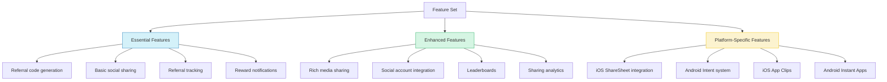
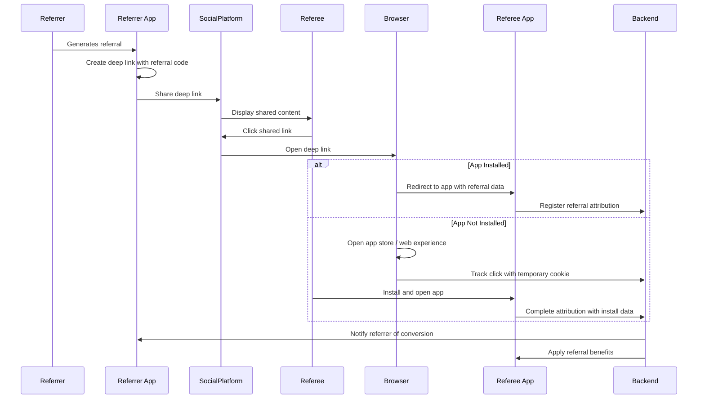
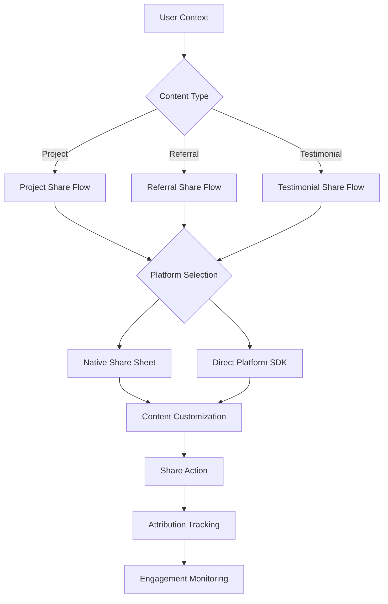
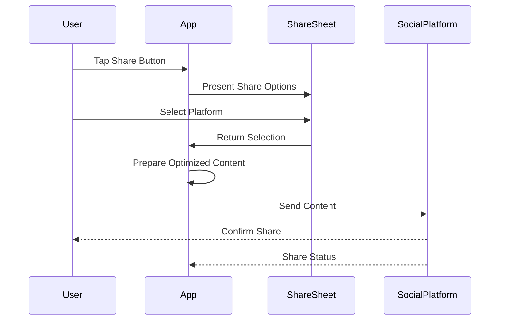
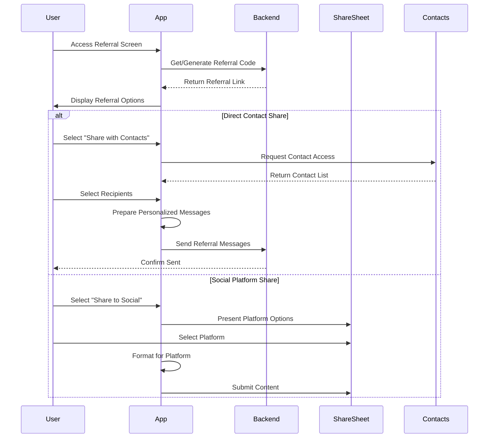
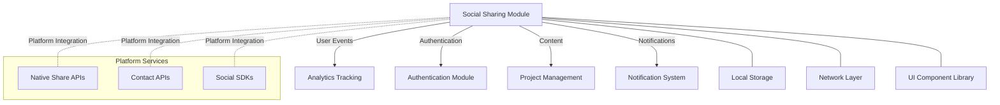

That's all right now.# Social Sharing & Referrals Mobile Strategy Documentation

This document outlines the mobile strategy for the Social Sharing & Referrals domain of the InstaBids platform. It covers mobile-specific considerations, implementation approaches, and optimization strategies to ensure a seamless user experience across mobile devices.

## Overview

The Social Sharing & Referrals domain plays a critical role in the mobile experience of the InstaBids platform. Mobile users are particularly likely to engage with social features, share content, and participate in referral programs. This document defines how these features will be implemented for mobile platforms while addressing mobile-specific challenges.

## Mobile User Experience Goals

### Primary Goals

1. **Frictionless Sharing**
   - Enable one-tap sharing to popular platforms
   - Minimize steps required to generate and share referral codes
   - Provide native sharing experiences on each mobile platform

2. **Seamless Referral Process**
   - Support deep linking for direct referral attribution
   - Enable app-to-app transitions without context loss
   - Provide real-time visibility into referral status

3. **Optimized Content**
   - Auto-format shared content for mobile viewing
   - Optimize images and media for mobile bandwidth
   - Ensure readability and usability on small screens

## Platform Support Strategy

### Native Mobile Applications

| Platform | Support Level | Features | Implementation Approach |
|----------|--------------|----------|-------------------------|
| iOS | Full | All social and referral features | Swift with UIKit/SwiftUI, native Share Extension |
| Android | Full | All social and referral features | Kotlin with Jetpack Compose, native Share Integration |
| Progressive Web App | High | Most features with graceful degradation | Web Share API, responsive design |
| Other Mobile Platforms | Basic | Essential sharing and referral features | Web-based fallback |

### Feature Parity Considerations



The feature parity approach follows these principles:

1. **Essential Features** (100% parity across all platforms)
   - Core referral functionality
   - Basic sharing capabilities
   - Referral status tracking
   - Reward claiming

2. **Enhanced Features** (100% parity on native apps, 80%+ on PWA)
   - Rich media sharing
   - Social account connections
   - Enhanced analytics
   - Gamification elements

3. **Platform-Specific Features** (Leverage unique capabilities of each platform)
   - iOS: ShareSheet, App Clips, iMessage sharing
   - Android: Intent system, App Shortcuts, Direct Share

## Mobile-Specific Technical Implementations

### Deep Linking Architecture

Deep links are crucial for the referral system, enabling direct attribution when a user clicks a referral link on a mobile device.



**Implementation Details:**

1. **Universal Links (iOS) / App Links (Android)**
   - Configure associated domains for direct app opening
   - Fall back to web experience if app not installed
   - Preserve referral parameters across install process

2. **Deferred Deep Linking**
   - Track referral clicks before app installation
   - Maintain attribution through installation process
   - Resolve attribution upon first app launch

3. **Deep Link Data Structure**
   ```
   instabids://referral?code=REF123&source=facebook&campaign=spring2025&referrer=user456
   ```

### Mobile Share Flow Optimizations

The mobile sharing flow is optimized for quick, contextual sharing while preserving all tracking capabilities:



**Mobile-Optimized Share Content Structure:**

1. **Project Sharing**
   - Thumbnail image optimized for mobile (responsive sizing)
   - Brief, impactful description (first 80 characters crucial)
   - Clear call-to-action button
   - UTM parameters for attribution

2. **Referral Sharing**
   - Personalized message templates (character-count optimized)
   - Single-tap referral code copying
   - Suggested contacts integration
   - Preview of reward information

3. **Testimonial Sharing**
   - Quote-focused layout
   - Author attribution with minimal metadata
   - Platform-specific formatting (Twitter character limits, etc.)

### Mobile Performance Optimizations

| Challenge | Solution | Implementation |
|-----------|----------|----------------|
| Limited Bandwidth | Adaptive content delivery | Dynamically adjust image quality and content complexity based on connection type |
| Battery Consumption | Efficient background operations | Batch network requests, minimize background processing |
| Intermittent Connectivity | Offline capability | Queue sharing actions for execution when connectivity is restored |
| Screen Size Constraints | Responsive UI | Use progressive disclosure, prioritize essential elements |
| Input Limitations | Simplified interaction | Provide pre-composed templates, minimize typing requirements |

### Mobile-Specific Analytics

Mobile-specific analytics track the unique aspects of mobile sharing and referral behavior:

1. **Share Initiation Points**
   - In-app share button usage
   - System share sheet usage
   - Direct platform SDK sharing

2. **Device-Specific Metrics**
   - Conversion rates by device type
   - Performance by OS version
   - Screen size impact on engagement

3. **Context Metrics**
   - Time-of-day sharing patterns
   - Location-based sharing behavior
   - WiFi vs. cellular sharing activity

4. **Mobile Journey Tracking**
   - Cross-app attribution
   - App-to-web-to-app flows
   - Installation attribution accuracy

## Platform-Specific Implementation Details

### iOS Implementation

1. **Share Extension**
   - Custom share extension for InstaBids content
   - Support for sharing from other apps to InstaBids
   - Metadata preservation across sharing contexts

2. **iMessage Integration**
   - Custom iMessage app for sharing projects
   - Rich interactive messages with project previews
   - Direct referral flow within Messages

3. **Shortcuts Integration**
   - Custom shortcuts for frequent sharing actions
   - Siri integration for voice-activated sharing
   - Widget support for referral status and quick sharing

4. **App Clips**
   - Lightweight preview experience for non-users
   - Focused on single-project viewing
   - Seamless transition to full app with referral attribution

### Android Implementation

1. **Intent System Integration**
   - Custom intent handlers for sharing content
   - Intent filters for capturing shared content
   - Deep link intent resolution for referrals

2. **Direct Share**
   - Predictive share targets for frequent contacts
   - Custom ChooserTargets for social platforms
   - Referral-specific share targets

3. **App Shortcuts**
   - Static and dynamic shortcuts for sharing
   - Pinned shortcuts for referral program
   - Shortcut ranking based on user behavior

4. **Instant Apps**
   - Modular instant app experience for project viewing
   - Referral-focused entry point
   - Streamlined conversion to full app installation

### Progressive Web App Considerations

1. **Web Share API**
   - Support for native sharing where available
   - Fallback to clipboard copy with guidance
   - Share target API for receiving shared content

2. **Offline Support**
   - Service worker for offline sharing capability
   - Background sync for pending shares
   - Offline referral code generation

3. **Push Notifications**
   - Referral status updates
   - Conversion notifications
   - Reward notifications

4. **Responsive Design Principles**
   - Mobile-first layout for all sharing interfaces
   - Touch-optimized interaction targets
   - Adaptive content based on viewport size

## Mobile UI/UX Guidelines

### Mobile Share UI Components

| Component | Purpose | Design Considerations |
|-----------|---------|------------------------|
| Share Action Button | Primary entry point for sharing | Prominent placement, recognizable icon, haptic feedback |
| Platform Selector | Choose destination platform | Visual platform icons, recently used platforms first |
| Share Preview | Show content as it will appear | Accurate platform-specific preview, editable elements |
| Referral Card | Display and share referral info | Copy button, share shortcuts, reward details |
| Attribution Tracker | Monitor share performance | Unobtrusive status indicators, engagement counters |

### Mobile Share Flows

**1. Quick Share Flow**



**2. Referral Share Flow**



### Mobile-Specific UI Best Practices

1. **Touch Optimization**
   - Minimum 44×44pt touch targets
   - Adequate spacing between interactive elements
   - Touch feedback (visual and haptic)

2. **Content Hierarchy**
   - Primary share content always visible
   - Secondary elements available through progressive disclosure
   - Critical actions (share, copy) always accessible

3. **Visual Clarity**
   - High contrast for sharing CTAs
   - Platform-recognizable iconography
   - Status indicators visible at a glance

4. **Performance Perception**
   - Immediate UI feedback for share actions
   - Progressive loading for preview content
   - Optimistic UI updates with background synchronization

## Mobile Testing Strategy

### Test Scenarios

| Test Category | Test Cases | Success Criteria |
|---------------|------------|------------------|
| Platform Integration | Share to each supported platform | Content correctly formatted for each platform |
| | Receive shared content from other apps | Content properly parsed and attributed |
| | Share from various app contexts | Consistent experience across all contexts |
| Deep Linking | Click referral link with app installed | Direct app launch with attribution |
| | Click referral link without app | Proper store/web redirection with deferred attribution |
| | Handle malformed deep links | Graceful error handling |
| Performance | Share large media content | Responsive UI during upload |
| | Operate in low-bandwidth conditions | Appropriate fallbacks and user feedback |
| | Background sharing operations | Battery-efficient processing |
| Cross-Device | Start referral on mobile, convert on desktop | Proper cross-device attribution |
| | Share from mobile to mobile | End-to-end tracking across devices |

### Testing Tools

1. **Automated Testing**
   - UI testing with XCTest (iOS) and Espresso (Android)
   - Deep link validation testing
   - Share extension integration tests

2. **Manual Testing**
   - Real-device testing across device models
   - Cross-platform sharing verification
   - Attribution tracking validation

3. **Analytics Validation**
   - Funnel completion verification
   - Attribution accuracy testing
   - A/B test implementation verification

## Accessibility Considerations

The mobile sharing experience must be accessible to all users:

1. **Screen Reader Support**
   - All sharing controls properly labeled
   - Custom actions for sharing flows
   - Non-visual feedback for share completion

2. **Motor Control Accommodations**
   - Support for assistive touch
   - Voice command integration
   - Adjustable timing for interactions

3. **Visual Accessibility**
   - Support for dynamic type
   - Respect system contrast settings
   - Color-independent status indicators

## Implementation Roadmap

| Phase | Timeline | Focus | Deliverables |
|-------|----------|-------|--------------|
| 1 | Q2 2025 | Core Mobile Sharing | Basic share functionality, deep linking infrastructure |
| 2 | Q3 2025 | Platform Integrations | Native sharing for major platforms, optimized previews |
| 3 | Q4 2025 | Advanced Referrals | Complete referral tracking, cross-device attribution |
| 4 | Q1 2026 | Performance Optimization | Bandwidth optimizations, offline capabilities |

## Integration with Mobile Architecture

The Social Sharing & Referrals mobile components integrate with the broader mobile architecture:



### Code Architecture

The mobile implementation follows a layered architecture:

1. **Presentation Layer**
   - Share UI Components
   - Referral UI Components
   - Preview Generators

2. **Business Logic Layer**
   - Share Service
   - Referral Service
   - Attribution Tracker

3. **Data Layer**
   - Share Repository
   - Referral Repository
   - Platform Connectors

4. **Platform Integration Layer**
   - iOS Share Extension
   - Android Intent Handlers
   - Web Share API Wrapper

## Appendix: Mobile-Optimized UTM Structure

The mobile sharing implementation uses a consistent UTM parameter structure for accurate attribution:

```
utm_source=instabids_app
utm_medium=referral
utm_campaign=user_referral_program
utm_content=ios_share_extension
utm_term=project_123
instabids_referrer=user_456
instabids_share_id=share_789
```

### Additional Mobile Parameters

| Parameter | Purpose | Example |
|-----------|---------|---------|
| `instabids_device_type` | Device category for optimization | `smartphone`, `tablet` |
| `instabids_share_context` | Location within app where share initiated | `project_detail`, `referral_hub` |
| `instabids_connection_type` | Network context for analytics | `wifi`, `cellular` |
| `instabids_app_version` | Version tracking | `2.1.3` |
