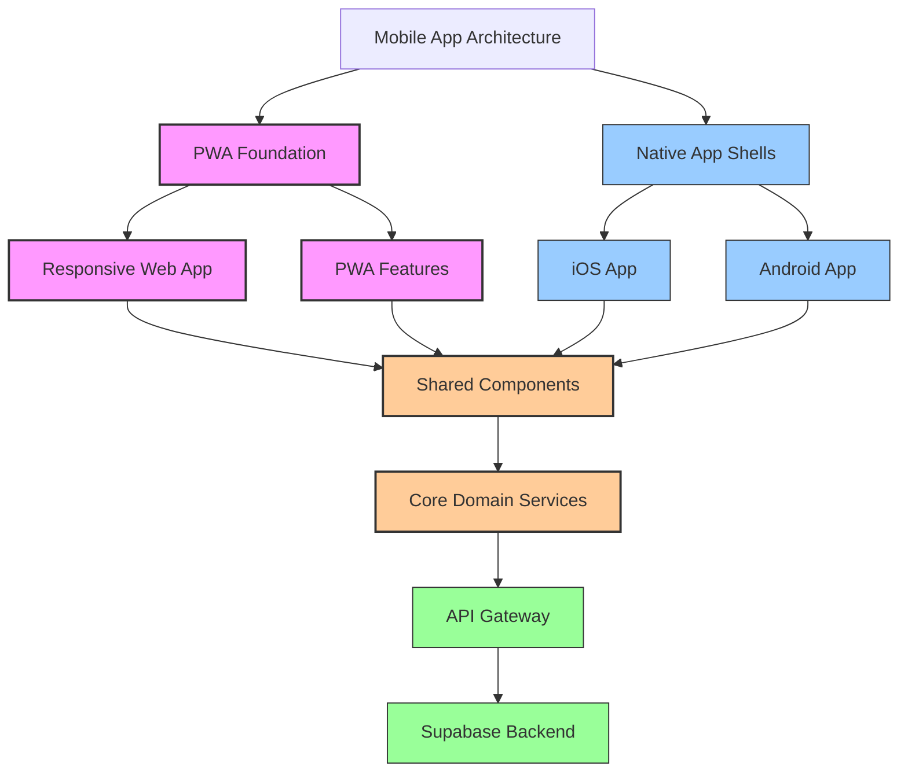

# Overall Mobile Approach for InstaBids

This document outlines the comprehensive mobile strategy for the InstaBids platform, detailing the cross-domain approach to mobile application architecture, development methodology, user experience principles, and technical implementation.

## Mobile Strategy Vision

InstaBids' mobile strategy is designed to provide a seamless, responsive, and feature-rich experience across devices while accommodating the specific needs of different user types. The platform recognizes that contractors, homeowners, and administrators have distinct mobile usage patterns and priorities, requiring tailored mobile experiences.

### Strategic Objectives

1. **Device Ubiquity**: Ensure the platform is accessible across all relevant devices and form factors
2. **Performance First**: Optimize for speed and responsiveness, especially in variable connectivity conditions
3. **Progressive Enhancement**: Core functionality works universally, with enhanced capabilities on advanced devices
4. **Offline Capabilities**: Essential functions remain available without continuous connectivity
5. **Cross-Platform Consistency**: Maintain brand and UX consistency while leveraging platform-specific advantages
6. **Reduced Friction**: Minimize steps required to complete key workflows on mobile devices
7. **Contextual Intelligence**: Utilize device capabilities (location, camera, etc.) to enhance the user experience

## Mobile Architecture Approach

### High-Level Architecture

### Architecture Evolution Strategy

The InstaBids mobile architecture will evolve through three distinct phases:

#### Phase 1: Responsive Web Foundation (Months 1-6)

- Responsive web application accessible on all devices
- Progressive Web App (PWA) features: installability, offline support, push notifications
- Mobile-optimized responsive UI with touch-friendly controls
- Device capability integration: camera, location, storage

#### Phase 2: Advanced PWA Capabilities (Months 7-12)

- Enhanced offline capabilities with robust data synchronization
- Advanced push notification implementations
- Background sync for data submissions
- Performance optimizations and lazy loading
- Deeper device integration (contacts, calendars, sharing)

#### Phase 3: Native Applications (Months 13-18)

- Native iOS and Android applications
- Shared business logic with web applications
- Platform-specific UX optimizations
- Native performance advantages
- Advanced biometric security integration
- Marketplace distribution (App Store, Google Play)

## User Experience Strategy

### Device-Specific Experience Adaptations

InstaBids will adapt the user experience based on device capabilities and form factors:

1. **Small Screens (Smartphones)**
   - Focus on essential functions and common tasks
   - Simplified navigation with bottom-oriented controls
   - Step-based workflows to reduce cognitive load
   - Context-aware UI showing relevant information based on user location/activity

2. **Medium Screens (Tablets)**
   - Enhanced information density
   - Two-pane layouts where appropriate
   - Richer input mechanisms including stylus support for annotations
   - Combined navigation patterns (bottom + sidebar)

3. **Large Screens (Desktops/Laptops)**
   - Maximum information density and multi-tasking
   - Advanced management features
   - Keyboard shortcut optimization
   - Multi-window support

### Core Mobile UX Principles

The following principles guide all mobile experiences across InstaBids:

1. **Single-Handed Operation**
   - Critical controls within thumb reach on smartphones
   - Adaptive controls based on device size and orientation
   - Minimal reliance on gestures requiring two hands

2. **Progressive Disclosure**
   - Essential information first, details on demand
   - Collapsible sections and expandable content
   - Contextual help and guidance

3. **Feedback & Visibility**
   - Clear system status indicators
   - Meaningful loading states and progress indication
   - Haptic feedback for important actions

4. **Forgiving Inputs**
   - Error prevention over error correction
   - Generous touch targets (minimum 44x44 points)
   - Undo capabilities for destructive actions

5. **Content-First Design**
   - Minimize chrome and UI controls
   - Prioritize user content and data
   - Immersive viewing experiences

## Cross-Domain Mobile Components

### Shared UI Component Library

InstaBids will implement a comprehensive shared component library to ensure consistency across domains and devices:

```mermaid
graph TD
    A[Mobile Component Library] --> B[Foundation]
    A --> C[Navigation]
    A --> D[Data Display]
    A --> E[Input]
    A --> F[Feedback]
    
    B --> B1[Typography]
    B --> B2[Color System]
    B --> B3[Spacing]
    B --> B4[Iconography]
    
    C --> C1[Bottom Navigation]
    C --> C2[Side Menu]
    C --> C3[Tab Controls]
    C --> C4[Breadcrumbs]
    
    D --> D1[Cards]
    D --> D2[Lists]
    D --> D3[Tables]
    D --> D4[Data Visualization]
    
    E --> E1[Form Controls]
    E --> E2[Selection Controls]
    E --> E3[File Upload]
    E --> E4[Search]
    
    F --> F1[Notifications]
    F --> F2[Dialogs]
    F --> F3[Loaders]
    F --> F4[Snackbars]
    
    classDef foundation fill:#f9f,stroke:#333,stroke-width:2px;
    classDef primary fill:#9cf,stroke:#333,stroke-width:1px;
    
    class A,B foundation;
    class C,D,E,F,B1,B2,B3,B4,C1,C2,C3,C4,D1,D2,D3,D4,E1,E2,E3,E4,F1,F2,F3,F4 primary;
```

These components will be implemented using a technology stack that supports both web and native platforms, with appropriate adaptations for each environment.

### Shared Navigation Patterns

The application will implement consistent navigation patterns across domains:

1. **Primary Navigation**
   - Bottom navigation bar on mobile devices
   - Side navigation on tablets and larger devices
   - Role-based navigation adapting to user type

2. **Secondary Navigation**
   - Tab controls for related content
   - Breadcrumbs for deep hierarchies
   - Back gestures and buttons for linear flows

3. **Contextual Navigation**
   - Swipe actions for common operations
   - Long-press menus for additional options
   - Quick action buttons for primary tasks

### Authentication & Security

Mobile-specific authentication and security features include:

1. **Authentication Methods**
   - Biometric authentication (Face ID, Touch ID, fingerprint)
   - PIN/passcode options
   - Device-bound tokens for simplified re-authentication
   - Social authentication integrations

2. **Security Measures**
   - Secure local storage with encryption
   - Automatic session timeouts
   - Sensitive data masking
   - Screenshot protection for sensitive screens
   - Jailbreak/root detection

## User Type-Specific Mobile Experiences

### Homeowner Mobile Experience

Homeowners primarily use the mobile application to:

1. **Project Management**
   - Create and track renovation projects
   - Browse inspiration and templates
   - Document existing conditions with photos
   - Capture measurements and dimensions

2. **Contractor Engagement**
   - Review incoming bids and proposals
   - Compare contractor options
   - Communicate with potential contractors
   - Schedule site visits and meetings

3. **Project Monitoring**
   - Track project progress with photo/video updates
   - Approve completed milestones
   - Process payments and manage budget
   - Document completed work

**Key Mobile Features for Homeowners**:
- AR visualization tools for project planning
- Photo/video capture with annotation
- Real-time notifications for bid activity
- Calendar integration for scheduling
- Document scanning for receipts and warranties

### Contractor Mobile Experience

Contractors rely on mobile capabilities for:

1. **Opportunity Management**
   - Discover new project opportunities
   - Submit and track bids
   - Manage opportunity pipeline
   - Schedule site visits

2. **Project Execution**
   - Access project details and specifications
   - Document work progress with photos
   - Track time and materials
   - Communicate with clients and subcontractors

3. **Business Operations**
   - Process payments and track financials
   - Manage crew scheduling
   - Track inventory and materials
   - Access reference documents and specifications

**Key Mobile Features for Contractors**:
- Offline access to project documents
- Field estimation tools
- Mobile time and expense tracking
- Photo/video documentation with geolocation
- Digital signature collection
- Notification prioritization for urgent items

### Administrator Mobile Experience

Platform administrators use mobile capabilities for:

1. **User Management**
   - Review and approve new users
   - Respond to support requests
   - Monitor user activity and metrics

2. **Content Management**
   - Moderate user-generated content
   - Publish announcements and updates
   - Manage featured listings and promotions

3. **System Monitoring**
   - Track platform health metrics
   - Respond to critical alerts
   - View operational dashboards

**Key Mobile Features for Administrators**:
- Push notification controls
- Quick approval workflows
- At-a-glance system health dashboards
- User impersonation for troubleshooting
- Streamlined moderation tools

## Technical Implementation

### Mobile Technology Stack

```mermaid
graph TD
    A[Technology Stack] --> B[Frontend]
    A --> C[Backend Services]
    A --> D[Native Integration]
    A --> E[Testing & Monitoring]
    
    B --> B1[React & React Native]
    B --> B2[TypeScript]
    B --> B3[Tailwind CSS + Native Base]
    B --> B4[Redux/Context for State]
    
    C --> C1[GraphQL API]
    C --> C2[REST API Fallback]
    C --> C3[WebSockets for Real-time]
    C --> C4[Serverless Functions]
    
    D --> D1[Camera Integration]
    D --> D2[Biometric Authentication]
    D --> D3[Push Notifications]
    D --> D4[Geolocation Services]
    
    E --> E1[Cross-platform Testing]
    E --> E2[Performance Monitoring]
    E --> E3[Crash Reporting]
    E --> E4[User Analytics]
    
    classDef core fill:#f9f,stroke:#333,stroke-width:2px;
    classDef service fill:#9cf,stroke:#333,stroke-width:1px;
    
    class A,B,C,D,E core;
    class B1,B2,B3,B4,C1,C2,C3,C4,D1,D2,D3,D4,E1,E2,E3,E4 service;
```

This technology stack enables code sharing between web and native applications while allowing platform-specific optimizations where needed.

### Data Management Strategy

1. **State Management**
   - Centralized state with Redux/Context
   - Local persistent storage with Async Storage
   - Optimistic UI updates for responsiveness
   - Event-based synchronization for multi-device consistency

2. **Offline Data Strategy**
   - Prioritized data synchronization (critical user data first)
   - Conflict resolution with versioning
   - Queued operations for offline actions
   - Background synchronization when connectivity returns

3. **Data Security**
   - End-to-end encryption for sensitive communications
   - Local data encryption at rest
   - Secure credential storage
   - Data minimization principles

### Performance Optimization

Mobile performance is optimized through:

1. **Network Optimization**
   - Data compression
   - Request batching
   - GraphQL for precise data fetching
   - Asset optimization (images, media)
   - Caching strategies (HTTP cache, service workers)

2. **Rendering Performance**
   - Virtual list implementations for long lists
   - Deferred rendering for complex UIs
   - Memoization of expensive calculations
   - Lazy loading of non-critical components

3. **Memory Management**
   - Image resizing and progressive loading
   - Resource cleanup for unused assets
   - Lifecycle-aware data retention
   - Proactive garbage collection hints

### Push Notification Strategy

Push notifications are central to the mobile experience:

1. **Notification Categories**
   - Transactional notifications (bids, messages, payments)
   - Status updates (project milestones, approvals)
   - System notifications (maintenance, updates)
   - Marketing notifications (new features, promotions)

2. **Notification Management**
   - User preference controls by category
   - Smart batching to prevent notification fatigue
   - Time-zone aware delivery
   - Read/unread status tracking

3. **Rich Notifications**
   - Interactive notification actions
   - Media attachments (images, videos)
   - Deep linking to specific content
   - Context-preserving application launches

## Mobile Analytics & Measurement

### User Analytics Framework

The mobile analytics framework captures:

1. **Engagement Metrics**
   - Session frequency and duration
   - Feature usage patterns
   - User journey flows
   - Content interaction metrics

2. **Performance Metrics**
   - Load times and perceived performance
   - Network request success rates
   - Error frequency and patterns
   - Device/OS performance variations

3. **Business Impact Metrics**
   - Conversion events (bids, projects, payments)
   - Revenue attribution
   - Retention and churn indicators
   - User acquisition channel effectiveness

### A/B Testing Framework

Mobile experiences are continuously optimized through:

1. **Experiment Types**
   - UI/UX variations
   - Feature availability tests
   - Workflow optimization experiments
   - Content presentation tests

2. **Targeting Capabilities**
   - Device type and capabilities
   - User segments and behaviors
   - Geographic and temporal factors
   - Experience level and usage patterns

3. **Measurement Framework**
   - Statistical significance modeling
   - Multi-variant testing capabilities
   - Funnel conversion analysis
   - User feedback correlation

## Accessibility & Compliance

### Accessibility Standards

Mobile experiences adhere to:

1. **WCAG 2.1 AA Compliance**
   - Perceivable content (text alternatives, adaptable presentation)
   - Operable interfaces (keyboard accessibility, timing controls)
   - Understandable information (readability, predictability)
   - Robust implementation (compatibility with assistive technologies)

2. **Platform-Specific Accessibility**
   - iOS VoiceOver optimization
   - Android TalkBack support
   - Dynamic text sizing
   - Sufficient color contrast

3. **Motor Accessibility**
   - Alternative input methods
   - Adjustable timing controls
   - Touch target size compliance
   - Gesture alternatives

### Regulatory Compliance

Mobile applications comply with:

1. **Privacy Regulations**
   - GDPR/CCPA compliance
   - User data access and portability
   - Consent management
   - Privacy policy integration

2. **Industry Standards**
   - PCI DSS for payment handling
   - OWASP Mobile Top 10 security guidelines
   - Platform-specific security requirements
   - Regular security auditing

## Implementation Roadmap

### Phase 1: Responsive Foundation (Months 1-6)

| Month | Milestone | Deliverables |
|-------|-----------|--------------|
| 1 | Mobile Design System | UI component library, responsive grid system, design tokens |
| 2 | Core User Journeys | Responsive layouts for authentication, project creation, bidding |
| 3 | PWA Implementation | Service worker integration, manifest configuration, offline capabilities |
| 4 | Media Optimization | Photo/video capture, optimization, and upload workflows |
| 5 | Notification System | Push notification infrastructure, preference management |
| 6 | Performance Optimization | Loading time improvements, responsive testing across devices |

### Phase 2: Native-Like Experience (Months 7-12)

| Month | Milestone | Deliverables |
|-------|-----------|--------------|
| 7 | Advanced Offline | Complex offline workflows, conflict resolution, background sync |
| 8 | Deep Device Integration | Camera, geolocation, contacts, and calendar integration |
| 9 | Payment Processing | Mobile payment workflows, receipt management, subscription handling |
| 10 | Advanced Visualization | AR features for project visualization, measurement tools |
| 11 | Cross-Device Continuity | Seamless experience synchronization across devices |
| 12 | Performance Enhancement | Animation optimizations, rendering performance improvements |

### Phase 3: Native Applications (Months 13-18)

| Month | Milestone | Deliverables |
|-------|-----------|--------------|
| 13 | Native App Architecture | React Native foundation, shared business logic implementation |
| 14 | iOS Application | Initial iOS application with core features |
| 15 | Android Application | Initial Android application with core features |
| 16 | Platform Optimizations | Platform-specific UX enhancements, performance optimizations |
| 17 | Advanced Integration | Deeper OS integration, homescreen widgets, app shortcuts |
| 18 | Distribution | App Store and Google Play publishing, CI/CD for mobile releases |

## Testing Strategy

### Mobile-Specific Testing

1. **Device Coverage**
   - Physical device testing lab for primary devices
   - Emulator/simulator testing for extended coverage
   - Cloud testing services for edge cases

2. **Connectivity Testing**
   - Variable network conditions (2G, 3G, 4G, 5G, WiFi)
   - Offline and intermittent connectivity
   - Background/foreground transitions
   - Network type switching

3. **Interaction Testing**
   - Touch gesture validation
   - Multi-touch scenario testing
   - Device orientation changes
   - Input method variations (keyboard, voice, stylus)

4. **Battery & Performance**
   - Battery consumption monitoring
   - CPU/memory usage profiling
   - Thermal testing under load
   - Background processing efficiency

## Support & Maintenance

### Mobile Support Infrastructure

1. **User Support Channels**
   - In-app support access
   - Contextual help content
   - User guides and walkthroughs
   - Remote support capabilities

2. **Update Management**
   - Over-the-air updates for web/PWA
   - Native app update coordination
   - Feature flagging for controlled rollouts
   - Backward compatibility for delayed updaters

3. **Monitoring & Alerting**
   - Real-time crash reporting
   - Performance anomaly detection
   - Usage pattern monitoring
   - Proactive issue resolution

## Conclusion

This comprehensive mobile strategy provides a roadmap for delivering an exceptional cross-platform experience for all InstaBids users. By implementing a progressive approach—starting with a robust responsive web foundation and evolving toward platform-specific optimizations—the strategy balances immediate user needs with long-term platform capabilities.

The strategy recognizes the distinct requirements of different user types while maintaining consistency in brand experience, performance standards, and quality expectations. By following this approach, InstaBids will deliver a mobile experience that not only meets current industry standards but sets new benchmarks for marketplace platforms in the construction industry.
