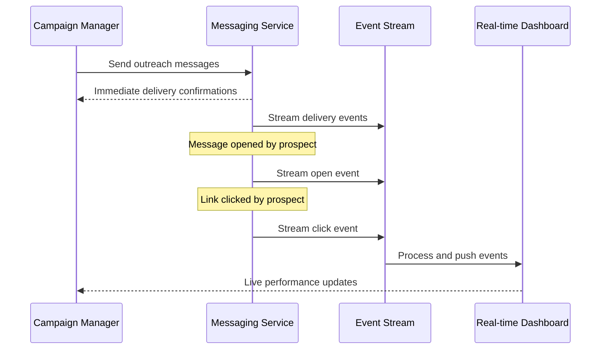
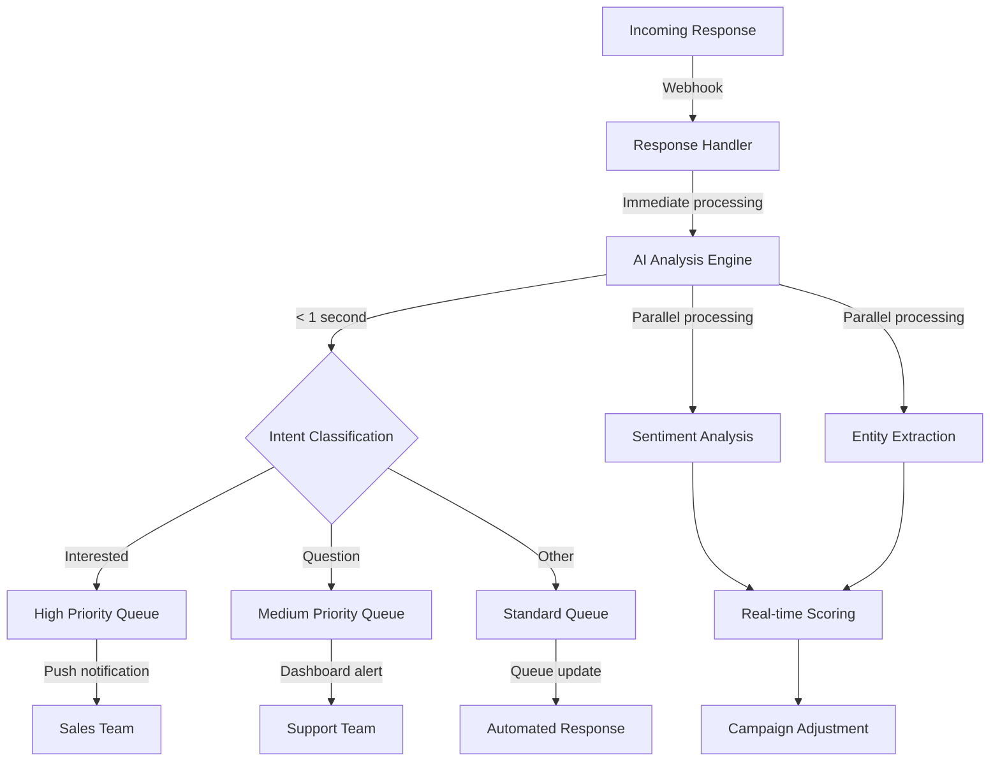
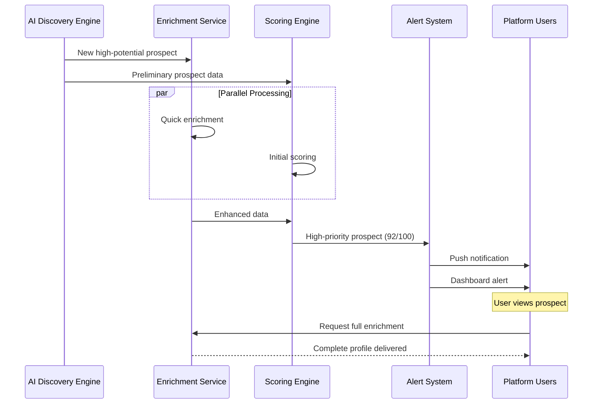
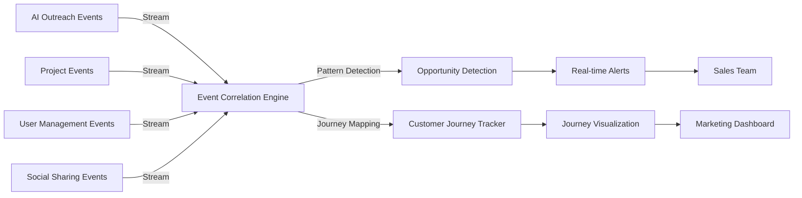
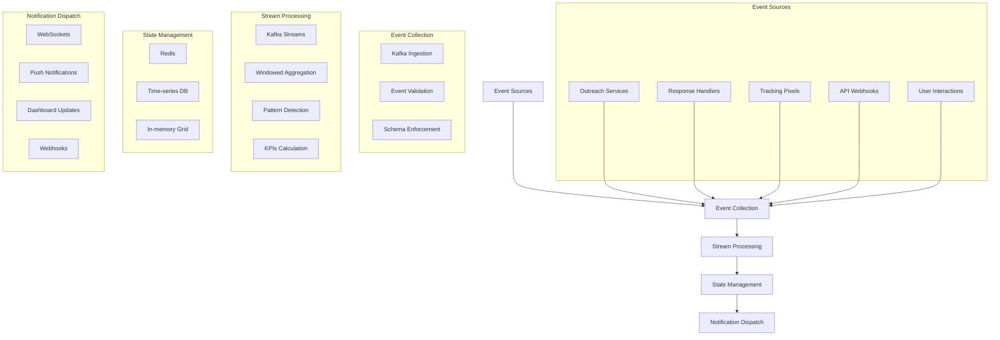
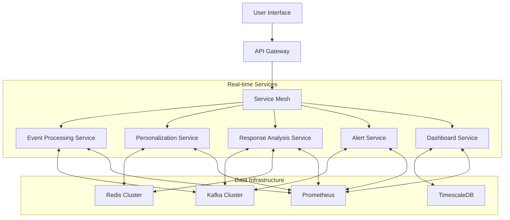

# Real-time Features: AI Outreach & Automation

This document outlines the real-time capabilities of the AI Outreach & Automation domain in the InstaBids platform, focusing on the systems, architecture, and features that enable immediate data processing, prompt responses, and timely contractor acquisition activities.

## Overview

The AI Outreach & Automation domain requires robust real-time capabilities to effectively discover, engage, and convert contractors. The real-time features ensure timely delivery of personalized messages, immediate response analysis, and adaptive campaign management based on performance metrics.

## Key Real-time Components

### 1. Outreach Activity Monitoring

**Purpose**: Provide immediate visibility into outreach campaign performance and contractor engagement.

**Real-time Capabilities**:
- Live campaign status dashboards with sub-second refresh
- Message delivery confirmations within seconds of sending
- Immediate notification of message open/click events
- Real-time conversion tracking and pipeline visualization

**Implementation Approach**:
- WebSocket-based dashboard connections for live updates
- Server-Sent Events (SSE) for status notifications
- Message tracking pixels and click handlers with direct event pushing
- Stream processing for event aggregation and visualization

### 2. Response Analysis & Triage

**Purpose**: Analyze and categorize incoming prospect responses in real time to enable immediate follow-up.

**Real-time Capabilities**:
- Instant response detection and routing
- Real-time sentiment and intent classification (< 1 second)
- Immediate escalation of high-priority responses
- Live response queue with smart prioritization

**Implementation Approach**:
- Email and messaging webhooks for instant response capture
- Edge-deployed machine learning models for low-latency analysis
- Priority scoring algorithms with real-time adjustment
- Push notifications for critical responses

### 3. Dynamic Campaign Optimization

**Purpose**: Continuously optimize outreach campaigns based on real-time performance data.

**Real-time Capabilities**:
- Automatic A/B test winner selection based on live performance
- Dynamic message template adjustment based on engagement patterns
- Real-time budget reallocation to high-performing segments
- Instant campaign pause for underperforming or problematic content

**Implementation Approach**:
- Stream processing for continuous metric calculation
- Statistical significance calculators with early stopping rules
- Machine learning models with online learning capabilities
- Rules engine for automated optimization decisions

**Key Metrics Monitored in Real-time**:
- Open rates by template and segment
- Click-through rates by call-to-action
- Response rates by message type
- Conversion rates by prospect segment

### 4. Prospect Discovery Alerting

**Purpose**: Identify and alert on high-value contractor prospects as soon as they are discovered.

**Real-time Capabilities**:
- Immediate notification of high-potential prospect discovery
- Real-time scoring and prioritization of new prospects
- Instant enrichment of critical prospect data
- Automated fast-track workflows for premium prospects

**Implementation Approach**:
- Event-driven architecture with priority channels
- Real-time scoring models deployed at the edge
- Push notification integration for mobile and desktop alerts
- Parallel processing for simultaneous enrichment and scoring

### 5. Real-time Messaging Personalization

**Purpose**: Dynamically personalize outreach messages at the moment of delivery.

**Real-time Capabilities**:
- Just-in-time message personalization
- Dynamic content selection based on latest prospect data
- Real-time A/B testing for personalization elements
- Immediate feedback loop for personalization effectiveness

**Implementation Approach**:
- Pre-warmed personalization service with < 100ms response time
- Edge-cached personalization elements for quick assembly
- Dynamic template rendering with fallback options
- Real-time personalization scoring and improvement

### 6. Cross-domain Activity Correlation

**Purpose**: Correlate prospect activities across domains to enable coordinated responses.

**Real-time Capabilities**:
- Immediate detection of project-outreach interactions
- Real-time correlation of social sharing and outreach activities
- Instant notification of cross-domain conversion opportunities
- Live visualization of prospect journey across touchpoints

**Implementation Approach**:
- Distributed tracing for cross-domain activity tracking
- Event sourcing with correlation IDs
- Real-time graph database updates for relationship mapping
- Complex event processing for multi-domain pattern detection

## Technical Architecture

### Event Processing Pipeline

The real-time capabilities are built on a high-performance event processing pipeline:

### Performance Characteristics

The real-time system is designed to meet these key performance metrics:

| Component | Latency Target | Throughput | Reliability |
|-----------|----------------|------------|-------------|
| Event Ingestion | < 50ms | 5,000 events/sec | 99.99% |
| Message Personalization | < 100ms | 500 requests/sec | 99.95% |
| Response Analysis | < 1 second | 100 analyses/sec | 99.9% |
| Dashboard Updates | < 2 seconds | 1,000 updates/min | 99.9% |
| Alert Dispatch | < 5 seconds | 200 alerts/min | 99.99% |

### Scalability Approach

The real-time architecture scales horizontally to handle peak loads:

1. **Auto-scaling Event Processors**: Kubernetes-based auto-scaling of event processing pods based on queue depth
2. **Regional Processing**: Geographically distributed processing for low-latency responses
3. **Load-based Partition Rebalancing**: Dynamic Kafka partition assignment based on consumer load
4. **Workload Prioritization**: Critical path operations receive priority resource allocation
5. **Graceful Degradation**: Non-critical features degrade gracefully under extreme load

## Real-time Integrations

### Integration with Messaging Domain

- Real-time delivery status updates from messaging systems
- Immediate click and open tracking data
- Instant notification of responses
- Dynamic content rendering requests

### Integration with User Management Domain

- Immediate contractor registration notifications
- Real-time user status changes
- Instant profile updates for personalization
- Live onboarding progress tracking

### Integration with Analytics Domain

- Real-time campaign performance metrics
- Live conversion tracking
- Immediate anomaly detection
- Instant A/B test results

## User Experience Features

### Campaign Manager Experience

- Live campaign dashboard with real-time performance metrics
- Instant alerts for campaign anomalies
- Real-time audience segment performance comparison
- Dynamic recommendation notifications for optimization opportunities

### Sales Team Experience

- Real-time prospect response notifications
- Live conversion pipeline visualization
- Instant high-value prospect alerts
- Real-time contractor quality scoring updates

### Contractor Experience

- Immediate response to inquiries through AI-powered responses
- Real-time onboarding assistance
- Instant verification status updates
- Live project matching based on profile completion

## Implementation Guidelines

### Real-time Service Requirements

1. **Stateless Design**: All real-time services must be stateless for horizontal scaling
2. **Circuit Breakers**: Implement circuit breakers to prevent cascade failures
3. **Redundancy**: Deploy redundant instances across availability zones
4. **Graceful Degradation**: Design for graceful degradation of non-critical features
5. **Caching Strategy**: Implement multi-level caching with appropriate invalidation

### Monitoring and Alerting

1. **End-to-End Latency Tracking**: Monitor full processing path latency
2. **Throughput Dashboards**: Real-time visualization of event throughput
3. **Error Rate Alerting**: Immediate notification of error rate spikes
4. **Health Checks**: Regular health checks for all real-time components
5. **Resource Utilization**: Monitor CPU, memory, and network utilization

### Data Consistency Considerations

1. **Eventually Consistent Model**: Use eventually consistent data models for non-critical data
2. **Optimistic Concurrency**: Implement optimistic concurrency for high-contention resources
3. **Idempotent Operations**: Ensure all operations are idempotent for safe retries
4. **Conflict Resolution**: Implement Last-Writer-Wins or custom conflict resolution
5. **Compensating Transactions**: Use compensating transactions for error recovery

## Deployment Architecture

The real-time components are deployed as part of the broader InstaBids architecture:

## Disaster Recovery

The real-time system implements these disaster recovery approaches:

1. **Event Replay**: Ability to replay events from Kafka in case of processing failures
2. **Standby Processing**: Hot standby processing clusters in secondary regions
3. **Log-based Recovery**: Recovery of state from event logs
4. **Incremental Snapshots**: Regular state snapshots for faster recovery
5. **Multi-region Redundancy**: Critical components deployed across multiple regions

## Conclusion

The AI Outreach & Automation domain's real-time capabilities enable efficient, responsive, and effective contractor discovery and acquisition. By processing events, analyzing responses, and optimizing campaigns in real-time, the system maximizes conversion rates and ensures timely engagement with high-value prospects.

These real-time features integrate seamlessly with other InstaBids domains to provide a cohesive, responsive platform that can adapt to changing market conditions and prospect behaviors instantaneously.
