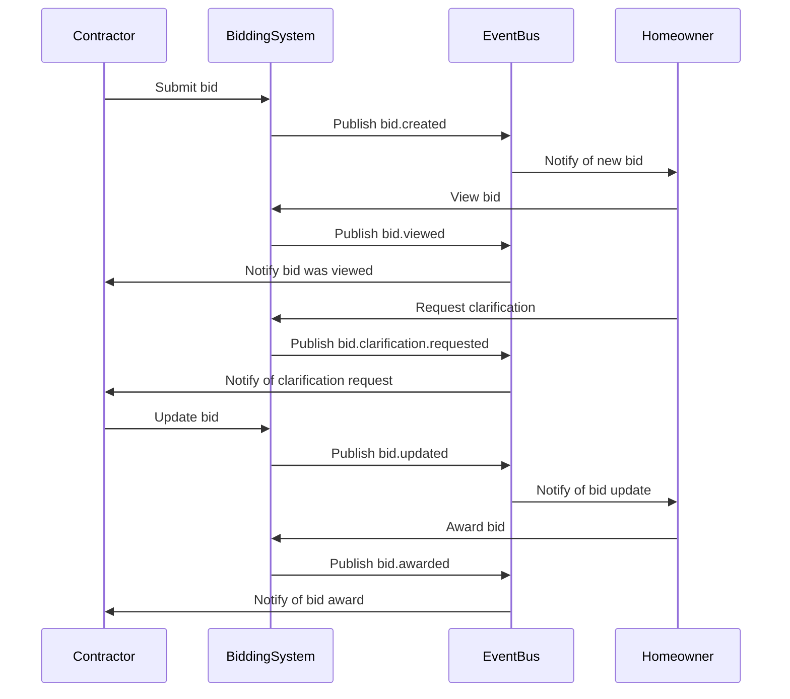
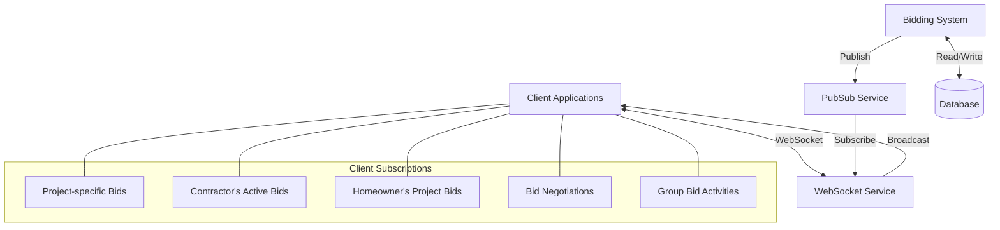
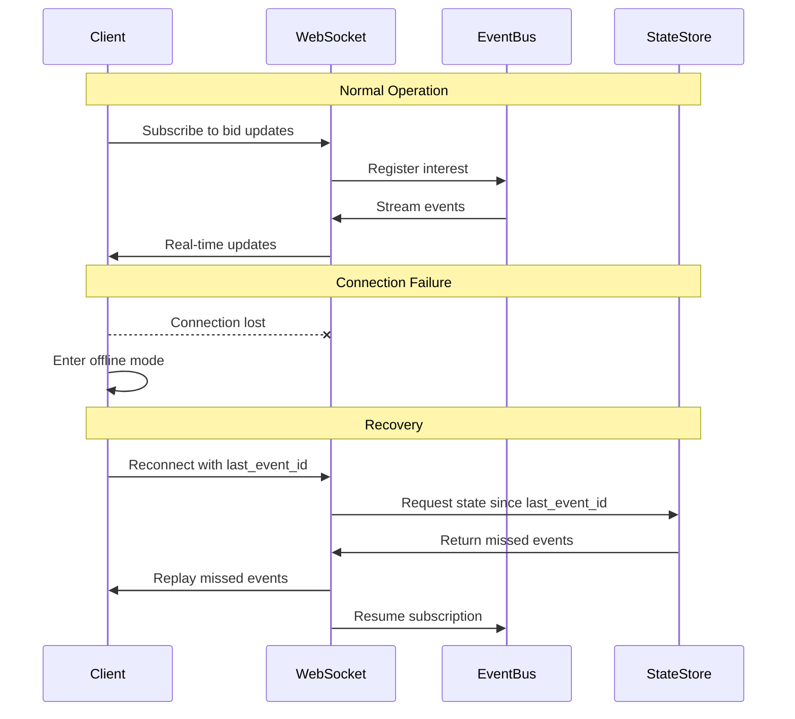
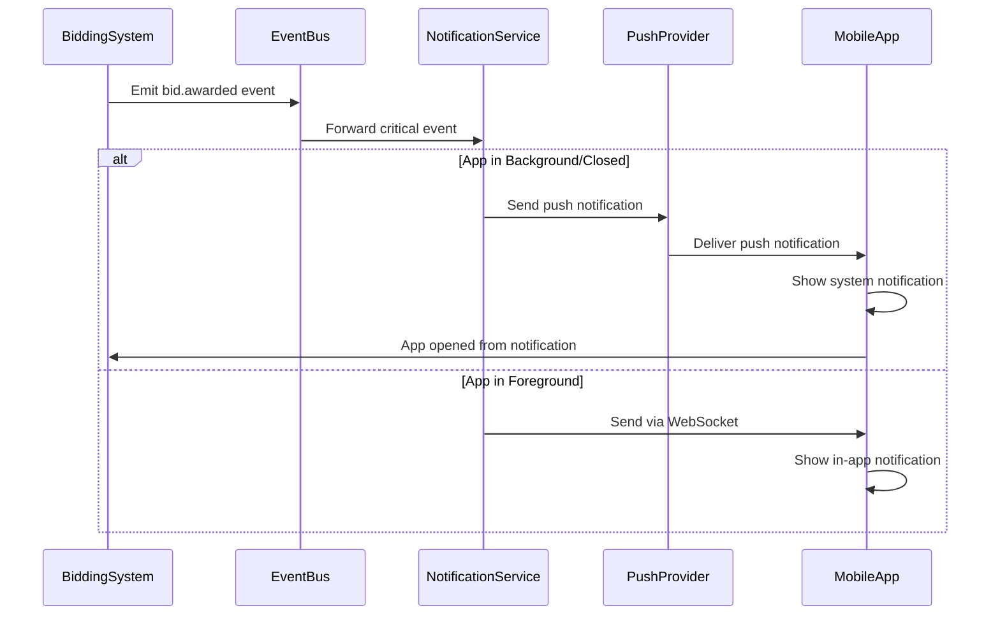
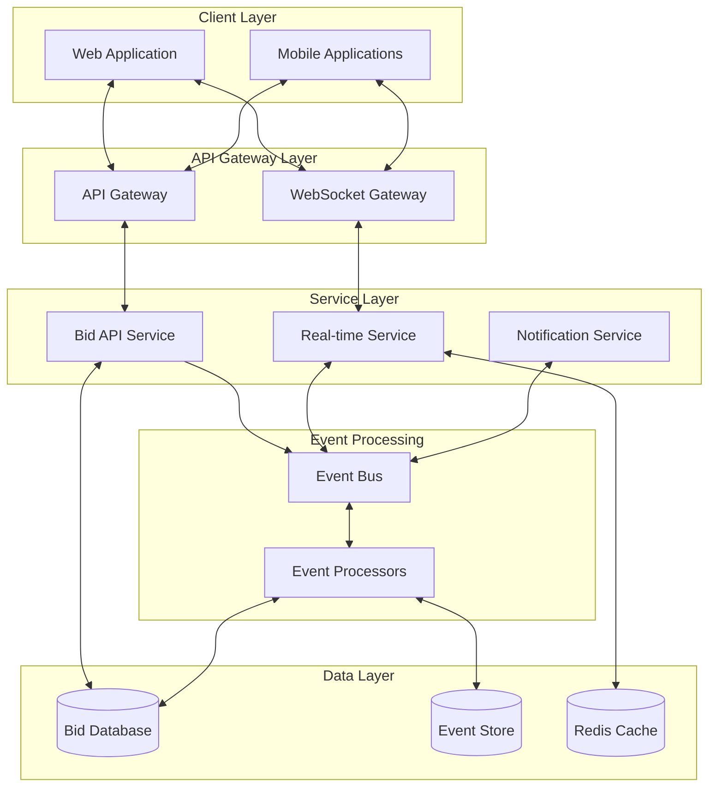

# Bidding System Real-time Features Specification

This document outlines the real-time capabilities, event streams, subscription models, and implementation details for the Bidding System domain of the InstaBids platform.

## Overview

The Bidding System requires robust real-time capabilities to facilitate dynamic interactions between homeowners and contractors during the bidding process. These real-time features ensure that all participants have immediate access to critical information, enabling faster decision-making and enhancing the overall bidding experience.

## Real-time Use Cases

### 1. Bid Status Updates

| Feature | Description | Implementation Priority |
|---------|-------------|------------------------|
| Bid Submission Confirmation | Immediate confirmation when a bid is successfully submitted | High |
| Bid Review Status | Real-time updates when a homeowner views a bid | Medium |
| Bid Selection Notification | Instant notification when a bid is selected or shortlisted | High |
| Bid Rejection Notification | Prompt notification when a bid is rejected | High |
| Bid Expiration Alerts | Countdown and alerts for bids approaching expiration | Medium |

### 2. Competitive Bidding Insights

| Feature | Description | Implementation Priority |
|---------|-------------|------------------------|
| Bid Count Indicator | Real-time counter showing total bids on a project | High |
| Bid Position Indicator | Dynamic indicator showing relative standing among other bids | Medium |
| Price Range Indicator | Anonymous price range of competing bids | Medium |
| New Competitor Alert | Notification when new bids are submitted | Low |
| Bid Adjustment Opportunity | Alert when competitive position changes | Medium |

### 3. Negotiation and Communication

| Feature | Description | Implementation Priority |
|---------|-------------|------------------------|
| Clarification Requests | Instant delivery of questions about bid details | High |
| Counter-Offer Notifications | Real-time alerts for counter-offers | High |
| Negotiation Session Status | Live status indicators during active negotiation | Medium |
| Document Exchange | Real-time tracking of document uploads/reviews | Medium |
| Typing Indicators | Show when the other party is composing a message | Low |

### 4. Time-Sensitive Bidding Actions

| Feature | Description | Implementation Priority |
|---------|-------------|------------------------|
| Bid Deadline Countdown | Real-time countdown for bid submission deadline | High |
| Flash Bid Requests | Urgent bid requests with short deadlines | Medium |
| Auction-Style Events | Time-limited competitive bidding events | Low |
| Homeowner Presence Indicator | Show when homeowner is actively reviewing bids | Medium |
| Decision Window Timer | Countdown for accepting a bid offer | High |

### 5. Group Bidding Coordination

| Feature | Description | Implementation Priority |
|---------|-------------|------------------------|
| Team Member Availability | Real-time status of group bid team members | High |
| Contribution Tracking | Live updates of components contributed to a group bid | High |
| Consensus Dashboard | Real-time tracking of team agreement on bid terms | Medium |
| Resource Allocation Updates | Dynamic updates on resource commitments | Medium |
| Group Chat Presence | Live participant status in group bid discussions | Low |

## Event Streams

### Published Events

The Bidding System publishes the following events to the platform's event bus:



| Event | Payload | Publishers | Subscribers | Rate |
|-------|---------|------------|-------------|------|
| `bid.created` | `{ bidId, projectId, contractorId, timestamp, amount, bidType }` | Bid Submission Service | Project Management, Notifications, Analytics | ~1000/day |
| `bid.updated` | `{ bidId, projectId, contractorId, timestamp, changes, previousVersion }` | Bid Management Service | Project Management, Notifications, Analytics | ~500/day |
| `bid.viewed` | `{ bidId, viewerId, timestamp, viewDuration, viewCompleted }` | Bid Viewing Service | Notifications, Analytics | ~2000/day |
| `bid.clarification.requested` | `{ bidId, requesterId, timestamp, questionId, question }` | Bid Negotiation Service | Notifications, Messaging | ~300/day |
| `bid.clarification.provided` | `{ bidId, responderId, timestamp, questionId, answer }` | Bid Negotiation Service | Notifications, Messaging | ~250/day |
| `bid.shortlisted` | `{ bidId, projectId, timestamp, position }` | Bid Selection Service | Notifications, Analytics | ~200/day |
| `bid.awarded` | `{ bidId, projectId, timestamp, contractDetails }` | Bid Selection Service | Contract Management, Payment Processing, Notifications | ~100/day |
| `bid.declined` | `{ bidId, projectId, timestamp, reason }` | Bid Selection Service | Notifications, Analytics | ~500/day |
| `bid.expired` | `{ bidId, projectId, timestamp }` | Bid Lifecycle Service | Notifications, Analytics | ~200/day |
| `bid.comparison.created` | `{ comparisonId, projectId, bidIds, timestamp, criteria }` | Bid Comparison Service | Project Management, Analytics | ~150/day |
| `bid.group.member.joined` | `{ groupBidId, memberId, timestamp, role }` | Group Bid Management | Notifications, Team Management | ~50/day |
| `bid.group.consensus.updated` | `{ groupBidId, consensusLevel, outstandingApprovals, timestamp }` | Group Bid Management | Notifications, Team Management | ~75/day |

### Subscribed Events

The Bidding System subscribes to these events from other domains:

| Event | Source Domain | Handler | Purpose |
|-------|--------------|---------|---------|
| `project.created` | Project Management | `BidOpportunityDetector` | Identify new bidding opportunities |
| `project.updated` | Project Management | `BidRequirementsUpdater` | Update associated bids with new requirements |
| `project.deadline.changed` | Project Management | `BidDeadlineUpdater` | Update bid submission deadlines |
| `project.canceled` | Project Management | `BidCancellationHandler` | Cancel active bids on the project |
| `user.contractor.verified` | User Management | `ContractorEligibilityUpdater` | Update bidding eligibility for contractors |
| `payment.deposit.confirmed` | Payment Processing | `BidActivationService` | Activate bid after deposit confirmation |
| `message.bid.question` | Messaging | `BidClarificationProcessor` | Process questions about specific bids |
| `labor.team.availability` | Labor Marketplace | `ResourceAvailabilityTracker` | Update resource availability for bids |
| `group.bid.invitation.accepted` | Group Bidding | `TeamMembershipUpdater` | Update team composition for group bids |

## Real-time Technical Implementation

### Subscription Model



#### Subscription Topics

| Topic | Pattern | Content | Access Control |
|-------|---------|---------|----------------|
| `bid.{bidId}` | Individual bid activity | Status changes, negotiations, viewing events | Bid owner, Project owner |
| `project.{projectId}.bids` | All bids for a project | New bids, status changes, comparisons | Project owner, Admins |
| `contractor.{userId}.bids` | Contractor's portfolio of bids | Status across all contractor's bids | Contractor, Admins |
| `homeowner.{userId}.bids` | Bids on homeowner's projects | Activity across all homeowner projects | Homeowner, Admins |
| `group.bid.{groupId}` | Group bid activities | Team updates, consensus status, resources | Group members |
| `bid.comparison.{comparisonId}` | Comparison activities | Updated comparisons, criteria changes | Project owner, Admins |

#### Client Connection Management

1. **Authentication and Authorization**
   - JWT-based authentication for WebSocket connections
   - Role-based access control for subscription topics
   - Per-user topic restrictions enforced at connection time

2. **Connection Lifecycle**
   - Heartbeat mechanism (15-second intervals)
   - Automatic reconnection with exponential backoff
   - Session state maintenance across reconnections

3. **Scaling Considerations**
   - Connection pooling for high-volume users
   - Sharded WebSocket servers based on topic distribution
   - Message prioritization for critical bid events

## Performance Considerations

### Throughput Requirements

| Component | Peak Throughput | Average Throughput | Burst Capacity |
|-----------|----------------|-------------------|----------------|
| Event Publication | 100 events/second | 20 events/second | 500 events/second |
| Event Subscription | 10,000 messages/second | 2,000 messages/second | 50,000 messages/second |
| WebSocket Connections | 20,000 concurrent | 5,000 concurrent | 100,000 concurrent |

### Latency Requirements

| Interaction Type | Maximum Latency | Target Latency | Measurement Point |
|------------------|----------------|----------------|-------------------|
| Bid Submission Confirmation | 1 second | 200 ms | Client acknowledgment |
| Bid Status Updates | 2 seconds | 500 ms | All subscribers notified |
| Negotiation Messages | 1 second | 300 ms | Recipient notification |
| Bid Award Notification | 500 ms | 100 ms | Contractor notification |
| Group Bid Updates | 3 seconds | 1 second | All team members notified |

### Optimization Strategies

1. **Message Prioritization**
   - Critical events (awards, rejections) get processing priority
   - Non-critical events (views, updates) processed at lower priority
   - Message queuing with priority lanes

2. **Selective Broadcasting**
   - Client-side filtering for high-volume topics
   - Server-side filtering based on user context
   - Interest-based subscription model

3. **Batching and Aggregation**
   - Event batching for non-critical updates
   - State snapshots with incremental updates
   - Periodic digest updates for inactive users

4. **Data Locality**
   - Geo-distributed WebSocket servers
   - Regional event processing
   - Local caching of frequently accessed bid data

## Offline Behavior & Resilience

### Offline Message Handling

| Scenario | Approach | Retention Policy |
|----------|----------|------------------|
| Temporary Connection Loss | Queue messages for delivery upon reconnection | 1-hour message retention |
| Extended Offline Period | Store critical notifications, summarize activity | 24-hour notification summary |
| Cross-Device Synchronization | Track message delivery/read status across devices | 7-day status tracking |

### Resilience Patterns

1. **Event Sourcing**
   - Maintain complete event log for all bid activities
   - Rebuild bid state from event history when needed
   - Event replay for recovery scenarios

2. **Redundancy**
   - Multi-region event processing
   - Replicated WebSocket servers
   - Redundant event streams

3. **Graceful Degradation**
   - Fallback to polling for WebSocket failures
   - Reduced update frequency during high load
   - Critical features prioritized during degraded service

### Failure Recovery



## Security Considerations

### Real-time Data Protection

| Concern | Mitigation | Implementation |
|---------|------------|----------------|
| Unauthorized Topic Access | Topic-level access control | Permission checking on subscription and per-message |
| Message Spoofing | Event signature verification | Cryptographic signatures for all events |
| Sensitive Bid Data | Data field masking | Selective field encryption for sensitive bid data |
| Connection Hijacking | Token binding to connection | Session tokens bound to connection parameters |

### Privacy Controls

1. **Bid Privacy**
   - Competing bids never disclosed between contractors
   - Price ranges shown without identifying details
   - Anonymized comparative metrics

2. **Activity Tracking**
   - Configurable visibility of online status
   - Opt-out options for non-critical notifications
   - Transparency on what activities are tracked

3. **Data Minimization**
   - Only necessary bid data included in events
   - Temporary caching for real-time needs only
   - Purging of transient connection data

## Mobile Considerations

### Mobile-Specific Optimizations

1. **Battery Impact Reduction**
   - Variable heartbeat frequency based on application state
   - Batch updates when in background mode
   - Push notification fallback for critical events

2. **Bandwidth Optimization**
   - Compressed event format for mobile clients
   - Delta updates instead of full state
   - Lazy loading of non-critical bid details

3. **Intermittent Connectivity**
   - Offline mode with queued actions
   - Optimistic UI updates with background synchronization
   - State reconciliation on reconnection

### Mobile Push Integration



## Implementation Architecture

### Technology Stack

| Component | Technology | Justification |
|-----------|------------|---------------|
| Event Bus | Apache Kafka | High throughput, durable storage, topic partitioning |
| WebSocket Server | Socket.IO | Broad browser support, fallback options, room-based broadcasting |
| State Management | Redis | In-memory performance, pub/sub capabilities, key expiration |
| Event Storage | PostgreSQL + TimescaleDB | Time-series data, complex querying capabilities |
| Mobile Push | Firebase Cloud Messaging + APNs | Cross-platform support, reliable delivery |

### Deployment Architecture



## Monitoring & Observability

### Key Metrics

| Metric | Description | Threshold | Alert |
|--------|-------------|-----------|-------|
| Connection Count | Active WebSocket connections | >20% deviation from baseline | Warning |
| Message Delivery Rate | Events delivered per second | >50% deviation from baseline | Warning |
| Message Delivery Latency | Time from event creation to client delivery | >1s p95 | Critical |
| Connection Error Rate | Failed connection attempts | >5% of attempts | Warning |
| Subscription Churn | Subscription create/drop rate | >20% deviation from baseline | Info |
| Event Processing Lag | Time from event production to processing | >2s | Critical |

### Health Checks

1. **Connection Health**
   - WebSocket server availability
   - Connection acceptance rate
   - Connection duration distribution

2. **Message Delivery Health**
   - End-to-end delivery success rate
   - Delivery acknowledgment rate
   - Message processing time

3. **Subscription Health**
   - Subscription success rate
   - Topic distribution balance
   - Authorization failure rate

### Logging Strategy

| Log Category | Purpose | Components | Retention |
|--------------|---------|------------|-----------|
| Connection Logs | Track connection lifecycle | WebSocket servers | 7 days |
| Message Delivery Logs | Track event delivery | Event processors, WebSocket servers | 3 days |
| Subscription Logs | Track topic subscriptions | WebSocket servers | 7 days |
| Error Logs | Capture failures | All components | 30 days |
| Security Logs | Track authentication/authorization | All components | 90 days |

## Testing Strategy

### Real-time Test Scenarios

| Test Category | Test Cases | Success Criteria |
|---------------|------------|------------------|
| Connection Management | Connect, disconnect, reconnect with state recovery | Successful recovery of missed events |
| | Connection with invalid credentials | Proper rejection and error handling |
| | Connection under network degradation | Graceful degradation and recovery |
| Message Delivery | End-to-end event delivery | Correct, in-order delivery to all subscribers |
| | High-volume event publication | Performance within latency requirements |
| | Prioritized message delivery | Critical messages delivered first |
| Failure Recovery | WebSocket server failure | Client reconnection to alternate server |
| | Event bus partition | Recovery without data loss |
| | Database unavailability | Graceful degradation of service |

### Load Testing

| Test Scenario | Parameters | Success Criteria |
|---------------|------------|------------------|
| Peak Connection Load | 100,000 concurrent connections | <1% connection errors, <500ms latency |
| Peak Message Load | 10,000 messages/second | <1% message loss, <1s delivery time |
| Sustained Load | 5,000 messages/second for 24 hours | No degradation in performance |
| Flash Crowd | 10,000 new connections in 1 minute | <5% connection errors, <2s connection time |

## Implementation Roadmap

| Phase | Timeline | Focus | Key Deliverables |
|-------|----------|-------|-----------------|
| Phase 1 | Q2 2025 | Core Real-time Infrastructure | WebSocket gateway, basic event distribution |
| Phase 2 | Q3 2025 | Bid Status Notifications | Real-time bid status updates, contractor notifications |
| Phase 3 | Q4 2025 | Negotiation Features | Real-time messaging, clarification workflow |
| Phase 4 | Q1 2026 | Advanced Features | Competitive insights, group bid coordination |

## Integration Example

The following examples demonstrate how front-end applications can interact with the real-time bid features:

### Web Client Integration

```typescript
// Bid status subscription example using Socket.IO client
import { io } from 'socket.io-client';
import { getAuthToken } from './auth';

class BidRealTimeService {
  private socket: any;
  private bidSubscriptions: Map<string, (data: any) => void> = new Map();
  
  constructor() {
    this.socket = io('wss://realtime.instabids.com/bids', {
      auth: { token: getAuthToken() },
      transports: ['websocket', 'polling']
    });
    
    this.socket.on('connect', () => {
      console.log('Connected to bid real-time service');
      // Re-subscribe to previous bid subscriptions
      this.bidSubscriptions.forEach((callback, bidId) => {
        this.subscribeToBid(bidId, callback);
      });
    });
    
    this.socket.on('disconnect', (reason) => {
      console.log('Disconnected from bid real-time service:', reason);
      if (reason === 'io server disconnect') {
        // Server initiated disconnect, try to reconnect
        this.socket.connect();
      }
    });
    
    this.socket.on('error', (error) => {
      console.error('Socket connection error:', error);
    });
  }
  
  subscribeToBid(bidId: string, callback: (data: any) => void): void {
    // Store callback for reconnection scenarios
    this.bidSubscriptions.set(bidId, callback);
    
    // Subscribe to bid topic
    this.socket.emit('subscribe', `bid.${bidId}`, (response: any) => {
      if (response.error) {
        console.error(`Failed to subscribe to bid ${bidId}:`, response.error);
        return;
      }
      console.log(`Subscribed to bid ${bidId} updates`);
    });
    
    // Listen for bid events
    this.socket.on(`bid.${bidId}.update`, (data: any) => {
      callback(data);
    });
  }
  
  unsubscribeFromBid(bidId: string): void {
    this.bidSubscriptions.delete(bidId);
    this.socket.emit('unsubscribe', `bid.${bidId}`);
    this.socket.off(`bid.${bidId}.update`);
  }
  
  subscribeToContractorBids(contractorId: string, callback: (data: any) => void): void {
    this.socket.emit('subscribe', `contractor.${contractorId}.bids`, (response: any) => {
      if (response.error) {
        console.error(`Failed to subscribe to contractor bids:`, response.error);
        return;
      }
    });
    
    this.socket.on(`contractor.${contractorId}.bids.update`, callback);
  }
  
  submitBidClarification(bidId: string, question: string): Promise<void> {
    return new Promise((resolve, reject) => {
      this.socket.emit('bid.clarification.request', {
        bidId,
        question
      }, (response: any) => {
        if (response.error) {
          reject(response.error);
        } else {
          resolve();
        }
      });
    });
  }
}

export const bidRealTimeService = new BidRealTimeService();
```

### Mobile Client Integration

```swift
// Swift example for iOS bid real-time integration
import SocketIO
import Foundation

class BidRealTimeManager {
    static let shared = BidRealTimeManager()
    
    private let socketManager: SocketManager
    private let socket: SocketIOClient
    private var bidSubscriptions: [String: (Data) -> Void] = [:]
    
    private init() {
        // Configure Socket.IO manager
        let authToken = AuthManager.shared.getToken() ?? ""
        socketManager = SocketManager(socketURL: URL(string: "wss://realtime.instabids.com/bids")!,
                                     config: [.log(true), .extraHeaders(["Authorization": "Bearer \(authToken)"])])
        socket = socketManager.defaultSocket
        
        setupSocketHandlers()
    }
    
    private func setupSocketHandlers() {
        socket.on(clientEvent: .connect) { [weak self] _, _ in
            print("Connected to bid real-time service")
            // Re-establish subscriptions
            self?.resubscribeToTopics()
        }
        
        socket.on(clientEvent: .disconnect) { _, _ in
            print("Disconnected from bid real-time service")
        }
        
        socket.on(clientEvent: .error) { _, data in
            print("Socket error: \(data)")
        }
    }
    
    func connect() {
        socket.connect()
    }
    
    func disconnect() {
        socket.disconnect()
    }
    
    private func resubscribeToTopics() {
        for (bidId, _) in bidSubscriptions {
            subscribeToBid(bidId: bidId)
        }
    }
    
    func subscribeToBid(bidId: String, callback: @escaping (BidUpdate) -> Void) {
        // Store callback for reconnection scenarios
        bidSubscriptions[bidId] = { jsonData in
            if let bidUpdate = try? JSONDecoder().decode(BidUpdate.self, from: jsonData) {
                callback(bidUpdate)
            }
        }
        
        // Subscribe to bid topic
        socket.emit("subscribe", "bid.\(bidId)") { [weak self] response in
            guard let self = self else { return }
            
            if let error = (response as? [[String: Any]])?.first?["error"] as? String {
                print("Failed to subscribe to bid \(bidId): \(error)")
                return
            }
            
            // Set up event handler for this specific bid
            self.socket.on("bid.\(bidId).update") { [weak self] data, _ in
                guard let self = self,
                      let jsonData = try? JSONSerialization.data(withJSONObject: data[0], options: []),
                      let callback = self.bidSubscriptions[bidId] else { return }
                
                callback(jsonData)
            }
        }
    }
    
    func unsubscribeFromBid(bidId: String) {
        bidSubscriptions.removeValue(forKey: bidId)
        socket.emit("unsubscribe", "bid.\(bidId)")
        socket.off("bid.\(bidId).update")
    }
    
    func subscribeToProjectBids(projectId: String, callback: @escaping ([BidSummary]) -> Void) {
        socket.emit("subscribe", "project.\(projectId).bids")
        
        socket.on("project.\(projectId).bids.update") { data, _ in
            guard let jsonData = try? JSONSerialization.data(withJSONObject: data[0], options: []),
                  let bidSummaries = try? JSONDecoder().decode([BidSummary].self, from: jsonData) else { return }
            
            callback(bidSummaries)
        }
    }
    
    func sendBidClarificationRequest(bidId: String, question: String, completion: @escaping (Bool, String?) -> Void) {
        let payload: [String: Any] = [
            "bidId": bidId,
            "question": question
        ]
        
        socket.emit("bid.clarification.request", payload) { response in
            if let error = (response as? [[String: Any]])?.first?["error"] as? String {
                completion(false, error)
            } else {
                completion(true, nil)
            }
        }
    }
}

// Data models for bid real-time updates
struct BidUpdate: Codable {
    let bidId: String
    let status: String
    let lastUpdated: Date
    let changes: [String: String]?
}

struct BidSummary: Codable {
    let bidId: String
    let contractorId: String
    let amount: Decimal
    let status: String
    let submissionDate: Date
}
```

## Appendix: WebSocket Event Schema

### Subscription Request

```json
{
  "action": "subscribe",
  "topic": "bid.12345",
  "options": {
    "includeHistory": true,
    "historyCount": 10
  }
}
```

### Subscription Response

```json
{
  "status": "success",
  "topic": "bid.12345",
  "subscriptionId": "sub_67890",
  "history": [
    {
      "type": "bid.updated",
      "timestamp": "2025-03-18T14:22:33Z",
      "data": {
        "bidId": "12345",
        "status": "under_review",
        "changes": {
          "status": "from 'submitted' to 'under_review'"
        }
      }
    }
  ]
}
```

### Event Message

```json
{
  "topic": "bid.12345",
  "type": "bid.updated",
  "id": "evt_987654",
  "timestamp": "2025-03-19T10:15:22Z",
  "data": {
    "bidId": "12345",
    "status": "shortlisted",
    "updatedBy": "user_owner_789",
    "notes": "Your bid has been shortlisted for final consideration",
    "ranking": 2,
    "previousStatus": "under_review"
  }
}
```

### Error Message

```json
{
  "status": "error",
  "code": "auth_failed",
  "message": "Not authorized to subscribe to this topic",
  "requestId": "req_123456",
  "topic": "bid.12345"
}
