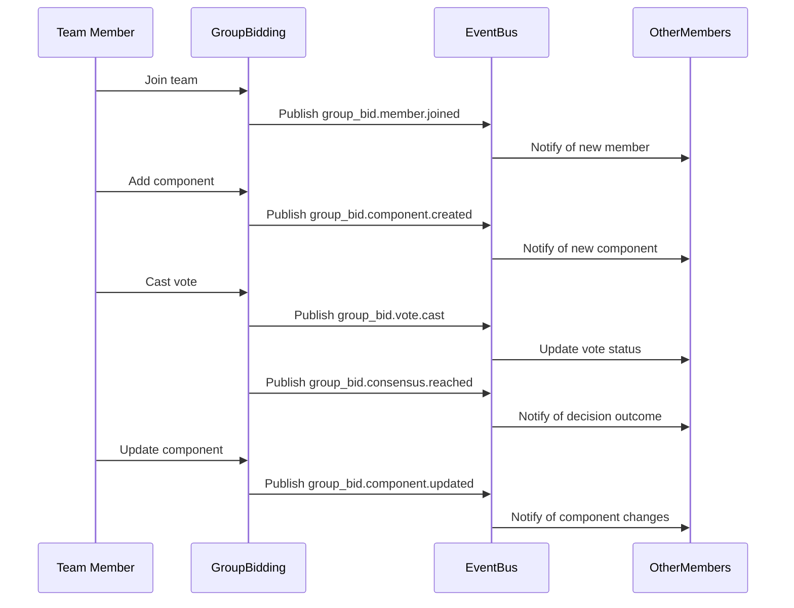
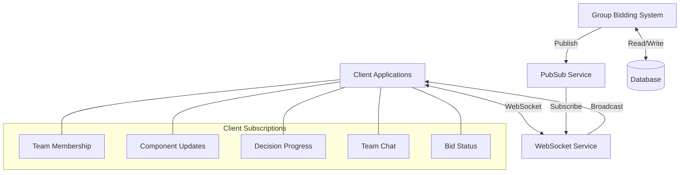
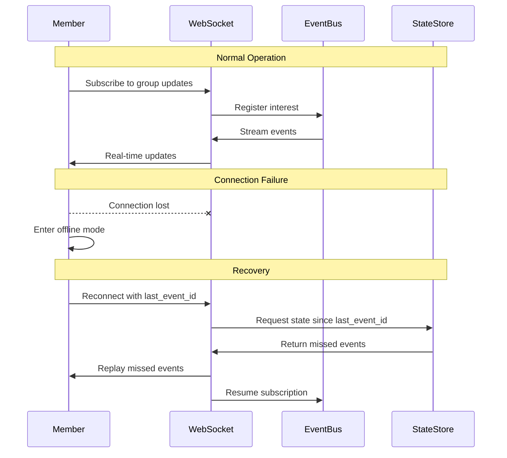
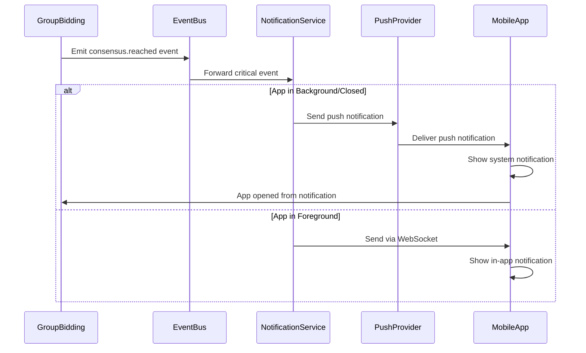
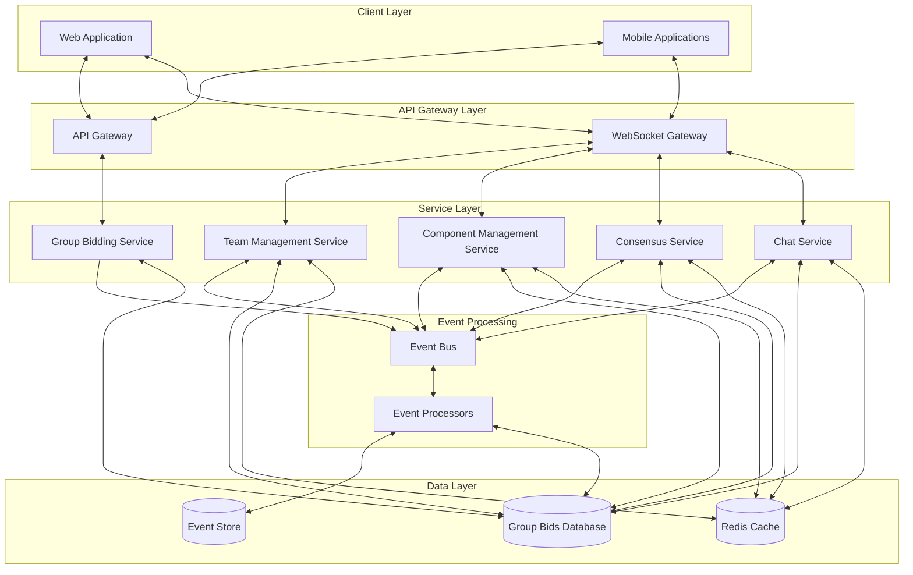

# Group Bidding Real-time Features Specification

This document outlines the real-time capabilities, event streams, subscription models, and implementation details for the Group Bidding domain of the InstaBids platform.

## Overview

The Group Bidding system requires robust real-time capabilities to facilitate seamless collaboration between team members working together on complex project bids. These real-time features enable immediate communication, consensus building, component coordination, and synchronized decision-making across distributed teams.

## Real-time Use Cases

### 1. Team Formation and Management

| Feature | Description | Implementation Priority |
|---------|-------------|------------------------|
| Team Invitation Notifications | Immediate notification when invited to join a bidding team | High |
| Team Member Join/Leave Updates | Real-time roster updates when team composition changes | High |
| Team Member Availability Status | Live indicators of team member availability for collaboration | Medium |
| Team Role Assignment Notifications | Instant updates when roles are assigned or changed | Medium |
| Team Dissolution Alerts | Prompt notification if team is disbanded | High |

### 2. Consensus Building and Decision Making

| Feature | Description | Implementation Priority |
|---------|-------------|------------------------|
| Voting Status Updates | Real-time tracking of team voting progress | High |
| Decision Outcome Notifications | Instant notification when consensus is reached | High |
| Decision Deadline Countdowns | Live countdown timers for pending decisions | Medium |
| Veto Alerts | Immediate notification when a veto is exercised | High |
| Quorum Status Indicators | Dynamic tracking of quorum requirements | Medium |

### 3. Component Collaboration

| Feature | Description | Implementation Priority |
|---------|-------------|------------------------|
| Component Assignment Notifications | Real-time alerts when components are assigned | High |
| Component Update Streams | Live updates when components are modified | High |
| Pricing Change Alerts | Immediate notification of pricing changes affecting total bid | High |
| Dependency Resolution Status | Real-time tracking of component dependencies | Medium |
| Component Lock Indicators | Show when another team member is editing a component | Medium |

### 4. Team Communication

| Feature | Description | Implementation Priority |
|---------|-------------|------------------------|
| Team Chat | Real-time messaging between team members | High |
| Component Discussion Threads | Live discussions related to specific bid components | Medium |
| @Mention Notifications | Immediate alerts when mentioned in discussions | Medium |
| Typing Indicators | Show when team members are composing messages | Low |
| Read Receipts | Indicators showing who has seen important messages | Low |

### 5. Coordination with External Domains

| Feature | Description | Implementation Priority |
|---------|-------------|------------------------|
| Bid Status Synchronization | Real-time updates from the Bidding System domain | High |
| Project Requirement Updates | Live notifications when project requirements change | High |
| Payment Distribution Alerts | Real-time notifications about payment-related events | Medium |
| Client Message Alerts | Immediate delivery of client communications | High |
| Resource Availability Updates | Dynamic updates on resource allocation | Medium |

## Event Streams

### Published Events

The Group Bidding system publishes the following events to the platform's event bus:



| Event | Payload | Publishers | Subscribers | Rate |
|-------|---------|------------|-------------|------|
| `group_bid.created` | `{ groupId, projectId, leadContractorId, timestamp, name }` | Group Formation Service | Team Management, Notifications, Analytics | ~100/day |
| `group_bid.member.joined` | `{ groupId, memberId, role, timestamp }` | Team Management Service | Notification, Analytics, UI | ~300/day |
| `group_bid.member.left` | `{ groupId, memberId, reason, timestamp }` | Team Management Service | Notification, Analytics, UI | ~50/day |
| `group_bid.component.created` | `{ componentId, groupId, ownerId, description, amount }` | Component Management Service | Bidding System, Analytics, UI | ~500/day |
| `group_bid.component.updated` | `{ componentId, changes, previousValues, newValues }` | Component Management Service | Bidding System, Analytics, UI | ~1000/day |
| `group_bid.decision.created` | `{ decisionId, groupId, type, options, deadline }` | Consensus Service | Notification, UI | ~200/day |
| `group_bid.vote.cast` | `{ decisionId, memberId, vote, timestamp }` | Consensus Service | Group Members, Analytics | ~500/day |
| `group_bid.consensus.reached` | `{ decisionId, outcome, votingSummary, timestamp }` | Consensus Service | Bidding System, Notifications | ~150/day |
| `group_bid.message.sent` | `{ messageId, groupId, senderId, content, timestamp }` | Messaging Service | Group Members, Analytics | ~2000/day |
| `group_bid.submitted` | `{ groupId, bidId, timestamp }` | Submission Service | Bidding System, Notifications | ~50/day |

### Subscribed Events

The Group Bidding system subscribes to these events from other domains:

| Event | Source Domain | Handler | Purpose |
|-------|--------------|---------|---------|
| `project.updated` | Project Management | `GroupProjectUpdater` | Update group bid based on project changes |
| `bid.status.changed` | Bidding System | `GroupBidStatusUpdater` | Synchronize bid status with group |
| `bid.awarded` | Bidding System | `GroupAwardProcessor` | Process award notification to team |
| `contractor.availability.changed` | Labor Marketplace | `TeamAvailabilityTracker` | Update team member availability |
| `message.client.sent` | Messaging | `ClientMessageDistributor` | Distribute client messages to team |
| `payment.milestone.created` | Payment Processing | `PaymentPlanDistributor` | Share payment information with team |
| `user.reputation.updated` | User Management | `TeamReputationCalculator` | Update team reputation scores |

## Real-time Technical Implementation

### Subscription Model



#### Subscription Topics

| Topic | Pattern | Content | Access Control |
|-------|---------|---------|----------------|
| `group.{groupId}` | General group activity | Team changes, submissions, status updates | Team members only |
| `group.{groupId}.components` | Component changes | Component creation, updates, assignments | Team members only |
| `group.{groupId}.decisions` | Decision activity | New decisions, votes, outcomes | Team members only |
| `group.{groupId}.chat` | Chat messages | Team messages, mentions, reactions | Team members only |
| `user.{userId}.groups` | User's group activities | Updates across all user's groups | User only |
| `group.{groupId}.client` | Client communications | Messages from and about the client | Team members only |

#### Client Connection Management

1. **Authentication and Authorization**
   - JWT-based authentication for WebSocket connections
   - Role-based access to group topics
   - Team membership verification at connection time

2. **Connection Lifecycle**
   - Heartbeat mechanism (10-second intervals)
   - Automatic reconnection with exponential backoff
   - Session state maintenance across reconnections

3. **Scaling Considerations**
   - Connection pooling for active groups
   - Sharded WebSocket servers based on group distribution
   - Message prioritization for decision-critical events

## Performance Considerations

### Throughput Requirements

| Component | Peak Throughput | Average Throughput | Burst Capacity |
|-----------|----------------|-------------------|----------------|
| Event Publication | 50 events/second | 10 events/second | 200 events/second |
| Event Subscription | 5,000 messages/second | 1,000 messages/second | 20,000 messages/second |
| WebSocket Connections | 10,000 concurrent | 2,000 concurrent | 50,000 concurrent |

### Latency Requirements

| Interaction Type | Maximum Latency | Target Latency | Measurement Point |
|------------------|----------------|----------------|-------------------|
| Team Member Updates | 1 second | 200 ms | All team members notified |
| Component Changes | 1 second | 300 ms | Component editors notified |
| Vote Registration | 500 ms | 100 ms | Vote recorded and broadcast |
| Consensus Achievement | 1 second | 300 ms | All team members notified |
| Chat Messages | 1 second | 300 ms | Message delivered to recipients |

### Optimization Strategies

1. **Message Prioritization**
   - Critical events (consensus outcomes, team changes) get processing priority
   - Component updates batched during high-frequency edits
   - Message queuing with priority lanes

2. **Selective Broadcasting**
   - Component updates only to members working on related components
   - Role-based message filtering
   - Intelligent batching for rapid updates

3. **Client-Side Optimizations**
   - Optimistic UI updates for faster response time
   - Debounced component updates to reduce network traffic
   - Local state caching with server reconciliation

4. **Data Locality**
   - Group-specific data sharding
   - Regional event processing for distributed teams
   - Local caching of frequently accessed team data

## Offline Behavior & Resilience

### Offline Message Handling

| Scenario | Approach | Retention Policy |
|----------|----------|------------------|
| Temporary Connection Loss | Queue messages for delivery upon reconnection | 30-minute message retention |
| Extended Offline Period | Store critical decisions, summarize activities | 24-hour decision summary |
| Cross-Device Synchronization | Track message status across user devices | 3-day status tracking |

### Resilience Patterns

1. **Event Sourcing**
   - Maintain complete event log for all group activities
   - Rebuild group state from event history when needed
   - Event replay for new team members and reconnections

2. **Redundancy**
   - Multi-region event processing
   - Replicated WebSocket servers
   - Redundant event streams

3. **Graceful Degradation**
   - Fallback to polling for WebSocket failures
   - Read-only mode for partial system failure
   - Delayed consistency for non-critical updates

### Failure Recovery



## Security Considerations

### Real-time Data Protection

| Concern | Mitigation | Implementation |
|---------|------------|----------------|
| Unauthorized Group Access | Group-level access control | Membership verification on connection and per-message |
| Component Editing Conflicts | Optimistic concurrency control | Version-based updates with conflict resolution |
| Vote Manipulation | Secure vote recording | Cryptographically signed votes with audit trail |
| Sensitive Data Exposure | Field-level redaction | Sensitive financial data masked based on role |
| Session Hijacking | Connection binding | WebSocket sessions bound to authenticated user |

### Privacy Controls

1. **Team Information**
   - Component financials visible only to relevant team members based on role
   - Voting history accessible only to team members
   - Personal contact information protected

2. **Activity Tracking**
   - Configurable presence sharing
   - Transparent notification settings
   - Activity summary preferences

3. **Data Minimization**
   - Need-to-know basis for sensitive bid information
   - Automatic pruning of transient communication data
   - Purpose-limited data collection

## Mobile Considerations

### Mobile-Specific Optimizations

1. **Battery Impact Reduction**
   - Adaptive WebSocket heartbeat rates based on app state
   - Push notification fallback for background state
   - Batch updates when in reduced power mode

2. **Bandwidth Optimization**
   - Compressed event format for constrained connections
   - Differential updates for components
   - Image and file optimization for mobile networks

3. **Offline Capabilities**
   - Cached group and component data for offline viewing
   - Queued actions for reconnection
   - Background synchronization when connection restores

### Mobile Push Integration



## Implementation Architecture

### Technology Stack

| Component | Technology | Justification |
|-----------|------------|---------------|
| Event Bus | Apache Kafka | High throughput, durable storage, topic partitioning |
| WebSocket Server | Socket.IO | Broad browser support, fallback options, room-based messaging |
| State Management | Redis | In-memory performance, pub/sub capabilities, key expiration |
| Event Storage | PostgreSQL + TimescaleDB | Time-series data, complex querying capabilities |
| Mobile Push | Firebase Cloud Messaging + APNs | Cross-platform support, reliable delivery |

### Deployment Architecture



## Monitoring & Observability

### Key Metrics

| Metric | Description | Threshold | Alert |
|--------|-------------|-----------|-------|
| Team WebSocket Connections | Active WebSocket connections per team | >25% deviation from baseline | Warning |
| Message Delivery Rate | Events delivered per second | >50% deviation from baseline | Warning |
| Message Delivery Latency | Time from event creation to client delivery | >1s p95 | Critical |
| Component Edit Conflicts | Rate of concurrent edit conflicts | >5% of edits | Warning |
| Consensus Achievement Time | Time from decision creation to resolution | >24h | Warning |
| Offline Queue Size | Messages queued for offline clients | >1000 per client | Warning |

### Health Checks

1. **Connection Health**
   - WebSocket server availability
   - Connection success rate
   - Subscription success rate

2. **Message Delivery Health**
   - End-to-end delivery confirmation rate
   - Message order preservation
   - Duplicate message detection

3. **Decision System Health**
   - Vote recording accuracy
   - Consensus calculation correctness
   - Decision timeout monitoring

### Logging Strategy

| Log Category | Purpose | Components | Retention |
|--------------|---------|------------|-----------|
| Connection Logs | Track connection lifecycle | WebSocket servers | 7 days |
| Message Delivery Logs | Track event delivery | WebSocket servers | 3 days |
| Decision Process Logs | Track voting and consensus | Consensus Service | 30 days |
| Component Edit Logs | Track component changes | Component Service | 14 days |
| Security Logs | Track authentication/authorization | All components | 90 days |

## Testing Strategy

### Real-time Test Scenarios

| Test Category | Test Cases | Success Criteria |
|---------------|------------|------------------|
| Team Collaboration | Multiple users editing components simultaneously | Consistent state across all clients |
| | Team chat with rapid message exchange | All messages delivered in order |
| | Decision voting with all team members | Correct consensus calculation |
| Failure Recovery | WebSocket disconnection during component edit | State recovery upon reconnection |
| | Server restart during active session | Session resumption without data loss |
| | Network partitioning during consensus process | Consistent decision outcome |
| Performance | High-frequency component updates | <1s propagation to all clients |
| | Large team with many concurrent actions | System responsiveness maintained |
| | Cross-region team collaboration | Acceptable latency for all members |

### Load Testing

| Test Scenario | Parameters | Success Criteria |
|---------------|------------|------------------|
| Peak Connection Load | 10,000 concurrent team members | <1% connection errors, <500ms latency |
| Peak Message Load | 5,000 messages/second | <1% message loss, <1s delivery time |
| Component Edit Storm | 1,000 component edits in 1 minute | <2% conflict rate, <2s propagation |
| Decision Flood | 100 simultaneous consensus processes | All completed correctly, <30s resolution |

## Implementation Roadmap

| Phase | Timeline | Focus | Key Deliverables |
|-------|----------|-------|-----------------|
| Phase 1 | Q2 2025 | Core Team Communication | WebSocket infrastructure, team presence, basic chat |
| Phase 2 | Q3 2025 | Component Collaboration | Real-time component editing, conflict resolution |
| Phase 3 | Q4 2025 | Decision System | Voting mechanism, consensus tracking |
| Phase 4 | Q1 2026 | Mobile Optimizations | Offline mode, push notifications, bandwidth optimizations |

## Integration Example

The following examples demonstrate how front-end applications can interact with the real-time group bidding features:

### Web Client Integration

```typescript
// Group bid real-time collaboration using Socket.IO client
import { io } from 'socket.io-client';
import { getAuthToken } from './auth';

class GroupBidRealtimeService {
  private socket: any;
  private groupSubscriptions: Map<string, Set<(data: any) => void>> = new Map();
  
  constructor() {
    this.socket = io('wss://realtime.instabids.com/groups', {
      auth: { token: getAuthToken() },
      transports: ['websocket', 'polling']
    });
    
    this.socket.on('connect', () => {
      console.log('Connected to group bidding real-time service');
      // Re-subscribe to previous group subscriptions
      this.groupSubscriptions.forEach((callbacks, groupId) => {
        this.subscribeToGroup(groupId);
      });
    });
    
    this.socket.on('disconnect', (reason) => {
      console.log('Disconnected from group bidding real-time service:', reason);
      if (reason === 'io server disconnect') {
        // Server initiated disconnect, try to reconnect
        this.socket.connect();
      }
    });
    
    this.socket.on('error', (error) => {
      console.error('Socket connection error:', error);
    });
  }
  
  subscribeToGroup(groupId: string): void {
    if (!this.groupSubscriptions.has(groupId)) {
      this.groupSubscriptions.set(groupId, new Set());
    }
    
    // Subscribe to group topic
    this.socket.emit('subscribe', `group.${groupId}`, (response: any) => {
      if (response.error) {
        console.error(`Failed to subscribe to group ${groupId}:`, response.error);
        return;
      }
      console.log(`Subscribed to group ${groupId} updates`);
    });
  }
  
  onMembershipChange(groupId: string, callback: (data: any) => void): void {
    const callbacks = this.groupSubscriptions.get(groupId) || new Set();
    callbacks.add(callback);
    this.groupSubscriptions.set(groupId, callbacks);
    
    this.subscribeToGroup(groupId);
    
    this.socket.on(`group.${groupId}.membership`, callback);
  }
  
  onComponentUpdate(groupId: string, callback: (data: any) => void): void {
    this.subscribeToGroup(groupId);
    
    this.socket.on(`group.${groupId}.component`, callback);
  }
  
  onDecisionUpdate(groupId: string, callback: (data: any) => void): void {
    this.subscribeToGroup(groupId);
    
    this.socket.on(`group.${groupId}.decision`, callback);
  }
  
  onGroupChat(groupId: string, callback: (data: any) => void): void {
    this.subscribeToGroup(groupId);
    
    this.socket.on(`group.${groupId}.chat`, callback);
  }
  
  unsubscribeFromGroup(groupId: string): void {
    this.socket.emit('unsubscribe', `group.${groupId}`);
    
    // Remove all listeners for this group
    this.socket.off(`group.${groupId}.membership`);
    this.socket.off(`group.${groupId}.component`);
    this.socket.off(`group.${groupId}.decision`);
    this.socket.off(`group.${groupId}.chat`);
    
    this.groupSubscriptions.delete(groupId);
  }
  
  updateComponent(groupId: string, componentId: string, changes: any): Promise<void> {
    return new Promise((resolve, reject) => {
      this.socket.emit('component.update', {
        groupId,
        componentId,
        changes,
        timestamp: new Date().toISOString()
      }, (response: any) => {
        if (response.error) {
          reject(response.error);
        } else {
          resolve();
        }
      });
    });
  }
  
  castVote(groupId: string, decisionId: string, vote: string): Promise<void> {
    return new Promise((resolve, reject) => {
      this.socket.emit('decision.vote', {
        groupId,
        decisionId,
        vote,
        timestamp: new Date().toISOString()
      }, (response: any) => {
        if (response.error) {
          reject(response.error);
        } else {
          resolve();
        }
      });
    });
  }
  
  sendMessage(groupId: string, message: string): Promise<void> {
    return new Promise((resolve, reject) => {
      this.socket.emit('chat.message', {
        groupId,
        content: message,
        timestamp: new Date().toISOString()
      }, (response: any) => {
        if (response.error) {
          reject(response.error);
        } else {
          resolve();
        }
      });
    });
  }
}

export const groupBidRealtimeService = new GroupBidRealtimeService();
```

### Mobile Client Integration

```swift
// Swift example for iOS group bidding real-time integration
import SocketIO
import Foundation

class GroupBidRealtimeManager {
    static let shared = GroupBidRealtimeManager()
    
    private let socketManager: SocketManager
    private let socket: SocketIOClient
    private var groupSubscriptions: [String: Set<String>] = [:]
    
    private init() {
        // Configure Socket.IO manager
        let authToken = AuthManager.shared.getToken() ?? ""
        socketManager = SocketManager(socketURL: URL(string: "wss://realtime.instabids.com/groups")!,
                                      config: [.log(true), .extraHeaders(["Authorization": "Bearer \(authToken)"])])
        socket = socketManager.defaultSocket
        
        setupSocketHandlers()
    }
    
    private func setupSocketHandlers() {
        socket.on(clientEvent: .connect) { [weak self] _, _ in
            print("Connected to group bidding real-time service")
            // Re-establish subscriptions
            self?.resubscribeToGroups()
        }
        
        socket.on(clientEvent: .disconnect) { _, _ in
            print("Disconnected from group bidding real-time service")
        }
        
        socket.on(clientEvent: .error) { _, data in
            print("Socket error: \(data)")
        }
    }
    
    func connect() {
        socket.connect()
    }
    
    func disconnect() {
        socket.disconnect()
    }
    
    private func resubscribeToGroups() {
        for groupId in groupSubscriptions.keys {
            subscribeToGroup(groupId: groupId)
        }
    }
    
    func subscribeToGroup(groupId: String) {
        if groupSubscriptions[groupId] == nil {
            groupSubscriptions[groupId] = Set()
        }
        
        socket.emit("subscribe", "group.\(groupId)") { [weak self] response in
            guard let self = self else { return }
            
            if let error = (response as? [[String: Any]])?.first?["error"] as? String {
                print("Failed to subscribe to group \(groupId): \(error)")
                return
            }
            
            print("Subscribed to group \(groupId) updates")
        }
    }
    
    func onMembershipChange(groupId: String, handler: @escaping (GroupMembershipEvent) -> Void) -> String {
        let handlerId = UUID().uuidString
        var handlers = groupSubscriptions[groupId] ?? Set()
        handlers.insert(handlerId)
        groupSubscriptions[groupId] = handlers
        
        subscribeToGroup(groupId: groupId)
        
        socket.on("group.\(groupId).membership") { data, _ in
            guard let jsonData = try? JSONSerialization.data(withJSONObject: data[0], options: []),
                  let event = try? JSONDecoder().decode(GroupMembershipEvent.self, from: jsonData) else { return }
            
            handler(event)
        }
        
        return handlerId
    }
    
    func onComponentUpdate(groupId: String, handler: @escaping (ComponentUpdateEvent) -> Void) -> String {
        let handlerId = UUID().uuidString
        var handlers = groupSubscriptions[groupId] ?? Set()
        handlers.insert(handlerId)
        groupSubscriptions[groupId] = handlers
        
        subscribeToGroup(groupId: groupId)
        
        socket.on("group.\(groupId).component") { data, _ in
            guard let jsonData = try? JSONSerialization.data(withJSONObject: data[0], options: []),
                  let event = try? JSONDecoder().decode(ComponentUpdateEvent.self, from: jsonData) else { return }
            
            handler(event)
        }
        
        return handlerId
    }
    
    func onDecisionUpdate(groupId: String, handler: @escaping (DecisionEvent) -> Void) -> String {
        let handlerId = UUID().uuidString
        var handlers = groupSubscriptions[groupId] ?? Set()
        handlers.insert(handlerId)
        groupSubscriptions[groupId] = handlers
        
        subscribeToGroup(groupId: groupId)
        
        socket.on("group.\(groupId).decision") { data, _ in
            guard let jsonData = try? JSONSerialization.data(withJSONObject: data[0], options: []),
