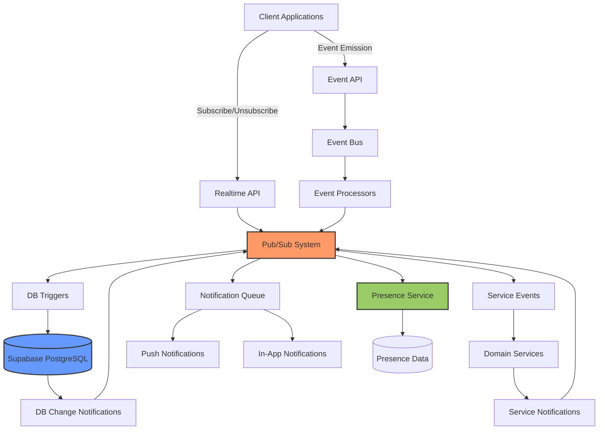
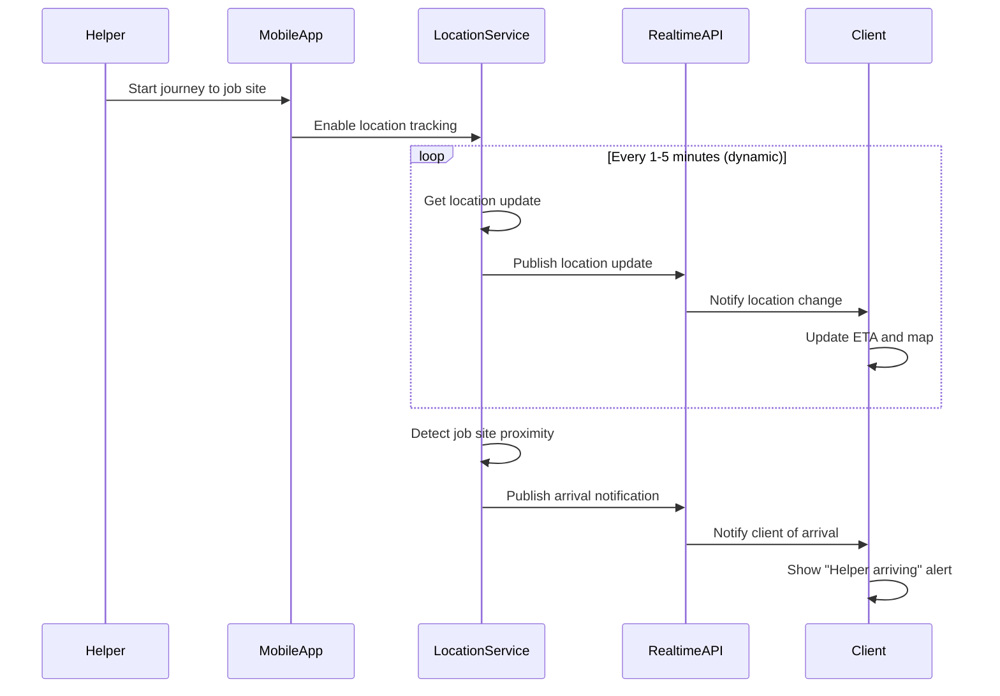
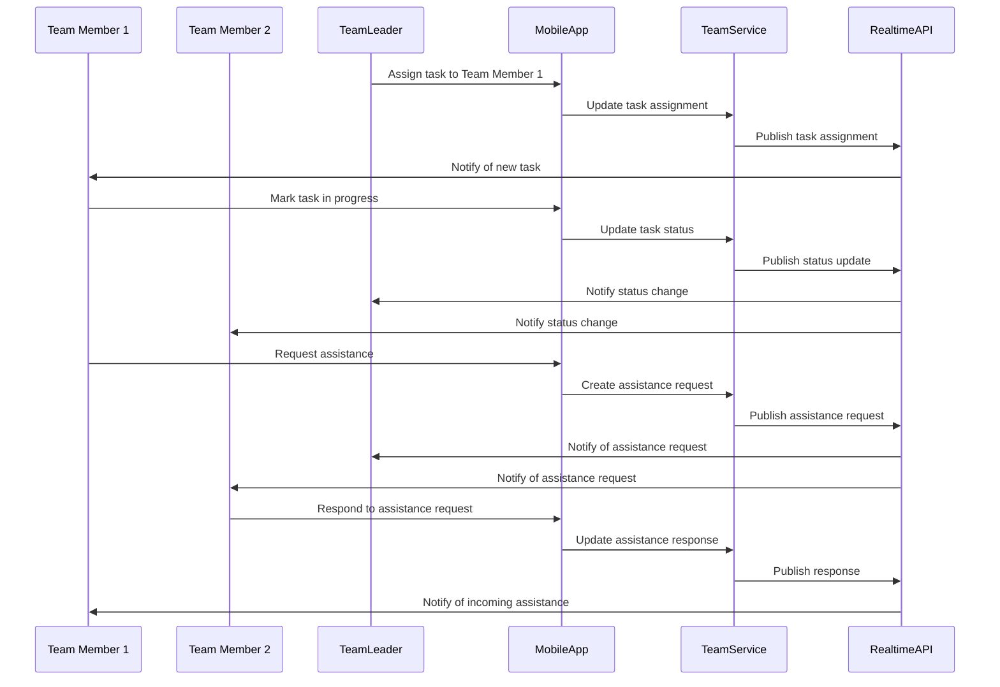
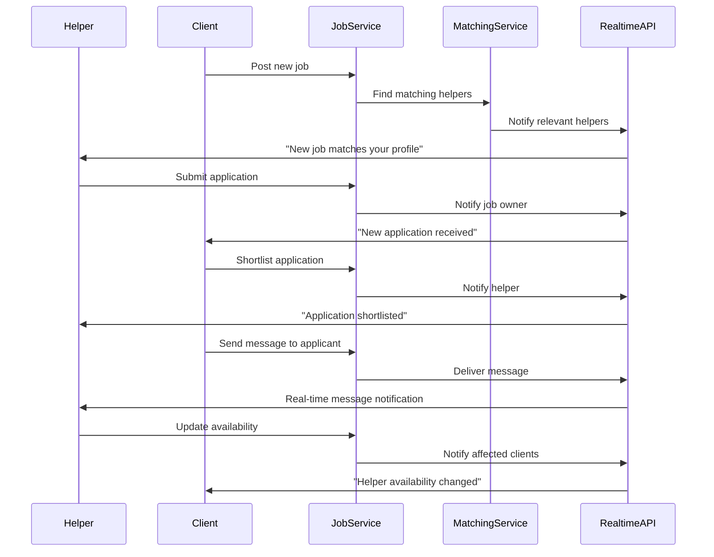

So how do you want to do that? He was telling me. come on, Willie. Come on. Wow. I'm going to go take a look. I'm picking up the worker. You can take it up. Come on. What? Yeah, and optimize. What you doing? You've got to go to sleep now. Come on. We're not playing. Get the house. Get the pass. Get your passing. I don't want to hear it. Get your passing. Get your passy. We're passing. All right. I have to go to work. I have to get ready. OK, people, and they don't think so. Now you're laying down and you're going to sleep. So we're going to sleep. I don't want to go. I know, I know, I know. I know. I know. Go to somewhere. Have the bottom of the box. Twenty four five. . OK, he won't go to sleep. He says, no. OK, That breathes bloody murder. He comes in and everyone. is he drinking a bottle? No, I don't even give him to drink any bottle. I'm just getting dressed for work. all right, I'll see you in a minute. Bye. What are you doing? Let's take a call. We watched our team come on, but we watched our game. Yeah, you know, get away with bloody murder with Jackie and Mommy. Here's one baby. He's so tired. He's a baby. He's so tired. Watch out. You don't follow. Be careful. I got to find a shirt. I need a tank top. Be careful on the bed near me. Fox, I need a tank box. Oh, Lord, Oh, I sent you hung one up. All right here, you're going to go get in the bed. Ohh my neck hurts. His daddy's on his way. Oh, what happened? 0 yeah, let's change shorts. Come on, come on. No, we don't close that little pumpkin dunking. Come on. Oh, # Real-Time Features Specification for Labor Marketplace

This document outlines the real-time capabilities in the Labor Marketplace domain. Real-time features are critical for enabling responsive user experiences, timely notifications, and live tracking of labor activities in the field.

## Real-Time Architecture Overview

The Labor Marketplace domain employs a multi-layered real-time architecture:



### Key Components

1. **Pub/Sub System**: Powered by Supabase Realtime, providing WebSocket-based subscription capabilities
2. **Event Bus**: Asynchronous event processing system for non-realtime events that may trigger realtime updates
3. **Presence Service**: Tracks online/offline status and activity of users
4. **DB Triggers**: PostgreSQL triggers that emit events on data changes
5. **Notification Queue**: Manages delivery of notifications through various channels

## Real-Time Subscription Channels

The Labor Marketplace domain provides the following real-time subscription channels:

| Channel Name | Purpose | Access Control | Events |
|--------------|---------|----------------|--------|
| `helper:status:{helperId}` | Helper status changes | Helper + Client with active assignment | `location_update`, `availability_change`, `verification_change` |
| `job:updates:{jobId}` | Job post updates | Job creator + Applicants | `status_change`, `application_received`, `job_modified` |
| `assignment:status:{assignmentId}` | Assignment status tracking | Assignment participants | `check_in`, `check_out`, `status_change`, `issue_reported`, `message_received` |
| `application:status:{applicationId}` | Application status updates | Applicant + Job creator | `viewed`, `shortlisted`, `rejected`, `hired` |
| `helper:invitations:{helperId}` | New job invitations | Helper only | `job_invitation`, `team_invitation` |
| `client:applications:{clientId}` | New job applications | Client only | `new_application`, `application_withdrawn` |
| `helper:verification:{helperId}` | Verification process updates | Helper only | `verification_started`, `verification_updated`, `verification_completed` |
| `team:updates:{teamId}` | Team coordination | Team members + Client | `member_joined`, `member_left`, `task_assigned`, `status_update` |
| `labor_marketplace:area:{areaCode}` | Area-specific updates | Helpers in area | `new_jobs_available`, `urgent_needs`, `rate_trends` |

## Event Types and Schemas

### Helper Status Events

```typescript
interface HelperStatusEvent {
  type: 'location_update' | 'availability_change' | 'verification_change';
  helperId: string;
  timestamp: string; // ISO format
  data: {
    // For location_update
    currentLocation?: {
      latitude: number;
      longitude: number;
      accuracy: number;
    };
    // For availability_change
    availabilityUpdate?: {
      status: 'available' | 'unavailable' | 'limited';
      until?: string; // ISO date
      reason?: string;
    };
    // For verification_change
    verificationUpdate?: {
      verificationLevel: 'basic' | 'identity_verified' | 'background_checked' | 'fully_verified';
      changedFields: string[];
    };
  };
}
```

### Job Events

```typescript
interface JobEvent {
  type: 'status_change' | 'application_received' | 'job_modified';
  jobId: string;
  timestamp: string; // ISO format
  actorId: string; // User who triggered the event
  data: {
    // For status_change
    previousStatus?: 'draft' | 'open' | 'in_progress' | 'filled' | 'canceled' | 'completed' | 'expired';
    newStatus?: 'draft' | 'open' | 'in_progress' | 'filled' | 'canceled' | 'completed' | 'expired';
    
    // For application_received
    application?: {
      applicationId: string;
      helperId: string;
      helperName: string;
      proposedRate: number;
    };
    
    // For job_modified
    modifiedFields?: string[];
    significantChange?: boolean; // Indicates if change affects existing applicants
  };
}
```

### Assignment Events

```typescript
interface AssignmentEvent {
  type: 'check_in' | 'check_out' | 'status_change' | 'issue_reported' | 'message_received';
  assignmentId: string;
  timestamp: string; // ISO format
  actorId: string;
  data: {
    // For check_in/check_out
    location?: {
      latitude: number;
      longitude: number;
      timestamp: string; // ISO format
      verified: boolean;
    };
    
    // For status_change
    previousStatus?: 'scheduled' | 'in_progress' | 'completed' | 'canceled' | 'no_show' | 'disputed';
    newStatus?: 'scheduled' | 'in_progress' | 'completed' | 'canceled' | 'no_show' | 'disputed';
    note?: string;
    
    // For issue_reported
    issue?: {
      issueId: string;
      severity: 'low' | 'medium' | 'high' | 'critical';
      description: string;
      requiresAction: boolean;
    };
    
    // For message_received
    message?: {
      messageId: string;
      content: string;
      attachments?: { type: string; url: string }[];
    };
  };
}
```

## Delivery Guarantees

The real-time system provides the following delivery guarantees:

1. **At-Least-Once Delivery**: Events may be delivered multiple times in rare cases
2. **Ordered Delivery**: Events within a single channel are delivered in order
3. **Persistent Connections**: WebSocket connections with automatic reconnection
4. **Offline Support**: Events missed while offline are synchronized upon reconnection (up to 24 hours)
5. **Delivery Confirmation**: Critical events require client acknowledgment

### Quality of Service Levels

The system supports different QoS levels depending on the event type:

| QoS Level | Use Cases | Behavior |
|-----------|-----------|----------|
| 0 (Fire and Forget) | Presence updates, typing indicators | No guarantee of delivery, no persistence |
| 1 (At Least Once) | Status updates, non-critical notifications | Persisted until confirmed delivered at least once |
| 2 (Exactly Once) | Payment events, official job status changes | Persisted with transaction guarantees and exactly-once semantics |

## Client-Side Implementation Guidelines

### Web Client Implementation

```typescript
// Using Supabase Realtime client
import { createClient } from '@supabase/supabase-js'

const supabase = createClient('https://instabids-api.supabase.co', 'public-anon-key')

// Subscribe to a helper's status channel
const subscribeToHelperStatus = (helperId: string) => {
  const channel = supabase
    .channel(`helper:status:${helperId}`)
    .on('broadcast', { event: 'location_update' }, (payload) => {
      console.log('Helper location updated:', payload)
      // Update UI with new location
      updateHelperLocationOnMap(payload.data)
    })
    .on('broadcast', { event: 'availability_change' }, (payload) => {
      console.log('Helper availability changed:', payload)
      // Update availability indicator
      updateHelperAvailabilityStatus(payload.data)
    })
    .subscribe()

  return () => {
    // Return unsubscribe function
    channel.unsubscribe()
  }
}

// Subscribe to assignment updates
const subscribeToAssignment = (assignmentId: string) => {
  const channel = supabase
    .channel(`assignment:status:${assignmentId}`)
    .on('broadcast', { event: 'check_in' }, (payload) => {
      console.log('Helper checked in:', payload)
      // Update assignment status
      updateAssignmentStatus(payload.data)
      // Show notification
      showNotification('Helper has checked in at the job site')
    })
    .on('broadcast', { event: 'issue_reported' }, (payload) => {
      console.log('Issue reported:', payload)
      // Show urgent notification
      showUrgentNotification('Issue reported on job site', payload.data.issue)
    })
    .subscribe()

  return () => {
    channel.unsubscribe()
  }
}
```

### Mobile Client Implementation

```typescript
// React Native implementation with Supabase
import { createClient } from '@supabase/supabase-js'
import { setupURLPolyfill } from 'react-native-url-polyfill'
import AsyncStorage from '@react-native-async-storage/async-storage'

// Setup polyfills
setupURLPolyfill()

// Create client with AsyncStorage
const supabase = createClient(
  'https://instabids-api.supabase.co',
  'public-anon-key',
  {
    auth: {
      storage: AsyncStorage,
      autoRefreshToken: true,
      persistSession: true,
      detectSessionInUrl: false,
    },
  }
)

// Subscribe to job updates with offline support
const subscribeToJobWithOfflineSupport = (jobId: string) => {
  // Track subscription state
  let isActive = true
  let retryCount = 0
  const MAX_RETRIES = 5
  
  const connect = () => {
    if (!isActive) return
    
    const channel = supabase
      .channel(`job:updates:${jobId}`)
      .on('broadcast', { event: 'status_change' }, (payload) => {
        console.log('Job status changed:', payload)
        // Update job status in local state
        updateJobStatus(payload.data)
        // Reset retry counter on successful event
        retryCount = 0
      })
      .on('broadcast', { event: 'application_received' }, (payload) => {
        console.log('New application received:', payload)
        // Update applications list
        addNewApplication(payload.data.application)
      })
      .on('error', (error) => {
        console.error('Realtime connection error:', error)
        if (isActive && retryCount < MAX_RETRIES) {
          // Exponential backoff
          const delay = Math.min(1000 * Math.pow(2, retryCount), 30000)
          retryCount++
          setTimeout(connect, delay)
        }
      })
      .subscribe()
      
    return channel
  }
  
  let channel = connect()
  
  // Handle app state changes
  const handleAppStateChange = (nextAppState) => {
    if (nextAppState === 'active') {
      // Reconnect when app comes to foreground
      if (channel) channel.unsubscribe()
      channel = connect()
    }
  }
  
  // Return cleanup function
  return () => {
    isActive = false
    if (channel) channel.unsubscribe()
    // Also remove app state change listener in real implementation
  }
}
```

## Reconnection Strategies

The real-time system implements the following reconnection strategies:

1. **Incremental Backoff**: Starting with 0.5s and increasing up to 30s maximum between retry attempts
2. **Stateful Reconnection**: Maintains subscription state across reconnections
3. **Connection Recovery**: Recovers partially-delivered messages when possible
4. **Event Replay**: Replays missed events upon reconnection

```typescript
// Reconnection strategy implementation
const createReconnectingClient = (supabaseUrl, supabaseKey) => {
  let client = createClient(supabaseUrl, supabaseKey)
  let isConnected = false
  let reconnectAttempts = 0
  
  // Monitor connection state
  client.realtime.onOpen(() => {
    console.log('Connection established')
    isConnected = true
    reconnectAttempts = 0
    // Resubscribe to channels if needed
  })
  
  client.realtime.onClose(() => {
    console.log('Connection closed')
    isConnected = false
    
    if (reconnectAttempts < 10) {
      const delay = Math.min(1000 * Math.pow(2, reconnectAttempts), 30000)
      reconnectAttempts++
      
      console.log(`Reconnecting in ${delay}ms (attempt ${reconnectAttempts})`)
      setTimeout(() => {
        // Force reconnection
        client.realtime.connect()
      }, delay)
    } else {
      console.error('Max reconnection attempts reached')
      // Notify user of connection issues
    }
  })
  
  return client
}
```

## Performance Considerations

### Bandwidth Optimization

1. **Selective Subscriptions**: Clients only subscribe to immediately relevant channels
2. **Batched Updates**: High-frequency updates are batched (e.g., location updates sent at most once per 10 seconds)
3. **Presence Consolidation**: User presence events are throttled and consolidated
4. **Payload Minimization**: Event payloads are kept minimal with references instead of full objects

### Resource Management

1. **Connection Pooling**: Shared WebSocket connections across channels
2. **Auto-Unsubscribe**: Automatic unsubscribe from irrelevant channels when navigating away
3. **Subscription Limits**: Maximum of 50 concurrent subscriptions per client
4. **Graceful Degradation**: Ability to fall back to polling for non-critical features

## Battery Impact Mitigation (Mobile)

1. **Location Tracking Optimization**:
   - Reduced frequency when app is in background
   - Geofencing instead of continuous tracking when possible
   - Batch location updates

2. **Connection Management**:
   - WebSocket connection sharing across features
   - Selective suspension during battery conservation mode
   - Transition to server-sent push notifications when in background

3. **Background Processing**:
   - Minimal background processing of real-time events
   - Priority-based handling of critical notifications

```typescript
// Example of battery-optimized location tracking
const startOptimizedLocationTracking = (assignmentId, jobLocation) => {
  // Define geofence around job location
  const geofence = {
    latitude: jobLocation.latitude,
    longitude: jobLocation.longitude,
    radius: 500, // meters
  }
  
  // Different strategies based on app state
  if (appState === 'active') {
    // Foreground: More frequent updates
    return startForegroundLocationTracking(assignmentId, {
      distanceFilter: 50, // meters
      interval: 30000, // 30 seconds
    })
  } else {
    // Background: Use geofencing to detect arrival/departure
    return startGeofencedLocationTracking(assignmentId, geofence, {
      notifyOnEntry: true,
      notifyOnExit: true,
      // Only send location updates when crossing geofence
    })
  }
}
```

## Testing Approach

### Real-Time Feature Testing

1. **Subscription Testing**:
   - Verify correct subscription/unsubscription behavior
   - Test permissions and access control
   - Validate event payload structure

2. **Connection Resiliency**:
   - Test reconnection behavior during network interruptions
   - Verify event replay functionality
   - Test behavior during server restarts

3. **Scale Testing**:
   - Simulate high message volumes
   - Test with thousands of concurrent connections
   - Measure and optimize latency

### Testing Tools

1. **Realtime Simulator**: Tool for simulating events and testing client responses
2. **Connection Chaos Testing**: Randomly disrupts connections to test resilience
3. **Subscription Analytics**: Tracks subscription patterns and identifies inefficiencies

```typescript
// Example of a real-time test case
describe('Helper check-in real-time notifications', () => {
  let clientSubscription
  let helperSubscription
  
  beforeEach(async () => {
    // Set up test users and assignment
    const { client, helper, assignment } = await setupTestAssignment()
    
    // Subscribe to real-time channels
    clientSubscription = subscribeToAssignmentAsClient(client, assignment.id)
    helperSubscription = subscribeToAssignmentAsHelper(helper, assignment.id)
  })
  
  afterEach(() => {
    // Clean up subscriptions
    if (clientSubscription) clientSubscription.unsubscribe()
    if (helperSubscription) helperSubscription.unsubscribe()
  })
  
  it('should notify client when helper checks in', async () => {
    // Helper checks in
    const checkInResult = await performHelperCheckIn(assignment.id, {
      latitude: 34.0522,
      longitude: -118.2437,
    })
    
    // Verify client received notification
    await expectClientToReceiveEvent('check_in', {
      assignmentId: assignment.id,
      location: {
        latitude: 34.0522,
        longitude: -118.2437,
        verified: true,
      },
    })
  })
  
  it('should handle connection interruptions during check-in', async () => {
    // Simulate network interruption
    await simulateNetworkInterruption(5000) // 5 second interruption
    
    // Helper checks in during interruption
    const checkInResult = await performHelperCheckIn(assignment.id, {
      latitude: 34.0522,
      longitude: -118.2437,
    })
    
    // Verify client received notification after reconnection
    await expectClientToReceiveEvent('check_in', {
      assignmentId: assignment.id,
      // Event data...
    }, 10000) // Allow extra time for reconnection
  })
})
```

## Domain-Specific Real-Time Features

### Live Helper Tracking

For active assignments, the system provides real-time tracking of helper location and status:



### Real-Time Assignment Coordination

For team-based assignments, the system provides real-time coordination features:



### Real-Time Bidding and Job Matching

The system provides real-time notifications for job matching and application processes:



## Integration with Push Notifications

For critical events when the app is not in the foreground, the real-time system integrates with push notifications:

1. **Fallback Mechanism**: If real-time delivery fails, system falls back to push notification
2. **Critical Notifications**: High-priority events always send both real-time and push notifications
3. **Notification Deduplication**: System prevents duplicate notifications from real-time and push channels

```typescript
// Push notification integration
const configureRealTimeWithPushFallback = (userId) => {
  // Get device token for push notifications
  const deviceToken = getDeviceToken()
  
  // Register device for fallback push notifications
  registerDeviceForPushFallback(userId, deviceToken)
  
  // Set up real-time connection
  const client = createReconnectingClient('https://instabids-api.supabase.co', 'public-anon-key')
  
  // Configure connection status monitoring that triggers push mode
  client.realtime.onClose(() => {
    // If disconnected, enable push-only mode on server
    enablePushOnlyMode(userId, deviceToken)
  })
  
  client.realtime.onOpen(() => {
    // When reconnected, disable push-only mode
    disablePushOnlyMode(userId, deviceToken)
  })
  
  return client
}
```

## Feature Flags for Real-Time Features

The system uses feature flags to control real-time feature availability:

| Feature Flag | Description | Default | 
|--------------|-------------|---------|
| `realtime.helper_tracking.enabled` | Controls helper location tracking | `true` |
| `realtime.presence.enabled` | Controls online presence features | `true` |
| `realtime.typing_indicators.enabled` | Controls typing indicators in messaging | `true` |
| `realtime.team_coordination.enabled` | Controls team coordination features | `true` |
| `realtime.job_alerts.enabled` | Controls instant job matching alerts | `true` |
| `realtime.battery_optimization.enabled` | Controls battery optimization features | `true` |

This allows for granular control of real-time features based on:
- User preferences
- Device capabilities
- Network conditions
- Server load balancing

## Future Enhancements

1. **Offline Queuing**: Enhanced client-side queuing of events during offline periods
2. **Multi-Region Support**: Distributed real-time infrastructure across geographic regions
3. **E2E Encryption**: End-to-end encryption for sensitive real-time communications
4. **Advanced Presence**: Rich presence information with contextual status
5. **AI-Powered Prioritization**: Intelligent prioritization of real-time updates based on user context

This real-time specification provides a comprehensive framework for building responsive, reliable real-time features in the Labor Marketplace domain, ensuring users have immediate awareness of critical events and status changes.
