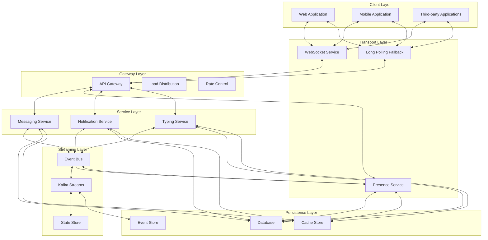
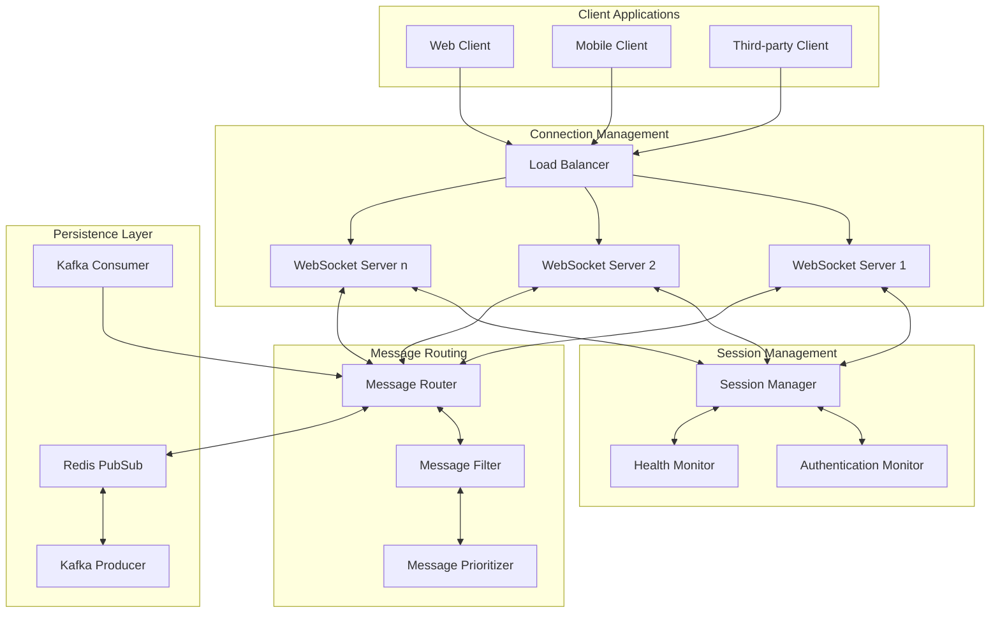
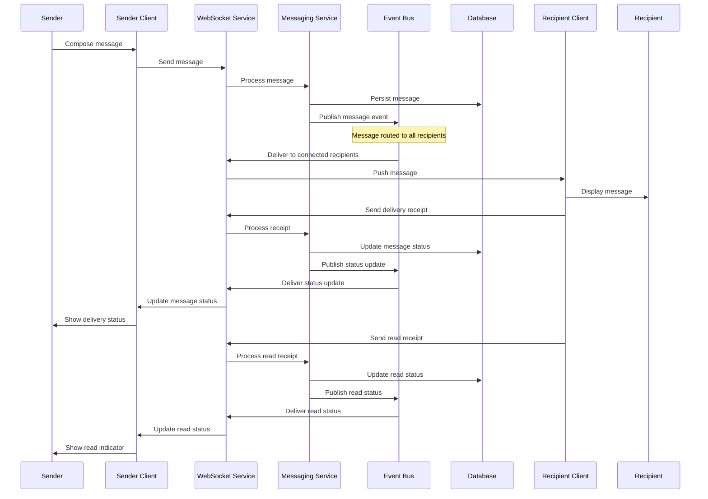
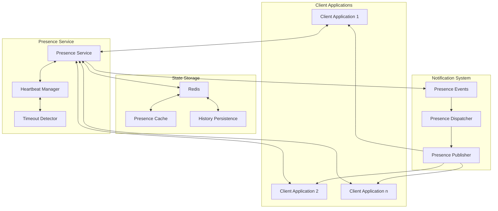
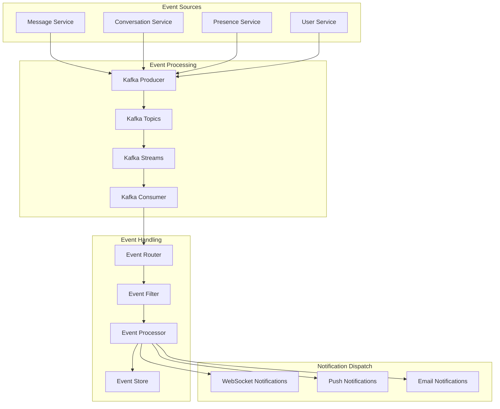
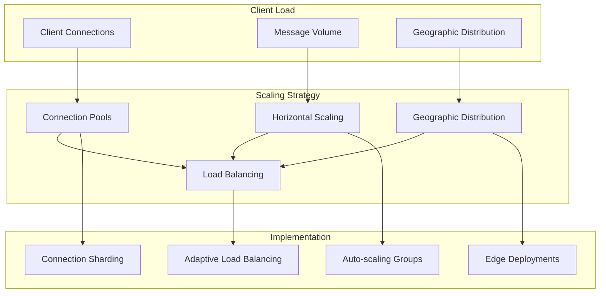
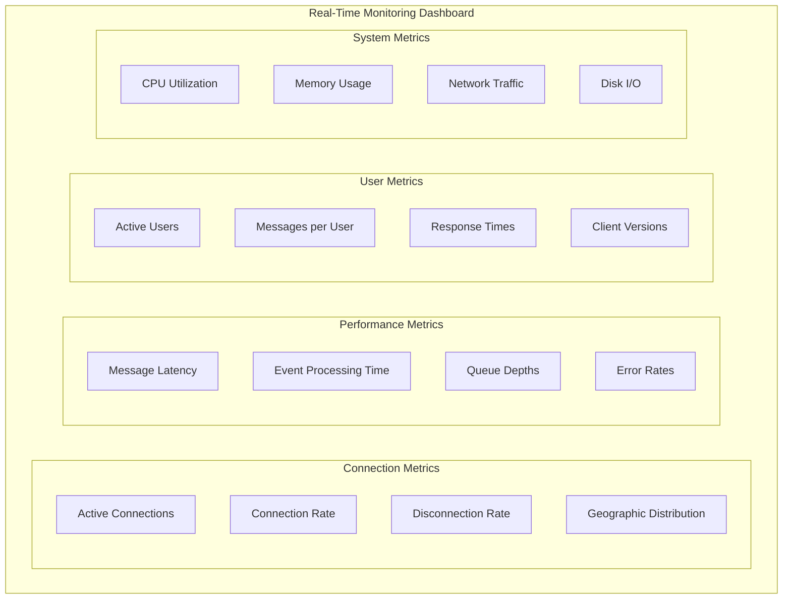

# Messaging System Real-Time Features

This document outlines the real-time capabilities, architecture, and implementation approach for the Messaging domain of the InstaBids platform. It defines how the system delivers immediate updates, notifications, and interactive features to provide a responsive messaging experience.

## Real-Time Architecture Overview

The Messaging System implements a comprehensive real-time architecture to ensure message delivery, status updates, and presence information are immediately synchronized across devices and users.



## Real-Time Capabilities

### 1. Message Delivery and Status

The system provides immediate message delivery and status tracking to ensure a responsive conversation experience:

| Feature | Description | Implementation Approach |
|---------|-------------|------------------------|
| Instant Message Delivery | Messages are delivered to recipients in real-time without page refresh | WebSocket-based delivery with message queue backup |
| Delivery Status Updates | Senders receive real-time updates on message delivery status | Event-driven status propagation via WebSockets |
| Read Receipts | Visual indicators show when messages have been read by recipients | Real-time read status events with delivery confirmation |
| Message Updates | Edits and deletions are immediately reflected for all participants | Optimistic UI updates with server confirmation |
| Typing Indicators | Real-time indication when users are typing in a conversation | Throttled event-based typing state broadcast |
| Delivery Guarantees | Messages are guaranteed to be delivered even during connectivity issues | Message persistence with delivery confirmation |

### 2. Presence and Status Management

The system maintains real-time user presence information:

| Feature | Description | Implementation Approach |
|---------|-------------|------------------------|
| Online Status | Real-time indicators of user online/offline status | Heartbeat-based presence detection |
| Activity Status | Indicators for user activity states (active, away, busy) | Client state monitoring with server broadcast |
| Last Seen Tracking | Real-time updates of user's last active timestamp | Event-based timestamp updates |
| Device Synchronization | Presence status synchronized across multiple devices | Central presence service with device tracking |
| Custom Status | User-defined status messages with real-time updates | Event-based status broadcast |
| Privacy Controls | User-configurable presence visibility | Permission-based presence information access |

### 3. Conversation Updates

The system provides real-time updates to conversation state:

| Feature | Description | Implementation Approach |
|---------|-------------|------------------------|
| Participant Changes | Real-time updates when users join or leave conversations | Event-based participant list synchronization |
| New Conversation Notifications | Immediate notification of new conversation creation | Push-based conversation creation events |
| Conversation State Changes | Real-time updates to conversation metadata | Event-driven state propagation |
| Attachment Progress | Real-time progress indicators for file uploads/downloads | WebSocket progress events during transfer |
| Context Updates | Immediate updates to conversation context (project, bid, etc.) | Context change events with optimistic UI updates |
| Read Horizon Updates | Real-time tracking of read positions in conversations | Periodic read state synchronization |

## Real-Time Implementation Architecture

### 1. WebSocket Service Architecture

The WebSocket service is the primary real-time communication channel for the messaging system:



**Implementation Details:**

1. **Connection Pooling**
   - Long-lived WebSocket connections are maintained per client
   - Connection pooling for efficient resource utilization
   - Connection affinity for related contexts

2. **Horizontal Scaling**
   - WebSocket servers can scale horizontally
   - Sticky sessions for connection stability
   - Service discovery for client connection management

3. **Reconnection Strategy**
   - Exponential backoff for reconnection attempts
   - Connection state recovery on reconnection
   - Session resumption with message continuity

### 2. Message Delivery Pipeline

The message delivery pipeline ensures reliable and ordered delivery of messages:



**Implementation Details:**

1. **Message States**
   - Sending: Initial state when sending message
   - Sent: Successfully sent to server
   - Delivered: Delivered to recipient device
   - Read: Viewed by recipient
   - Failed: Delivery failed

2. **Ordering Guarantees**
   - Sequence numbers for message ordering
   - Timestamp-based conflict resolution
   - Reordering detection and correction

3. **Delivery Assurance**
   - Acknowledgment-based delivery confirmation
   - Store-and-forward for offline recipients
   - Delivery retries with exponential backoff

### 3. Presence Management System

The presence management system maintains real-time user status information:



**Implementation Details:**

1. **Presence Detection**
   - Heartbeat-based presence monitoring
   - Activity-based status updates
   - Inactivity timeout detection

2. **Status Synchronization**
   - Multi-device presence aggregation
   - Prioritized status resolution
   - Cross-device status synchronization

3. **Efficient Broadcasting**
   - Interest-based status subscription
   - Batched status updates
   - Differential status broadcasting

### 4. Real-Time Event Processing

The event processing system handles the flow of real-time events throughout the messaging system:



**Implementation Details:**

1. **Event Types**
   - Message events (created, updated, deleted)
   - Conversation events (created, updated, participant changes)
   - Presence events (status changes, device changes)
   - System events (service status, maintenance)

2. **Event Processing Pipeline**
   - Event validation and enrichment
   - Event transformation and normalization
   - Event correlation and aggregation
   - Event routing and distribution

3. **Event Persistence**
   - Event logging for auditability
   - Event replay for recovery
   - Event archiving for compliance

## Real-Time Implementation Patterns

### 1. Optimistic UI Updates

The system implements optimistic UI updates to provide a responsive user experience:

```typescript
// Example: Optimistic UI update for message sending
export class OptimisticMessageManager {
  private pendingMessages: Map<string, Message> = new Map();
  
  constructor(
    private messagingService: MessagingService,
    private messageStore: MessageStore,
    private syncService: SyncService
  ) {}
  
  public async sendMessage(conversationId: string, content: MessageContent): Promise<string> {
    // Generate a temporary ID for the message
    const tempId = this.generateTempId();
    
    // Create optimistic message
    const optimisticMessage: Message = {
      id: tempId,
      conversationId,
      content,
      senderId: this.getCurrentUserId(),
      status: 'sending',
      timestamp: new Date().toISOString(),
      isOptimistic: true
    };
    
    // Add to pending messages
    this.pendingMessages.set(tempId, optimisticMessage);
    
    // Update local store immediately
    this.messageStore.addMessage(optimisticMessage);
    
    try {
      // Send to server
      const result = await this.messagingService.sendMessage(conversationId, content);
      
      // Update with real ID and status
      this.messageStore.updateMessage(tempId, {
        id: result.id,
        status: 'sent',
        timestamp: result.timestamp,
        isOptimistic: false
      });
      
      // Remove from pending
      this.pendingMessages.delete(tempId);
      
      return result.id;
    } catch (error) {
      // Mark as failed
      this.messageStore.updateMessage(tempId, {
        status: 'failed',
        error: error.message
      });
      
      // Queue for retry
      this.syncService.queueForRetry({
        type: 'sendMessage',
        conversationId,
        content,
        tempId
      });
      
      throw error;
    }
  }
  
  private generateTempId(): string {
    return `temp-${Date.now()}-${Math.random().toString(36).substr(2, 9)}`;
  }
  
  private getCurrentUserId(): string {
    return this.messagingService.getCurrentUserId();
  }
}
```

### 2. Real-Time State Synchronization

The system implements efficient state synchronization to ensure consistency across clients:

```typescript
// Example: State synchronization for conversation participant status
export class ConversationStateSync {
  private participantStates: Map<string, ParticipantState> = new Map();
  private syncInProgress: boolean = false;
  
  constructor(
    private websocketService: WebSocketService,
    private conversationStore: ConversationStore
  ) {
    // Listen for state updates from server
    this.websocketService.subscribe('conversation.state_update', this.handleStateUpdate.bind(this));
    
    // Listen for local participant changes
    this.conversationStore.onParticipantChange(this.handleLocalParticipantChange.bind(this));
  }
  
  private handleStateUpdate(update: ConversationStateUpdate): void {
    // Avoid loops by marking sync in progress
    this.syncInProgress = true;
    
    try {
      // Process participant updates
      if (update.participants) {
        for (const participant of update.participants) {
          // Update local state
          this.participantStates.set(participant.id, participant.state);
          
          // Update store
          this.conversationStore.updateParticipant(
            update.conversationId,
            participant.id,
            participant.state
          );
        }
      }
      
      // Process other state updates
      if (update.metadata) {
        this.conversationStore.updateConversation(
          update.conversationId,
          { metadata: update.metadata }
        );
      }
    } finally {
      this.syncInProgress = false;
    }
  }
  
  private handleLocalParticipantChange(change: ParticipantChangeEvent): void {
    // Avoid echoing changes that came from server
    if (this.syncInProgress) {
      return;
    }
    
    // Send update to server
    this.websocketService.send('conversation.update_participant', {
      conversationId: change.conversationId,
      participantId: change.participantId,
      state: change.newState
    });
    
    // Optimistically update local state
    this.participantStates.set(change.participantId, change.newState);
  }
  
  public getParticipantState(participantId: string): ParticipantState | undefined {
    return this.participantStates.get(participantId);
  }
}
```

### 3. Typing Indicator Implementation

The system implements efficient typing indicators with throttling and debouncing:

```typescript
// Example: Typing indicator implementation
export class TypingIndicatorService {
  private typingTimers: Map<string, number> = new Map();
  private throttleTimers: Map<string, number> = new Map();
  private activeTypingUsers: Map<string, Set<string>> = new Map();
  
  constructor(
    private websocketService: WebSocketService,
    private conversationStore: ConversationStore,
    private typingThrottlePeriod: number = 1000, // 1 second throttle
    private typingExpiryPeriod: number = 5000 // 5 second expiry
  ) {
    // Subscribe to typing events from other users
    this.websocketService.subscribe('conversation.typing', this.handleTypingEvent.bind(this));
  }
  
  // Called when local user is typing
  public userIsTyping(conversationId: string, userId: string): void {
    const key = `${conversationId}:${userId}`;
    
    // Check if we've sent a notification recently
    if (this.throttleTimers.has(key)) {
      return;
    }
    
    // Send typing notification
    this.sendTypingNotification(conversationId, userId, true);
    
    // Set throttle to prevent sending too many events
    this.throttleTimers.set(key, window.setTimeout(() => {
      this.throttleTimers.delete(key);
    }, this.typingThrottlePeriod));
    
    // Clear any existing expiry timer
    if (this.typingTimers.has(key)) {
      window.clearTimeout(this.typingTimers.get(key));
    }
    
    // Set expiry timer
    this.typingTimers.set(key, window.setTimeout(() => {
      this.sendTypingNotification(conversationId, userId, false);
      this.typingTimers.delete(key);
    }, this.typingExpiryPeriod));
  }
  
  private sendTypingNotification(conversationId: string, userId: string, isTyping: boolean): void {
    this.websocketService.send('conversation.typing', {
      conversationId,
      userId,
      isTyping
    });
  }
  
  private handleTypingEvent(event: TypingEvent): void {
    // Skip events for the current user
    if (event.userId === this.getCurrentUserId()) {
      return;
    }
    
    // Get or create the set of typing users for this conversation
    if (!this.activeTypingUsers.has(event.conversationId)) {
      this.activeTypingUsers.set(event.conversationId, new Set());
    }
    
    const typingUsers = this.activeTypingUsers.get(event.conversationId)!;
    
    if (event.isTyping) {
      // Add user to typing set
      typingUsers.add(event.userId);
    } else {
      // Remove user from typing set
      typingUsers.delete(event.userId);
    }
    
    // Update UI
    this.conversationStore.updateTypingUsers(
      event.conversationId,
      Array.from(typingUsers)
    );
  }
  
  private getCurrentUserId(): string {
    return 'current-user-id'; // Would come from auth service
  }
}
```

### 4. Offline Message Queue

The system implements an offline message queue to ensure message delivery during connectivity issues:

```typescript
// Example: Offline message queue implementation
export class OfflineMessageQueue {
  private queue: QueuedMessage[] = [];
  private processingQueue: boolean = false;
  
  constructor(
    private messagingService: MessagingService,
    private networkService: NetworkService,
    private storageService: StorageService
  ) {
    // Load queued messages from storage
    this.loadQueuedMessages();
    
    // Listen for network changes
    this.networkService.onConnectivityChanged.subscribe(
      isConnected => this.handleConnectivityChange(isConnected)
    );
  }
  
  public async queueMessage(message: OutgoingMessage): Promise<void> {
    // Create queued message
    const queuedMessage: QueuedMessage = {
      id: this.generateId(),
      message,
      timestamp: Date.now(),
      attempts: 0
    };
    
    // Add to queue
    this.queue.push(queuedMessage);
    
    // Persist queue
    await this.saveQueuedMessages();
    
    // Try to process the queue if we're online
    if (this.networkService.isConnected()) {
      this.processQueue();
    }
  }
  
  private async handleConnectivityChange(isConnected: boolean): Promise<void> {
    if (isConnected && this.queue.length > 0) {
      // Process queue when we're back online
      this.processQueue();
    }
  }
  
  private async processQueue(): Promise<void> {
    // Prevent concurrent queue processing
    if (this.processingQueue || !this.networkService.isConnected()) {
      return;
    }
    
    this.processingQueue = true;
    
    try {
      // Process queue in order
      while (this.queue.length > 0 && this.networkService.isConnected()) {
        const queuedMessage = this.queue[0];
        
        try {
          // Try to send the message
          await this.messagingService.sendMessage(
            queuedMessage.message.conversationId,
            queuedMessage.message.content
          );
          
          // Message sent successfully, remove from queue
          this.queue.shift();
        } catch (error) {
          // Increment attempt counter
          queuedMessage.attempts++;
          
          if (queuedMessage.attempts >= 5) {
            // Too many failures, remove from queue
            this.queue.shift();
            
            // Notify of failure
            this.notifyMessageFailure(queuedMessage);
          } else {
            // Stop processing for now
            break;
          }
        }
      }
      
      // Save updated queue
      await this.saveQueuedMessages();
    } finally {
      this.processingQueue = false;
    }
  }
  
  private async loadQueuedMessages(): Promise<void> {
    try {
      const stored = await this.storageService.get('offline_message_queue');
      if (stored) {
        this.queue = JSON.parse(stored);
      }
    } catch (error) {
      console.error('Failed to load queued messages', error);
    }
  }
  
  private async saveQueuedMessages(): Promise<void> {
    try {
      await this.storageService.set('offline_message_queue', JSON.stringify(this.queue));
    } catch (error) {
      console.error('Failed to save queued messages', error);
    }
  }
  
  private generateId(): string {
    return `queued-${Date.now()}-${Math.random().toString(36).substr(2, 9)}`;
  }
  
  private notifyMessageFailure(queuedMessage: QueuedMessage): void {
    // Implementation for notifying the user of message failure
    console.error('Failed to send message after multiple attempts', queuedMessage);
  }
}
```

## Context-Specific Real-Time Features

### 1. Project Messaging Real-Time Features

Real-time features specific to project-related messaging:

| Feature | Description | Implementation |
|---------|-------------|----------------|
| Milestone Notifications | Real-time updates when project milestones change | Event-based milestone state change notifications |
| Team Availability | Live view of project team member availability | Aggregated presence information for project team |
| Project Timeline Updates | Immediate updates to project schedule changes | Real-time timeline event broadcasting |
| On-Site Coordination | Real-time communication for on-site teams | Location-aware messaging with presence |
| Document Collaboration | Real-time updates when project documents change | Document change events with version tracking |

### 2. Bid-Related Real-Time Features

Real-time features specific to bid-related messaging:

| Feature | Description | Implementation |
|---------|-------------|----------------|
| Bid Status Updates | Immediate notifications when bid status changes | Event-based bid state propagation |
| Question Response Alerts | Real-time alerts when bid questions are answered | Question-answer event pairing |
| Negotiation Timeframes | Live countdowns for time-sensitive negotiations | Synchronized timers with server verification |
| Competitive Bid Alerts | Real-time notifications about competitive bidding activity | Anonymized bid activity events |
| Approval Chain Tracking | Live tracking of bid approvals through chain | Approval workflow state synchronization |

### 3. Payment-Related Real-Time Features

Real-time features specific to payment-related messaging:

| Feature | Description | Implementation |
|---------|-------------|----------------|
| Payment Status Tracking | Real-time updates on payment processing | Event-based payment state propagation |
| Milestone Release Coordination | Live coordination of milestone payment releases | Synchronized approval workflows |
| Dispute Resolution Communication | Real-time messaging during dispute resolution | Dedicated dispute conversation channels |
| Payment Authorization Notifications | Immediate alerts for required payment authorizations | Priority real-time notifications |
| Invoice Discussion | Real-time collaboration on invoice details | Document-centric real-time collaboration |

## Performance Considerations

### 1. Scaling Strategy

The real-time messaging infrastructure scaling approach:



**Implementation Details:**

1. **Connection Management**
   - WebSocket connection pooling
   - Connection sharding by conversation context
   - Geographic distribution based on user location

2. **Auto-Scaling Strategy**
   - Metrics-based auto-scaling
   - Predictive scaling based on usage patterns
   - Reserved capacity for critical conversations

3. **Load Distribution**
   - Conversation-based routing
   - Affinity-based load balancing
   - Geographic routing optimization

### 2. Performance Metrics

Key performance metrics monitored for real-time messaging:

| Metric | Description | Target | Alert Threshold |
|--------|-------------|--------|-----------------|
| Message Delivery Latency | Time from send to delivery | < 200ms | > 1s |
| Connection Establishment Time | Time to establish WebSocket connection | < 500ms | > 3s |
| Connection Stability | Average connection duration | > 30 min | < 5 min |
| Message Processing Rate | Messages processed per second | > 10,000/s | < 5,000/s |
| Event Propagation Time | Time from event generation to client notification | < 300ms | > 2s |
| Reconnection Success Rate | Percentage of successful reconnections | > 99% | < 95% |
| State Sync Time | Time to synchronize client state after reconnection | < 1s | > 5s |

### 3. Resource Optimization

Strategies for optimizing resource usage in real-time messaging:

| Strategy | Implementation | Benefit |
|----------|----------------|---------|
| Connection Multiplexing | Multiple logical channels over single connection | Reduces connection overhead |
| Selective Subscription | Subscribe only to relevant topics/contexts | Minimizes unnecessary traffic |
| Message Batching | Batch multiple updates into single transmission | Reduces protocol overhead |
| Compressed Payloads | Compress message content for efficient transmission | Reduces bandwidth usage |
| Throttling & Debouncing | Limit update frequency for high-frequency events | Prevents event flooding |
| Event Coalescing | Combine related events before transmission | Minimizes redundant updates |
| Priority-Based Processing | Process messages based on priority | Ensures critical messages are delivered first |

## Monitoring and Observability

### 1. Real-Time Metrics Dashboard



**Implementation Details:**

1. **Real-Time Monitoring**
   - Live metrics dashboard for operations team
   - Real-time anomaly detection
   - Service health indicators
   - Geographic performance map

2. **Alerting System**
   - Threshold-based alerts
   - Anomaly-based alerts
   - Predictive alerts
   - Escalation policies

3. **Tracing System**
   - End-to-end message tracing
   - Distributed trace collection
   - Performance bottleneck identification
   - Cross-service trace correlation

### 2. Debugging Tools

Specialized tools for debugging real-time messaging issues:

| Tool | Purpose | Implementation |
|------|---------|----------------|
| Message Tracer | Track message flow through the system | Distributed tracing with correlation IDs |
| Connection Debugger | Diagnose connection issues | Connection state visualization and analysis |
| Event Visualizer | Visualize event flow through the system | Event graph with causal relationships |
| Latency Analyzer | Identify sources of message delivery latency | Component-level timing measurements |
| State Comparator | Compare client and server state | State snapshots with difference highlighting |
| Load Simulator | Test system under various load conditions | Configurable load generation with metrics |
| Chaos Testing | Test system resilience to failures | Controlled failure injection with monitoring |

## Implementation Roadmap

### Phase 1: Core Real-Time Infrastructure
- Implement WebSocket server infrastructure
- Develop message delivery system
- Build basic presence management
- Create client connection libraries
- Implement simple monitoring

### Phase 2: Enhanced Real-Time Features
- Add typing indicators
- Implement read receipts
- Develop optimistic UI updates
- Create offline message queue
- Enhance monitoring and alerting

### Phase 3: Advanced Real-Time Capabilities
- Implement cross-device synchronization
- Add context-specific real-time features
- Develop advanced presence capabilities
- Create debugging and diagnostic tools
- Build performance optimization tools

### Phase 4: Enterprise-Scale Real-Time Features
- Implement geo-distributed real-time infrastructure
- Add enterprise-grade security measures
- Develop advanced analytics for real-time data
- Create custom real-time integration points
- Build automated scaling solutions
