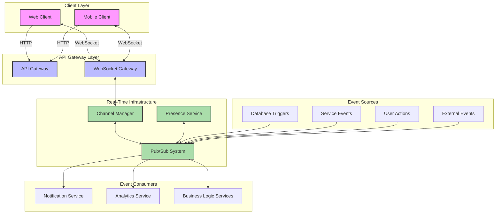

# InstaBids Real-Time Features Overview

This document provides a comprehensive overview of the real-time capabilities across the InstaBids platform. It outlines the architecture, patterns, and implementation approaches for building responsive, event-driven features that provide immediate feedback and updates to users.

## Real-Time Architecture Overview

The InstaBids platform employs a multi-layered real-time architecture that enables immediate data propagation across domains while maintaining system resilience and scalability:



### Key Components

1. **Pub/Sub System**: Central message broker based on Redis for handling real-time events
2. **WebSocket Gateway**: Manages WebSocket connections and handles authentication and authorization
3. **Channel Manager**: Organizes subscriptions into logical channels with access control
4. **Presence Service**: Tracks online/offline status of users and their activity
5. **Database Triggers**: Emit events on data changes in the database
6. **Service Events**: Events emitted by internal services based on business logic

## Real-Time Event Types

The system handles several categories of real-time events:

### System Events

| Event Type | Purpose | Example |
|------------|---------|---------|
| `system.status` | System status updates | Service outages, maintenance notifications |
| `system.config` | Configuration changes | Feature flag updates, policy changes |
| `system.broadcast` | System-wide announcements | Important announcements to all users |

### User-Specific Events

| Event Type | Purpose | Example |
|------------|---------|---------|
| `user.notification` | User notifications | New messages, bid updates, payment confirmations |
| `user.presence` | User presence changes | User comes online/goes offline |
| `user.activity` | User activity tracking | User viewing a project, typing in chat |
| `user.verification` | Verification status changes | Identity verification completed, background check updated |

### Business Domain Events

| Event Type | Purpose | Example |
|------------|---------|---------|
| `project.update` | Project changes | Project details updated, new photos added |
| `bid.new` | New bid submissions | Contractor submitted a new bid |
| `bid.update` | Bid status changes | Bid accepted, rejected, or modified |
| `payment.status` | Payment status changes | Payment processed, released from escrow |
| `job.status` | Job status updates | Job started, completed, or canceled |
| `message.new` | New messages | New message in a conversation |

## Event Format

All events in the system follow a standardized format:

```typescript
interface Event<T = any> {
  id: string;              // Unique event ID
  type: string;            // Event type (e.g., 'bid.new')
  timestamp: string;       // ISO 8601 timestamp
  source: string;          // Event source (service or component)
  subject?: string;        // Subject of the event (typically a resource ID)
  actor?: {                // Actor who caused the event (if applicable)
    id: string;            // Actor ID
    type: string;          // Actor type (user, system, etc.)
  };
  data: T;                 // Event payload (type varies by event)
  metadata?: {             // Optional metadata
    correlationId?: string; // For tracking related events
    causationId?: string;   // ID of event that caused this event
    version?: string;       // Schema version
    [key: string]: any;     // Additional metadata
  };
}
```

Example event:

```json
{
  "id": "evt_12345abcde",
  "type": "bid.new",
  "timestamp": "2025-03-19T14:30:00Z",
  "source": "bidding-service",
  "subject": "project_789",
  "actor": {
    "id": "user_456",
    "type": "contractor"
  },
  "data": {
    "bidId": "bid_101112",
    "projectId": "project_789",
    "amount": 5000,
    "description": "Complete bathroom renovation with custom tilework",
    "estimatedDuration": 14
  },
  "metadata": {
    "correlationId": "corr_13579",
    "version": "1.0"
  }
}
```

## Subscription Channels

The real-time system organizes events into logical channels that clients can subscribe to:

### User-Specific Channels

- `user:{userId}`: Personal events for a specific user
- `user:{userId}:notifications`: User's notifications
- `user:{userId}:messages`: User's messages across all conversations

### Resource-Specific Channels

- `project:{projectId}`: Events related to a specific project
- `bid:{bidId}`: Events related to a specific bid
- `conversation:{conversationId}`: Events in a specific conversation
- `job:{jobId}`: Events related to a specific job

### Group Channels

- `group:{groupId}`: Events related to a group bidding group
- `team:{teamId}`: Events related to a contractor team

### Domain-Wide Channels

- `domain:projects`: Public project-related events
- `domain:bids`: Public bid-related events
- `domain:marketplace`: Public marketplace events

## Client Implementation

### Web Client

Web clients connect to the real-time system using WebSockets with the following approach:

```typescript
// Real-time client implementation for web
import { RealtimeClient } from '@instabids/realtime-client';

class RealtimeService {
  private client: RealtimeClient;
  private subscriptions: Map<string, () => void> = new Map();
  
  constructor() {
    this.client = new RealtimeClient({
      url: import.meta.env.VITE_REALTIME_URL,
      authProvider: () => this.getAuthToken(),
    });
    
    this.client.onConnect(() => {
      console.log('Connected to real-time system');
      this.resubscribeToSavedChannels();
    });
    
    this.client.onDisconnect(() => {
      console.log('Disconnected from real-time system');
    });
    
    this.client.onError((error) => {
      console.error('Real-time connection error', error);
    });
  }
  
  private async getAuthToken(): Promise<string> {
    // Get the current access token from auth service
    return AuthService.getAccessToken();
  }
  
  public connect(): void {
    this.client.connect();
  }
  
  public disconnect(): void {
    this.client.disconnect();
  }
  
  public subscribe<T>(channel: string, eventType: string, callback: (data: T) => void): () => void {
    const unsubscribe = this.client.subscribe(channel, eventType, callback);
    this.subscriptions.set(`${channel}:${eventType}`, unsubscribe);
    return unsubscribe;
  }
  
  public unsubscribe(channel: string, eventType: string): void {
    const key = `${channel}:${eventType}`;
    const unsubscribe = this.subscriptions.get(key);
    if (unsubscribe) {
      unsubscribe();
      this.subscriptions.delete(key);
    }
  }
  
  private resubscribeToSavedChannels(): void {
    // Resubscribe to channels after reconnection
    // Implementation depends on how subscriptions are stored
  }
  
  // Presence features
  public setPresence(status: 'online' | 'away' | 'offline', metadata?: Record<string, any>): void {
    this.client.setPresence(status, metadata);
  }
  
  public getPresence(channel: string): Record<string, any>[] {
    return this.client.getPresence(channel);
  }
  
  public onPresenceChange(channel: string, callback: (presenceData: Record<string, any>[]) => void): () => void {
    return this.client.onPresenceChange(channel, callback);
  }
}

// Usage example
const realtime = new RealtimeService();
realtime.connect();

// Subscribe to a project's updates
const unsubscribe = realtime.subscribe<ProjectUpdateEvent>(
  `project:${projectId}`,
  'project.update',
  (event) => {
    console.log('Project updated:', event);
    updateProjectUI(event.data);
  }
);

// Set user presence
realtime.setPresence('online', {
  lastActivity: new Date().toISOString(),
  currentView: 'project-details',
  projectId: 'project_123'
});

// Cleanup
onUnmount(() => {
  unsubscribe();
  realtime.disconnect();
});
```

### Mobile Client

Mobile clients have additional considerations for battery life, background operation, and connectivity:

```typescript
// React Native implementation
import { RealtimeClient } from '@instabids/realtime-client-native';
import { AppState } from 'react-native';
import NetInfo from '@react-native-community/netinfo';

class MobileRealtimeService {
  private client: RealtimeClient;
  private appState: string = AppState.currentState;
  private isConnected: boolean = true;
  private pendingEvents: Array<{ channel: string, event: any }> = [];
  private reconnectTimeout: any = null;
  
  constructor() {
    this.client = new RealtimeClient({
      url: Config.REALTIME_URL,
      authProvider: () => this.getAuthToken(),
      connectionOptions: {
        // Mobile-optimized options
        heartbeatInterval: 30000, // 30 seconds
        reconnectDelay: 5000,     // Start with 5 second delay
        maxReconnectDelay: 60000, // Max 1 minute between retries
        timeout: 10000,           // Connection timeout
      }
    });
    
    // Setup listeners for app state changes
    AppState.addEventListener('change', this.handleAppStateChange);
    
    // Monitor network connectivity
    NetInfo.addEventListener(state => {
      this.isConnected = state.isConnected ?? false;
      this.handleConnectivityChange();
    });
  }
  
  private handleAppStateChange = (nextAppState: string) => {
    if (this.appState === 'active' && nextAppState.match(/inactive|background/)) {
      // App is going to background
      this.optimizeForBackground();
    } else if (nextAppState === 'active') {
      // App is coming to foreground
      this.optimizeForForeground();
    }
    
    this.appState = nextAppState;
  };
  
  private optimizeForBackground() {
    // Reduce realtime activity when app is in background
    this.client.setBackgroundMode(true);
    
    // Unsubscribe from non-critical channels
    this.unsubscribeFromNonCriticalChannels();
    
    // Switch to push notifications for important events
    this.enablePushNotificationFallback();
  }
  
  private optimizeForForeground() {
    // Resume normal realtime operations
    this.client.setBackgroundMode(false);
    
    // Resubscribe to all needed channels
    this.resubscribeToAllChannels();
    
    // Sync missed events
    this.syncMissedEvents();
  }
  
  private handleConnectivityChange() {
    if (this.isConnected) {
      // Network is available, try to reconnect
      this.reconnect();
    } else {
      // Network is unavailable, prepare for offline mode
      this.prepareForOffline();
    }
  }
  
  private prepareForOffline() {
    // Clear any pending reconnect attempts
    if (this.reconnectTimeout) {
      clearTimeout(this.reconnectTimeout);
      this.reconnectTimeout = null;
    }
    
    // Disconnect client (if not already disconnected)
    this.client.disconnect();
    
    // Enable local event queue for offline events
    this.enableLocalEventQueue();
  }
  
  private reconnect() {
    if (this.reconnectTimeout) {
      clearTimeout(this.reconnectTimeout);
    }
    
    this.reconnectTimeout = setTimeout(() => {
      this.client.connect();
    }, 1000); // Small delay to avoid immediate reconnection
  }
  
  private enableLocalEventQueue() {
    // Set up queue for events that would be sent when back online
    // Implementation depends on offline capabilities needed
  }
  
  // Other methods similar to web client but with mobile optimizations
  // ...
}
```

## Server-Side Event Processing

### Event Publishing

Services can publish events to the real-time system using the following pattern:

```typescript
// Event publishing from a service
import { EventPublisher } from '@instabids/events';

class BiddingService {
  private eventPublisher: EventPublisher;
  
  constructor(eventPublisher: EventPublisher) {
    this.eventPublisher = eventPublisher;
  }
  
  async createBid(bidData: BidCreateInput, userId: string): Promise<Bid> {
    // Business logic to create a bid
    const bid = await this.bidRepository.create(bidData);
    
    // Publish real-time event
    await this.eventPublisher.publish({
      type: 'bid.new',
      source: 'bidding-service',
      subject: bidData.projectId,
      actor: {
        id: userId,
        type: 'contractor'
      },
      data: {
        bidId: bid.id,
        projectId: bid.projectId,
        amount: bid.amount,
        description: bid.description,
        estimatedDuration: bid.estimatedDuration
      }
    });
    
    return bid;
  }
}
```

### Database Triggers

PostgreSQL triggers are used to automatically publish events when database changes occur:

```sql
-- Example trigger function for publishing events on data changes
CREATE OR REPLACE FUNCTION notify_project_update()
RETURNS TRIGGER AS $$
DECLARE
  payload JSONB;
BEGIN
  payload = jsonb_build_object(
    'id', gen_random_uuid(),
    'type', 'project.update',
    'timestamp', now(),
    'source', 'database',
    'subject', NEW.id,
    'data', jsonb_build_object(
      'projectId', NEW.id,
      'title', NEW.title,
      'status', NEW.status,
      'updatedAt', NEW.updated_at
    )
  );
  
  -- Publish to PostgreSQL notification channel
  PERFORM pg_notify('realtime_events', payload::text);
  
  RETURN NEW;
END;
$$ LANGUAGE plpgsql;

-- Attach trigger to projects table
CREATE TRIGGER project_update_trigger
AFTER UPDATE ON projects
FOR EACH ROW
EXECUTE FUNCTION notify_project_update();
```

### Event Consumers

Services can also consume events to perform side effects:

```typescript
// Event consumer example
import { EventConsumer } from '@instabids/events';

class NotificationService {
  private eventConsumer: EventConsumer;
  
  constructor(eventConsumer: EventConsumer) {
    this.eventConsumer = eventConsumer;
    
    // Subscribe to events
    this.eventConsumer.subscribe('bid.new', this.handleNewBid.bind(this));
    this.eventConsumer.subscribe('project.update', this.handleProjectUpdate.bind(this));
  }
  
  private async handleNewBid(event: Event): Promise<void> {
    // Extract project owner from the event or lookup
    const projectOwnerId = await this.projectService.getProjectOwnerId(event.data.projectId);
    
    // Create notification for project owner
    await this.createNotification({
      userId: projectOwnerId,
      type: 'new_bid',
      title: 'New Bid Received',
      message: `You received a new bid of $${event.data.amount} for your project.`,
      data: {
        bidId: event.data.bidId,
        projectId: event.data.projectId,
        amount: event.data.amount
      }
    });
  }
  
  // Other event handlers...
}
```

## Presence and User Activity

The Presence service tracks user online status and activity:

```typescript
// Presence implementation
interface PresenceInfo {
  userId: string;
  status: 'online' | 'away' | 'offline';
  lastActivity: string; // ISO timestamp
  metadata?: Record<string, any>;
}

class PresenceService {
  private readonly redis: Redis;
  private readonly expirationSeconds: number = 60; // Presence expires after 60 seconds of inactivity
  
  constructor(redis: Redis) {
    this.redis = redis;
  }
  
  async updatePresence(userId: string, status: 'online' | 'away' | 'offline', metadata?: Record<string, any>): Promise<void> {
    const presence: PresenceInfo = {
      userId,
      status,
      lastActivity: new Date().toISOString(),
      metadata
    };
    
    // Store in Redis with expiration
    await this.redis.setex(`presence:${userId}`, this.expirationSeconds, JSON.stringify(presence));
    
    // Publish presence change event
    await this.redis.publish('presence-channel', JSON.stringify({
      type: 'presence.update',
      data: presence
    }));
  }
  
  async getPresence(userId: string): Promise<PresenceInfo | null> {
    const presence = await this.redis.get(`presence:${userId}`);
    return presence ? JSON.parse(presence) : null;
  }
  
  async getChannelPresence(channel: string): Promise<PresenceInfo[]> {
    // Get all users subscribed to the channel
    const userIds = await this.redis.smembers(`channel:${channel}:users`);
    
    // Get presence info for each user
    const presencePromises = userIds.map(userId => this.getPresence(userId));
    const presenceResults = await Promise.all(presencePromises);
    
    // Filter out null results (users with expired presence)
    return presenceResults.filter(Boolean) as PresenceInfo[];
  }
  
  // Channel subscription tracking
  async subscribeToChannel(channel: string, userId: string): Promise<void> {
    await this.redis.sadd(`channel:${channel}:users`, userId);
    await this.redis.sadd(`user:${userId}:channels`, channel);
  }
  
  async unsubscribeFromChannel(channel: string, userId: string): Promise<void> {
    await this.redis.srem(`channel:${channel}:users`, userId);
    await this.redis.srem(`user:${userId}:channels`, channel);
  }
}
```

## Performance Optimization

The real-time system implements several optimizations to maintain performance:

### Connection Pooling

```typescript
// WebSocket connection pool management
class WebSocketPoolManager {
  private readonly maxConnectionsPerWorker: number = 5000;
  private readonly workerConnections: Map<string, number> = new Map();
  
  registerWorker(workerId: string): void {
    this.workerConnections.set(workerId, 0);
  }
  
  unregisterWorker(workerId: string): void {
    this.workerConnections.delete(workerId);
  }
  
  getWorkerForNewConnection(): string | null {
    // Find worker with fewest connections
    let selectedWorker: string | null = null;
    let minConnections = Infinity;
    
    for (const [workerId, connectionCount] of this.workerConnections.entries()) {
      if (connectionCount < minConnections && connectionCount < this.maxConnectionsPerWorker) {
        selectedWorker = workerId;
        minConnections = connectionCount;
      }
    }
    
    return selectedWorker;
  }
  
  incrementWorkerConnections(workerId: string): void {
    const current = this.workerConnections.get(workerId) || 0;
    this.workerConnections.set(workerId, current + 1);
  }
  
  decrementWorkerConnections(workerId: string): void {
    const current = this.workerConnections.get(workerId) || 0;
    this.workerConnections.set(workerId, Math.max(0, current - 1));
  }
}
```

### Event Batching

```typescript
// Event batching for high-frequency updates
class EventBatcher<T> {
  private readonly maxBatchSize: number = 100;
  private readonly maxWaitTimeMs: number = 200;
  private readonly batchCallback: (events: T[]) => Promise<void>;
  
  private batch: T[] = [];
  private timeoutId: NodeJS.Timeout | null = null;
  
  constructor(batchCallback: (events: T[]) => Promise<void>) {
    this.batchCallback = batchCallback;
  }
  
  add(event: T): void {
    this.batch.push(event);
    
    if (this.batch.length >= this.maxBatchSize) {
      this.flush();
    } else if (!this.timeoutId) {
      this.timeoutId = setTimeout(() => this.flush(), this.maxWaitTimeMs);
    }
  }
  
  async flush(): Promise<void> {
    if (this.timeoutId) {
      clearTimeout(this.timeoutId);
      this.timeoutId = null;
    }
    
    if (this.batch.length === 0) {
      return;
    }
    
    const batchToProcess = [...this.batch];
    this.batch = [];
    
    try {
      await this.batchCallback(batchToProcess);
    } catch (error) {
      console.error('Error processing batch:', error);
      // Handle error (retry, log, etc.)
    }
  }
}
```

### Selective Subscription

The system supports selective subscription to reduce unnecessary traffic:

```typescript
// Event filter for selective subscription
class EventFilter {
  applyFilter(subscriptionOptions: SubscriptionOptions, event: Event): boolean {
    // Check channel match
    if (subscriptionOptions.channel && !this.channelMatches(subscriptionOptions.channel, event)) {
      return false;
    }
    
    // Check event type match
    if (subscriptionOptions.eventTypes && subscriptionOptions.eventTypes.length > 0) {
      if (!subscriptionOptions.eventTypes.includes(event.type)) {
        return false;
      }
    }
    
    // Check custom filter expression
    if (subscriptionOptions.filter) {
      return this.evaluateFilterExpression(subscriptionOptions.filter, event);
    }
    
    return true;
  }
  
  private channelMatches(channelPattern: string, event: Event): boolean {
    // Implement channel matching logic
    // Support wildcards, e.g., "project:*" matches all project channels
    // ...
    return true; // Simplified for example
  }
  
  private evaluateFilterExpression(filter: FilterExpression, event: Event): boolean {
    // Evaluate custom filter expression
    // Support conditions like { "data.amount": { gt: 1000 } }
    // ...
    return true; // Simplified for example
  }
}
```

## Security Considerations

### Authentication and Authorization

Real-time connections are secured through:

1. **Initial Authentication**: WebSocket connections require a valid JWT token
2. **Channel Authorization**: Subscription requests are validated against user permissions
3. **Token Refresh**: Long-lived connections periodically refresh authentication

```typescript
// Authorization middleware for WebSocket connections
class WebSocketAuthMiddleware {
  verifyConnection(request: WebSocketRequest, token: string): Promise<User | null> {
    try {
      // Verify JWT token
      const decoded = jwt.verify(token, process.env.JWT_SECRET);
      
      // Get user information
      return this.userService.findById(decoded.sub);
    } catch (error) {
      console.error('WebSocket authentication error:', error);
      return null;
    }
  }
  
  async authorizeChannelSubscription(user: User, channel: string): Promise<boolean> {
    // Check if user can subscribe to the channel
    const [resourceType, resourceId] = channel.split(':');
    
    switch (resourceType) {
      case 'user':
        // Users can only subscribe to their own user channel
        return user.id === resourceId;
        
      case 'project':
        // Check if user has access to the project
        return this.projectService.hasAccess(resourceId, user.id);
        
      case 'conversation':
        // Check if user is a participant in the conversation
        return this.conversationService.isParticipant(resourceId, user.id);
        
      // Other resource types...
      
      default:
        return false;
    }
  }
}
```

### Rate Limiting

Rate limiting prevents abuse of real-time connections:

```typescript
// Rate limiting for WebSocket connections
class WebSocketRateLimiter {
  private readonly redis: Redis;
  private readonly limits: {
    connection: { max: number, window: number }, // max connections per window
    subscription: { max: number, window: number }, // max subscriptions per window
    message: { max: number, window: number }, // max messages per window
  };
  
  constructor(redis: Redis) {
    this.redis = redis;
    this.limits = {
      connection: { max: 10, window: 60 }, // 10 connections per minute
      subscription: { max: 50, window: 60 }, // 50 subscriptions per minute
      message: { max: 100, window: 60 }, // 100 messages per minute
    };
  }
  
  async checkConnectionLimit(userId: string): Promise<boolean> {
    return this.checkLimit(`connection:${userId}`, this.limits.connection.max, this.limits.connection.window);
  }
  
  async checkSubscriptionLimit(userId: string): Promise<boolean> {
    return this.checkLimit(`subscription:${userId}`, this.limits.subscription.max, this.limits.subscription.window);
  }
  
  async checkMessageLimit(userId: string): Promise<boolean> {
    return this.checkLimit(`message:${userId}`, this.limits.message.max, this.limits.message.window);
  }
  
  private async checkLimit(key: string, max: number, window: number): Promise<boolean> {
    const count = await this.redis.incr(key);
    
    // Set expiration on first increment
    if (count === 1) {
      await this.redis.expire(key, window);
    }
    
    return count <= max;
  }
}
```

## Monitoring and Metrics

The real-time system collects the following metrics:

### Connection Metrics

- Active connections
- Connection rate
- Connection duration
- Connection errors
- Disconnection reasons

### Message Metrics

- Messages per second (in/out)
- Message size distribution
- Message delivery latency
- Failed message deliveries

### Subscription Metrics

- Active subscriptions per channel
- Subscription rate
- Channel popularity

### Performance Metrics

- WebSocket server CPU/memory usage
- Redis pub/sub throughput
- Event processing time

```typescript
// Metrics collection example
class RealTimeMetrics {
  private readonly metricsClient: MetricsClient;
  
  constructor(metricsClient: MetricsClient) {
    this.metricsClient = metricsClient;
  }
  
  recordConnection(userId: string, connectionId: string): void {
    this.metricsClient.increment('realtime.connections.active');
    this.metricsClient.increment('realtime.connections.total');
  }
  
  recordDisconnection(userId: string, connectionId: string, reason: string, durationMs: number): void {
    this.metricsClient.decrement('realtime.connections.active');
    this.metricsClient.histogram('realtime.connections.duration', durationMs);
    this.metricsClient.increment(`realtime.disconnections.reasons.${reason}`);
  }
  
  recordSubscription(channel: string): void {
    this.metricsClient.increment('realtime.subscriptions.active');
    this.metricsClient.increment(`realtime.subscriptions.channels.${channel}`);
  }
  
  recordUnsubscription(channel: string): void {
    this.metricsClient.decrement('realtime.subscriptions.active');
    this.metricsClient.decrement(`realtime.subscriptions.channels.${channel}`);
  }
  
  recordMessageSent(channel: string, size: number): void {
    this.metricsClient.increment('realtime.messages.sent');
    this.metricsClient.increment(`realtime.messages.channels.${channel}.sent`);
    this.metricsClient.histogram('realtime.messages.size', size);
  }
  
  recordMessageDelivery(deliveryTimeMs: number): void {
    this.metricsClient.histogram('realtime.messages.delivery_time', deliveryTimeMs);
  }
  
  recordMessageError(channel: string, errorType: string): void {
    this.metricsClient.increment('realtime.messages.errors');
    this.metricsClient.increment(`realtime.messages.errors.${errorType}`);
  }
}
```

## Implementation by Domain

Each domain in InstaBids uses real-time features in specific ways:

### Bidding System

- Real-time bid notifications
- Bid status updates
- Group bidding coordination
- Live bid statistics updates

### Project Management

- Project status updates
- Task assignments and updates
- Timeline changes
- Document and photo additions

### Labor Marketplace

- Helper location tracking
- Job status updates
- Work verification events
- Rating and review notifications

### Messaging

- Real-time message delivery
- Typing indicators
- Read receipts
- Chat presence

### Payment System

- Payment status updates
- Milestone completion notifications
- Escrow release events
- Dispute resolution updates

## Fallback Mechanisms

For clients with limited connectivity, the system provides fallbacks:

1. **Progressive Enhancement**: Basic functionality works without real-time features
2. **Polling Fall
