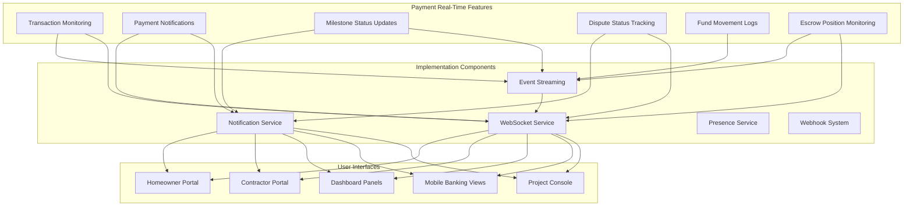
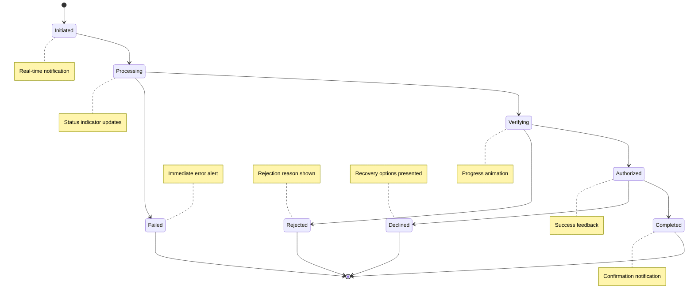
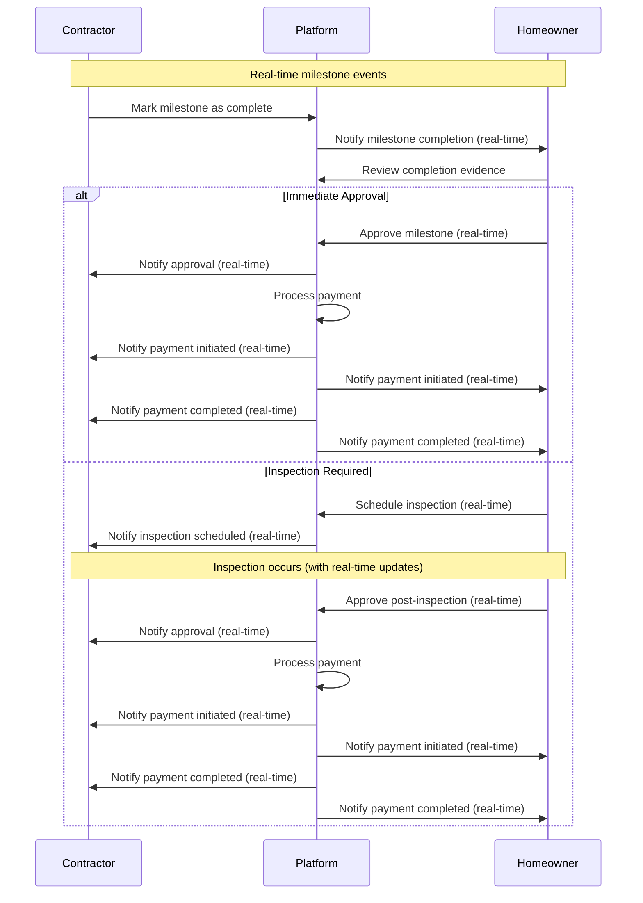
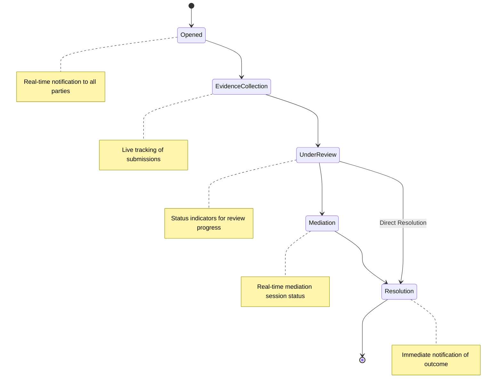
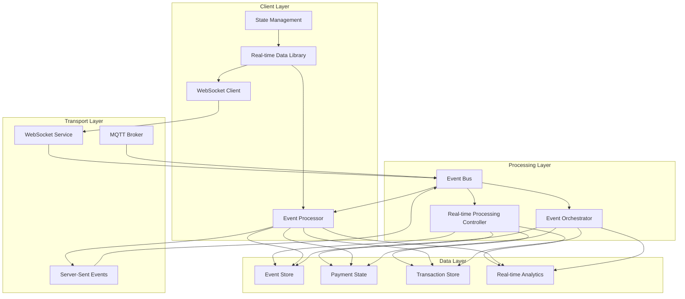
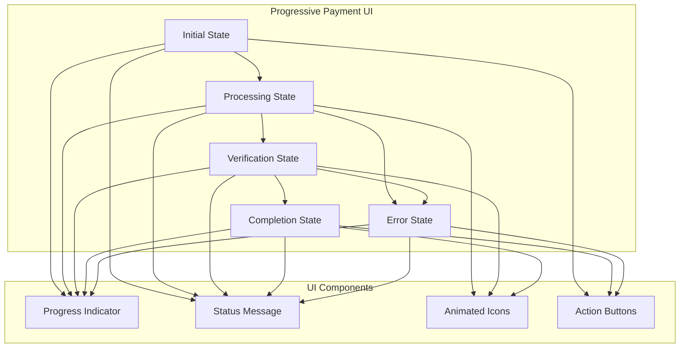
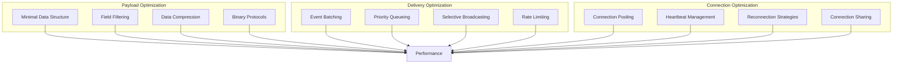
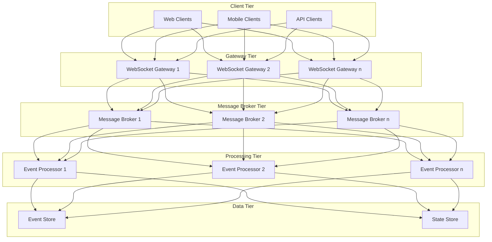

# Payment Processing Real-Time Features

This document outlines the real-time features, capabilities, and implementation for the Payment Processing domain of the InstaBids platform. It defines how users interact with payment processes in real-time, receive live updates, and benefit from immediate feedback during financial transactions.

## Overview

Real-time payment features enable instant visibility into transaction status, immediate notifications of financial events, and responsive payment workflows. These capabilities are essential for building trust in the platform's financial operations and enabling users to make timely decisions based on current payment information.



## Key Real-Time Capabilities

### 1. Transaction Monitoring

Users can monitor financial transactions as they happen, with real-time updates on status changes and processing steps.

| Feature | Description | User Types | Implementation |
|---------|-------------|------------|----------------|
| Live Transaction Status | Real-time status updates for in-progress payments | All | WebSocket events with transaction state changes |
| Processing Step Indicators | Visual indicators showing current step in payment processing | All | Event-driven UI state updates |
| Transaction Timeline | Real-time updating timeline of transaction events | All | Incremental timeline updates via WebSocket |
| Error Notifications | Immediate alerts for failed or rejected transactions | All | Push notifications and in-app alerts |
| Fund Movement Visualization | Visual representation of funds moving between accounts | All | Animated UI components triggered by events |

#### Transaction Status Flow



### 2. Milestone Payment Monitoring

Contractors and homeowners can track milestone payment statuses in real-time, improving transparency and reducing payment disputes.

| Feature | Description | User Types | Implementation |
|---------|-------------|------------|----------------|
| Milestone Status Tracker | Real-time updates on milestone payment status | Contractors, Homeowners | WebSocket events for status changes |
| Escrow Fund Monitoring | Live view of funds held in escrow for milestones | Contractors, Homeowners | Periodic updates via secure channel |
| Release Authorization Tracking | Real-time updates during release authorization process | Contractors, Homeowners | Step-by-step status via WebSocket |
| Milestone Completion Verification | Live progress of verification process | Contractors, Homeowners | Event-driven status updates |
| Payment Receipt Confirmation | Instant confirmation when funds are received | Contractors | Push notifications and in-app alerts |

#### Milestone Payment Release Flow



### 3. Dispute Resolution Tracking

Users can follow the progress of payment disputes in real-time, with live updates on resolution steps and outcomes.

| Feature | Description | User Types | Implementation |
|---------|-------------|------------|----------------|
| Dispute Status Tracker | Real-time updates on dispute resolution process | All involved parties | WebSocket events for status changes |
| Evidence Submission Tracking | Live updates on evidence submission and review | All involved parties | Event-driven status updates |
| Resolution Timeline | Real-time updating timeline of resolution steps | All involved parties | Incremental timeline updates |
| Mediation Session Monitoring | Live status during mediation sessions | All involved parties | Presence indicators and status updates |
| Resolution Notification | Instant notification of dispute resolution | All involved parties | Push notifications and in-app alerts |

#### Dispute Resolution Flow



### 4. Financial Dashboard Updates

Real-time updating financial dashboards provide users with current information on their financial position within the platform.

| Feature | Description | User Types | Implementation |
|---------|-------------|------------|----------------|
| Balance Updates | Real-time updates to account balances | All | WebSocket events for balance changes |
| Pending Transaction Indicators | Live indicators for pending transactions | All | Event-driven status updates |
| Payment Due Alerts | Real-time countdown and alerts for upcoming payments | All | Time-based notifications |
| Earnings Tracker | Live updates to earnings as payments are processed | Contractors | WebSocket events for payment completion |
| Budget Utilization | Real-time updates to project budget utilization | Homeowners | Event-driven progress indicators |

### 5. Payment Method Status Monitoring

Users receive instant feedback on payment method status changes and verification processes.

| Feature | Description | User Types | Implementation |
|---------|-------------|------------|----------------|
| Verification Status | Real-time updates during payment method verification | All | WebSocket events for status changes |
| Card Authorization Status | Live tracking of card authorization processes | All | Event-driven status updates |
| Bank Connection Status | Real-time monitoring of bank connection status | All | Connection state events via WebSocket |
| Payment Method Health | Instant alerts for expiring or problematic payment methods | All | Proactive status monitoring and alerts |
| Automatic Retry Status | Live updates during automatic payment retry processes | All | WebSocket events for retry attempts |

## Real-Time Event Types

The Payment Processing domain publishes and consumes a variety of real-time events to enable instant updates and responsive user experiences.

### Published Events

| Event | Description | Data Payload | Consumers |
|-------|-------------|--------------|-----------|
| `payment.started` | Payment process has been initiated | `{ paymentId, amount, currency, timestamp, payerId, payeeId }` | User interfaces, Notification service |
| `payment.status_updated` | Payment status has changed | `{ paymentId, previousStatus, newStatus, timestamp }` | User interfaces, Notification service, Project Management |
| `payment.completed` | Payment has been completed successfully | `{ paymentId, amount, currency, timestamp, transactionId }` | User interfaces, Notification service, Project Management |
| `payment.failed` | Payment has failed | `{ paymentId, errorCode, errorMessage, timestamp }` | User interfaces, Notification service, Project Management |
| `milestone.funded` | Milestone escrow has been funded | `{ milestoneId, projectId, amount, timestamp }` | User interfaces, Notification service, Project Management |
| `milestone.released` | Milestone payment has been released | `{ milestoneId, projectId, amount, timestamp }` | User interfaces, Notification service, Project Management |
| `escrow.balance_changed` | Escrow account balance has changed | `{ escrowId, previousBalance, newBalance, reason, timestamp }` | User interfaces, Financial dashboards |
| `dispute.status_updated` | Dispute status has changed | `{ disputeId, previousStatus, newStatus, timestamp }` | User interfaces, Notification service, Messaging |
| `payment_method.status_changed` | Payment method status has changed | `{ methodId, userId, previousStatus, newStatus, timestamp }` | User interfaces, Notification service |

### Subscribed Events

| Event | Description | Publisher | Handler Action |
|-------|-------------|-----------|---------------|
| `project.milestone_completed` | Project milestone marked as complete | Project Management | Initiate milestone payment release process |
| `project.milestone_approved` | Project milestone approved by homeowner | Project Management | Release milestone payment from escrow |
| `bid.accepted` | Bid has been accepted | Bidding System | Configure payment schedule and escrow accounts |
| `contract.signed` | Contract has been signed by all parties | Project Management | Activate payment schedule and funding requirements |
| `user.payment_method_added` | User has added a new payment method | User Management | Begin verification process for new payment method |
| `helper.hours_submitted` | Helper has submitted work hours | Labor Marketplace | Initiate helper payment calculation |
| `dispute.evidence_submitted` | New evidence submitted for dispute | Dispute Management | Update dispute review status |

## Implementation Architecture

### Real-Time Technology Stack



#### Technology Components

1. **WebSocket Service**
   - Secure WebSocket connections (wss://)
   - Binary protocol for efficient data transfer
   - Message compression for bandwidth optimization
   - Connection pooling for scalability

2. **Event Bus**
   - Distributed event routing system
   - Topic-based subscription model
   - Event prioritization system
   - Dead letter queue for failed event processing

3. **State Synchronization**
   - Optimistic UI updates with confirmation
   - Conflict resolution strategies
   - Delta-based updates to minimize bandwidth
   - State reconciliation mechanism

4. **Event Store**
   - Append-only event log
   - Event sourcing for payment state reconstruction
   - Temporal querying capabilities
   - Immutable audit trail

### Client Implementation

```typescript
// Example: TypeScript client implementation for real-time payment updates
class PaymentRealTimeClient {
  private socket: WebSocket;
  private eventHandlers: Map<string, Function[]> = new Map();
  private reconnectAttempts = 0;
  private maxReconnectAttempts = 5;
  private reconnectDelay = 1000; // Start with 1 second
  
  constructor(private userId: string, private authToken: string) {
    this.connect();
  }
  
  private connect() {
    // Secure connection with authentication
    this.socket = new WebSocket(`wss://api.instabids.com/payments/realtime?token=${this.authToken}`);
    
    this.socket.onopen = () => {
      console.log('Payment real-time connection established');
      this.reconnectAttempts = 0;
      this.reconnectDelay = 1000;
      
      // Subscribe to user-specific payment events
      this.sendMessage({
        type: 'subscribe',
        channels: [
          `user.${this.userId}.payments`,
          `user.${this.userId}.milestones`,
          `user.${this.userId}.payment_methods`
        ]
      });
    };
    
    this.socket.onmessage = (event) => {
      try {
        const message = JSON.parse(event.data);
        this.handleMessage(message);
      } catch (error) {
        console.error('Error parsing real-time payment message', error);
      }
    };
    
    this.socket.onclose = (event) => {
      console.log('Payment real-time connection closed', event.code, event.reason);
      
      // Implement exponential backoff for reconnection
      if (this.reconnectAttempts < this.maxReconnectAttempts) {
        setTimeout(() => {
          this.reconnectAttempts++;
          this.reconnectDelay *= 2; // Exponential backoff
          this.connect();
        }, this.reconnectDelay);
      }
    };
    
    this.socket.onerror = (error) => {
      console.error('Payment real-time connection error', error);
    };
  }
  
  private sendMessage(message: any) {
    if (this.socket.readyState === WebSocket.OPEN) {
      this.socket.send(JSON.stringify(message));
    }
  }
  
  private handleMessage(message: any) {
    const eventType = message.type;
    const handlers = this.eventHandlers.get(eventType) || [];
    
    handlers.forEach(handler => {
      try {
        handler(message.data);
      } catch (error) {
        console.error(`Error in handler for ${eventType}`, error);
      }
    });
  }
  
  // Public API
  public on(eventType: string, handler: Function) {
    const handlers = this.eventHandlers.get(eventType) || [];
    handlers.push(handler);
    this.eventHandlers.set(eventType, handlers);
    return this;
  }
  
  public off(eventType: string, handler?: Function) {
    if (!handler) {
      // Remove all handlers for this event
      this.eventHandlers.delete(eventType);
    } else {
      // Remove specific handler
      const handlers = this.eventHandlers.get(eventType) || [];
      const index = handlers.indexOf(handler);
      if (index >= 0) {
        handlers.splice(index, 1);
        this.eventHandlers.set(eventType, handlers);
      }
    }
    return this;
  }
  
  public subscribeToPayment(paymentId: string) {
    this.sendMessage({
      type: 'subscribe',
      channels: [`payment.${paymentId}`]
    });
    return this;
  }
  
  public subscribeToMilestone(milestoneId: string) {
    this.sendMessage({
      type: 'subscribe',
      channels: [`milestone.${milestoneId}`]
    });
    return this;
  }
  
  public subscribeToDispute(disputeId: string) {
    this.sendMessage({
      type: 'subscribe',
      channels: [`dispute.${disputeId}`]
    });
    return this;
  }
  
  public disconnect() {
    this.socket.close();
  }
}

// Usage example
const paymentClient = new PaymentRealTimeClient('user-123', 'auth-token');

// Listen for specific payment events
paymentClient.on('payment.status_updated', (data) => {
  console.log(`Payment ${data.paymentId} status changed to ${data.newStatus}`);
  // Update UI with new status
  updatePaymentStatusUI(data.paymentId, data.newStatus);
});

// Subscribe to specific payment
paymentClient.subscribeToPayment('payment-456');

// Subscribe to specific milestone
paymentClient.subscribeToMilestone('milestone-789');
```

### Server Implementation

```typescript
// Example: TypeScript server implementation for payment real-time updates
import { WebSocketServer } from 'ws';
import { verifyAuthToken } from './auth';
import { EventEmitter } from 'events';

// Global event bus
const eventBus = new EventEmitter();

// WebSocket server
const wss = new WebSocketServer({ 
  server, // HTTP server instance
  path: '/payments/realtime',
  clientTracking: true
});

// Client connections map
const clients = new Map();

// Handle new WebSocket connections
wss.on('connection', async (ws, req) => {
  try {
    // Extract and verify auth token
    const url = new URL(req.url, `http://${req.headers.host}`);
    const token = url.searchParams.get('token');
    
    if (!token) {
      ws.close(1008, 'Authentication required');
      return;
    }
    
    // Verify token and get user info
    const userData = await verifyAuthToken(token);
    if (!userData) {
      ws.close(1008, 'Invalid authentication');
      return;
    }
    
    // Store client information
    const clientId = userData.userId;
    clients.set(ws, {
      id: clientId,
      subscriptions: new Set([`user.${clientId}.payments`]), // Default subscription
      userData
    });
    
    // Set up ping/pong for connection health monitoring
    ws.isAlive = true;
    ws.on('pong', () => {
      ws.isAlive = true;
    });
    
    // Handle client messages
    ws.on('message', (message) => {
      try {
        const data = JSON.parse(message.toString());
        handleClientMessage(ws, data);
      } catch (error) {
        console.error('Error processing client message', error);
      }
    });
    
    // Handle client disconnection
    ws.on('close', () => {
      clients.delete(ws);
    });
    
    // Send initial state if needed
    sendInitialState(ws, userData);
    
  } catch (error) {
    console.error('WebSocket connection error', error);
    ws.close(1011, 'Server error');
  }
});

// Handle client messages
function handleClientMessage(ws, message) {
  const client = clients.get(ws);
  if (!client) return;
  
  switch (message.type) {
    case 'subscribe':
      handleSubscribe(ws, client, message);
      break;
    case 'unsubscribe':
      handleUnsubscribe(ws, client, message);
      break;
    // Other message types...
  }
}

// Handle channel subscriptions
function handleSubscribe(ws, client, message) {
  if (!Array.isArray(message.channels)) return;
  
  message.channels.forEach(channel => {
    // Validate channel subscription permissions
    if (canSubscribeToChannel(client, channel)) {
      client.subscriptions.add(channel);
    }
  });
}

// Handle channel unsubscriptions
function handleUnsubscribe(ws, client, message) {
  if (!Array.isArray(message.channels)) return;
  
  message.channels.forEach(channel => {
    client.subscriptions.delete(channel);
  });
}

// Check if client can subscribe to a channel
function canSubscribeToChannel(client, channel) {
  // User-specific channels
  if (channel.startsWith(`user.${client.id}.`)) {
    return true;
  }
  
  // Payment-specific channels
  if (channel.startsWith('payment.')) {
    const paymentId = channel.split('.')[1];
    return hasAccessToPayment(client.id, paymentId);
  }
  
  // Milestone-specific channels
  if (channel.startsWith('milestone.')) {
    const milestoneId = channel.split('.')[1];
    return hasAccessToMilestone(client.id, milestoneId);
  }
  
  // Dispute-specific channels
  if (channel.startsWith('dispute.')) {
    const disputeId = channel.split('.')[1];
    return hasAccessToDispute(client.id, disputeId);
  }
  
  return false;
}

// Broadcast event to subscribed clients
function broadcastEvent(eventType, channel, data) {
  const message = JSON.stringify({
    type: eventType,
    channel,
    data,
    timestamp: new Date().toISOString()
  });
  
  for (const [ws, client] of clients.entries()) {
    if (ws.readyState === WebSocket.OPEN && client.subscriptions.has(channel)) {
      ws.send(message);
    }
  }
}

// Integration with payment events
eventBus.on('payment.status_updated', (data) => {
  // Broadcast to payment-specific channel
  broadcastEvent('payment.status_updated', `payment.${data.paymentId}`, data);
  
  // Broadcast to user-specific channels
  broadcastEvent('payment.status_updated', `user.${data.payerId}.payments`, data);
  if (data.payeeId) {
    broadcastEvent('payment.status_updated', `user.${data.payeeId}.payments`, data);
  }
});

// Health check interval
const interval = setInterval(() => {
  wss.clients.forEach((ws) => {
    if (ws.isAlive === false) {
      clients.delete(ws);
      return ws.terminate();
    }
    
    ws.isAlive = false;
    ws.ping();
  });
}, 30000);

// Clean up on server shutdown
wss.on('close', () => {
  clearInterval(interval);
});
```

## User Experience Patterns

### 1. Progressive Loading & Status Indicators

Real-time payment interfaces use progressive loading and status indicators to provide immediate feedback during payment processes.



Guidelines for implementing progressive loading:

1. **Immediate Feedback**
   - Show status changes immediately, even before server confirmation
   - Use optimistic UI updates with fallback patterns
   - Provide clear visual indication of processing state

2. **Contextual Information**
   - Display relevant information for each payment state
   - Show estimated time to completion when available
   - Provide context-specific guidance during waiting periods

3. **Error Recovery**
   - Present clear error messages with recovery actions
   - Maintain state during error recovery attempts
   - Provide alternative payment options when appropriate

### 2. Real-Time Financial Dashboard Components

Dashboards display live financial data with automatic updates and visual indicators for changes.

| Component | Purpose | Update Frequency | Visual Indicators |
|-----------|---------|------------------|-------------------|
| Payment Activity Feed | Show recent payment activities | Real-time | Highlight new entries, animation |
| Balance Indicators | Display current account balances | Real-time | Color change, subtle animation on update |
| Payment Due Timeline | Show upcoming payment obligations | Real-time + Daily | Countdown, urgency indicators |
| Transaction Status Cards | Display status of recent transactions | Real-time | Progress indicators, status icons |
| Milestone Payment Tracker | Track milestone payment status | Real-time | Progress bars, status transitions |

### 3. Mobile-Specific Real-Time Features

Mobile applications require specialized real-time payment features to accommodate mobile usage patterns.

| Feature | Description | Implementation Considerations |
|---------|-------------|-------------------------------|
| Push Notifications | Immediate alerts for payment events | Silent vs. visible notifications based on importance |
| Background Sync | Synchronize payment data when app is in background | Battery optimization, sync frequency tuning |
| Offline Queuing | Queue payment actions during offline periods | Local data consistency, conflict resolution |
| Biometric Verification | Real-time biometric auth for transactions | Quick authentication flow for payment approval |
| Gesture-Based Controls | Swipe gestures for payment approvals/rejections | Simple, intuitive gestures with confirmation |

## Performance Considerations

### 1. Message Optimization



Key optimization strategies:

1. **Payload Size Reduction**
   - Use compact data structures (minimal field names, efficient types)
   - Filter unnecessary fields based on subscription type
   - Compress messages for larger payloads
   - Consider binary formats for high-frequency updates

2. **Selective Broadcasting**
   - Send updates only to clients who need the information
   - Implement fine-grained subscription models
   - Use delta updates for incremental changes
   - Batch non-critical updates to reduce message frequency

3. **Connection Management**
   - Implement connection sharing across features
   - Use heartbeats to maintain connection health
   - Optimize reconnection strategies with backoff
   - Consider connection pooling for server resources

### 2. Scalability Architecture



Scalability design patterns:

1. **Horizontal Scaling**
   - Stateless WebSocket gateways behind load balancers
   - Distributed message broker clusters
   - Partitioned event processors by client segment
   - Sharded data stores for state management

2. **Partition Strategies**
   - User-based partitioning for personal payment data
   - Project-based partitioning for milestone payments
   - Geographic partitioning for regional payment methods
   - Time-based partitioning for historical data

3. **Load Management**
   - Rate limiting for high-frequency clients
   - Backpressure mechanisms for traffic spikes
   - Priority queuing for critical payment events
   - Circuit breakers for dependency failures

### 3. Resource Utilization

| Resource Type | Usage Pattern | Optimization Strategy | Monitoring Metrics |
|---------------|---------------|------------------------|-------------------|
| WebSocket Connections | Long-lived, persistent | Connection pooling, session sharing | Connection count, lifetime, error rate |
| Message Processing | Burst patterns around payment events | Worker scaling, priority processing | Queue depth, processing time, error rate |
| State Management | Read-heavy with write spikes | Caching, read replicas, eventual consistency | Cache hit ratio, query time, consistency lag |
| Notification Delivery | Fan-out pattern to multiple recipients | Batching, asynchronous delivery | Delivery time, success rate, queue size |

## Integration Patterns

### 1. Integration with Notification System

Real-time payment events integrate with the platform's notification system to provide alerts across multiple
