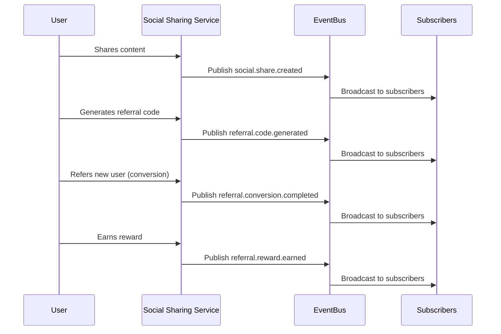
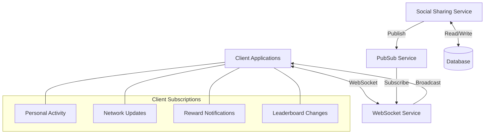
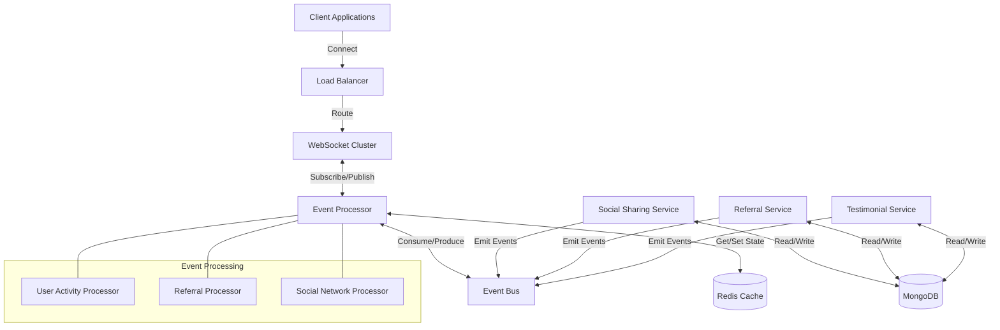
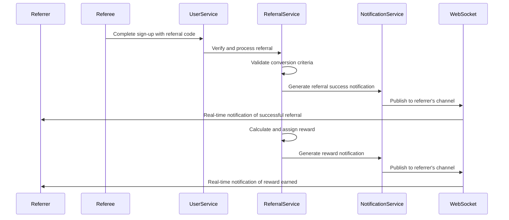
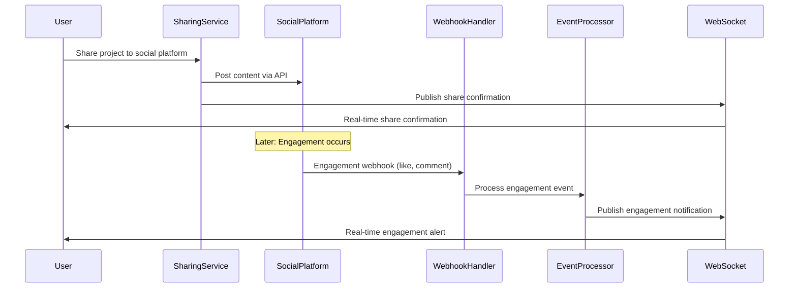

# Social Sharing & Referrals Real-time Features Specification

This document outlines the real-time capabilities, event streams, subscription models, and implementation details for the Social Sharing & Referrals domain of the InstaBids platform.

## Overview

The Social Sharing & Referrals domain requires real-time capabilities to provide immediate feedback on sharing activities, track referral conversions, and enable dynamic social interactions between users. These real-time features enhance user engagement and create a sense of community on the platform.

## Real-time Use Cases

### 1. Social Activity Notifications

| Feature | Description | Implementation Priority |
|---------|-------------|------------------------|
| Share Confirmations | Immediate confirmation when content is shared on social platforms | High |
| Engagement Alerts | Real-time notifications when shared content receives engagement | Medium |
| Referral Tracking | Immediate updates when a referred user takes qualifying actions | High |
| Reward Notifications | Instant alerts when a user earns a referral reward | High |
| Testimonial Activity | Real-time notifications when testimonials receive engagement | Low |

### 2. Social Connection Updates

| Feature | Description | Implementation Priority |
|---------|-------------|------------------------|
| Friend Join Alerts | Real-time notification when a friend joins via referral | High |
| Connection Status | Live updates when social connections are established/removed | Medium |
| Platform Activity | Real-time indicators showing friends currently active on the platform | Low |
| Collaborative Opportunities | Instant notifications of potential collaboration matches | Medium |

### 3. Dynamic Referral Elements

| Feature | Description | Implementation Priority |
|---------|-------------|------------------------|
| Live Referral Counters | Real-time updates of referral counts and conversions | High |
| Reward Progress Trackers | Live progress bars for tiered/threshold rewards | Medium |
| Leaderboard Updates | Real-time updates to referral and sharing leaderboards | Medium |
| Trending Content | Live-updating feeds of popular shared content | Low |

## Event Streams

### Published Events

The Social Sharing & Referrals domain publishes the following events to the platform's event bus:



| Event | Payload | Publishers | Subscribers | Rate |
|-------|---------|------------|-------------|------|
| `social.share.created` | `{ shareId, userId, contentType, contentId, platform, timestamp }` | Social Sharing Service | Notifications, Analytics, User Profile | ~1000/day |
| `social.share.engaged` | `{ shareId, engagementType, engagerInfo, timestamp }` | Social Platforms, API Webhooks | Notifications, Analytics, Feed Service | ~5000/day |
| `referral.code.generated` | `{ codeId, userId, programId, timestamp }` | Referral Service | Analytics, User Profile | ~500/day |
| `referral.link.clicked` | `{ referralId, sourceIp, userAgent, timestamp }` | Web/Mobile Clients | Analytics, Fraud Detection | ~2000/day |
| `referral.conversion.started` | `{ referralId, prospectId, stage, timestamp }` | User Management | Referral Service, Analytics | ~1000/day |
| `referral.conversion.completed` | `{ referralId, newUserId, referrerId, timestamp }` | User Management | Notifications, Rewards Service, Analytics | ~200/day |
| `referral.reward.earned` | `{ userId, rewardId, amount, type, timestamp }` | Rewards Service | Notifications, User Profile, Analytics | ~200/day |
| `referral.leaderboard.updated` | `{ boardId, changes: [{userId, position, delta}], timestamp }` | Referral Service | Feed Service, Notifications | ~50/day |

### Subscribed Events

The Social Sharing & Referrals domain subscribes to these events from other domains:

| Event | Source Domain | Handler | Purpose |
|-------|--------------|---------|---------|
| `user.registered` | User Management | `ReferralAttribution` | Track and attribute user registrations to referrals |
| `user.profile.updated` | User Management | `SocialConnectionUpdater` | Update social connections based on profile changes |
| `project.created` | Project Management | `ShareSuggestionGenerator` | Generate sharing suggestions for new projects |
| `project.completed` | Project Management | `TestimonialRequestor` | Trigger testimonial requests for completed projects |
| `bid.awarded` | Bidding System | `CollaborationTracker` | Track successful collaborations from referred partners |
| `message.sent.social` | Messaging | `SocialInteractionProcessor` | Process messages with social interaction context |

## Real-time Technical Implementation

### Subscription Model



#### Subscription Topics

| Topic | Pattern | Content | Access Control |
|-------|---------|---------|----------------|
| `user.{userId}.social` | User-specific social activity | Personal sharing, referral status | User-only |
| `user.{userId}.referrals` | User-specific referral activity | Referral conversions, rewards | User-only |
| `user.{userId}.network` | User's social network activity | Friend joins, social connections | User-only |
| `program.{programId}.updates` | Referral program updates | Rule changes, rewards adjustments | Program members |
| `leaderboard.{boardId}` | Leaderboard updates | Position changes, achievements | Public |
| `testimonials.recent` | Recently published testimonials | New testimonials, engagement | Public |

#### Client Connection Management

1. **Connection Establishment**
   - WebSocket connection with JWT authentication
   - Subscription preferences stored in user profile
   - Connection state tracking for reliability

2. **Connection Maintenance**
   - Heartbeat mechanism (30-second intervals)
   - Automatic reconnection with exponential backoff
   - Session resumption to prevent message loss

3. **Connection Scaling**
   - Connection pooling for high-volume topics
   - Sharded WebSocket servers by user cohorts
   - Regional deployment for latency optimization

## Performance Considerations

### Throughput Requirements

| Component | Peak Throughput | Average Throughput | Burst Capacity |
|-----------|-----------------|---------------------|---------------|
| Event Publication | 50 events/sec | 10 events/sec | 200 events/sec |
| Event Subscription | 5,000 messages/sec | 1,000 messages/sec | 20,000 messages/sec |
| WebSocket Connections | 10,000 concurrent | 2,000 concurrent | 50,000 concurrent |

### Latency Requirements

| Interaction Type | Maximum Latency | Target Latency | Measurement Point |
|------------------|-----------------|----------------|-------------------|
| Share Confirmation | 2 seconds | 500 ms | Client acknowledgment |
| Referral Notification | 5 seconds | 1 second | Cross-user delivery |
| Leaderboard Updates | 10 seconds | 3 seconds | Multi-user broadcast |
| Reward Notifications | 3 seconds | 800 ms | User notification |

### Optimization Strategies

1. **Message Batching**
   - Aggregate multiple events for bulk delivery
   - Client-side event batching for high-frequency updates
   - Server-side batching for multi-recipient messages

2. **Selective Broadcasting**
   - Interest-based filtering for targeted delivery
   - Client-side filtering for non-critical updates
   - Digest mode for low-priority notifications

3. **State Synchronization**
   - Periodic full state snapshots
   - Incremental state updates between snapshots
   - Version vectors for conflict resolution

## Offline Behavior & Resilience

### Offline Message Handling

| Scenario | Approach | Retention Policy |
|----------|----------|------------------|
| Temporary Disconnection | Queue messages for delivery upon reconnection | 24-hour message retention |
| Extended Offline Period | Store critical notifications, summarize activity | 7-day summary retention |
| Cross-Device Synchronization | Track message read/delivery status across devices | 14-day status retention |

### Resilience Patterns

1. **Circuit Breaking**
   - Detect and isolate failing components
   - Graceful degradation of real-time features
   - Automatic service recovery and resubscription

2. **Message Persistence**
   - Durable message storage for critical events
   - At-least-once delivery guarantees
   - Idempotent event handlers for safe redelivery

3. **State Recovery**
   - Periodic state snapshots for quick recovery
   - Event sourcing for complete state reconstruction
   - Version-based conflict resolution

## Security Considerations

### Real-time Data Protection

| Concern | Mitigation | Implementation |
|---------|------------|----------------|
| Message Tampering | Signed payloads with server verification | JWT-based message signatures |
| Connection Hijacking | Session-bound authentication tokens | Short-lived access tokens with refresh mechanism |
| Data Leakage | Topic-level access control | Permission checks on subscription and delivery |
| Subscription Abuse | Rate limiting and throttling | Per-user subscription limits and cool-downs |

### Privacy Controls

1. **Visibility Settings**
   - User-controlled referral attribution visibility
   - Granular social activity privacy settings
   - Activity broadcast opt-out options

2. **Anonymization Options**
   - Anonymous referral tracking mode
   - Private reward notifications
   - Incognito participation in social features

## Implementation Architecture

### Technology Stack

| Component | Technology | Justification |
|-----------|------------|---------------|
| Event Bus | Kafka | High throughput, durable storage, topic partitioning |
| Real-time Delivery | Socket.io | WebSocket with fallbacks, room-based broadcasting |
| State Management | Redis | In-memory performance, pub/sub capabilities |
| Persistence | MongoDB | Flexible schema for varied event types, sharding |
| Client SDK | Custom TypeScript | Type-safe integration, platform consistency |

### Deployment Architecture



## Testing Strategy

### Real-time Test Scenarios

| Test Type | Description | Success Criteria |
|-----------|-------------|------------------|
| Connection Stability | Sustained connection under various network conditions | <1% connection drops over 24 hours |
| Message Delivery | End-to-end message delivery testing | >99.9% delivery rate, <2s latency |
| Subscription Load | Mass subscription/unsubscription scenarios | Handle 1000 subscription changes/minute |
| Broadcast Scale | Large-scale event broadcasting | Deliver to 10,000 clients in <5 seconds |
| Offline Recovery | Message recovery after disconnection | 100% critical message delivery after reconnect |

### Monitoring & Observability

1. **Key Metrics**
   - Connection count and churn rate
   - Message delivery latency (p95, p99)
   - Subscription counts by topic
   - Event processing throughput

2. **Health Checks**
   - WebSocket server availability
   - Event processor queue depth
   - Subscription manager state
   - Message delivery confirmation rate

3. **Alerting Thresholds**
   - >5% connection failure rate
   - >2s p95 delivery latency
   - >1000 event processing backlog
   - >5% message delivery failure rate

## Progressive Enhancement

The real-time features are implemented with progressive enhancement in mind:

| Feature Level | Capabilities | Fallback | Client Support |
|---------------|--------------|----------|----------------|
| Full Real-time | WebSocket connections, live updates | - | Modern browsers, native apps |
| Polling | Regular HTTP polling for updates | Used when WebSockets unavailable | All browsers |
| Server-Rendered | Traditional request/response | Used when client-side JS disabled | Basic clients, search engines |

## Mobile Considerations

### Mobile-Specific Optimizations

1. **Battery Conservation**
   - Adaptive polling based on app state (foreground/background)
   - Batched notifications to reduce wake cycles
   - Push notification fallback for critical events

2. **Data Usage Optimization**
   - Compressed message format for mobile clients
   - Selective subscription when on cellular data
   - Delayed/digest mode for non-critical updates

3. **Offline Experience**
   - Queued sharing actions for offline users
   - Local state caching with sync on reconnection
   - Background sync for pending social actions

## Implementation Roadmap

| Phase | Timeline | Focus | Deliverables |
|-------|----------|-------|--------------|
| Phase 1 | Q2 2025 | Core Infrastructure | Event bus, WebSocket service, basic subscriptions |
| Phase 2 | Q3 2025 | Personal Notifications | User-specific referral tracking, sharing confirmations |
| Phase 3 | Q4 2025 | Social Features | Network updates, leaderboards, friend activity |
| Phase 4 | Q1 2026 | Advanced Features | Trending content, personalized recommendations |

## Integration Points

### Front-end Integration

| Client Type | Integration Method | SDK Support |
|-------------|-------------------|-------------|
| Web App | WebSocket client with reconnection logic | TypeScript SDK with React hooks |
| iOS Native | Native WebSocket client | Swift SDK with delegate pattern |
| Android Native | Native WebSocket client | Kotlin SDK with listener pattern |
| Progressive Web App | Service worker with push notifications | JavaScript SDK with worker support |

### Back-end Integration

| System | Integration Type | Purpose |
|--------|------------------|---------|
| Notification Service | Event consumer | Convert real-time events to push notifications |
| Analytics Pipeline | Event consumer | Real-time metrics and dashboard updates |
| User Service | Bi-directional | User status updates, profile synchronization |
| Content Moderation | Event filter | Real-time content filtering before broadcasting |

## Live Example Scenarios

### Scenario 1: Referral Conversion



### Scenario 2: Social Share with Engagement



## Appendix: Message Schemas

### WebSocket Message Format

```json
{
  "type": "EVENT",
  "topic": "user.123.referrals",
  "id": "msg-456789",
  "timestamp": "2025-03-15T14:30:45Z",
  "data": {
    "eventType": "referral.conversion.completed",
    "referralId": "ref-123456",
    "newUserId": "user-789",
    "programId": "program-standard",
    "rewardPending": true
  },
  "version": 1
}
```

### Subscription Request Format

```json
{
  "type": "SUBSCRIBE",
  "topics": [
    "user.123.social",
    "user.123.referrals",
    "leaderboard.weekly"
  ],
  "clientId": "device-456789",
  "options": {
    "history": 10,
    "priority": "high",
    "offlineDelivery": true
  }
}
```

### Common Event Payloads

**Share Created Event:**
```json
{
  "shareId": "share-123456",
  "userId": "user-789",
  "contentType": "project",
  "contentId": "project-456",
  "platform": "facebook",
  "shareFormat": "post",
  "timestamp": "2025-03-15T14:30:45Z",
  "metadata": {
    "message": "Check out my new renovation project!",
    "imageCount": 3,
    "visibility": "public"
  }
}
```

**Referral Conversion Event:**
```json
{
  "referralId": "ref-123456",
  "referrerId": "user-123",
  "newUserId": "user-789",
  "programId": "program-standard",
  "conversionType": "registration",
  "timestamp": "2025-03-15T14:30:45Z",
  "reward": {
    "type": "credit",
    "amount": 50.00,
    "status": "pending",
    "eligibleDate": "2025-03-30T00:00:00Z"
  }
}
