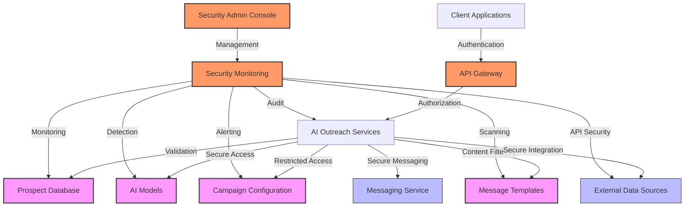
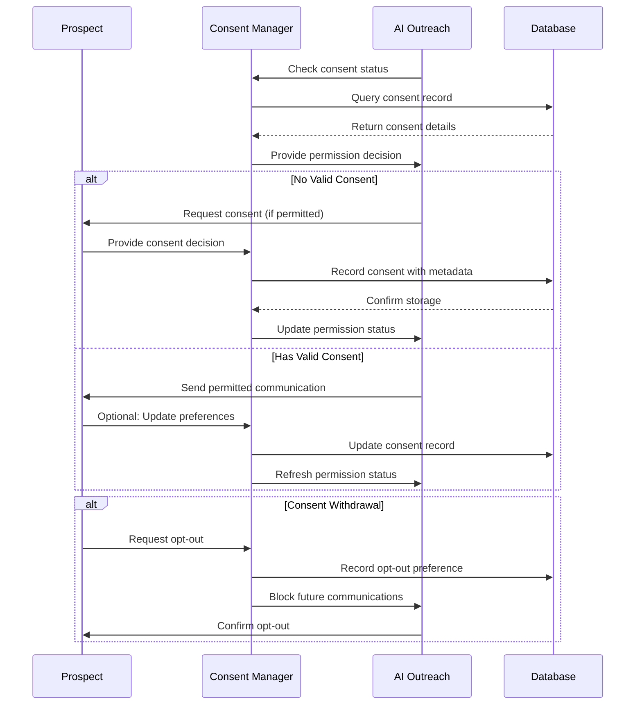

# Security Documentation: AI Outreach & Automation

This document outlines the security architecture, requirements, controls, and best practices for the AI Outreach & Automation domain of the InstaBids platform. As this domain handles sensitive contractor data and leverages AI systems for automated outreach, robust security measures are essential to protect data privacy, ensure compliance, and maintain system integrity.

## Security Considerations

The AI Outreach & Automation domain presents several unique security challenges:

1. **Personal Data Protection**: The system processes and stores personal information about contractor prospects
2. **Automated Communications**: AI-generated outreach must comply with privacy regulations and anti-spam laws
3. **AI Model Security**: Protection of proprietary AI models and training data
4. **External Data Sources**: Secure integration with third-party data providers
5. **Campaign Configuration Security**: Preventing unauthorized access to outreach campaigns
6. **Message Content Security**: Ensuring the integrity and appropriateness of outbound messages

## Security Architecture

### High-Level Security Architecture

### Authentication & Authorization

1. **Authentication Mechanism**
   - JWT-based authentication integrated with Supabase Auth
   - MFA requirement for administrative access to AI Outreach services
   - API key authentication for service-to-service communication
   - OAuth2 for third-party data provider integrations

2. **Authorization Model**
   - Role-based access control (RBAC) with predefined roles:
     - Outreach Administrator: Full access to all AI outreach features
     - Campaign Manager: Create and manage campaigns, view analytics
     - Content Manager: Create and edit message templates
     - Data Analyst: View analytics and reporting only
     - API Integration: Limited access for external services

3. **Permission Matrix**

| Resource | Outreach Admin | Campaign Manager | Content Manager | Data Analyst | API Integration |
|----------|----------------|------------------|-----------------|--------------|-----------------|
| AI Models | Configure | Access | No Access | No Access | Limited Access |
| Campaigns | Manage All | Manage Own | No Access | View Only | No Access |
| Templates | Manage All | Use | Manage All | View Only | No Access |
| Prospects | Full Access | Limited Access | No Access | Anonymized | Limited Access |
| Analytics | Full Access | Own Campaigns | No Access | Full Access | Limited Access |
| External Data | Configure | Use | No Access | No Access | Full Access |
| Outbound Messages | Approve All | Send Approved | Draft | No Access | Send Approved |

### Data Protection

1. **Data Classification**

| Data Category | Classification | Storage Requirements | Transmission Requirements |
|---------------|----------------|----------------------|---------------------------|
| Prospect Contact Info | Sensitive | Encrypted at Rest | TLS 1.3+ |
| AI Model Parameters | Confidential | Encrypted at Rest | Internal Only |
| Campaign Configurations | Internal | Standard Protection | TLS 1.2+ |
| Message Templates | Internal | Standard Protection | TLS 1.2+ |
| Analytics Data | Internal | Standard Protection | TLS 1.2+ |
| Training Data | Confidential | Encrypted at Rest | Internal Only |
| External Provider Credentials | Critical | Encrypted at Rest | TLS 1.3+ |

2. **Encryption Strategy**
   - Data at rest: AES-256 encryption for sensitive and confidential data
   - Data in transit: TLS 1.3 for all external communications
   - Field-level encryption for critical PII elements
   - Encryption key management via AWS KMS or equivalent

3. **Data Lifecycle Management**
   - Prospect data retention policy: 24 months from last interaction
   - Automated anonymization after retention period
   - Secure data deletion processes with verification
   - Backup encryption and retention aligned with main data stores

### API Security

1. **API Gateway Protection**
   - Rate limiting to prevent abuse
   - Request validation against schema
   - API versioning to manage changes
   - API key rotation policy (90-day maximum)

2. **External API Integration Security**
   - OAuth 2.0 with PKCE for third-party authentication
   - Credential storage in secrets management service
   - Just-in-time credential access
   - API response validation to prevent injection attacks

## Secure Development Practices

### Development Security Controls

1. **Code Security**
   - Static application security testing (SAST) in CI/CD pipeline
   - Dependency scanning for vulnerabilities
   - Secret detection to prevent credential exposure
   - Secure code review practices

2. **AI-Specific Controls**
   - Model validation for unintended biases
   - Input validation to prevent prompt injection
   - Output filtering to prevent inappropriate content
   - Training data security and privacy controls

### Deployment Security

1. **Infrastructure Security**
   - Infrastructure as Code security scanning
   - Container security scanning
   - Least privilege service accounts
   - Network segmentation for AI services

2. **Runtime Protection**
   - Web Application Firewall
   - Runtime application self-protection (RASP)
   - Container runtime security
   - Automated vulnerability response

## Compliance Controls

### Regulatory Compliance

1. **GDPR Compliance**
   - Lawful basis for processing (legitimate interest or consent)
   - Right to be forgotten implementation
   - Data portability support
   - Processing records maintenance

2. **CCPA/CPRA Compliance**
   - Privacy notice requirements
   - Opt-out mechanism for data sales/sharing
   - Service provider requirements
   - Data subject access request handling

3. **CAN-SPAM Compliance**
   - Clear sender identification
   - Accurate subject lines
   - Opt-out mechanism in all messages
   - Physical address inclusion
   - Commercial message identification

### Consent Management

1. **Outreach Consent Framework**
   - Granular consent options for:
     - Initial contact consent
     - Channel-specific consent (email, SMS, phone)
     - Data enrichment consent
     - Preference settings
   - Consent timestamp and source tracking
   - Consent withdrawal handling
   - Consent refresh mechanism (12-month maximum)

2. **Consent Implementation**

## Security Monitoring & Incident Response

### Security Monitoring

1. **Monitoring Strategy**
   - User access and activity monitoring
   - API call monitoring and anomaly detection
   - AI model usage monitoring
   - Data access patterns analysis
   - Campaign execution monitoring

2. **Security Analytics**
   - Behavioral analysis to detect account compromise
   - Pattern recognition for data exfiltration attempts
   - Correlation rules for multi-stage attacks
   - AI-assisted threat detection

### Incident Response

1. **AI Outreach-Specific Incident Types**
   - Unauthorized campaign creation or modification
   - Mass message transmission errors
   - AI model manipulation attempts
   - Training data poisoning
   - Prospect data breach
   - Messaging content manipulation

2. **Response Procedures**
   - Initial assessment and classification
   - Containment strategy by incident type
   - Communication plan including regulatory notification
   - Forensic investigation process
   - Recovery and service restoration
   - Post-incident analysis and improvement

3. **Incident Playbooks**

For **Unauthorized Campaign Creation**:
   1. Immediately pause all campaigns created/modified in the suspect timeframe
   2. Restrict access to campaign management functionality
   3. Validate legitimacy of recent campaigns and messages
   4. Review access logs to identify responsible accounts
   5. Reset credentials for affected accounts
   6. Review and approve campaigns before resuming
   7. Implement additional authorization controls as needed

For **Prospect Data Breach**:
   1. Identify scope of affected records
   2. Preserve evidence for investigation
   3. Isolate affected systems or data stores
   4. Assess regulatory notification requirements
   5. Prepare notification to affected individuals
   6. Implement immediate security improvements
   7. Engage with legal team for compliance requirements

## Risk Assessment & Mitigation

### Key Risks

| Risk | Likelihood | Impact | Risk Score | Controls |
|------|------------|--------|------------|----------|
| Unauthorized access to prospect database | Medium | High | High | Access controls, encryption, monitoring |
| Regulatory non-compliance for outreach | Medium | High | High | Consent management, compliance validation |
| AI model compromise | Low | Critical | Medium | Model validation, access restrictions |
| Message content manipulation | Medium | High | High | Content approval workflow, content validation |
| Data enrichment provider breach | Medium | High | High | Provider security assessment, data minimization |
| Campaign configuration tampering | Low | High | Medium | Change tracking, approval workflows |
| Excessive data collection | Medium | Medium | Medium | Data minimization principles, collection limits |

### Risk Mitigation Strategy

1. **Technical Controls**
   - Implementation of security architecture as defined
   - Regular security assessments and penetration testing
   - Automated security scanning and continuous monitoring
   - Secure development practices enforcement

2. **Administrative Controls**
   - Security awareness training for AI Outreach administrators
   - Regular access reviews and permission auditing
   - Documentation of security procedures
   - Incident response team training

3. **Risk Transfer**
   - Cyber insurance coverage
   - Vendor security requirements
   - Service level agreements with security provisions
   - Legal agreements with contractors and data providers

## Privacy by Design

### Privacy Architecture

1. **Data Minimization**
   - Collection limitation to necessary prospect data
   - Progressive data collection based on engagement
   - Automated data purging for unused fields
   - Data quality validation to prevent overcollection

2. **Purpose Limitation**
   - Clear definition of data use purposes
   - Separation of data by purpose
   - Prevention of purpose creep through access controls
   - Data use audit trails

3. **Privacy Controls**
   - Anonymization for analytics data
   - Pseudonymization where possible
   - Right to access implementation
   - Right to erasure implementation
   - Data portability support

### Privacy Impact Assessment

A Privacy Impact Assessment (PIA) must be conducted:
   - Before initial deployment
   - When adding new data collection sources
   - When implementing new AI models
   - When changing data retention policies
   - When integrating new third-party data providers

## Third-Party Security

### Vendor Security Requirements

1. **Data Provider Requirements**
   - SOC 2 Type II or equivalent certification
   - Annual penetration testing
   - Data handling agreement
   - Breach notification commitment
   - Right to audit provisions

2. **AI Model Provider Requirements**
   - Model explainability documentation
   - Bias assessment results
   - Training data privacy confirmation
   - Security vulnerability disclosure process
   - Regular security updates

### Integration Security

1. **Secure Integration Patterns**
   - API Gateway mediation
   - Request and response validation
   - Rate limiting and quota enforcement
   - Circuit breaking for dependency failures
   - Credentials isolation and rotation

2. **Data Exchange Security**
   - Field-level encryption for sensitive data
   - Data validation before processing
   - Secure file exchange protocols
   - Data lineage tracking

## Security Implementation Guidelines

### Security Implementation Phases

**Phase 1: Foundation**
- Authentication and authorization infrastructure
- Basic encryption for sensitive data
- Initial access controls
- Security logging and monitoring setup

**Phase 2: Enhancement**
- Advanced data protection controls
- Third-party integration security
- Enhanced monitoring and alerting
- Incident response playbooks

**Phase 3: Optimization**
- AI-specific security controls
- Advanced threat detection
- Automated compliance validation
- Continuous security testing

### Security Testing Requirements

1. **Testing Approach**
   - Automated security testing in CI/CD pipeline
   - Regular vulnerability scanning
   - Quarterly penetration testing
   - Annual red team assessment
   - AI model security evaluation

2. **Test Coverage Requirements**
   - Authentication and authorization mechanisms
   - Data protection controls
   - API security
   - Input validation and output filtering
   - Privacy control effectiveness
   - Compliance with regulatory requirements

## Conclusion

The security architecture for the AI Outreach & Automation domain implements defense-in-depth strategies to protect sensitive prospect data, ensure regulatory compliance, and maintain the integrity of AI-driven outreach processes. By following these security guidelines and implementing the defined controls, InstaBids can effectively manage security risks while leveraging AI capabilities for contractor acquisition.

Security is a continuous process, and this document should be reviewed and updated regularly as the system evolves, new threats emerge, and regulatory requirements change.
