# Group Bidding Security Documentation

This document outlines the security architecture, threat model, and protection mechanisms for the Group Bidding domain of the InstaBids platform. It includes authentication, authorization, data protection, and secure collaboration patterns for team-based bidding activities.

## Security Overview

The Group Bidding domain has unique security considerations due to its collaborative nature, involving multiple contractors working together on sensitive bid information. The security architecture must balance collaboration needs with appropriate protection of competitive and financial data.

## Threat Model

### Key Assets to Protect

1. **Team Composition Data**
   - Contractor relationships and team structures
   - Specialization and capability information
   - Previous collaboration history

2. **Bid Components**
   - Pricing information and cost breakdowns
   - Work distribution and responsibility assignments
   - Proprietary techniques and methodologies

3. **Decision Process Data**
   - Voting records and consensus information
   - Team member opinions and disagreements
   - Strategic bidding decisions

4. **Team Communications**
   - Private discussion content
   - Negotiation strategies
   - Contractor-specific concerns

5. **Payment Distribution Data**
   - Compensation arrangements between team members
   - Commission and fee structures
   - Financial account information

### Threat Actors

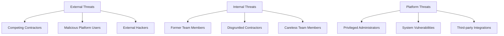

#### External Threat Actors

| Actor | Motivation | Capability | Target Assets |
|-------|------------|------------|---------------|
| Competing Contractors | Gain competitive advantage | Medium | Bid components, pricing data, team strategies |
| Malicious Platform Users | Financial gain, competitive intel | Medium | Team composition, pricing data |
| External Hackers | Financial gain, data theft | High | All data, particularly payment information |

#### Internal Threat Actors

| Actor | Motivation | Capability | Target Assets |
|-------|------------|------------|---------------|
| Former Team Members | Revenge, competing bids | High | Team communications, bid components |
| Disgruntled Contractors | Personal grievances | High | Decision process data, payment distribution |
| Careless Team Members | No malicious intent | Variable | Any data they have access to |

#### Platform Threats

| Actor | Motivation | Capability | Target Assets |
|-------|------------|------------|---------------|
| Privileged Administrators | Curiosity, corruption | Very High | All system data |
| System Vulnerabilities | N/A | Variable | Depends on vulnerability |
| Third-party Integrations | N/A | Variable | Data shared with third parties |

### Attack Vectors

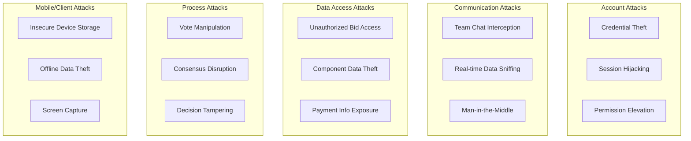

| Attack Category | Attack Vector | Impact | Likelihood | Countermeasures |
|-----------------|---------------|--------|------------|-----------------|
| Account Attacks | Credential theft | High | Medium | MFA, credential monitoring |
| | Session hijacking | High | Low | Secure session management |
| | Permission elevation | Very High | Low | Strict RBAC, audit logging |
| Communication Attacks | Team chat interception | Medium | Low | End-to-end encryption |
| | Real-time data sniffing | Medium | Low | TLS, secure WebSockets |
| | Man-in-the-middle | High | Low | Certificate pinning, HSTS |
| Data Access Attacks | Unauthorized bid access | High | Medium | Access controls, encryption |
| | Component data theft | High | Medium | Field-level security, audit logs |
| | Payment info exposure | Very High | Low | Tokenization, PCI compliance |
| Process Attacks | Vote manipulation | High | Medium | Digital signatures, blockchain |
| | Consensus disruption | Medium | Medium | Quorum rules, timeout policies |
| | Decision tampering | High | Low | Immutable audit trails |
| Mobile/Client Attacks | Insecure device storage | Medium | High | Encrypted local storage |
| | Offline data theft | Medium | Medium | Secure sync, remote wipe |
| | Screen capture | Low | High | Sensitive data masking |

## Authentication & Identity

### Authentication Mechanisms

The Group Bidding domain leverages the platform's core authentication system with these domain-specific enhancements:

1. **Team Authentication Context**
   - Extended JWT claims for team membership and roles
   - Team-specific session attributes
   - Cross-device authentication state

2. **Bid-Specific Authentication**
   - Action-specific verification for critical bid operations
   - Step-up authentication for sensitive actions
   - Context-aware auth challenges

3. **Team Member Verification**
   - Team lead approval workflow for new members
   - Member invitation verification flow
   - Previous collaboration validation

### Identity Management

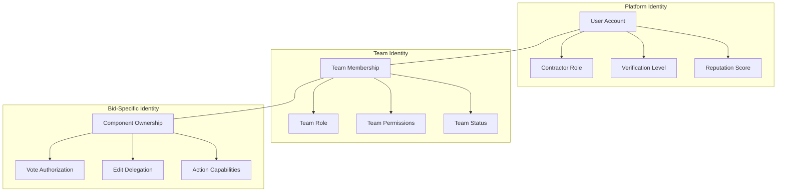

#### Identity Lifecycle Management

| Event | Security Actions | Audit Requirements |
|-------|-----------------|-------------------|
| Team Formation | Verify creator credentials, establish team context | Record team creation details and membership |
| Member Invitation | Generate secure invite token, set expiration | Log invitation details and response |
| Member Joining | Verify invite, establish team permissions | Record new member details and team role |
| Role Change | Require team lead approval, update permissions | Log role change details and approver |
| Member Removal | Revoke access tokens, update team state | Record removal reason and executor |
| Team Dissolution | Archive team data, revoke all access | Log dissolution details and final state |

## Authorization & Access Control

### Role-Based Access Control

The Group Bidding domain implements a fine-grained RBAC model with the following roles:

| Role | Description | Permissions | Assignment Process |
|------|-------------|-------------|-------------------|
| Team Lead | Primary team organizer | Full team management, bid submission, payment distribution | Self-assigned at team creation or delegated |
| Component Owner | Responsible for specific bid components | Component editing, dependent component viewing | Assigned by team lead or self-selected |
| Financial Manager | Handles payment distribution | Payment plan creation, escrow management | Assigned by team lead |
| Team Member | Standard team participant | Component viewing, decision voting | Default role when joining team |
| Observer | Limited visibility participant | View-only access to specific components | Explicitly assigned by team lead |

### Permission Model

```mermaid
graph TD
    subgraph "Team Management Permissions"
        TMP1[Invite Members]
        TMP2[Remove Members]
        TMP3[Assign Roles]
        TMP4[Dissolve Team]
    end
    
    subgraph "Component Permissions"
        CP1[Create Components]
        CP2[Edit Own Components]
        CP3[View All Components]
        CP4[Edit Any Component]
        CP5[Delete Components]
    end
    
    subgraph "Decision Permissions"
        DP1[Create Decisions]
        DP2[Cast Votes]
        DP3[Close Decisions]
        DP4[Override Decisions]
    end
    
    subgraph "Submission Permissions"
        SP1[Review Bid]
        SP2[Submit Bid]
        SP3[Withdraw Bid]
        SP4[Revise Bid]
    end
    
    subgraph "Payment Permissions"
        PP1[Define Distribution]
        PP2[Approve Payments]
        PP3[View Payment Details]
        PP4[Raise Payment Disputes]
    end

    TL[Team Lead] --- TMP1 & TMP2 & TMP3 & TMP4
    TL --- CP1 & CP2 & CP3 & CP4 & CP5
    TL --- DP1 & DP2 & DP3 & DP4
    TL --- SP1 & SP2 & SP3 & SP4
    TL --- PP1 & PP2 & PP3 & PP4
    
    CO[Component Owner] --- CP1 & CP2 & CP3
    CO --- DP1 & DP2
    CO --- SP1
    CO --- PP3 & PP4
    
    FM[Financial Manager] --- CP3
    FM --- DP2
    FM --- SP1
    FM --- PP1 & PP2 & PP3 & PP4
    
    TM[Team Member] --- CP1 & CP2 & CP3
    TM --- DP2
    TM --- SP1
    TM --- PP3 & PP4
    
    OB[Observer] --- CP3
    OB --- PP3
```

### Access Control Enforcement

Access control is enforced at multiple levels:

1. **API Layer**
   - JWT-based authorization with team and role claims
   - Request validation against permission matrix
   - Field-level redaction based on permission model

2. **Service Layer**
   - Team membership verification before processing
   - Component ownership validation for edits
   - Context-specific permission evaluation

3. **Database Layer**
   - Row-level security policies in PostgreSQL
   - Team-based data isolation
   - Attribute-based access control for sensitive fields

4. **Client Applications**
   - UI rendering based on permission model
   - Client-side enforcement as defense in depth
   - Secure local storage with permission filtering

### Cross-Team Isolation

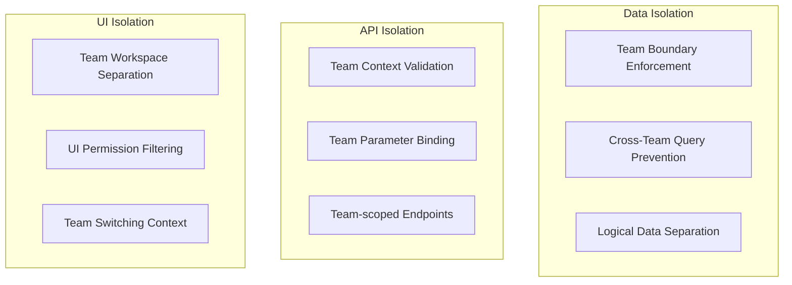

Cross-team isolation is enforced through:

1. **Database Schema Design**
   - Team ID as foreign key in all team-related tables
   - Database constraints enforcing team boundaries
   - Parameterized queries with team context

2. **Service Implementation**
   - Team membership validation on all operations
   - Context propagation across service boundaries
   - Team ID included in all cross-service calls

3. **API Gateway Controls**
   - Team context extraction from authentication token
   - Request enrichment with verified team information
   - Response filtering based on team membership

## Data Protection

### Data Classification

| Data Category | Sensitivity | Examples | Protection Level |
|---------------|-------------|----------|-----------------|
| Team Structure | Medium | Team members, roles, contact info | Authenticated access, team isolation |
| Bid Strategy | High | Pricing strategy, competitive positioning | Encrypted, role-based access |
| Component Details | Medium-High | Work breakdown, methodologies | Team-only access, component-level permissions |
| Decision Records | High | Votes, discussion points, strategic decisions | Encrypted, immutable audit trail |
| Financial Arrangements | Very High | Payment distribution, banking details | Encrypted, tokenized, PCI compliance |
| Communications | Medium-High | Team chat, comments, feedback | E2E encrypted where possible |
| Offline Data | High | Mobile cached data, downloads | Encrypted at rest, remote management |

### Encryption Strategy

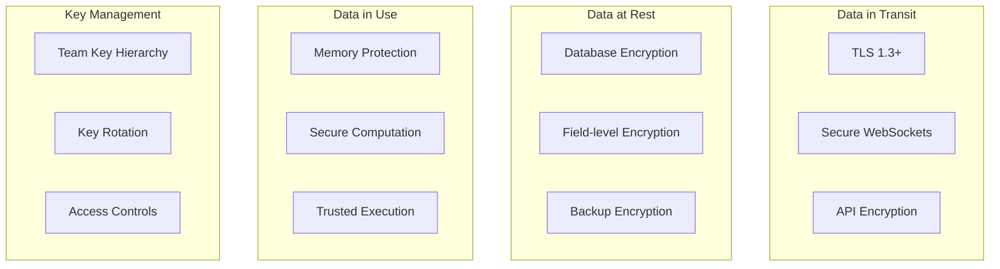

#### Encryption Implementation

1. **Database Encryption**
   - Transparent Data Encryption (TDE) for database files
   - PostgreSQL pgcrypto for sensitive fields
   - AES-256 for encrypted fields

2. **Application-Level Encryption**
   - Team-specific encryption keys for shared data
   - Component-specific keys for granular protection
   - User-specific keys for personal data

3. **Key Management**
   - AWS KMS for master key management
   - Key hierarchies with team-specific derived keys
   - Automatic key rotation every 90 days
   - Key access tied to team membership

### Data Minimization and Lifecycle

| Phase | Minimization Strategy | Retention Period | Disposal Method |
|-------|----------------------|------------------|-----------------|
| Collection | Only essential fields collected | N/A | N/A |
| Active Use | Role-based field visibility | Duration of active bid | N/A |
| Completion | Archival of essential records only | 3 years for compliance | Secure deletion |
| Member Departure | Removal of personal identifiers | 30 days post-departure | Field nullification |
| Team Dissolution | Retention of bid outcome only | 7 years for completed bids | Secure deletion with audit |

## Communication Security

### Team Communication Protection

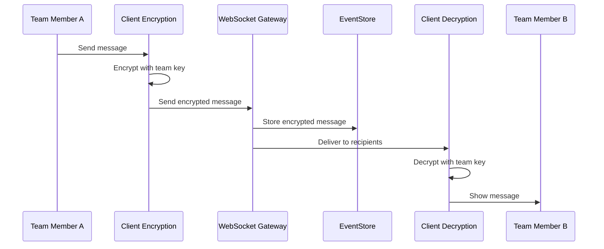

#### Communication Security Controls

1. **Message Confidentiality**
   - End-to-end encryption for team chat
   - Team-specific encryption keys
   - Ephemeral messaging option for sensitive discussions

2. **Message Integrity**
   - Digital signatures on all messages
   - Tamper-evident message storage
   - Immutable message history

3. **Message Availability**
   - Message delivery confirmation
   - Offline message queueing
   - Message recovery mechanisms

### Document Sharing Security

| Document Type | Security Controls | Access Tracking | Revocation |
|---------------|-------------------|----------------|------------|
| Bid Templates | Team-only access, watermarking | Access logging, download tracking | Team membership revocation |
| Cost Sheets | Field-level encryption, role-based access | View/edit tracking, version history | Component reassignment |
| Technical Specs | Document encryption, watermarking | Access logging, print tracking | Team departure cleanup |
| Contracts | Field-level encryption, version control | View/edit tracking, signature logging | Contract completion |
| Photos/Media | Client-side encryption, secure storage | View tracking, download logging | Media purge on team exit |

## Secure Collaboration Patterns

### Team Formation Security

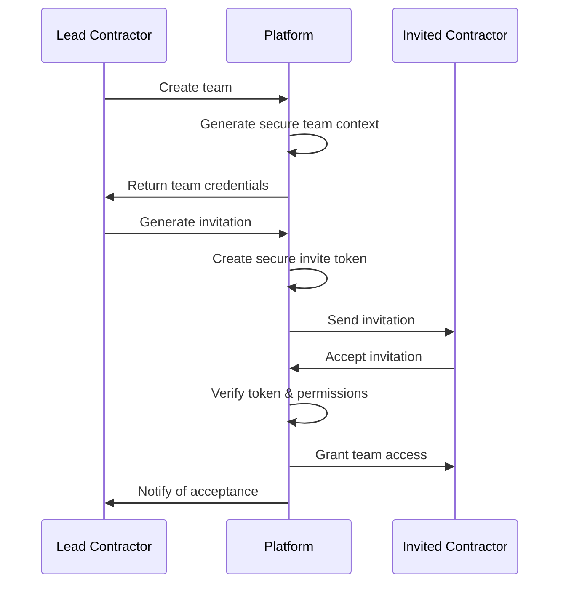

### Component Sharing Model

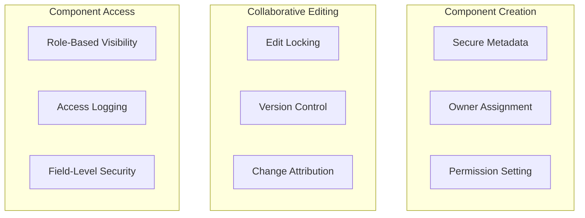

#### Secure Collaboration Implementation

1. **Secure Team Formation**
   - Identity verification for team creators
   - Invitation-only team joining
   - Two-factor verification for team leads

2. **Component Security**
   - Owner-based edit permissions
   - Version history with attribution
   - Change approval workflows for critical components

3. **Decision Security**
   - Authenticated voting mechanisms
   - Vote verification and non-repudiation
   - Immutable decision records

## Security Implementation Patterns

### Authentication Implementation

```typescript
// Example: Team authentication context extension
interface TeamAuthContext extends AuthContext {
  teamIds: string[];
  teamRoles: Record<string, TeamRole>;
  componentOwnership: Record<string, string[]>;
  canSubmitBid: boolean;
  canManageTeam: boolean;
}

// Example: Team-aware authentication middleware
const teamAuthMiddleware = (req: Request, res: Response, next: NextFunction) => {
  const authContext = req.auth as TeamAuthContext;
  const teamId = req.params.teamId || req.body.teamId;
  
  // Verify team membership
  if (!teamId || !authContext.teamIds.includes(teamId)) {
    return res.status(403).send({ error: 'Team access denied' });
  }
  
  // Enrich request with team-specific context
  req.teamContext = {
    teamId,
    role: authContext.teamRoles[teamId] || 'member',
    ownedComponents: authContext.componentOwnership[teamId] || [],
    permissions: getTeamPermissions(authContext.teamRoles[teamId])
  };
  
  next();
};
```

### Authorization Implementation

```typescript
// Example: Permission verification for component operations
const verifyComponentPermission = (
  operation: 'view' | 'edit' | 'delete',
  component: Component,
  teamContext: TeamContext
): boolean => {
  // Team lead can do anything
  if (teamContext.role === 'lead') {
    return true;
  }
  
  // Component owners can edit their own components
  if (operation === 'edit' && component.ownerId === teamContext.userId) {
    return true;
  }
  
  // Financial manager can view but not edit
  if (operation === 'view' && teamContext.role === 'financial') {
    return true;
  }
  
  // Team members can view all components
  if (operation === 'view' && teamContext.role === 'member') {
    return true;
  }
  
  // Dependent component owners can view dependencies
  if (operation === 'view' && component.dependencyIds.some(id => 
    teamContext.ownedComponents.includes(id))) {
    return true;
  }
  
  return false;
};

// Example: Database query with team isolation
const getTeamComponents = async (teamId: string, userId: string): Promise<Component[]> => {
  // Using query parameters to enforce team isolation
  const result = await db.query(
    `SELECT 
      c.*,
      CASE WHEN c.owner_id = $2 THEN true ELSE false END as is_owner,
      CASE WHEN c.sensitivity > 1 AND c.owner_id != $2 
           THEN mask_sensitive_fields(c) 
           ELSE c END as content
     FROM components c
     WHERE c.team_id = $1
     ORDER BY c.created_at DESC`,
    [teamId, userId]
  );
  
  return result.rows;
};
```

### Data Protection Implementation

```typescript
// Example: Field-level encryption for sensitive component data
const encryptComponentFields = (
  component: Component,
  teamKey: Buffer
): EncryptedComponent => {
  // Fields that need encryption
  const sensitiveFields = ['pricingStrategy', 'proprietaryTechnique', 'supplierDetails'];
  
  const encryptedComponent = { ...component };
  
  // Only encrypt sensitive fields
  for (const field of sensitiveFields) {
    if (component[field]) {
      encryptedComponent[field] = encrypt(component[field], teamKey);
    }
  }
  
  return encryptedComponent;
};

// Example: Secure component storage with team isolation
const storeComponent = async (
  component: Component,
  teamId: string,
  userId: string
): Promise<void> => {
  // Get team encryption key
  const teamKey = await getTeamEncryptionKey(teamId);
  
  // Encrypt sensitive fields
  const encryptedComponent = encryptComponentFields(component, teamKey);
  
  // Store with team isolation
  await db.query(
    `INSERT INTO components(
      id, team_id, owner_id, title, description, 
      pricing_strategy, proprietary_technique, supplier_details,
      estimated_cost, created_at, updated_at
    ) VALUES($1, $2, $3, $4, $5, $6, $7, $8, $9, $10, $11)`,
    [
      component.id, teamId, userId, component.title, component.description,
      encryptedComponent.pricingStrategy, encryptedComponent.proprietaryTechnique,
      encryptedComponent.supplierDetails, component.estimatedCost,
      new Date(), new Date()
    ]
  );
};
```

## Security Monitoring & Incident Response

### Security Monitoring

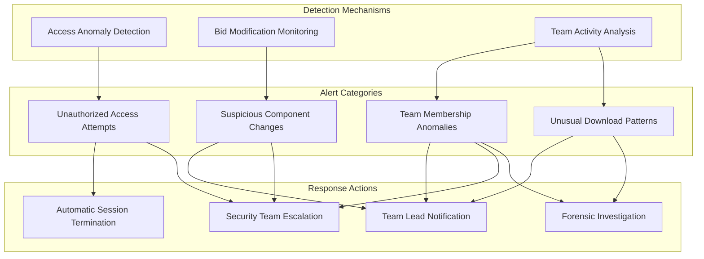

#### Monitoring Implementation

1. **Anomaly Detection**
   - Unusual access patterns (time, location, frequency)
   - Unexpected component modifications
   - Abnormal team formation or dissolution

2. **Activity Logging**
   - All team management actions
   - Component creation, editing, and viewing
   - Decision creation and voting
   - Bid submission and modifications

3. **Audit Trails**
   - Immutable records of key team actions
   - Cryptographically verifiable audit logs
   - Team-specific audit views

### Incident Response

| Incident Type | Detection Method | Response Actions | Recovery Process |
|---------------|------------------|------------------|-----------------|
| Unauthorized Access | Failed login attempts, unusual IP | Account lockout, notification | Password reset, session invalidation |
| Data Exposure | Unusual data access patterns | Team isolation, investigation | Data containment, exposure assessment |
| Team Member Compromise | Anomalous team activity | Account suspension, team notification | Credential reset, activity review |
| Bid Tampering | Version history anomalies | Bid freezing, forensic analysis | Bid restoration, chain of custody |
| Messaging Compromise | Message pattern anomalies | Chat suspension, investigation | Secure channel re-establishment |

#### Incident Response Workflow

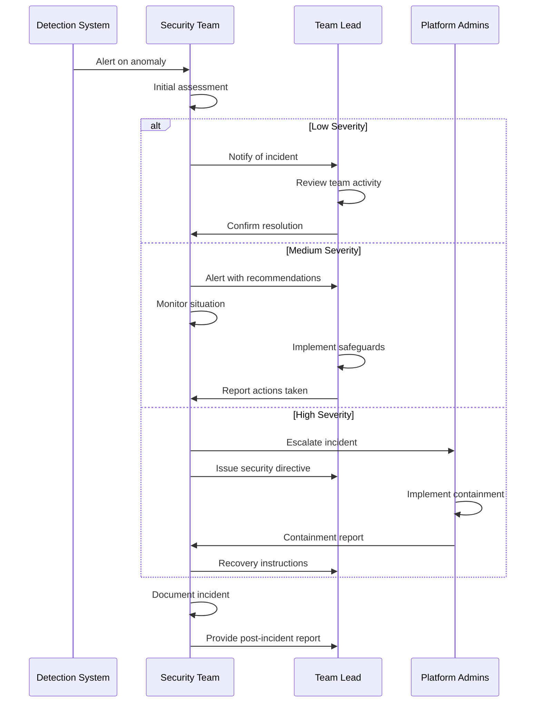

## Security Compliance & Standards

### Regulatory Considerations

| Regulation | Relevance | Key Requirements | Implementation |
|------------|-----------|------------------|----------------|
| GDPR | Medium | Personal data protection, right to be forgotten | Team member data minimization, deletion workflows |
| CCPA | Medium | Disclosure of data sharing, opt-out rights | Transparent team data policies, data sharing controls |
| PCI DSS | High (for payment) | Secure payment handling, tokenization | Payment data isolation, PCI-compliant processing |
| NIST 800-53 | Reference | Security controls framework | Defense-in-depth, principle of least privilege |
| ISO 27001 | Reference | Information security management | Risk assessment, security controls, continual improvement |

### Security Best Practices

1. **Least Privilege Principle**
   - Default to Team Member role with minimal permissions
   - Permission elevation requires explicit team lead approval
   - Regular permission audits and pruning

2. **Defense in Depth**
   - Multi-layer security controls (API, service, database)
   - Independent verification mechanisms
   - Redundant security boundaries

3. **Zero Trust Architecture**
   - Continuous authentication and authorization
   - Network-independent security model
   - Explicit verification for all operations

## Mobile & Cross-Device Security

### Mobile-Specific Security Controls

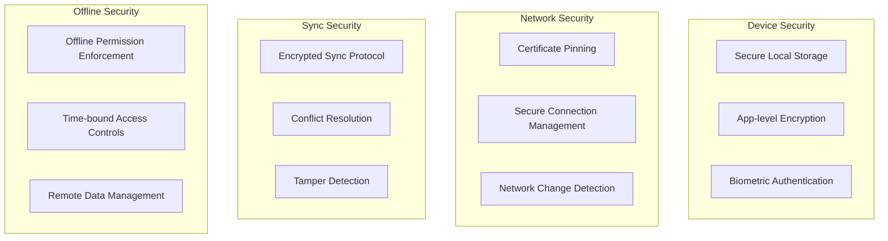

#### Mobile Implementation

1. **Secure Storage**
   - Encrypted SQLite database using SQLCipher
   - Secure key storage using Keychain/Keystore
   - Automatic data purging based on sensitivity

2. **Secure Sync**
   - Authenticated sync protocol
   - Change verification and validation
   - Conflict resolution with security validation

3. **Offline Controls**
   - Time-limited offline access
   - Permission enforcement in offline mode
   - Remote management capabilities

### Cross-Device Security

| Scenario | Security Challenge | Implementation | User Experience |
|----------|-------------------|----------------|-----------------|
| Device Switching | Session continuity, data consistency | Secure session transfer, sync verification | Seamless transition between devices |
| Multiple Device Use | Concurrent access, sync conflicts | Real-time conflict detection, version vectors | Consistent view across devices |
| Device Loss | Data exposure, unauthorized access | Remote wipe, automatic session expiration | Minimal disruption to team |
| New Device Addition | Authentication, data bootstrapping | Trusted device verification, progressive sync | Quick onboarding process |

## Third-Party Integration Security

### Integration Security Model

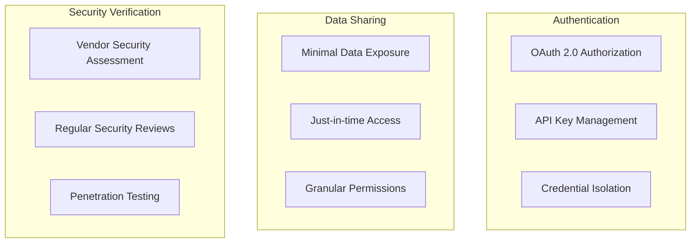

#### Integration Security Controls

1. **Calendar Services**
   - Isolated OAuth scopes for calendar operations only
   - Minimal permission requests (read/write calendars only)
   - No sharing of team composition beyond meeting attendees

2. **Document Collaboration Tools**
   - End-to-end encrypted document sharing
   - Team-specific workspaces with access controls
   - Document access auditing and expiration

3. **Digital Signature Providers**
   - Minimum necessary data sharing
   - Document access logs and verification
   - Secure callback validation
