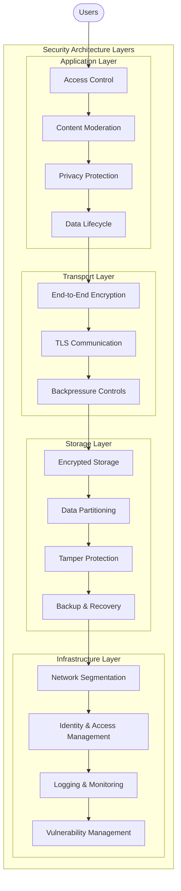
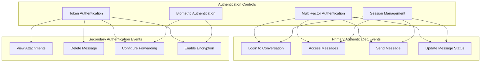
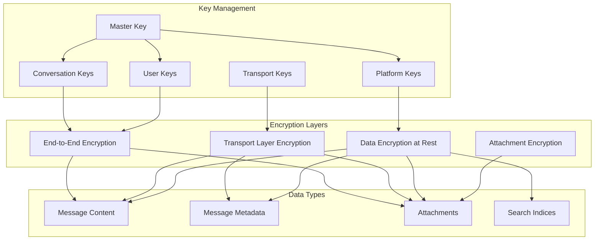
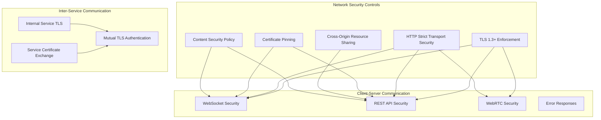
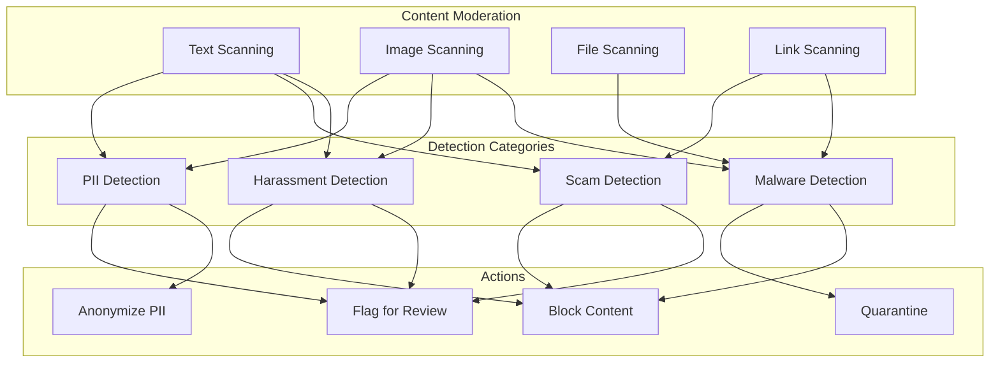
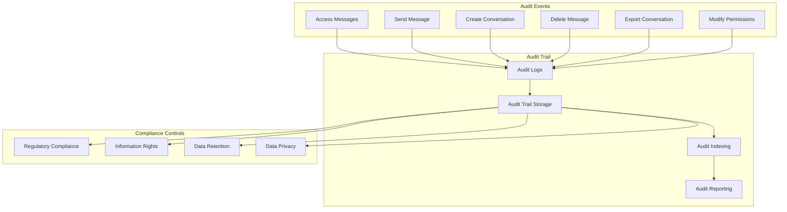
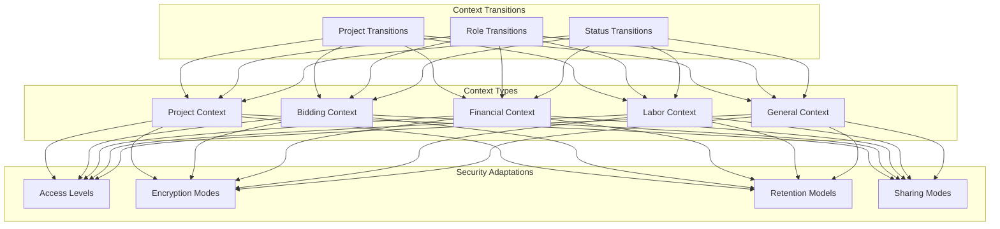

# Messaging System Security Documentation

This document outlines the security architecture, threat model, and security controls implemented in the Messaging domain of the InstaBids platform. It provides a comprehensive view of how message content, user communications, and sensitive information are protected.

## Security Architecture Overview

The Messaging System security architecture implements a defense-in-depth approach to protect against various threats while ensuring confidentiality, integrity, and availability of messaging data.



## Threat Model

The Messaging System faces various security threats that must be mitigated. The following threat model identifies potential attack vectors and their impact on the system.

### 1. Confidentiality Threats

| Threat | Description | Impact | Likelihood | Mitigation |
|--------|-------------|--------|------------|------------|
| Message Interception | Unauthorized access to message content during transit | High | Medium | End-to-end encryption, TLS |
| Unauthorized Access | Access to messages by unauthorized users | High | Medium | Strong access controls, authentication |
| Data Exposure | Leakage of sensitive message data from storage | High | Medium | Encryption at rest, access controls |
| Insider Threat | Malicious or compromised internal users accessing messages | High | Low | Least privilege, audit trails |
| Message Metadata Leakage | Disclosure of communication patterns even if content is encrypted | Medium | Medium | Metadata minimization, encryption |

### 2. Integrity Threats

| Threat | Description | Impact | Likelihood | Mitigation |
|--------|-------------|--------|------------|------------|
| Message Tampering | Modification of message content | High | Low | Digital signatures, content validation |
| Message Replay | Replaying old messages to create confusion | Medium | Low | Message sequencing, timestamps |
| Message Forgery | Creating fake messages appearing to be from another user | High | Medium | Identity verification, authentication |
| Manipulated Attachments | Malicious modifications to attachments | High | Medium | Content validation, scanning |
| Database Corruption | Unauthorized modifications to message database | High | Low | Access controls, audit logs |

### 3. Availability Threats

| Threat | Description | Impact | Likelihood | Mitigation |
|--------|-------------|--------|------------|------------|
| DoS Attacks | Overwhelming messaging services with traffic | High | Medium | Rate limiting, load balancing |
| Resource Exhaustion | Consuming system resources to degrade service | Medium | Medium | Resource quotas, monitoring |
| Message Flooding | Overwhelming users with excessive messages | Medium | High | Rate limiting, spam detection |
| Service Disruption | Attacks targeting messaging infrastructure | High | Low | Redundancy, monitoring |
| Data Loss | Permanent loss of message data | High | Low | Backup strategies, replication |

### 4. Domain-Specific Threats

| Threat | Description | Impact | Likelihood | Mitigation |
|--------|-------------|--------|------------|------------|
| Cross-Domain Information Leakage | Unauthorized data flow between contexts | High | Medium | Context isolation, access control |
| Impersonation in Project Context | Pretending to be another project member | High | Medium | Role verification, authentication |
| Confidential Project Information Sharing | Unauthorized sharing of project details | High | Medium | Context-aware access controls |
| Payment Negotiation Tampering | Manipulation of messages regarding payments | High | Medium | Transaction verification, signatures |
| Abusive Content | Harassment, threats, or inappropriate content | Medium | High | Content moderation, reporting |

## Security Controls

### 1. Authentication & Authorization

The Messaging System implements a comprehensive authentication and authorization framework to ensure that only authorized users can access messaging functionality and data.

#### 1.1 Authentication Controls



**Implementation Details:**

1. **Session-Based Authentication**
   - Short-lived session tokens (max 24 hours)
   - Session binding to device and IP
   - Session revocation on suspicious activity
   - Idle timeout after 30 minutes

2. **Role-Based Authorization**
   - Project roles determine messaging capabilities
   - Bid-specific messaging permissions
   - Context-specific access controls
   - Temporary role elevation with approval

3. **Just-in-Time Access**
   - Access granted only when needed
   - Automatic revocation when context changes
   - Time-limited access for sensitive conversations
   - Approval workflows for elevated access

#### 1.2 Authorization Matrix

| Action | System Admin | Project Owner | Contractor | Homeowner | Helper | Guest |
|--------|--------------|--------------|------------|-----------|--------|-------|
| Create conversation | ✅ | ✅ | ✅ | ✅ | ❌ | ❌ |
| Send message | ✅ | ✅ | ✅ | ✅ | ✅ | ✅ |
| Read project messages | ✅ | ✅ | Context-based | Context-based | Context-based | ❌ |
| Read direct messages | ✅ | Sender/Recipient | Sender/Recipient | Sender/Recipient | Sender/Recipient | Sender/Recipient |
| Share attachments | ✅ | ✅ | ✅ | ✅ | Context-based | ❌ |
| Delete messages | ✅ | Own messages | Own messages | Own messages | Own messages | Own messages |
| Archive conversations | ✅ | ✅ | ✅ | ✅ | ✅ | ✅ |
| Export conversation | ✅ | ✅ | Context-based | Context-based | ❌ | ❌ |
| Add participants | ✅ | ✅ | Context-based | Context-based | ❌ | ❌ |
| Remove participants | ✅ | ✅ | Context-based | Context-based | ❌ | ❌ |

### 2. Data Protection

The Messaging System implements robust data protection mechanisms to ensure the confidentiality and integrity of message content and metadata.

#### 2.1 Encryption Strategy



**Implementation Details:**

1. **End-to-End Encryption (E2EE)**
   - Signal Protocol integration for E2EE
   - Perfect forward secrecy
   - Encrypted attachments with separate keys
   - Key rotation policies

2. **Encryption at Rest**
   - AES-256 encryption for stored messages
   - Envelope encryption with key hierarchy
   - Secure key management with HSM
   - Encrypted backups

3. **Secure Key Management**
   - Hardware Security Module (HSM) for key storage
   - Key derivation for conversation-specific keys
   - Multi-party key generation for shared contexts
   - Key rotation schedule

#### 2.2 Data Classification

| Data Category | Classification | Encryption | Retention | Access Control |
|---------------|----------------|------------|-----------|----------------|
| Message Content | Confidential | E2EE + At Rest | Policy-based | Strict |
| Message Metadata | Internal | At Rest | 1 year | Moderate |
| Attachments | Confidential | E2EE + At Rest | Policy-based | Strict |
| User Presence | Internal | Transport only | 30 days | Moderate |
| System Messages | Internal | Transport + At Rest | 1 year | Moderate |
| Read Receipts | Internal | Transport + At Rest | 90 days | Moderate |
| Conversation Settings | Internal | Transport + At Rest | Life of conversation | Moderate |
| Deleted Messages | Confidential | At Rest | 30 days post-deletion | Very Strict |

### 3. Network Security

The Messaging System implements multiple layers of network security to protect data in transit and prevent unauthorized access.



**Implementation Details:**

1. **Transport Security**
   - TLS 1.3 with strong cipher suites
   - Certificate pinning for mobile apps
   - Perfect Forward Secrecy (PFS)
   - HSTS enforcement

2. **API Security**
   - API gateway with rate limiting
   - Token-based API authentication
   - Request signing for API calls
   - Granular API permissions

3. **WebSocket Security**
   - Secure WebSocket (wss://)
   - Token-based authentication
   - Connection limits and timeout policies
   - Message rate limiting

### 4. Content Security

The Messaging System implements content security controls to prevent malicious content and ensure appropriate usage.



**Implementation Details:**

1. **Content Moderation**
   - Automated content filtering
   - ML-based inappropriate content detection
   - Context-aware filtering thresholds
   - User reporting system

2. **Malware Protection**
   - Real-time attachment scanning
   - File type restrictions
   - Sandbox execution for suspicious files
   - Link scanning and validation

3. **Privacy Protection**
   - Automatic PII detection
   - Optional PII redaction
   - Screenshot prevention for sensitive chats
   - Content expiration options

### 5. Audit & Compliance

The Messaging System implements comprehensive audit and compliance controls to monitor system usage and ensure regulatory compliance.



**Implementation Details:**

1. **Audit Logging**
   - Immutable audit trails
   - User and system action logging
   - Access attempt recording
   - Privileged action monitoring

2. **Compliance Features**
   - Configurable retention policies
   - Legal hold capabilities
   - GDPR compliance tools
   - Data export for right to access

3. **Audit Analysis**
   - Anomaly detection in messaging patterns
   - Unauthorized access attempts alerts
   - Suspicious behavior monitoring
   - Compliance reporting

### 6. Context-Aware Security

The Messaging System implements context-aware security to adapt security controls based on the context of conversations and their relationship to other domains.



**Implementation Details:**

1. **Project Context Security**
   - Role-based access within project conversations
   - Automatic security inheritance from project settings
   - Milestone-specific conversation permissions
   - Historical access limitations

2. **Financial Context Security**
   - Enhanced security for payment-related messages
   - Payment verification in financial conversations
   - Evidence preservation for payment disputes
   - Financial conversation auditing

3. **Labor Context Security**
   - Work assignment verification
   - Qualification validation in labor discussions
   - Schedule confirmation security
   - Location-based security for on-site discussions

## Security Implementation Examples

### 1. Access Control Implementation

```typescript
// Example: Context-aware access control implementation
export class MessageAccessControl {
  // Check if user can access a specific message
  public async canAccessMessage(
    userId: string,
    messageId: string
  ): Promise<boolean> {
    // Get message details
    const message = await this.messageRepository.findById(messageId);
    if (!message) {
      return false;
    }
    
    // Get conversation details
    const conversation = await this.conversationRepository.findById(
      message.conversationId
    );
    if (!conversation) {
      return false;
    }
    
    // Check direct conversation access
    if (conversation.participants.includes(userId)) {
      return true;
    }
    
    // Check context-based access
    if (conversation.contextType && conversation.contextId) {
      const contextAccess = await this.contextAccessMap[conversation.contextType]?.hasAccess(
        userId,
        conversation.contextId
      );
      
      if (contextAccess) {
        // Log access for audit
        await this.auditLogger.logAccess({
          userId,
          resourceType: 'message',
          resourceId: messageId,
          contextType: conversation.contextType,
          contextId: conversation.contextId,
          accessType: 'contextual',
          timestamp: new Date()
        });
        
        return true;
      }
    }
    
    // Log access denial
    await this.auditLogger.logAccessDenial({
      userId,
      resourceType: 'message',
      resourceId: messageId,
      reason: 'no_access_rights',
      timestamp: new Date()
    });
    
    return false;
  }
  
  // Check if user can send a message to a conversation
  public async canSendMessage(
    userId: string,
    conversationId: string,
    messageContent: MessageContent
  ): Promise<AccessResult> {
    // Get conversation details
    const conversation = await this.conversationRepository.findById(
      conversationId
    );
    if (!conversation) {
      return { allowed: false, reason: 'conversation_not_found' };
    }
    
    // Check if user is a participant
    if (!conversation.participants.includes(userId)) {
      return { allowed: false, reason: 'not_participant' };
    }
    
    // Check if conversation is locked
    if (conversation.status === 'locked') {
      return { allowed: false, reason: 'conversation_locked' };
    }
    
    // Check content restrictions
    const contentCheck = await this.contentValidator.validateContent(
      messageContent,
      conversation.contentRestrictions
    );
    if (!contentCheck.valid) {
      return { allowed: false, reason: 'content_violation', details: contentCheck.violations };
    }
    
    // Check context-specific restrictions
    if (conversation.contextType && conversation.contextId) {
      const contextCheck = await this.contextRestrictionCheck(
        userId,
        conversation.contextType,
        conversation.contextId,
        messageContent
      );
      
      if (!contextCheck.allowed) {
        return contextCheck;
      }
    }
    
    // Check rate limits
    const rateCheck = await this.rateLimit.checkUserMessageRate(userId);
    if (!rateCheck.allowed) {
      return { allowed: false, reason: 'rate_limited', retryAfter: rateCheck.retryAfter };
    }
    
    return { allowed: true };
  }
}
```

### 2. End-to-End Encryption Implementation

```typescript
// Example: End-to-end encryption integration for messaging
export class MessageEncryptionService {
  // Initialize secure session for a conversation
  public async initializeSecureSession(
    conversationId: string,
    userId: string
  ): Promise<void> {
    // Get user's device keys
    const userDevices = await this.keyRepository.getUserDeviceKeys(userId);
    
    // Get conversation participants
    const conversation = await this.conversationRepository.findById(conversationId);
    if (!conversation) {
      throw new Error('Conversation not found');
    }
    
    // Initialize secure session for each participant device
    for (const participantId of conversation.participants) {
      // Skip self
      if (participantId === userId) continue;
      
      // Get participant device keys
      const participantDevices = await this.keyRepository.getUserDeviceKeys(participantId);
      
      // For each device pair, establish secure session
      for (const userDevice of userDevices) {
        for (const participantDevice of participantDevices) {
          try {
            // Create or retrieve session
            await this.signalProtocol.createSession(
              userDevice.keyBundle,
              participantDevice.keyBundle
            );
            
            // Log successful session creation
            this.logger.info('Secure session established', {
              conversationId,
              initiator: { userId, deviceId: userDevice.deviceId },
              recipient: { userId: participantId, deviceId: participantDevice.deviceId }
            });
          } catch (error) {
            // Log error and continue with other devices
            this.logger.error('Failed to establish secure session', {
              conversationId,
              initiator: { userId, deviceId: userDevice.deviceId },
              recipient: { userId: participantId, deviceId: participantDevice.deviceId },
              error: error.message
            });
          }
        }
      }
    }
    
    // Mark conversation as secure
    await this.conversationRepository.update(conversationId, {
      encryptionEnabled: true,
      encryptionStatus: 'active',
      encryptionUpdatedAt: new Date()
    });
  }
  
  // Encrypt a message for a conversation
  public async encryptMessage(
    message: OutgoingMessage,
    conversationId: string,
    senderDeviceId: string
  ): Promise<EncryptedMessage> {
    // Get conversation details
    const conversation = await this.conversationRepository.findById(conversationId);
    if (!conversation) {
      throw new Error('Conversation not found');
    }
    
    // Ensure encryption is enabled
    if (!conversation.encryptionEnabled) {
      throw new Error('End-to-end encryption not enabled for this conversation');
    }
    
    // Get all participant devices
    const recipientDevices: DeviceKey[] = [];
    for (const participantId of conversation.participants) {
      // Skip sender
      if (participantId === message.senderId) continue;
      
      // Get participant device keys
      const devices = await this.keyRepository.getUserDeviceKeys(participantId);
      recipientDevices.push(...devices);
    }
    
    // Serialize message content
    const serializedContent = JSON.stringify(message.content);
    
    // Generate message key
    const messageKey = await this.cryptoProvider.generateRandomBytes(32);
    
    // Encrypt message content with message key
    const encryptedContent = await this.cryptoProvider.encrypt(
      serializedContent,
      messageKey
    );
    
    // Encrypt message key for each recipient device
    const encryptedKeys: EncryptedKey[] = [];
    for (const device of recipientDevices) {
      try {
        // Get session with device
        const session = await this.signalProtocol.getSession(
          message.senderId,
          senderDeviceId,
          device.userId,
          device.deviceId
        );
        
        // Encrypt message key with session
        const encryptedKey = await session.encryptMessage(messageKey);
        
        // Add to encrypted keys
        encryptedKeys.push({
          userId: device.userId,
          deviceId: device.deviceId,
          encryptedKey
        });
      } catch (error) {
        this.logger.error('Failed to encrypt for device', {
          senderId: message.senderId,
          senderDeviceId,
          recipientId: device.userId,
          recipientDeviceId: device.deviceId,
          error: error.message
        });
        
        // Continue with other devices
      }
    }
    
    // Create encrypted message
    return {
      id: message.id,
      conversationId,
      senderId: message.senderId,
      senderDeviceId,
      encryptedContent,
      encryptedKeys,
      timestamp: new Date().toISOString(),
      messageType: message.messageType,
      attachments: await this.encryptAttachments(message.attachments, messageKey)
    };
  }
  
  // Decrypt a message for a specific user device
  public async decryptMessage(
    encryptedMessage: EncryptedMessage,
    userId: string,
    deviceId: string
  ): Promise<DecryptedMessage> {
    // Find the encrypted key for this device
    const encryptedKey = encryptedMessage.encryptedKeys.find(
      key => key.userId === userId && key.deviceId === deviceId
    );
    
    if (!encryptedKey) {
      throw new Error('No encrypted key found for this device');
    }
    
    // Get session with sender
    const session = await this.signalProtocol.getSession(
      userId,
      deviceId,
      encryptedMessage.senderId,
      encryptedMessage.senderDeviceId
    );
    
    // Decrypt the message key
    const messageKey = await session.decryptMessage(encryptedKey.encryptedKey);
    
    // Decrypt the message content
    const serializedContent = await this.cryptoProvider.decrypt(
      encryptedMessage.encryptedContent,
      messageKey
    );
    
    // Parse the content
    const content = JSON.parse(serializedContent);
    
    // Decrypt attachments if any
    const attachments = await this.decryptAttachments(
      encryptedMessage.attachments,
      messageKey
    );
    
    // Log decryption (excluding content)
    this.logger.info('Message decrypted', {
      messageId: encryptedMessage.id,
      conversationId: encryptedMessage.conversationId,
      senderId: encryptedMessage.senderId,
      recipientId: userId,
      timestamp: new Date()
    });
    
    // Return decrypted message
    return {
      id: encryptedMessage.id,
      conversationId: encryptedMessage.conversationId,
      senderId: encryptedMessage.senderId,
      content,
      attachments,
      timestamp: encryptedMessage.timestamp,
      messageType: encryptedMessage.messageType
    };
  }
}
```

### 3. Content Moderation Implementation

```typescript
// Example: Content moderation service for messaging
export class ContentModerationService {
  // Scan message content before sending
  public async moderateContent(
    content: MessageContent,
    contextType: string,
    contextId: string,
    senderId: string
  ): Promise<ModerationResult> {
    // Get moderation settings for this context
    const moderationSettings = await this.getContextModerationSettings(
      contextType,
      contextId
    );
    
    // Initialize result
    const result: ModerationResult = {
      approved: true,
      violations: [],
      sanitizedContent: null,
      reviewRequired: false
    };
    
    // Text content moderation
    if (content.text) {
      const textResult = await this.moderateTextContent(
        content.text,
        moderationSettings,
        senderId
      );
      
      if (!textResult.approved) {
        result.approved = false;
        result.violations.push(...textResult.violations);
        result.sanitizedContent = {
          ...content,
          text: textResult.sanitizedText
        };
      }
    }
    
    // Image/attachment moderation
    if (content.attachments && content.attachments.length > 0) {
      const attachmentResults = await Promise.all(
        content.attachments.map(attachment => 
          this.moderateAttachment(attachment, moderationSettings)
        )
      );
      
      // Process attachment results
      const invalidAttachments = attachmentResults
        .map((result, index) => ({ result, index }))
        .filter(item => !item.result.approved);
      
      if (invalidAttachments.length > 0) {
        result.approved = false;
        
        // Add attachment violations
        for (const item of invalidAttachments) {
          result.violations.push(...item.result.violations);
        }
        
        // Create sanitized content if needed
        if (!result.sanitizedContent) {
          result.sanitizedContent = { ...content };
        }
        
        // Filter out non-approved attachments
        result.sanitizedContent.attachments = content.attachments.filter(
          (_, index) => !invalidAttachments.some(item => item.index === index)
        );
      }
    }
    
    // Link moderation
    if (content.text && this.linkDetector.hasLinks(content.text)) {
      const links = this.linkDetector.extractLinks(content.text);
      const linkResults = await Promise.all(
        links.map(link => this.moderateLink(link, moderationSettings))
      );
      
      // Process link results
      const invalidLinks = linkResults
        .map((result, index) => ({ result, link: links[index] }))
        .filter(item => !item.result.approved);
      
      if (invalidLinks.length > 0) {
        result.approved = false;
        
        // Add link violations
        for (const item of invalidLinks) {
          result.violations.push({
            type: 'unsafe_link',
            severity: item.result.severity,
            description: `Unsafe link detected: ${item.link}`,
            location: 'text'
          });
        }
        
        // Create sanitized content if needed
        if (!result.sanitizedContent) {
          result.sanitizedContent = { ...content };
        }
        
        // Replace unsafe links with placeholder
        result.sanitizedContent.text = invalidLinks.reduce(
          (text, item) => text.replace(item.link, '[Link removed for security]'),
          content.text
        );
      }
    }
    
    // Check if human review is required
    result.reviewRequired = this.isReviewRequired(result.violations, moderationSettings);
    
    // Log moderation result (excluding content details)
    await this.moderationLogger.logModeration({
      senderId,
      contextType,
      contextId,
      hasViolations: !result.approved,
      violationCount: result.violations.length,
      reviewRequired: result.reviewRequired,
      timestamp: new Date()
    });
    
    return result;
  }
  
  // Determine if content should be blocked or allowed with warning
  private isReviewRequired(
    violations: ContentViolation[],
    settings: ModerationSettings
  ): boolean {
    // Check for high severity violations
    const hasHighSeverity = violations.some(v => v.severity === 'high');
    if (hasHighSeverity) {
      return true;
    }
    
    // Check for multiple medium severity violations
    const mediumViolations = violations.filter(v => v.severity === 'medium');
    if (mediumViolations.length >= settings.mediumViolationThreshold) {
      return true;
    }
    
    // Check for specific violation types that always require review
    const hasReviewableViolation = violations.some(v => 
      settings.alwaysReviewViolations.includes(v.type)
    );
    if (hasReviewableViolation) {
      return true;
    }
