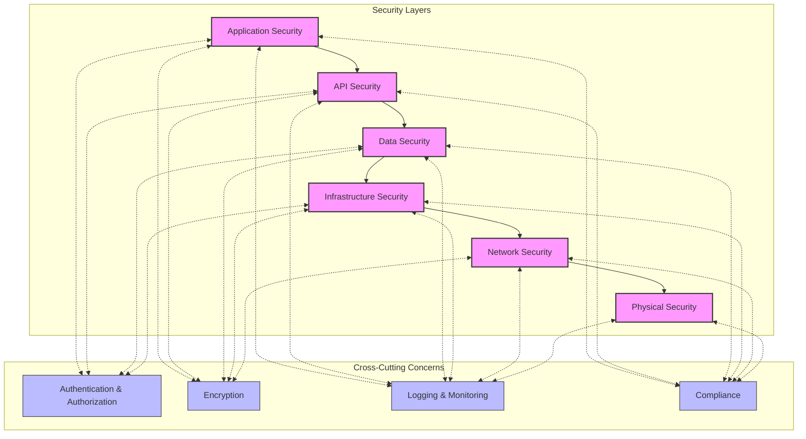
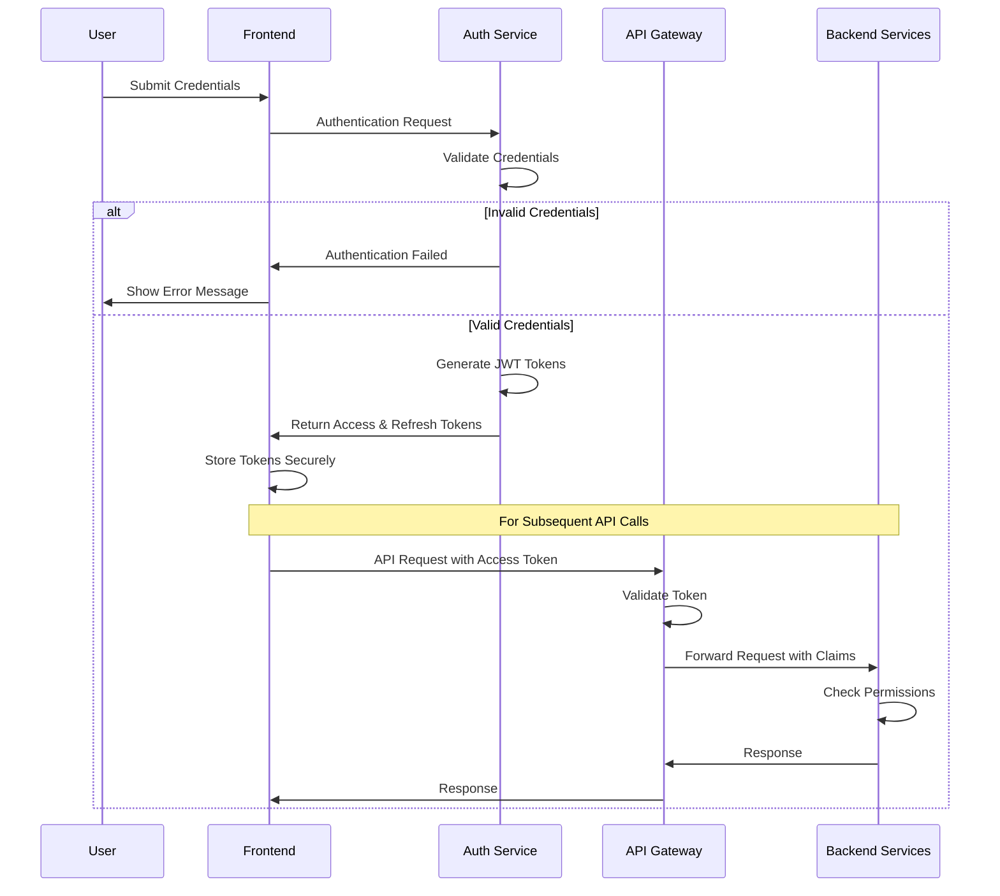
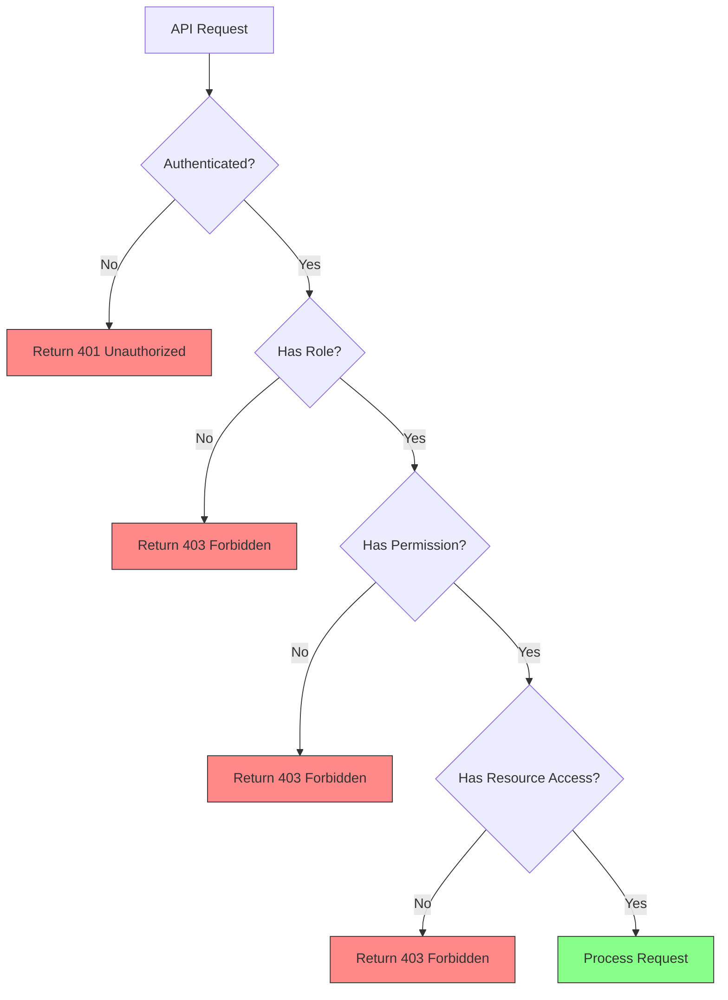
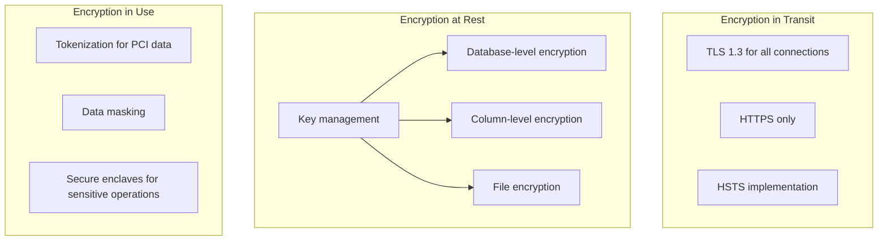
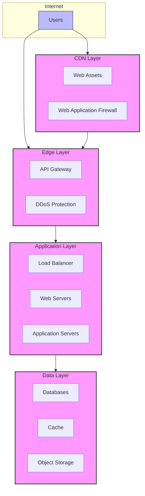
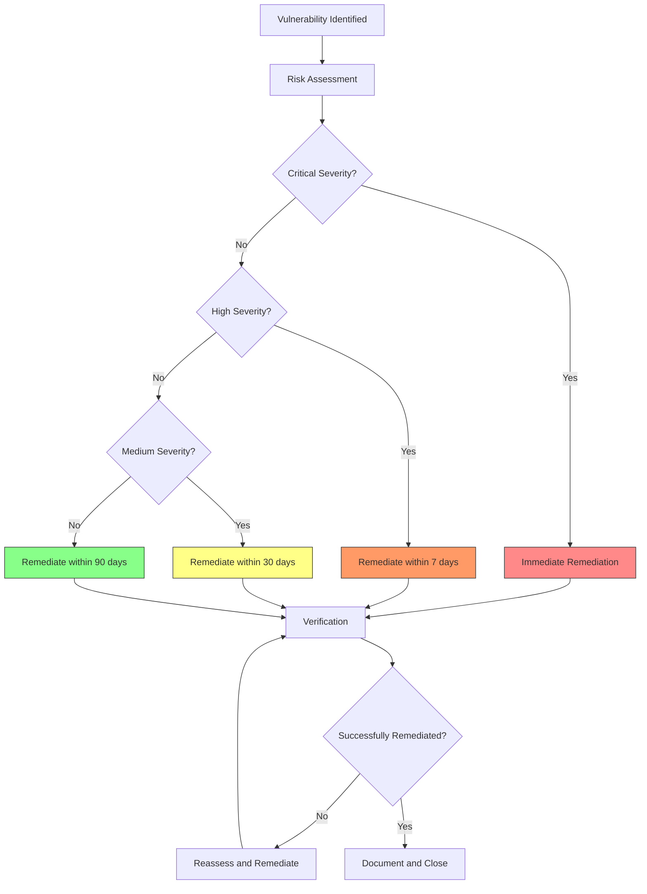
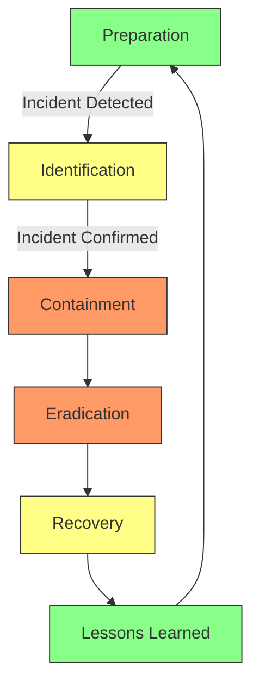

# InstaBids Security Architecture

This document outlines the comprehensive security architecture for the InstaBids platform. It covers authentication, authorization, data protection, API security, infrastructure security, compliance, and incident response procedures.

## Security Architecture Overview

The InstaBids security architecture follows a defense-in-depth approach, implementing multiple layers of security controls to protect user data, system integrity, and service availability:

## Authentication & Authorization

### Authentication System

InstaBids utilizes a multi-factor authentication system powered by Supabase Auth:

#### Authentication Methods

1. **Email/Password Authentication**
   - Password complexity requirements: minimum 10 characters, requiring uppercase, lowercase, numbers, and special characters
   - Password hash: bcrypt with work factor 12
   - Secure password reset workflow with time-limited tokens

2. **Social Authentication**
   - Google
   - Apple
   - Facebook

3. **Multi-Factor Authentication (MFA)**
   - SMS verification codes
   - Authenticator app support (TOTP)
   - Recovery codes for backup access
   - Required for high-privilege accounts and high-risk operations

4. **Token Management**
   - JWT-based authentication
   - Short-lived access tokens (1 hour)
   - Longer-lived refresh tokens (30 days) with rotation and automatic invalidation
   - Token revocation on logout or security concerns

### Authorization Model

InstaBids implements a comprehensive authorization model combining:

1. **Role-Based Access Control (RBAC)**
   - Core system roles: Admin, Support, Analyst
   - Domain-specific roles: Homeowner, Contractor, Helper, Property Manager

2. **Permission-Based Access Control (PBAC)**
   - Granular permissions mapped to API operations
   - Permission inheritance through roles
   - Custom permission sets for special cases

3. **Resource-Based Access Control**
   - Row-Level Security (RLS) policies in PostgreSQL
   - Object ownership and sharing rules
   - Resource visibility rules based on business relationships

#### Authorization Process

#### Authentication & Authorization Implementation

The system implements authentication and authorization through:

1. **Supabase Auth** for authentication services
2. **API Gateway middleware** for token validation and basic authorization
3. **Backend service middleware** for fine-grained authorization
4. **Database RLS policies** for data access control
5. **Frontend route guards** for UI access control

## Data Protection

### Data Classification

InstaBids classifies data into four categories with corresponding security controls:

| Classification | Description | Examples | Security Controls |
|---------------|-------------|----------|------------------|
| Public | Information publicly available with no restrictions | Marketing materials, public listings | Basic integrity controls |
| Internal | Information for internal use, limited business impact if disclosed | Internal documentation, non-sensitive configurations | Access controls, basic encryption |
| Confidential | Business-sensitive information, moderate impact if disclosed | Project details, bid information, user profiles | Strong access controls, encryption in transit and at rest, audit logging |
| Restricted | Highly sensitive information, severe impact if disclosed | Payment information, SSNs, ID documents | Strong encryption, strict access controls, MFA, enhanced monitoring |

### Encryption Strategy

#### Encryption Implementation Details

1. **Encryption in Transit**
   - TLS 1.3 for all communications
   - HTTPS-only with HSTS headers
   - Certificate management with auto-renewal
   - Strong cipher suites with perfect forward secrecy

2. **Encryption at Rest**
   - Database: RDS encryption with KMS
   - File storage: S3 server-side encryption
   - Column-level encryption for sensitive fields (payment data, personal identifiers)
   - Separate encryption keys for different data classifications

3. **Tokenization**
   - Tokenization for payment card data
   - Tokenization for social security numbers and other sensitive identifiers

### Personal Data Protection

For personal data protection, InstaBids implements:

1. **Data Minimization**
   - Collection of only necessary personal data
   - Defined retention periods with automatic deletion
   - Privacy by design principles in all features

2. **Consent Management**
   - Granular consent tracking for data usage
   - Audit trail of consent changes
   - Self-service consent management for users

3. **Data Subject Rights Management**
   - Processes for access, correction, deletion, and portability requests
   - Automated data inventory for request fulfillment
   - Response tracking and documentation

## API Security

### API Security Controls

InstaBids implements the following API security controls:

1. **Authentication & Authorization**
   - JWT token validation
   - Scoped API permissions
   - Documentation of permission requirements

2. **Input Validation**
   - Schema-based validation using JSON Schema
   - Sanitization of user inputs
   - Strict type checking and boundary validation

3. **Rate Limiting & Throttling**
   - Per-endpoint rate limits
   - Per-user rate limits
   - Graduated response (warning, blocking, account suspension)
   - Rate limit headers for client awareness

4. **API Versioning**
   - Clear versioning strategy
   - Deprecation process and timeline
   - Backward compatibility guarantees

5. **Security Headers**
   - Content-Security-Policy
   - X-Content-Type-Options
   - X-Frame-Options
   - X-XSS-Protection
   - Cache-Control

6. **Request Validation**
   - CORS configuration with specific origins
   - CSRF token validation for sensitive operations
   - Signature validation for webhook endpoints

## Infrastructure Security

### Network Security

#### Network Security Controls

1. **Perimeter Security**
   - DDoS protection
   - Web Application Firewall (WAF)
   - IP allowlisting for administrative access
   - API Gateway for request filtering and validation

2. **Network Segmentation**
   - Public, private, and restricted network zones
   - Security groups for granular access control
   - Internal traffic encryption
   - Strict egress filtering

3. **VPC Configuration**
   - Private subnets for sensitive components
   - VPC endpoints for AWS services
   - VPC flow logs for network monitoring
   - Network ACLs as additional security layer

### Infrastructure Hardening

1. **Server Hardening**
   - Minimal base images with only required packages
   - Regular patching and updates
   - Host-based firewalls
   - Immutable infrastructure approach

2. **Container Security**
   - Image scanning for vulnerabilities
   - Minimal base images
   - No privileged containers
   - Runtime protection

3. **Secret Management**
   - Centralized secret storage (AWS Secrets Manager)
   - Automated secret rotation
   - Temporary credentials with short lifetimes
   - Access auditing for secret retrieval

## Vulnerability Management

### Security Testing

InstaBids implements a comprehensive security testing program:

1. **Static Application Security Testing (SAST)**
   - Integrated into CI/CD pipeline
   - Automated code scanning in PRs
   - Regular full codebase scans
   - Language-specific analyzers

2. **Dynamic Application Security Testing (DAST)**
   - Scheduled scanning of staging environments
   - Pre-deployment scanning for major releases
   - API-focused vulnerability scanning
   - Interactive application security testing

3. **Dependency Scanning**
   - Continuous monitoring of dependencies
   - Blocking of known vulnerable dependencies
   - Automated remediation pathways
   - Software Bill of Materials (SBOM) generation

4. **Penetration Testing**
   - Annual full-scope penetration testing
   - Quarterly focused penetration testing
   - Bug bounty program
   - Red team exercises

### Vulnerability Management Process

## Security Monitoring & Incident Response

### Security Monitoring

InstaBids implements a multi-layered security monitoring approach:

1. **Log Collection & Analysis**
   - Centralized logging infrastructure
   - Log retention for compliance requirements
   - Structured logging format
   - Real-time log analysis for anomalies

2. **Security Information & Event Management (SIEM)**
   - Correlation of security events
   - Anomaly detection
   - Behavior-based alerting
   - Threat intelligence integration

3. **User Activity Monitoring**
   - Authentication attempts tracking
   - Privileged user activity monitoring
   - Unusual activity detection
   - Session recording for sensitive operations

4. **System Integrity Monitoring**
   - File integrity monitoring for critical systems
   - Configuration drift detection
   - Unauthorized change detection
   - Immutable infrastructure validation

### Incident Response

The incident response process follows these key phases:

#### Incident Response Procedures

1. **Preparation**
   - Incident response team and roles
   - Communication plans
   - Escalation procedures
   - Playbooks for common incidents

2. **Identification**
   - Alert triage process
   - Initial investigation procedures
   - Severity classification criteria
   - Notification thresholds

3. **Containment**
   - Isolation procedures
   - Evidence preservation
   - Short-term containment actions
   - Long-term containment strategy

4. **Eradication**
   - Root cause analysis
   - Malware removal procedures
   - Vulnerability remediation
   - Affected system restoration

5. **Recovery**
   - Service restoration prioritization
   - Verification of system integrity
   - Phased recovery approach
   - Post-recovery monitoring

6. **Lessons Learned**
   - Post-incident review process
   - Documentation updates
   - Control enhancement recommendations
   - Training and awareness updates

## Compliance Framework

### Regulatory Compliance

InstaBids maintains compliance with the following regulations:

1. **Payment Card Industry Data Security Standard (PCI DSS)**
   - For payment processing capabilities
   - Annual assessment and certification
   - Scope minimization through tokenization

2. **General Data Protection Regulation (GDPR)**
   - For processing EU citizens' personal data
   - Data Protection Impact Assessments for high-risk processing
   - Data subject rights management

3. **California Consumer Privacy Act (CCPA) / California Privacy Rights Act (CPRA)**
   - For processing California residents' personal data
   - Consumer rights management
   - Data inventory and classification

4. **Other State Privacy Laws**
   - Virginia Consumer Data Protection Act (VCDPA)
   - Colorado Privacy Act (CPA)
   - Other emerging state regulations

### Compliance Controls Mapping

The security controls described in this document map to compliance requirements as follows:

| Control Category | PCI DSS | GDPR | CCPA/CPRA | SOC 2 |
|-----------------|---------|------|-----------|-------|
| Authentication & Authorization | Req 7, 8 | Art 32 | § 1798.150 | CC5.0, CC6.0 |
| Encryption | Req 3, 4 | Art 32 | § 1798.150 | CC6.0 |
| Vulnerability Management | Req 5, 6, 11 | Art 32 | § 1798.150 | CC7.0 |
| Logging & Monitoring | Req 10, 12 | Art 30, 33, 34 | § 1798.150 | CC4.0, CC7.0 |
| Network Security | Req 1, 2 | Art 32 | § 1798.150 | CC6.0 |
| Incident Response | Req 12 | Art 33, 34 | § 1798.150 | CC7.0, CC8.0 |

### Compliance Validation

The compliance program includes:

1. **Annual Assessments**
   - Third-party security assessments
   - PCI DSS assessment by QSA
   - SOC 2 Type 2 audit

2. **Continuous Compliance Monitoring**
   - Automated compliance checks
   - Control effectiveness testing
   - Configuration validation

3. **Documentation & Evidence Collection**
   - Centralized evidence repository
   - Automated evidence collection where possible
   - Regular control validation

## Domain-Specific Security Considerations

Each domain in the InstaBids system has specific security requirements that extend the base security architecture:

### User Management Domain

- Identity verification procedures
- Profile information protection
- Role and permission management
- User activity monitoring

### Bidding System Domain

- Bid confidentiality controls
- Bid integrity verification
- Non-repudiation of bids
- Bid history protection

### Project Management Domain

- Project data access controls
- Document security
- Contractor verification
- Project milestone verification

### Labor Marketplace Domain

- Identity verification
- Background check integration
- Rating integrity
- Dispute resolution

### Payment Processing Domain

- PCI DSS compliance
- Payment fraud detection
- Escrow management security
- Financial data protection

### Messaging Domain

- Message confidentiality
- Content filtering
- Attachment scanning
- Anti-phishing measures

## Security Roadmap

The security roadmap outlines planned enhancements to the security architecture:

### Short Term (0-6 months)

1. Implement enhanced MFA options
2. Deploy additional WAF rules
3. Enhance logging and monitoring
4. Complete third-party security assessments

### Medium Term (6-12 months)

1. Implement enhanced fraud detection system
2. Deploy additional encryption for sensitive data
3. Enhance container security measures
4. Implement full DevSecOps pipeline

### Long Term (12-24 months)

1. Implement zero trust architecture
2. Enhance AI-based security monitoring
3. Implement advanced threat protection
4. Enhance security self-service capabilities

## Security Governance

### Security Roles & Responsibilities

| Role | Responsibilities |
|------|-----------------|
| Chief Information Security Officer (CISO) | Overall security strategy and governance |
| Security Architects | Security design and architecture |
| Security Engineers | Implementation of security controls |
| Security Operations | Monitoring and incident response |
| Compliance Manager | Regulatory compliance and assurance |
| Development Teams | Secure coding and security testing |

### Security Policies

The security architecture is supported by the following policy documents:

1. Information Security Policy
2. Data Classification Policy
3. Access Control Policy
4. Secure Development Policy
5. Incident Response Policy
6. Business Continuity Policy
7. Acceptable Use Policy
8. Vendor Security Policy

### Security Awareness & Training

The security program includes:

1. Required security awareness training for all employees
2. Role-specific security training for developers, operations, and administrators
3. Phishing simulation program
4. Security champions program
5. Regular security communications and updates
