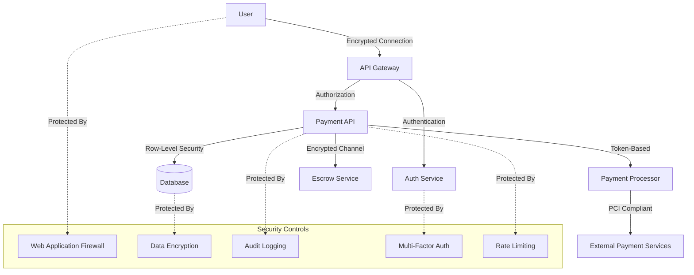
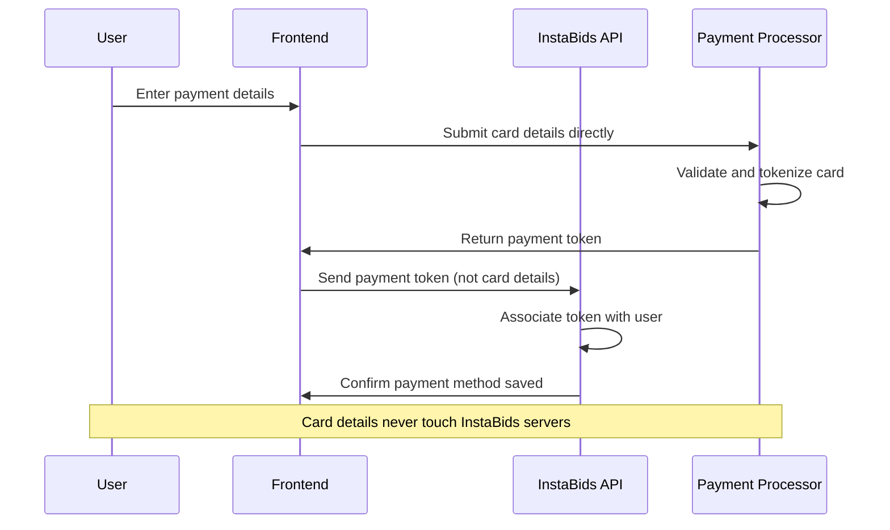

# Payment Processing Security Documentation

This document outlines the security measures, policies, and implementation details for the Payment Processing domain of the InstaBids platform. Due to the sensitive nature of financial transactions and personal payment information, this domain requires particularly strict security controls and compliance with financial regulations.

## Security Overview

The Payment Processing domain handles critical financial operations including:
- Payment method storage and processing
- Escrow account management
- Milestone payment releases
- Transaction processing
- Dispute handling
- Subscription management
- Withdrawal processing

Each of these operations presents unique security challenges that must be addressed through a combination of technical controls, business processes, and compliance measures.

## Security Architecture

### High-Level Security Flow



### Authentication & Authorization Model

Payment operations require additional security verification beyond standard platform authentication:

1. **Authentication Levels**
   - Standard platform authentication (JWT-based)
   - Enhanced authentication for payment operations
   - Step-up authentication for high-value transactions

2. **Authorization Model**
   - Role-based access controls (RBAC)
   - Fine-grained permission model for payment operations
   - Risk-based authorization for sensitive operations

3. **Multi-Factor Authentication Requirements**
   - Required for adding new payment methods
   - Required for withdrawals above configurable threshold
   - Required for modifying payout methods
   - Required for changing security settings

## Database Security

### Row-Level Security Policies

The following Row-Level Security (RLS) policies are implemented in the payment domain tables:

#### Payment Methods Table

```sql
-- Allow users to see and manage only their own payment methods
CREATE POLICY payment_methods_user_policy
    ON payment_methods
    FOR ALL
    TO authenticated
    USING (user_id = auth.uid());

-- Allow admins to see all payment methods for support purposes
CREATE POLICY payment_methods_admin_policy
    ON payment_methods
    FOR SELECT
    TO admin
    USING (true);

-- Allow payment service role to access all records
CREATE POLICY payment_methods_service_policy
    ON payment_methods
    FOR ALL
    TO payment_service
    USING (true);
```

#### Payment Transactions Table

```sql
-- Allow users to see only their own transactions
CREATE POLICY transactions_user_policy
    ON payment_transactions
    FOR SELECT
    TO authenticated
    USING (user_id = auth.uid());

-- Allow users to create transactions
CREATE POLICY transactions_user_insert_policy
    ON payment_transactions
    FOR INSERT
    TO authenticated
    WITH CHECK (user_id = auth.uid());

-- Allow admins to manage all transactions
CREATE POLICY transactions_admin_policy
    ON payment_transactions
    FOR ALL
    TO admin
    USING (true);

-- Allow payment service role to access all transactions
CREATE POLICY transactions_service_policy
    ON payment_transactions
    FOR ALL
    TO payment_service
    USING (true);
```

#### Escrow Accounts Table

```sql
-- Allow users to see only their own escrow accounts
CREATE POLICY escrow_accounts_user_policy
    ON escrow_accounts
    FOR SELECT
    TO authenticated
    USING (user_id = auth.uid());

-- Prevent direct modifications by users
CREATE POLICY escrow_accounts_no_modify_policy
    ON escrow_accounts
    FOR UPDATE
    TO authenticated
    USING (false); -- Disallow direct updates from users

-- Allow admins to manage all escrow accounts
CREATE POLICY escrow_accounts_admin_policy
    ON escrow_accounts
    FOR ALL
    TO admin
    USING (true);

-- Allow escrow service role to manage all accounts
CREATE POLICY escrow_accounts_service_policy
    ON escrow_accounts
    FOR ALL
    TO escrow_service
    USING (true);
```

#### Milestone Payments Table

```sql
-- Allow users to see milestone payments they're involved in (as payer or payee)
CREATE POLICY milestone_payments_user_policy
    ON milestone_payments
    FOR SELECT
    TO authenticated
    USING (payer_id = auth.uid() OR payee_id = auth.uid());

-- Allow homeowners to initiate payments
CREATE POLICY milestone_payments_payer_insert_policy
    ON milestone_payments
    FOR INSERT
    TO authenticated
    WITH CHECK (payer_id = auth.uid());

-- Restrict updates based on user role and payment status
CREATE POLICY milestone_payments_update_policy
    ON milestone_payments
    FOR UPDATE
    TO authenticated
    USING (
        (payer_id = auth.uid() AND status IN ('pending', 'funded')) OR
        (payee_id = auth.uid() AND status = 'disputed')
    );

-- Allow payment service to manage all milestone payments
CREATE POLICY milestone_payments_service_policy
    ON milestone_payments
    FOR ALL
    TO payment_service
    USING (true);
```

### Column-Level Encryption

Sensitive payment data is encrypted at the column level using the following approach:

```sql
-- Column encryption for payment methods
ALTER TABLE payment_methods
    ADD COLUMN encryption_details JSONB; -- Stores initialization vectors and other crypto metadata
    
-- Processor tokens and sensitive details are stored encrypted
-- The actual data is encrypted before storage and decrypted during retrieval using
-- application-layer encryption with key rotation
```

### Audit Logging

All payment operations are logged with an extensive audit trail:

```sql
CREATE TABLE payment_audit_logs (
    id UUID PRIMARY KEY DEFAULT uuid_generate_v4(),
    timestamp TIMESTAMP WITH TIME ZONE NOT NULL DEFAULT now(),
    operation VARCHAR(50) NOT NULL,
    entity_type VARCHAR(50) NOT NULL,
    entity_id UUID NOT NULL,
    user_id UUID NOT NULL,
    user_role VARCHAR(50) NOT NULL,
    ip_address VARCHAR(50),
    user_agent TEXT,
    old_values JSONB,
    new_values JSONB,
    success BOOLEAN NOT NULL,
    error_message TEXT,
    metadata JSONB
);

-- RLS policy to prevent modification of audit logs
CREATE POLICY audit_logs_no_delete_policy
    ON payment_audit_logs
    FOR DELETE
    TO authenticated
    USING (false); -- Prevent any deletion

CREATE POLICY audit_logs_no_update_policy
    ON payment_audit_logs
    FOR UPDATE
    TO authenticated
    USING (false); -- Prevent any updates

-- Only allow auditors and system admins to view logs
CREATE POLICY audit_logs_view_policy
    ON payment_audit_logs
    FOR SELECT
    TO authenticated
    USING (auth.uid() IN (
        SELECT id FROM users WHERE role IN ('auditor', 'system_admin')
    ));
```

## API Security

### Endpoint Security Matrix

The following security controls are applied to Payment API endpoints:

| Endpoint | Authentication | Authorization | Rate Limiting | Encryption | Audit Logging | MFA Required |
|----------|----------------|---------------|--------------|------------|--------------|-------------|
| `POST /payment-methods` | Required | User | Medium | High | Yes | Yes |
| `GET /payment-methods` | Required | User | Low | Medium | Yes | No |
| `DELETE /payment-methods/{id}` | Required | User | Medium | Medium | Yes | Yes |
| `POST /transactions` | Required | User | High | High | Yes | Conditional |
| `GET /transactions` | Required | User | Low | Medium | Yes | No |
| `POST /escrow/accounts` | Required | User | High | High | Yes | Yes |
| `GET /escrow/accounts` | Required | User | Medium | Medium | Yes | No |
| `POST /milestone-payments` | Required | Payer | Medium | High | Yes | Conditional |
| `POST /milestone-payments/{id}/release` | Required | Payer | High | High | Yes | Conditional |
| `POST /disputes` | Required | User | Medium | High | Yes | No |
| `POST /withdrawals` | Required | User | High | High | Yes | Yes |

### Request Validation

All payment API endpoints implement strict request validation:

1. **Input Sanitization**
   - Strict type checking
   - Field length limitations
   - Character whitelist enforcement
   - JSON schema validation

2. **Business Rule Validation**
   - Amount limits and thresholds
   - Operation timing restrictions
   - Account status verification
   - Balance sufficiency checks

3. **Anti-Fraud Checks**
   - Velocity checks
   - Pattern analysis
   - Unusual behavior detection
   - Limit enforcement

### Example Validation Implementation

```typescript
// Example of input validation for payment method creation
const validatePaymentMethodRequest = (req: PaymentMethodCreateRequest): ValidationResult => {
  const schema = Joi.object({
    paymentType: Joi.string().valid(
      'credit_card', 'debit_card', 'bank_account', 'paypal', 'stripe', 'apple_pay', 'google_pay'
    ).required(),
    name: Joi.string().max(255).optional(),
    // Token from secure payment form - never raw card details
    paymentToken: Joi.string().required(),
    isDefault: Joi.boolean().default(false),
    billingAddressId: Joi.string().uuid().optional(),
    metadata: Joi.object().optional()
  });
  
  return schema.validate(req);
};

// Example of business rule validation for milestone payment release
const validateMilestoneReleaseRequest = async (
  milestoneId: string, 
  userId: string
): Promise<ValidationResult> => {
  // Check if milestone exists and belongs to user
  const milestone = await getMilestonePayment(milestoneId);
  if (!milestone) {
    return { valid: false, error: 'Milestone payment not found' };
  }
  
  // Check if user is authorized to release
  if (milestone.payerId !== userId) {
    return { valid: false, error: 'Not authorized to release this payment' };
  }
  
  // Check milestone status
  if (milestone.status !== 'funded') {
    return { valid: false, error: 'Milestone payment is not in funded state' };
  }
  
  // Check for pending disputes
  const hasDisputes = await checkForDisputes(milestoneId);
  if (hasDisputes) {
    return { valid: false, error: 'Cannot release payment with active disputes' };
  }
  
  return { valid: true };
};
```

## Payment Data Handling

### PCI DSS Compliance

The InstaBids platform follows these approaches to maintain PCI DSS compliance:

1. **Card Data Flow Minimization**
   - Card data is never stored directly on InstaBids servers
   - All card processing is handled by PCI-compliant third-party processors
   - Tokenization is used for recurring payments
   - Card detail entry occurs in processor-hosted forms or SDKs

2. **PCI Scope Reduction**
   - Network segmentation between payment and non-payment systems
   - Use of iFrames for payment form isolation
   - Implementation of SAQ A or SAQ A-EP compliance requirements
   - Annual PCI compliance assessments

### Tokenization Architecture



### Data Classification and Handling

Payment data is classified and handled according to the following framework:

| Data Category | Classification | Storage Approach | Access Controls | Retention Policy |
|---------------|---------------|------------------|-----------------|------------------|
| Payment Tokens | Restricted | Encrypted | Service Account Only | Until Removal |
| Transaction Records | Sensitive | Encrypted | User + Support | 7 Years |
| Payment Metadata | Internal | Standard | User + Support | 7 Years |
| Account Balances | Sensitive | Encrypted | User + Finance | Permanent |
| Dispute Information | Sensitive | Encrypted | Parties + Support | 7 Years |
| Audit Logs | Restricted | Immutable Storage | Auditors Only | 10 Years |

## External Integration Security

### Payment Processor Integration

Integration with external payment processors follows these security principles:

1. **Secure Credential Management**
   - API keys stored in secure key management service
   - Keys rotated on regular schedule
   - Different keys for production/staging/development
   - Least-privilege access model for API credentials

2. **Communication Security**
   - TLS 1.2+ for all API communications
   - Certificate pinning for payment processor APIs
   - IP whitelisting where supported
   - Signed API requests

3. **Webhook Security**
   - HMAC signature verification for all webhooks
   - Idempotency key checking
   - Timestamp validation
   - Request replay protection

### Example Webhook Verification

```typescript
// Example webhook signature verification
const verifyStripeWebhook = (
  payload: string,
  signature: string,
  secret: string
): boolean => {
  try {
    // Using crypto library to verify HMAC signature
    const hmac = crypto.createHmac('sha256', secret);
    const expectedSignature = hmac.update(payload).digest('hex');
    
    // Constant-time comparison to prevent timing attacks
    return crypto.timingSafeEqual(
      Buffer.from(expectedSignature),
      Buffer.from(signature)
    );
  } catch (error) {
    logger.error('Webhook signature verification failed', error);
    return false;
  }
};

// Webhook handler with verification
app.post('/webhooks/stripe', (req, res) => {
  const signature = req.headers['stripe-signature'];
  const payload = req.rawBody;
  
  if (!verifyStripeWebhook(payload, signature, STRIPE_WEBHOOK_SECRET)) {
    logger.warn('Invalid webhook signature received');
    return res.status(401).send('Invalid signature');
  }
  
  // Process the webhook...
  processStripeWebhook(JSON.parse(payload));
  
  res.status(200).send('Webhook received');
});
```

## Threat Modeling & Mitigations

### Key Payment Security Threats

The following threats have been identified for the Payment domain, along with mitigations:

| Threat | Attack Vector | Risk Level | Mitigation Approach |
|--------|---------------|------------|---------------------|
| Unauthorized Transactions | Account Takeover | Critical | MFA, anomaly detection, amount limits |
| Payment Info Theft | Data Breach | Critical | Tokenization, encryption, PCI controls |
| Escrow Fund Redirection | System Compromise | High | Dual control, reconciliation, audit trails |
| Transaction Tampering | API Manipulation | High | Signature validation, business rule enforcement |
| Chargeback Fraud | Customer Dispute | Medium | Evidence collection, dispute process |
| Payment Method Testing | Automated Attacks | Medium | Rate limiting, CAPTCHA, pattern detection |
| Fake Milestone Completion | Platform Abuse | Medium | Review process, hold periods, dispute resolution |
| Processing Fee Manipulation | Rate Tampering | Low | Server-side calculation, audit logging |

### Security-Focused User Stories

The payment system is designed to address the following security-focused user stories:

1. As a user, I want my payment information to remain secure, so that my financial data is not exposed.
2. As a homeowner, I want confirmation when I initiate a payment, so that I can prevent accidental charges.
3. As a contractor, I want notification of pending payments, so that I can confirm expected amounts.
4. As a user, I want to verify my identity before adding payment methods, so that others cannot add methods to my account.
5. As a user, I want to be notified of all payment activities, so that I can detect unauthorized transactions.
6. As a platform operator, I want to detect unusual payment patterns, so that I can prevent fraud.
7. As an auditor, I want complete transaction logs, so that I can verify financial compliance.

## Security Monitoring & Incident Response

### Security Monitoring

The payment system includes the following monitoring controls:

1. **Real-time Alerting**
   - Transaction amount thresholds
   - Unusual payment method activity
   - Geographic anomalies
   - Velocity monitoring (transaction frequency)
   - After-hours activity

2. **Scheduled Reviews**
   - Daily transaction reconciliation
   - Weekly fee processing accuracy review
   - Monthly dispute pattern analysis
   - Quarterly security control assessment

3. **Continuous Monitoring**
   - Failed payment attempt patterns
   - API error rates
   - Service account activity
   - Database access patterns
   - Payment processor status

### Incident Response Plan

In the event of a payment security incident:

1. **Immediate Response (0-2 hours)**
   - Assess incident scope and impact
   - Contain affected systems
   - Suspend related transactions if necessary
   - Notify security team and designated incident commander
   - Preserve forensic evidence

2. **Investigation & Remediation (2-24 hours)**
   - Conduct root cause analysis
   - Identify affected users and transactions
   - Implement temporary security controls
   - Develop remediation plan
   - Prepare communications

3. **Recovery & Notification (24-72 hours)**
   - Restore services with enhanced controls
   - Notify affected users as appropriate
   - Process any necessary payment adjustments
   - Implement permanent security improvements
   - Update incident response documentation

4. **Post-Incident (1-2 weeks)**
   - Conduct incident review and lessons learned
   - Update security controls based on findings
   - Enhance monitoring for similar patterns
   - Share anonymized learnings with security team
   - Update security training materials

## Compliance Framework

### Regulatory Requirements

The payment system is designed to comply with:

1. **Payment Card Industry Data Security Standard (PCI DSS)**
   - Requirements for secure card data handling
   - Network security controls
   - Vulnerability management
   - Access control requirements
   - Monitoring and testing

2. **Anti-Money Laundering (AML) Requirements**
   - Know Your Customer (KYC) procedures
   - Transaction monitoring
   - Suspicious activity reporting
   - Recordkeeping requirements

3. **General Data Protection Regulation (GDPR)**
   - Payment data as personal information
   - User consent requirements
   - Data minimization principles
   - Right to erasure considerations

4. **State and Local Payment Regulations**
   - Money transmitter requirements
   - Fee disclosure requirements
   - Consumer protection regulations
   - Escrow account regulations

### Compliance Controls Matrix

| Requirement | Control Implementation | Verification Method | Responsible Party |
|-------------|------------------------|---------------------|-------------------|
| PCI DSS 3.2.1 | Tokenization of card data | Annual assessment | Security Team |
| PCI DSS 4.1 | TLS for data transmission | Quarterly scans | Infrastructure Team |
| PCI DSS 6.5 | Secure coding practices | Code reviews | Development Team |
| PCI DSS 10.2 | Audit logging of access | Log reviews | Security Team |
| AML - KYC | Identity verification | Process audit | Compliance Team |
| AML - Monitoring | Transaction screening | System testing | Data Science Team |
| GDPR - Consent | Payment method opt-in | UI review | Product Team |
| GDPR - Erasure | Data deletion procedures | Process testing | Data Team |

## Security Implementation Guidelines

### Developer Guidelines

When implementing payment functionality, developers must:

1. **Never process raw payment details**
   - Always use the payment processor SDK/API
   - Implement client-side tokenization
   - Avoid logging or displaying full payment details

2. **Implement proper validation**
   - Validate all input on the server side
   - Enforce business rules and limits
   - Check for duplicate transaction IDs
   - Verify mathematical calculations server-side

3. **Follow secure coding standards**
   - Parameterized queries for database access
   - Output encoding for all dynamic content
   - Secure error handling without data exposure
   - Regular dependency security updates

4. **Implement proper logging**
   - Log all payment events for audit
   - Avoid including sensitive details in logs
   - Include correlation IDs for transaction tracing
   - Maintain proper log retention policies

### Security Testing Requirements

All payment functionality must undergo:

1. **Static Application Security Testing (SAST)**
   - Run during CI/CD pipeline
   - Security-focused code reviews
   - Regular dependency scanning

2. **Dynamic Application Security Testing (DAST)**
   - Pre-release scanning of payment flows
   - API security testing
   - Authentication and authorization testing

3. **Payment-Specific Testing**
   - Boundary testing of amount limits
   - Negative testing of payment flows
   - Reconciliation testing
   - Concurrency and race condition testing

4. **Security Penetration Testing**
   - Annual third-party penetration testing
   - Simulated attack scenarios
   - Payment flow manipulation attempts
   - Authentication bypass attempts

## Security Implementation in Supabase

InstaBids uses Supabase as the primary backend platform. The following specific Supabase security features are utilized for payment security:

### Row-Level Security Implementation

Supabase RLS policies are implemented for all payment tables:

```sql
-- Example implementation of the Milestone Payments RLS
ALTER TABLE milestone_payments ENABLE ROW LEVEL SECURITY;

-- Policy for viewing milestone payments
CREATE POLICY "Users can view their own milestone payments" ON milestone_payments
  FOR SELECT USING (
    auth.uid() = payer_id OR auth.uid() = payee_id
  );

-- Policy for creating milestone payments
CREATE POLICY "Payers can create milestone payments" ON milestone_payments
  FOR INSERT WITH CHECK (
    auth.uid() = payer_id AND
    -- Verify the milestone exists and belongs to a project the user owns
    EXISTS (
      SELECT 1 FROM project_milestones pm
      JOIN projects p ON pm.project_id = p.id
      WHERE pm.id = milestone_id AND p.owner_id = auth.uid()
    )
  );

-- Policy for updating milestone payments
CREATE POLICY "Payers can update milestone payment status" ON milestone_payments
  FOR UPDATE USING (
    auth.uid() = payer_id AND
    (status = 'pending' OR status = 'funded')
  ) WITH CHECK (
    -- Only allow status changes to specific values
    (NEW.status IN ('funded', 'canceled') AND status = 'pending') OR
    (NEW.status = 'released' AND status = 'funded')
  );
```

### Edge Functions for Payment Logic

Sensitive payment logic is implemented in Supabase Edge Functions:

```typescript
// Example Edge Function for processing a milestone payment
import { serve } from 'https://deno.land/std@0.168.0/http/server.ts';
import { createClient } from 'https://esm.sh/@supabase/supabase-js@2.7.1';
import { stripe } from './lib/stripe.ts';

serve(async (req) => {
  try {
    // Initialize Supabase client with auth context from request
    const supabaseClient = createClient(
      Deno.env.get('SUPABASE_URL') ?? '',
      Deno.env.get('SUPABASE_ANON_KEY') ?? '',
      { global: { headers: { Authorization: req.headers.get('Authorization')! } } }
    );
    
    // Get the authenticated user
    const { data: { user } } = await supabaseClient.auth.getUser();
    if (!user) {
      return new Response(JSON.stringify({ error: 'Unauthorized' }), { 
        status: 401, headers: { 'Content-Type': 'application/json' } 
      });
    }

    // Process the payment request
    const { milestoneId, paymentMethodId } = await req.json();
    
    // Validate the milestone belongs to the user
    const { data: milestone, error: milestoneError } = await supabaseClient
      .from('milestone_payments')
      .select('*, project:projects(*)')
      .eq('id', milestoneId)
      .eq('payer_id', user.id)
      .eq('status', 'pending')
      .single();
      
    if (milestoneError || !milestone) {
      return new Response(JSON.stringify({ error: 'Invalid milestone' }), { 
        status: 400, headers: { 'Content-Type': 'application/json' } 
      });
    }
    
    // Get payment method
    const { data: paymentMethod } = await supabaseClient
      .from('payment_methods')
      .select('*')
      .eq('id', paymentMethodId)
      .eq('user_id', user.id)
      .single();
      
    if (!paymentMethod) {
      return new Response(JSON.stringify({ error: 'Invalid payment method' }), { 
        status: 400, headers: { 'Content-Type': 'application/json' } 
      });
    }
    
    // Process payment with Stripe
    const paymentIntent = await stripe.paymentIntents.create({
      amount: Math.round(milestone.amount * 100), // Convert to cents
      currency: 'usd',
      payment_method: paymentMethod.processor_token,
      confirm: true,
      customer: paymentMethod.processor_customer_id,
      metadata: {
        milestoneId: milestone.id,
        projectId: milestone.project.id,
        userId: user.id
      }
    });
    
    if (paymentIntent.status === 'succeeded') {
      // Update milestone status
      const { data: updatedMilestone, error: updateError } = await supabaseClient
        .from('milestone_payments')
        .update({ 
          status: 'funded',
          payment_transaction_id: paymentIntent.id,
          updated_at: new Date().toISOString()
        })
        .eq('id', milestoneId)
        .select()
        .single();
        
      if (updateError) {
        // Payment succeeded but milestone update failed - handle this edge case
        await logPaymentInconsistency(milestone.id, paymentIntent.id, updateError);
        return new Response(JSON.stringify({ 
          warning: 'Payment processed but status update delayed',
          paymentStatus: 'succeeded' 
        }), { 
          status: 200, headers: { 'Content-Type': 'application/json' } 
        });
      }
      
      // Log successful transaction
      await createAuditLog({
        operation: 'milestone_payment_funded',
        entity_type: 'milestone_payment',
        entity_id: milestone.id,
        user_id: user.id,
        success: true,
        new_values: { status: 'funded', transaction_id: paymentIntent.id }
      });
      
      return new Response(JSON.stringify({ 
        success: true, 
        milestone: updatedMilestone 
      }), { 
        status: 200, headers: { 'Content-Type': 'application/json' } 
      });
    } else {
      // Payment failed
      return new Response(JSON.stringify({ 
        error: 'Payment processing failed',
        status: paymentIntent.status
      }), { 
        status: 400, headers: { 'Content-Type': 'application/json' } 
      });
    }
  } catch (error) {
    // Log the error
    console.error('Payment processing error:', error);
    
    return new Response(JSON.stringify({ 
      error: 'An unexpected error occurred' 
    }), { 
      status: 500, headers: { 'Content-Type': 'application/json' } 
    });
  }
});

// Helper function to log payment inconsistencies that need manual reconciliation
async function logPaymentInconsistency(milestoneId, transactionId, error) {
  // Log to a special table for operations team to reconcile
  // This would be implemented based on your specific error handling needs
}

// Helper function to create audit logs
async function createAuditLog(logData) {
  // Implementation would depend on your audit logging approach
}
```

### Webhook Handlers

Secure webhook handlers for payment callbacks:

```typescript
// Example Stripe webhook handler as a Supabase Edge Function
import { serve } from 'https://deno.land/std@0.168.0/http/server.ts';
import { createClient } from 'https://esm.sh/@supabase/supabase-js@2.7.1';
import Stripe from 'stripe';

serve(async (req) => {
  try {
    const stripe = new Stripe(Deno.env.get('STRIPE_SECRET_KEY') ?? '', {
      apiVersion: '2022-11-15',
    });
    
    // Get the signature from the headers
    const signature = req.headers.get('stripe-signature');
    if (!signature) {
      return new Response(JSON.stringify({ error: 'No signature provided' }), { 
        status: 400, headers: { 'Content-Type': 'application/json' } 
      });
    }
    
    // Get the raw request body
    const body = await req.text();
    
    // Verify the webhook signature
    let event;
    try {
      event = stripe.webhooks.constructEvent(
        body,
        signature,
        Deno.env.get('STRIPE_WEBHOOK_SECRET') ?? ''
      );
    } catch (err) {
      return new Response(JSON.stringify({ error: `Webhook signature verification failed: ${err.message}` }), { 
        status: 400, headers: { 'Content-Type': 'application/json' } 
      });
    }
    
    // Initialize Supabase client (service role required for admin actions)
    const supabaseAdmin = createClient(
      Deno.env.get('SUPABASE_URL') ?? '',
      Deno.env.get('SUPABASE_SERVICE_ROLE_KEY') ?? ''
    );
    
    // Handle the event
    switch (event.type) {
      case 'payment_intent.succeeded':
        await handleSuccessfulPayment(event.data.object, supabaseAdmin);
        break;
      case 'payment_intent.payment_failed':
        await handleFailedPayment(event.data.object, supabaseAdmin);
        break;
      case 'payout.paid':
        await handleSuccessfulPayout(event.data.object, supabaseAdmin);
        break;
      // Add other event types as needed
      default:
        // Unexpected event type
        console.log(`Unhandled event type ${event.type}`);
    }
    
    // Return a response to acknowledge receipt of the event
    return new Response(JSON.stringify({ received: true }), { 
      status: 200, headers: { 'Content-Type':
