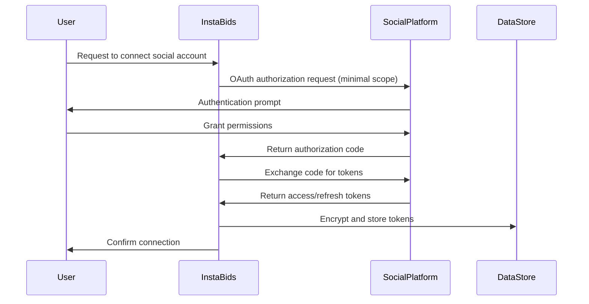
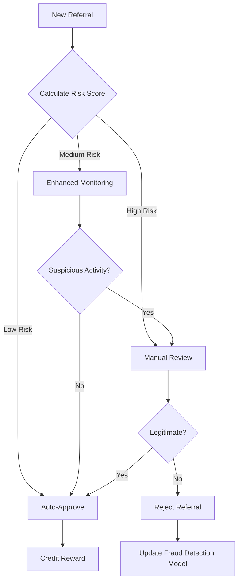

# Social Sharing & Referrals Security Documentation

This document outlines the security considerations, measures, and best practices for the Social Sharing & Referrals domain of the InstaBids platform.

## Overview

The Social Sharing & Referrals domain handles sensitive user data, integrates with external social platforms, and manages referral incentives. These features introduce unique security challenges that require careful consideration to protect user privacy, prevent fraud, and maintain platform integrity.

## Key Security Considerations

### User Privacy in Social Sharing

| Risk Area | Potential Threats | Security Measures |
|-----------|-------------------|-------------------|
| Project Sharing | Unintended exposure of private project details | Granular permission controls for what aspects of projects can be shared publicly |
| User Attribution | Unwanted visibility of referral activities | Option to make referrals anonymous; private referral statistics |
| Social Content | Automated data harvesting from shared content | Rate limiting; obfuscation of sensitive data in shared content |
| External Platform Data | Excessive data access by social platforms | Minimal scope OAuth requests; proxy image/content sharing |

### OAuth Integration Security

The system integrates with various social media platforms through OAuth for seamless sharing capabilities:

Security measures for OAuth integrations:

1. **Token Storage**
   - All OAuth tokens (access and refresh) are encrypted at rest using AES-256
   - Tokens are never exposed to frontend clients
   - Refresh tokens are rotated regularly

2. **Scope Limitations**
   - Request minimal permissions required for functionality (read-only when possible)
   - Never request permissions to post without explicit user consent
   - Store permission scopes with tokens for validation

3. **Platform-Specific Security**
   - Implement platform-specific security measures (e.g., PKCE for mobile flows)
   - Register valid redirect URIs with each platform
   - Validate state parameters to prevent CSRF attacks

### Referral Fraud Prevention

Referral programs are susceptible to various forms of abuse and fraud:

| Fraud Type | Description | Prevention Measures |
|------------|-------------|---------------------|
| Self-Referrals | Users referring themselves through multiple accounts | Device fingerprinting; IP tracking; payment method verification |
| Referral Farms | Organized groups creating fake accounts for rewards | ML-based detection of account patterns; gradual reward unlock |
| Coupon Abuse | Sharing/selling referral codes inappropriately | Single-use codes; user-specific codes; tracking distribution channels |
| Qualifying Action Manipulation | Gaming the system to trigger rewards | Multi-stage verification; admin review for high-value rewards |

The fraud prevention system uses a risk scoring model:

### UTM Parameter & Tracking Security

The system uses UTM parameters for tracking share effectiveness and attributing conversions:

1. **Data Minimization**
   - Only essential tracking parameters are used
   - PII is never included in tracking parameters

2. **Parameter Validation**
   - All tracking parameters are validated before processing
   - Parameters are checked for injection attempts

3. **Third-Party Tracking Limitations**
   - No third-party tracking pixels in shared content without clear disclosure
   - Option for users to disable tracking on content they share

## Access Control

### Permission Model

| Role | Create Referral Program | Generate Referral Code | View Program Analytics | Modify Sharing Settings |
|------|-------------------------|------------------------|------------------------|-------------------------|
| System Admin | ✅ | ✅ | ✅ | ✅ |
| Marketing Admin | ✅ | ✅ | ✅ | ❌ |
| Platform User | ❌ | ✅ | Limited (own data) | Limited (own projects) |
| Guest User | ❌ | ❌ | ❌ | ❌ |

### API Security

1. **Endpoint Protection**
   - All `/referral-programs/*` endpoints require admin authentication
   - User-level endpoints enforce ownership validation
   - Rate limiting on code generation and validation endpoints

2. **Input Validation**
   - Strict schema validation for all API inputs
   - Sanitization of user-provided content before storage
   - Prevention of malicious content in shared messages

## Data Protection

### Sensitive Data Handling

| Data Category | Classification | Storage Approach | Retention Period |
|---------------|----------------|------------------|------------------|
| OAuth Tokens | Highly Sensitive | Encrypted, access-logged | Until disconnection or expiry |
| Referral Relationships | Sensitive | Pseudonymized | Platform lifetime + 1 year |
| Sharing Analytics | Business Confidential | Aggregated for long-term storage | Raw: 90 days, Aggregated: Indefinite |
| Reward History | Sensitive | Immutable, auditable | 7 years (financial records) |

### Encryption Standards

1. **Data in Transit**
   - TLS 1.3 for all API communications
   - Certificate pinning for mobile applications

2. **Data at Rest**
   - OAuth credentials: AES-256 encryption
   - Database-level encryption for PII
   - Encrypted backups

## Audit Trail

The system maintains comprehensive audit logs for security-relevant actions:

1. **Logged Actions**
   - Referral program creation and modification
   - Reward issuance and redemption
   - Social account connections and disconnections
   - Sharing settings changes

2. **Log Format**
   - Timestamp
   - Actor (user or system ID)
   - Action type
   - Relevant identifiers
   - IP address
   - Device information

3. **Log Protection**
   - Immutable storage
   - Access controls on audit logs
   - Regular reviews for suspicious patterns

## Incident Response Plan

### Potential Incidents

1. **OAuth Token Compromise**
   - Immediate token revocation
   - Notification to affected users
   - Force reconnection of social accounts

2. **Referral Fraud Detection**
   - Temporary suspension of affected referral programs
   - Investigation of suspicious patterns
   - Recovery of fraudulently obtained rewards

3. **Unintended Data Sharing**
   - Takedown of shared content links
   - User notification
   - Review of sharing permission controls

### Response Procedures

1. **Detection**
   - Automated monitoring for unusual patterns
   - User-reported issues
   - Regular security audits

2. **Containment**
   - Isolate affected systems or users
   - Temporarily disable vulnerable features
   - Revoke compromised credentials

3. **Eradication & Recovery**
   - Remove vulnerability source
   - Restore from secure backups if needed
   - Implement additional safeguards

4. **Communication**
   - Notify affected users within 24 hours
   - Document incident details for internal review
   - Report to relevant authorities if required

## Security Testing

### Testing Methodologies

1. **Regular Testing**
   - Quarterly penetration testing of social integration features
   - Monthly fraud simulation exercises
   - Continuous vulnerability scanning

2. **Focus Areas**
   - OAuth implementation review
   - Referral fraud scenarios
   - Permission boundaries
   - Input validation and sanitization

### Responsible Disclosure

The platform maintains a responsible disclosure program for security researchers to report vulnerabilities in the social sharing and referrals systems.

## Compliance Considerations

The social sharing and referrals domain must comply with:

1. **Privacy Regulations**
   - GDPR: Ensure transparent data usage in sharing
   - CCPA: Allow users to opt out of tracking
   - Platform-specific terms of service compliance

2. **Financial Regulations**
   - Tax implications of referral rewards
   - Anti-money laundering considerations for cash rewards
   - Gift card and promotion regulations

3. **Social Platform Policies**
   - Adherence to each platform's developer policies
   - Regular review of policy changes
   - Compliant implementation of sharing mechanisms

## Security Roadmap

| Timeline | Planned Improvement | Priority |
|----------|---------------------|----------|
| Q2 2025 | Implement advanced fraud detection ML model | High |
| Q3 2025 | Enhanced social platform permission management | Medium |
| Q4 2025 | Improve real-time monitoring of sharing activities | Medium |
| Q1 2026 | Zero-knowledge proof for referral relationships | Low |

## Integration with System-Wide Security

The Social Sharing & Referrals security measures work in conjunction with system-wide security controls:

1. **Authentication Integration**
   - Leverages core authentication system
   - Honors session timeouts and invalidation

2. **Data Protection**
   - Follows system-wide encryption standards
   - Integrates with data classification policies

3. **Monitoring**
   - Events feed into centralized security monitoring
   - Correlation with other system events for threat detection
