# User Management Security Documentation

This document outlines the security architecture, threat model, and protection mechanisms for the User Management domain of the InstaBids platform. It includes authentication, authorization, identity management, data protection, and security compliance considerations.

## Security Overview

The User Management domain is foundational to the overall security posture of the InstaBids platform, handling sensitive user data, authentication credentials, and authorization policies. It serves as the trust anchor for the entire system and must implement robust security controls to protect user identities and maintain platform integrity.

## Threat Model

### Key Assets to Protect

1. **User Authentication Data**
   - Passwords and credential hashes
   - Multi-factor authentication secrets
   - Session tokens and refresh tokens
   - Social login connections

2. **Identity Information**
   - Personal identifiable information (PII)
   - Contact information
   - Professional credentials and certifications
   - Verification documents

3. **Account Settings**
   - Privacy preferences
   - Communication settings
   - Account recovery information
   - Connected accounts and integrations

4. **Role & Permission Assignments**
   - User type designations
   - Role assignments across projects
   - Custom permission configurations
   - Administrative access controls

5. **User Activity Data**
   - Login history and locations
   - Account actions and changes
   - Failed authentication attempts
   - Device and browser fingerprints

### Threat Actors

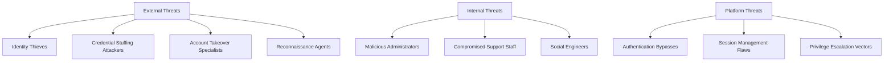

#### External Threat Actors

| Actor | Motivation | Capability | Target Assets |
|-------|------------|------------|---------------|
| Identity Thieves | Financial fraud, reputation damage | Medium | PII, contact information, verification documents |
| Credential Stuffing Attackers | Account takeover, platform access | High | Authentication data, session tokens |
| Account Takeover Specialists | Fraud, data access, hijacking | High | Authentication data, account settings, recovery info |
| Reconnaissance Agents | Information gathering for targeted attacks | Medium | User activity data, PII, role assignments |

#### Internal Threat Actors

| Actor | Motivation | Capability | Target Assets |
|-------|------------|------------|---------------|
| Malicious Administrators | Data theft, targeted abuse | Very High | All user data, role permissions, authentication systems |
| Compromised Support Staff | Financial gain, external pressure | High | PII, account settings, verification documents |
| Social Engineers | Account access, privilege escalation | Medium | Account recovery mechanisms, connected accounts |

#### Platform Threats

| Actor | Motivation | Capability | Target Assets |
|-------|------------|------------|---------------|
| Authentication Bypasses | N/A (system vulnerabilities) | Variable | Authentication data, session management |
| Session Management Flaws | N/A (system vulnerabilities) | Variable | Session tokens, authenticated state |
| Privilege Escalation Vectors | N/A (system vulnerabilities) | Variable | Role & permission assignments |

### Attack Vectors

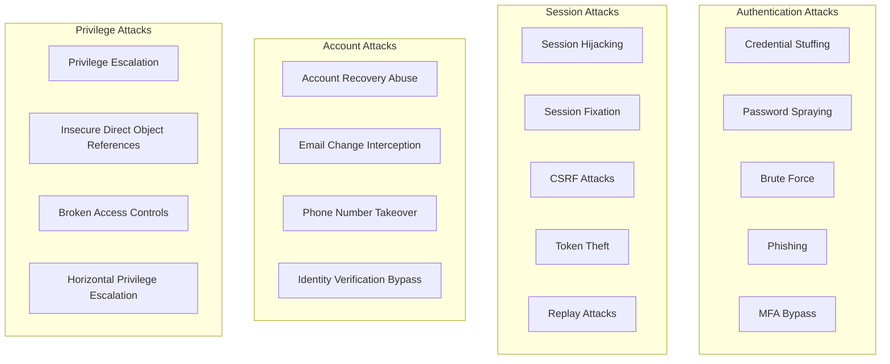

### Attack Risk Assessment

| Attack Category | Attack Vector | Impact | Likelihood | Countermeasures |
|-----------------|---------------|--------|------------|-----------------|
| Authentication Attacks | Credential Stuffing | High | High | Rate limiting, anomaly detection, CAPTCHA, MFA |
| | Password Spraying | High | Medium | Account lockouts, password complexity, MFA |
| | Brute Force | High | Low | Rate limiting, progressive delays, account lockouts |
| | Phishing | Very High | Medium | Security education, suspicious login alerts, MFA |
| | MFA Bypass | Very High | Low | Multiple MFA methods, phishing-resistant MFA |
| Session Attacks | Session Hijacking | High | Medium | HTTPS, secure cookies, short session timeouts |
| | Session Fixation | High | Low | Session regeneration, secure session creation |
| | CSRF Attacks | Medium | Medium | Anti-CSRF tokens, SameSite cookies |
| | Token Theft | High | Medium | HTTPOnly cookies, token binding, short lifetimes |
| | Replay Attacks | Medium | Low | Nonces, timestamps, token refreshing |
| Account Attacks | Account Recovery Abuse | High | Medium | Multi-channel verification, cool-down periods |
| | Email Change Interception | High | Medium | Multi-factor verification for email changes |
| | Phone Number Takeover | High | Medium | Alternative verification methods, cooling periods |
| | Identity Verification Bypass | Very High | Low | Multi-layered verification, manual reviews |
| Privilege Attacks | Privilege Escalation | Very High | Medium | Strict RBAC, permission checks at all layers |
| | Insecure Direct Object References | High | Medium | Resource-based authorization, UUID identifiers |
| | Broken Access Controls | High | Medium | Centralized access control, consistent enforcement |
| | Horizontal Privilege Escalation | High | Medium | User isolation, contextual permissions |

## Authentication Architecture

### Authentication Methods

The User Management domain implements a defense-in-depth approach to authentication with multiple methods:

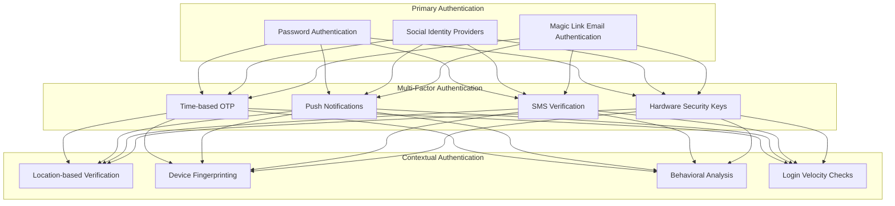

#### Primary Authentication Methods

| Method | Implementation | Security Considerations | Recovery Mechanism |
|--------|----------------|-------------------------|-------------------|
| Password Authentication | Argon2id hashing with per-user salt | Minimum complexity requirements, breach database checking | Email-based recovery with verification challenges |
| Social Identity Providers | OAuth 2.0 with PKCE flow | Limited permission scopes, ID token validation | Alternative authentication method |
| Magic Link Email Authentication | Time-limited signed tokens | Short expiration, single-use, link binding | Alternative authentication method |

#### Multi-Factor Authentication

| Method | Implementation | Security Considerations | Recovery Mechanism |
|--------|----------------|-------------------------|-------------------|
| Time-based OTP | RFC 6238 TOTP implementation | Secure seed storage, time drift handling | Backup codes, alternative MFA method |
| Push Notifications | Public key-based signed challenges | Device attestation, connection verification | Alternative MFA method, backup codes |
| SMS Verification | One-time codes via SMS | SIM swapping risks, rate limiting | Alternative MFA method, backup codes |
| Hardware Security Keys | FIDO2/WebAuthn standard | Phishing resistance, strong attestation | Backup security key, alternative MFA |

#### Contextual Authentication

| Factor | Implementation | Security Enhancement | User Experience Impact |
|--------|----------------|---------------------|------------------------|
| Location-based Verification | IP geolocation with historical comparison | Step-up auth for unusual locations | Additional verification in ~5% of logins |
| Device Fingerprinting | Canvas fingerprinting, hardware signals | Step-up auth for new devices | Additional verification for new devices |
| Behavioral Analysis | Typing patterns, interaction model | Risk scoring to trigger additional verification | Transparent except in high-risk cases |
| Login Velocity Checks | Time-distance analysis between logins | Block impossible travel patterns | Rare verification prompts |

### Session Management

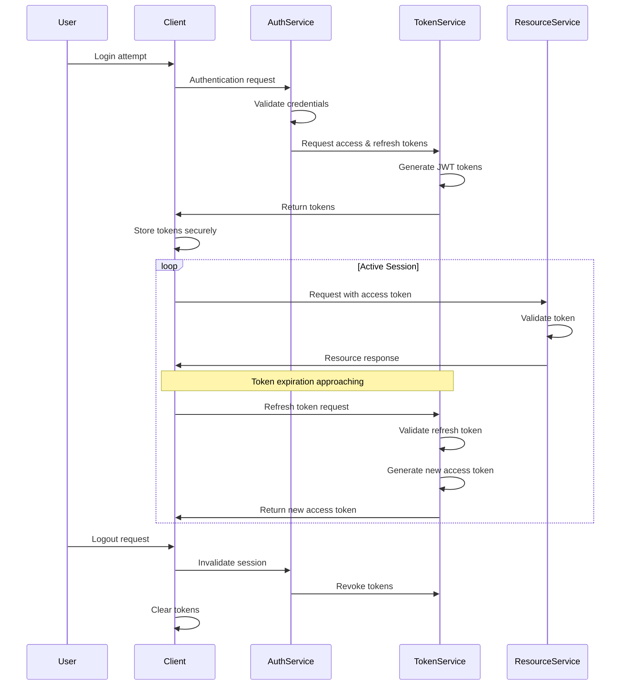

#### Token Architecture

1. **Access Tokens**
   - Short-lived JWT (15 minutes)
   - Stateless validation
   - Contains user ID, roles, permissions
   - Signed with RS256

2. **Refresh Tokens**
   - Longer-lived (7 days)
   - Securely stored in HTTPOnly, Secure cookies
   - Single-use with automatic rotation
   - Server-side invalidation capability

3. **ID Tokens**
   - Contains user identity information
   - Used for client-side personalization
   - Short lifespan synchronized with access token

#### Session Security Controls

| Control | Implementation | Purpose |
|---------|----------------|---------|
| Token Binding | Device fingerprint inclusion in token | Prevent token replay across devices |
| Absolute Session Limits | 7-day maximum session lifetime | Limit exposure from compromised tokens |
| Activity Timeouts | 30-minute inactivity timeout | Reduce risk from unattended sessions |
| Concurrent Session Management | Session registry with visibility & revocation | Control and limit active sessions |
| Forced Re-authentication | Periodic re-auth for sensitive operations | Defense in depth for critical actions |

### Password Policy and Management

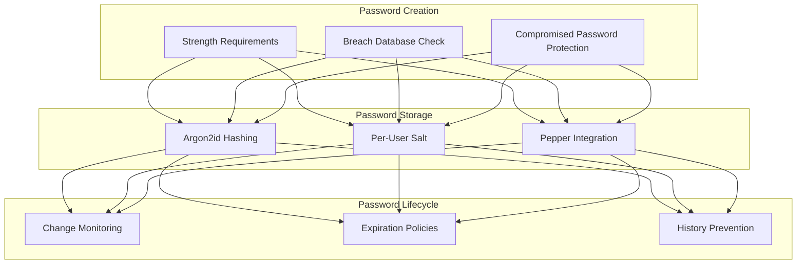

#### Password Requirements

| Requirement | Implementation | Rationale |
|-------------|----------------|-----------|
| Minimum Length | 12 characters | Resist brute force attacks |
| Complexity | zxcvbn scoring algorithm (min score 3) | Focus on entropy rather than character classes |
| Breach Database | Check against HaveIBeenPwned API | Prevent use of known compromised passwords |
| Allowed Pattern | No email/name/obvious patterns | Prevent easily guessable passwords |

#### Password Storage

| Technique | Implementation | Security Benefit |
|-----------|----------------|-----------------|
| Hashing Algorithm | Argon2id with tuned parameters | Memory-hard algorithm resistant to specialized hardware |
| Salting | Random per-user 16-byte salt | Prevent rainbow table attacks |
| Peppering | Application-wide encryption key | Additional protection if database is compromised |
| Work Factor | Tuned for 250ms on server hardware | Balance security vs. performance |

#### Password Reset Process

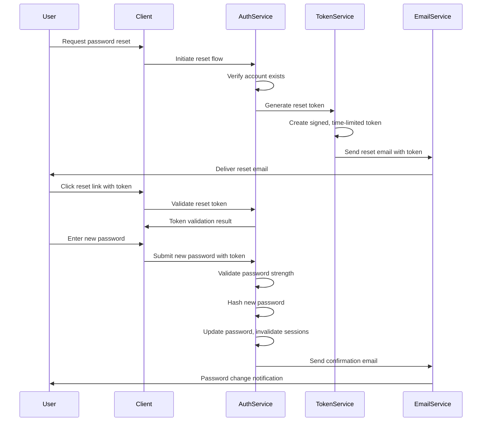

#### Password Reset Security Controls

| Control | Implementation | Security Benefit |
|---------|----------------|-----------------|
| Time-Limited Tokens | 15-minute expiration | Reduce exposure window |
| Single-Use Tokens | One-time use with invalidation | Prevent token reuse |
| Rate Limiting | Account-based limits | Prevent reset enumeration attacks |
| Notification | Email alerts for password changes | Early warning of unauthorized changes |
| Session Invalidation | Terminate all sessions on password change | Contain potential compromise |

## User Identity Management

### User Registration and Verification

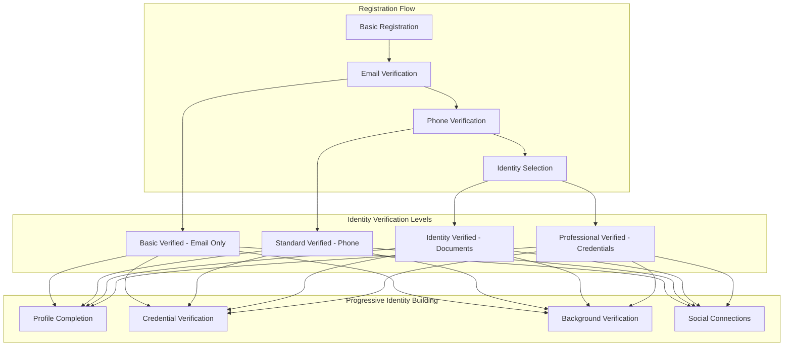

#### Verification Methods and Security

| Verification Level | Required Information | Verification Process | Security Controls |
|-------------------|---------------------|---------------------|-------------------|
| Basic | Email | Email validation link | Rate limiting, disposable email blocking |
| Standard | Phone number | SMS verification code | SIM swap protection, number validation |
| Identity | Government ID, selfie | Document scan, biometric matching | Tamper detection, liveness checks, manual review |
| Professional | Professional licenses | Credential verification, reference checks | Authority verification, expiration monitoring |

#### User Identity Progressive Disclosure

1. **Registration Phase**
   - Collect minimal information (email, name)
   - Focus on quick onboarding with essential verification

2. **Account Activation**
   - Email verification required for basic actions
   - Phone verification for financial operations

3. **Trust Building**
   - Progressive identity verification based on platform activities
   - Step-up verification for high-value transactions or roles

4. **Professional Verification**
   - Specialized verification for contractors and service providers
   - Credential verification proportional to service category

### Profile Data Security

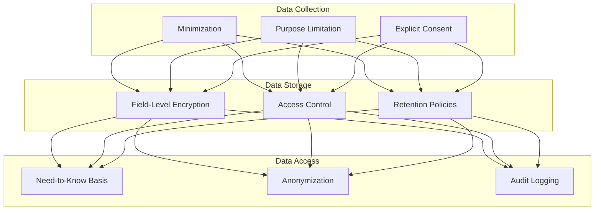

#### Profile Data Classification

| Data Category | Sensitivity | Protection Level | Example Fields |
|---------------|-------------|------------------|----------------|
| Public Profile | Low | Access controls | Name, profile picture, public bio |
| Contact Information | Medium | Field encryption | Email, phone, address |
| Identity Information | High | Field encryption, limited access | Date of birth, government ID numbers |
| Financial Information | Very High | Field encryption, tokenization | Payment methods, bank accounts |
| Verification Documents | Very High | Encrypted storage, expiration | ID scans, certification documents |

#### Encryption Strategy for Profile Data

| Data Type | Encryption Approach | Key Management | Access Pattern |
|-----------|---------------------|---------------|----------------|
| Basic PII | Application-level field encryption | Service-managed keys | Decrypted only when needed |
| Sensitive PII | Envelope encryption | CMK with rotating data keys | Strict access control |
| Financial Data | Tokenization + encryption | Payment processor managed | Token-only operations where possible |
| Documents | Encrypted at rest | User-specific derived keys | Temporary decryption for verification |

### User Types and Access Models

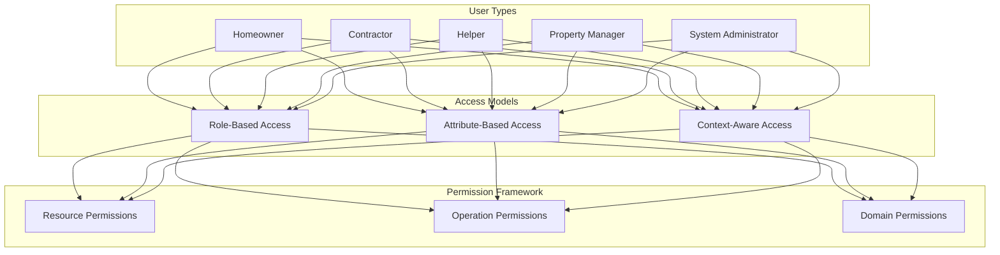

#### User Type Security Model

| User Type | Default Access Level | Verification Requirements | Security Constraints |
|-----------|---------------------|--------------------------|---------------------|
| Homeowner | Basic project creation | Email verification | Limited contractor data access |
| Contractor | Bid submission, profile management | Email, phone, license verification | Project data isolation |
| Helper | Task execution, limited data access | Email, contractor association | Delegated permissions only |
| Property Manager | Multi-property management | Email, phone, business verification | Client data partitioning |
| System Administrator | Platform operation access | Employment verification, background check | Segregation of duties, MFA requirement |

#### Permission Enforcement Architecture

1. **Role Definitions**
   - Standard roles with predefined permission sets
   - Role inheritance hierarchy
   - Role composition for complex access patterns

2. **Resource Access Controls**
   - Resource ownership model
   - Explicit sharing with permission levels
   - Domain boundary enforcement

3. **Operation Authorization**
   - Operation-specific permission checks
   - Context-sensitive authorization
   - Temporal and state-based permissions

4. **Administrative Access**
   - Fine-grained admin permissions
   - Administrative action logging
   - Just-in-time privilege elevation

## Authorization Framework

### RBAC Implementation

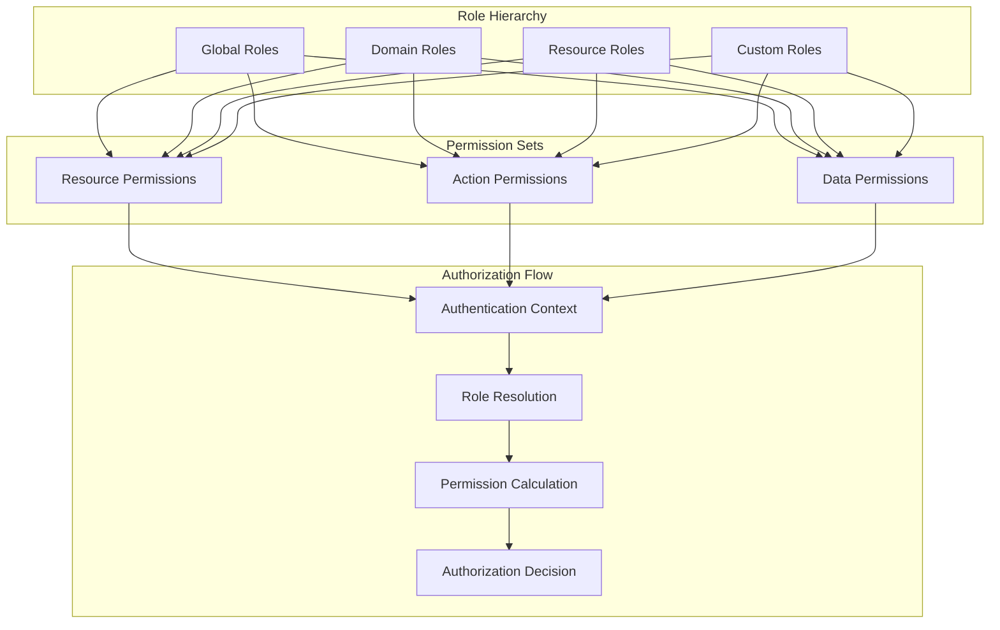

#### Role Definitions

| Role Category | Examples | Inheritance | Assignment Process |
|---------------|----------|------------|-------------------|
| Global Roles | User, Admin, Guest | None | System-assigned at registration |
| Domain Roles | ProjectOwner, Bidder, Helper | Global roles | Context-specific assignment |
| Resource Roles | DocumentEditor, TeamMember | Domain roles | Resource-level assignment |
| Custom Roles | ProjectManager, QualityInspector | Various | Dynamic composition of permissions |

#### Permission Model

| Permission Type | Structure | Evaluation | Example |
|-----------------|-----------|------------|---------|
| Resource Permission | `resource:action` | Direct mapping | `project:read` |
| Action Permission | `domain:action:context` | Context-based | `bid:submit:public` |
| Data Permission | `data:field:operation` | Field-level | `user:contact:read` |

#### Authorization Implementation

```typescript
// Example: Role-based permission check middleware
const checkPermission = (
  requiredPermission: string,
  contextExtractor?: (req: Request) => string
) => {
  return async (req: Request, res: Response, next: NextFunction) => {
    try {
      // Get authenticated user
      const user = req.user;
      if (!user) {
        return res.status(401).json({ error: 'Authentication required' });
      }
      
      // Get user's roles
      const roles = await getRolesForUser(user.id);
      
      // Get permissions for all roles
      const permissions = await getPermissionsForRoles(roles);
      
      // Check for specific permission
      const hasPermission = permissions.some(permission => {
        // For context-sensitive permissions
        if (contextExtractor && permission.includes('${context}')) {
          const context = contextExtractor(req);
          return permission.replace('${context}', context) === requiredPermission;
        }
        
        // Direct permission match
        return permission === requiredPermission || permission === '*';
      });
      
      if (!hasPermission) {
        return res.status(403).json({ error: 'Permission denied' });
      }
      
      // User has permission, proceed to handler
      next();
    } catch (error) {
      next(error);
    }
  };
};

// Example: Fine-grained field-level authorization
const authorizeResponseFields = (
  user: User,
  resource: any,
  resourceType: string
): any => {
  // Get user's permissions for this resource type
  const permissions = getUserPermissionsForResource(user, resourceType);
  
  // Start with empty authorized result
  const authorizedResult = {};
  
  // Process each field based on permissions
  Object.keys(resource).forEach(field => {
    const fieldPermission = `${resourceType}:${field}:read`;
    
    // Field is authorized if user has permission
    if (permissions.includes(fieldPermission) || permissions.includes(`${resourceType}:*:read`)) {
      authorizedResult[field] = resource[field];
    }
  });
  
  return authorizedResult;
};
```

### Attribute-Based Access Control (ABAC)

For more complex authorization scenarios, the system implements ABAC extensions to the RBAC model:

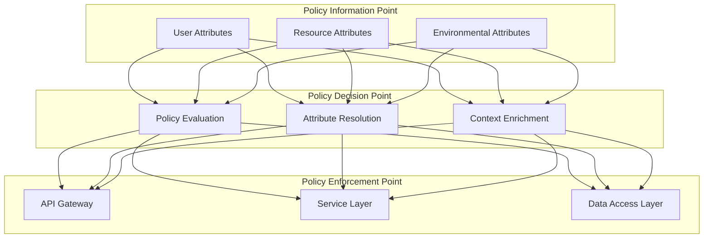

#### ABAC Implementation

```typescript
// Example: Policy evaluation with attributes
interface PolicyContext {
  user: {
    id: string;
    roles: string[];
    verificationLevel: string;
    attributes: Record<string, any>;
  };
  resource: {
    type: string;
    id: string;
    ownerId: string;
    status: string;
    attributes: Record<string, any>;
  };
  environment: {
    timestamp: Date;
    clientIp: string;
    location: string;
    riskScore: number;
  };
  action: {
    type: string;
    target: string;
    parameters: Record<string, any>;
  };
}

// Policy definition
interface Policy {
  id: string;
  effect: 'allow' | 'deny';
  condition: (context: PolicyContext) => boolean;
}

// Example policy: Contractors can only submit bids for open projects
const contractorBidPolicy: Policy = {
  id: 'contractor-bid-submission',
  effect: 'allow',
  condition: (ctx: PolicyContext): boolean => {
    // Check if user is a contractor
    const isContractor = ctx.user.roles.includes('contractor');
    
    // Check if resource is a project
    const isProject = ctx.resource.type === 'project';
    
    // Check if action is submitting a bid
    const isSubmitBid = ctx.action.type === 'submit' && ctx.action.target === 'bid';
    
    // Check if project is open for bids
    const isProjectOpen = ctx.resource.status === 'open';
    
    // Allow if all conditions are met
    return isContractor && isProject && isSubmitBid && isProjectOpen;
  }
};

// Policy evaluation engine
const evaluatePolicy = (
  policies: Policy[],
  context: PolicyContext
): boolean => {
  // Check for explicit deny policies first (deny overrides)
  const denyPolicies = policies.filter(p => p.effect === 'deny');
  for (const policy of denyPolicies) {
    if (policy.condition(context)) {
      return false; // Denied by policy
    }
  }
  
  // Then check for any allow policy
  const allowPolicies = policies.filter(p => p.effect === 'allow');
  for (const policy of allowPolicies) {
    if (policy.condition(context)) {
      return true; // Allowed by policy
    }
  }
  
  // Default to deny if no policy explicitly allows
  return false;
};
```

### Privilege Management

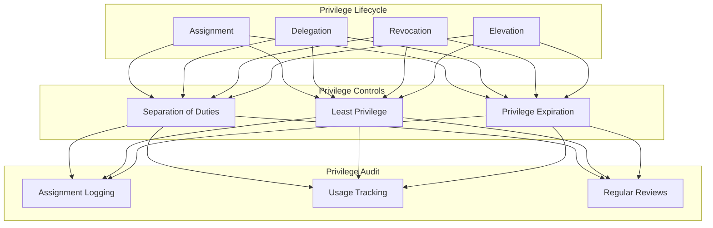

#### Privilege Assignment and Delegation

| Privilege Type | Assignment Method | Delegation Capability | Revocation Impact |
|----------------|-------------------|----------------------|-------------------|
| Basic User Rights | Automatic at registration | None | Account suspension |
| Role-Based Privileges | Administrative assignment | Limited delegation | Role removal |
| Resource Ownership | Creation or transfer | Granular permission sharing | Access removal, content preservation |
| Administrative Access | Formal assignment process | Temporary delegation for specific tasks | Complete access removal |

#### Administrative Access Controls

1. **Just-in-Time Privilege Elevation**
   - Time-limited administrative access
   - Purpose-specific approval workflow
   - Enhanced logging during elevated access

2. **Segregation of Administrative Duties**
   - Separate user management from system configuration
   - Divided access to financial and operational controls
   - Tiered approval workflows for critical changes

3. **Administrative Audit Trail**
   - Immutable logs of all administrative actions
   - Regular review of administrative activities
   - Anomaly detection for unusual administrative patterns

## Data Protection

### Data Classification and Handling

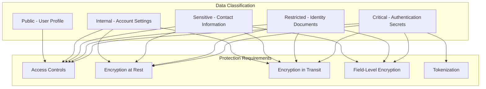

#### Data Protection Implementation

| Data Category | Protection Methods | Storage | Retention Policy | Access Controls |
|---------------|-------------------|---------|-----------------|----------------|
| Public Data | TLS in transit | Standard database | Platform lifetime | Public or authenticated, caching allowed |
| Internal Data | TLS, database encryption | Standard database | Platform lifetime | Authenticated, role-based, no caching |
| Sensitive Data | TLS, field encryption | Encrypted fields | According to legal requirements | Need-to-know basis, audit logged |
| Restricted Data | TLS, field encryption | Encrypted fields, secure storage | Minimum necessary | Strictly limited access, workflow approvals |
| Critical Data | TLS, field encryption, tokenization | Secure encrypted storage | Minimum necessary | System-only access, no direct user access |

### Encryption Strategy

```mermaid
graph TD
    subgraph "Key Management"
        KM1[Master Keys]
        KM2[Data Encryption Keys]
        KM3[User-specific Keys]
    end
    
    subgraph "Encryption Locations
