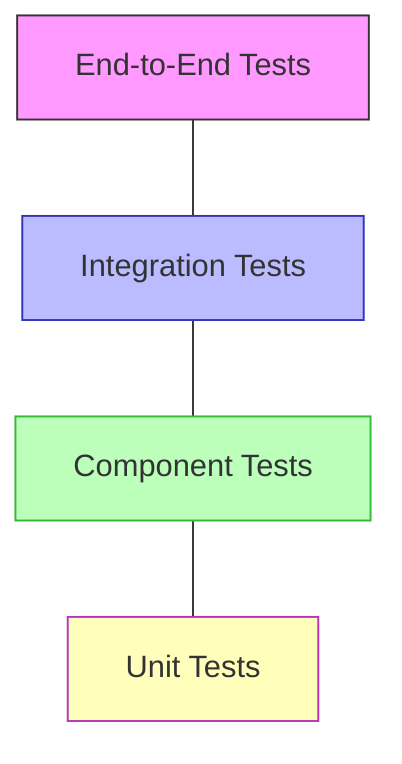

# Labor Marketplace Testing Strategy

This document outlines the comprehensive testing strategy for the Labor Marketplace domain. It covers approaches to different types of testing, test automation, test environments, and quality metrics to ensure robustness, performance, and security across all components.

## Testing Objectives

The Labor Marketplace testing strategy aims to:

1. **Ensure Functional Correctness**: All Labor Marketplace features work as specified across all user types (helpers, clients, verifiers)
2. **Verify System Integrations**: Correctly interact with internal domains and external services
3. **Validate Security Controls**: Protect sensitive PII data and verification information
4. **Confirm Performance Targets**: Meet response time and throughput requirements under various load conditions
5. **Support Regional Compliance**: Test region-specific behaviors and data handling
6. **Enable Continuous Delivery**: Provide rapid, reliable feedback for code changes
7. **Verify Mobile Experience**: Ensure consistent functionality across web and mobile platforms

## Testing Pyramid

The Labor Marketplace domain follows a balanced testing approach represented as a pyramid:



### Distribution Target

| Test Type | Percentage | Description |
|-----------|------------|-------------|
| Unit Tests | 70% | Fast, focused tests of individual functions and classes |
| Component Tests | 20% | Tests of service behaviors in isolation |
| Integration Tests | 7% | Tests of service interactions and domain integrations |
| End-to-End Tests | 3% | Full system tests with real or realistic dependencies |

## Test Types

### Unit Testing

**Scope**: Individual functions, methods, and classes

**Tools**:
- Jest for JavaScript/TypeScript
- JUnit for Java components
- pytest for Python components

**Key Strategies**:
1. **Pure Function Testing**: Validate inputs and outputs
2. **Mock Dependencies**: Use dependency injection and mocking
3. **State Verification**: Test state transitions
4. **Error Handling**: Test error cases and boundary conditions
5. **Test Coverage**: Aim for >90% branch coverage

**Domain-Specific Focus Areas**:
1. Helper profile validation logic
2. Job matching algorithms
3. Verification state machines
4. Rating calculation logic
5. Time tracking calculations
6. Permission checks
7. Search query builders

**Example: Helper Availability Logic Testing**

```typescript
describe('Helper Availability Service', () => {
  test('should correctly check if helper is available for a specific time slot', () => {
    // Setup test data
    const helper = createTestHelper({
      availability: [
        { dayOfWeek: 1, startTime: '09:00', endTime: '17:00' },
        { dayOfWeek: 3, startTime: '09:00', endTime: '17:00' }
      ],
      unavailableDates: [
        { date: '2025-06-15', reason: 'Vacation' }
      ]
    });
    
    const availabilityService = new HelperAvailabilityService();
    
    // Test available slot
    expect(
      availabilityService.isAvailable(
        helper.id, 
        new Date('2025-06-16T10:00:00'), // Monday at 10 AM
        new Date('2025-06-16T16:00:00')  // Monday at 4 PM
      )
    ).toBe(true);
    
    // Test unavailable day of week
    expect(
      availabilityService.isAvailable(
        helper.id, 
        new Date('2025-06-17T10:00:00'), // Tuesday at 10 AM
        new Date('2025-06-17T16:00:00')  // Tuesday at 4 PM
      )
    ).toBe(false);
    
    // Test blocked date
    expect(
      availabilityService.isAvailable(
        helper.id, 
        new Date('2025-06-15T10:00:00'), // Blocked vacation day
        new Date('2025-06-15T16:00:00')
      )
    ).toBe(false);
  });
});
```

### Component Testing

**Scope**: Individual services and their direct dependencies

**Tools**:
- Jest with supertest for API testing
- TestContainers for database tests
- Mock Service Worker for API mocking

**Key Strategies**:
1. **API Contract Testing**: Validate API endpoints against specifications
2. **Database Interaction Testing**: Verify persistence operations
3. **Event Testing**: Validate event publishing/consumption
4. **State Transitions**: Test service-level workflows
5. **Error Handling**: Verify error responses and failure modes

**Domain-Specific Focus Areas**:
1. Helper profile service CRUD operations
2. Job posting and application flows
3. Verification service integrations
4. Assignment lifecycle
5. Search service functionality
6. File upload/download operations

**Example: Job Application API Testing**

```typescript
describe('Job Application API', () => {
  let database: TestDatabase;
  let server: TestServer;
  
  beforeAll(async () => {
    database = await TestDatabase.start();
    server = await TestServer.start({
      database: database.url,
      mockServices: {
        notificationService: true,
        messagingService: true
      }
    });
  });
  
  afterAll(async () => {
    await server.stop();
    await database.stop();
  });
  
  test('should successfully submit a job application', async () => {
    // Setup test data
    const helper = await database.helpers.create({ /* helper data */ });
    const job = await database.jobs.create({ /* job data */ });
    
    // Submit application
    const response = await request(server.url)
      .post(`/labor/job-posts/${job.id}/applications`)
      .set('Authorization', `Bearer ${helper.generateToken()}`)
      .send({
        coverLetter: 'I am interested in this job because...',
        hourlyRate: 25,
        availableStartDate: '2025-07-01'
      });
    
    // Verify response
    expect(response.status).toBe(201);
    expect(response.body).toMatchObject({
      id: expect.any(String),
      helperId: helper.id,
      jobPostId: job.id,
      status: 'submitted',
      submissionDate: expect.any(String)
    });
    
    // Verify database state
    const savedApplication = await database.applications.findById(response.body.id);
    expect(savedApplication).toMatchObject({
      helperId: helper.id,
      jobPostId: job.id,
      status: 'submitted'
    });
    
    // Verify events
    expect(server.publishedEvents).toContainEqual({
      type: 'job.application.submitted',
      payload: expect.objectContaining({
        applicationId: response.body.id,
        helperId: helper.id,
        jobPostId: job.id
      })
    });
  });
  
  test('should reject application for already applied job', async () => {
    // Setup test data with existing application
    const helper = await database.helpers.create();
    const job = await database.jobs.create();
    await database.applications.create({
      helperId: helper.id,
      jobPostId: job.id,
      status: 'submitted'
    });
    
    // Try to submit duplicate application
    const response = await request(server.url)
      .post(`/labor/job-posts/${job.id}/applications`)
      .set('Authorization', `Bearer ${helper.generateToken()}`)
      .send({
        coverLetter: 'I am interested in this job because...',
        hourlyRate: 25,
        availableStartDate: '2025-07-01'
      });
    
    // Verify rejection
    expect(response.status).toBe(409); // Conflict
    expect(response.body).toMatchObject({
      code: 'already_applied',
      message: expect.any(String)
    });
  });
});
```

### Integration Testing

**Scope**: Interactions between multiple services or domains

**Tools**:
- Jest or Mocha for test orchestration
- Pact for contract testing
- Docker Compose for dependency orchestration

**Key Strategies**:
1. **Service Interaction Testing**: Verify correct service interactions
2. **Contract Testing**: Confirm service API compliance
3. **External Dependency Testing**: Test integration with external services
4. **Data Flow Testing**: Verify end-to-end data flows
5. **Event Chain Testing**: Test event propagation across services

**Domain-Specific Focus Areas**:
1. Labor Marketplace to User Management interactions
2. Job to Payment domain workflows
3. Verification service to background check provider integration
4. Notification workflows across domains
5. Cross-domain event propagation

**Example: Verification Service Integration with Background Check Provider**

```typescript
describe('Background Check Integration', () => {
  let verificationService: TestVerificationService;
  let mockBackgroundCheckProvider: MockBackgroundCheckService;
  
  beforeAll(async () => {
    mockBackgroundCheckProvider = await MockBackgroundCheckService.start();
    verificationService = await TestVerificationService.start({
      backgroundCheckApiUrl: mockBackgroundCheckProvider.url
    });
  });
  
  afterAll(async () => {
    await verificationService.stop();
    await mockBackgroundCheckProvider.stop();
  });
  
  test('should request background check and process result webhook', async () => {
    // Setup test data
    const helper = await createTestHelper();
    
    // Initiate background check
    const initiateResponse = await verificationService.initiateBackgroundCheck(helper.id);
    expect(initiateResponse).toMatchObject({
      status: 'pending',
      checkId: expect.any(String),
      redirectUrl: expect.stringContaining(mockBackgroundCheckProvider.url)
    });
    
    // Verify request to mock provider
    const requests = await mockBackgroundCheckProvider.getRequests();
    expect(requests).toHaveLength(1);
    expect(requests[0].body).toMatchObject({
      candidateId: expect.any(String),
      firstName: helper.firstName,
      lastName: helper.lastName,
      email: helper.email,
      redirectUrl: expect.stringContaining('verification/callback')
    });
    
    // Simulate webhook callback from provider
    await mockBackgroundCheckProvider.triggerWebhook({
      checkId: initiateResponse.checkId,
      status: 'completed',
      result: 'pass',
      completedAt: new Date().toISOString()
    });
    
    // Wait for processing and verify helper status update
    await waitFor(async () => {
      const updatedHelper = await verificationService.getHelper(helper.id);
      return updatedHelper.backgroundCheckStatus === 'passed';
    });
    
    // Verify events published
    const events = await verificationService.getPublishedEvents();
    expect(events).toContainEqual({
      type: 'helper.background_check.completed',
      payload: expect.objectContaining({
        helperId: helper.id,
        status: 'passed'
      })
    });
  });
});
```

### End-to-End Testing

**Scope**: Complete user flows across the entire system

**Tools**:
- Cypress for web application testing
- Detox for mobile application testing
- TestCafe for cross-browser testing

**Key Strategies**:
1. **Critical Path Testing**: Test essential user journeys
2. **Cross-Platform Testing**: Verify behavior across platforms
3. **Realistic Data Testing**: Use realistic data sets
4. **Realistic Environment Testing**: Test in production-like environment
5. **Performance Monitoring**: Capture performance metrics during tests

**Domain-Specific Focus Areas**:
1. Helper registration and onboarding
2. Job posting and helper matching
3. Application and hiring process
4. Work verification and payment
5. Dispute resolution
6. Skill verification workflows

**Example: Helper Job Application End-to-End Flow**

```javascript
describe('Helper Job Application Flow', () => {
  beforeEach(() => {
    // Set up test data via API calls
    cy.createTestHelper().then(helper => {
      cy.wrap(helper).as('helper');
    });
    
    cy.createTestJob().then(job => {
      cy.wrap(job).as('job');
    });
    
    // Login as helper
    cy.get('@helper').then(helper => {
      cy.login(helper.email, helper.password);
    });
  });
  
  it('should allow helper to find and apply to a job', () => {
    // Navigate to job search
    cy.visit('/helper/jobs');
    cy.get('[data-testid="search-input"]').type('construction');
    cy.get('[data-testid="search-button"]').click();
    
    // Find and select test job
    cy.get('@job').then(job => {
      cy.get(`[data-testid="job-card-${job.id}"]`).click();
    });
    
    // Review job details
    cy.get('[data-testid="job-title"]').should('be.visible');
    cy.get('[data-testid="job-description"]').should('be.visible');
    cy.get('[data-testid="job-requirements"]').should('be.visible');
    
    // Begin application
    cy.get('[data-testid="apply-button"]').click();
    
    // Fill application form
    cy.get('[data-testid="cover-letter"]')
      .type('I am interested in this job because I have 5 years of experience...');
    
    cy.get('[data-testid="hourly-rate"]').clear().type('25');
    
    cy.get('[data-testid="availability-selector"]').click();
    cy.get('[data-testid="date-picker"]').click();
    cy.get('.calendar-day-available').first().click();
    
    // Submit application
    cy.get('[data-testid="submit-application"]').click();
    
    // Verify success state
    cy.get('[data-testid="application-success"]').should('be.visible');
    cy.get('[data-testid="application-id"]').should('be.visible');
    
    // Verify application appears in helper's applications list
    cy.visit('/helper/applications');
    cy.get('@job').then(job => {
      cy.get(`[data-testid="application-item-${job.id}"]`).should('be.visible');
      cy.get(`[data-testid="application-status-${job.id}"]`)
        .should('have.text', 'Submitted');
    });
  });
});
```

## Specialized Testing Approaches

### Performance Testing

**Scope**: System behavior under various load conditions

**Tools**:
- k6 for API load testing
- Lighthouse for web performance
- JMeter for complex load scenarios

**Testing Scenarios**:

1. **Load Testing**:
   - Simulate expected peak loads for search functionality
   - Test concurrent job applications
   - Measure helper discovery performance
   - Evaluate verification process throughput

2. **Stress Testing**:
   - Simulate 3x expected load on job search
   - Test system behavior during major job listing events
   - Evaluate degradation patterns under extreme load

3. **Endurance Testing**:
   - Run system under moderate load for 24+ hours
   - Monitor for memory leaks and resource consumption
   - Verify database connection handling over time

4. **Spike Testing**:
   - Simulate sudden increase in helper registrations
   - Test rapid scaling of verification requests
   - Measure system recovery after traffic spikes

**Performance KPIs**:

| Metric | Target | Critical Threshold |
|--------|--------|-------------------|
| Job Search Response Time | < 300ms (95th percentile) | 1000ms |
| Helper Profile Load Time | < 200ms (95th percentile) | 800ms |
| Job Application Submission | < 500ms (95th percentile) | 2000ms |
| Verification API Response | < 300ms (95th percentile) | 1000ms |
| Max Concurrent Users | 5,000 | 1,000 |
| Database Query Time | < 50ms (95th percentile) | 200ms |
| Background Check Throughput | 10/second | 2/second |

**Example: Job Search Load Test**

```javascript
import http from 'k6/http';
import { check, sleep } from 'k6';

export const options = {
  stages: [
    { duration: '2m', target: 100 }, // Ramp up to 100 users
    { duration: '5m', target: 100 }, // Stay at 100 users
    { duration: '2m', target: 200 }, // Ramp up to 200 users
    { duration: '5m', target: 200 }, // Stay at 200 users
    { duration: '2m', target: 300 }, // Ramp up to 300 users
    { duration: '5m', target: 300 }, // Stay at 300 users
    { duration: '2m', target: 0 },   // Ramp down to 0 users
  ],
  thresholds: {
    'http_req_duration': ['p(95)<500'], // 95% of requests must complete within 500ms
    'http_req_failed': ['rate<0.01'],   // Error rate must be less than 1%
  },
};

export default function() {
  const searchTerms = [
    'construction',
    'plumbing',
    'electrical',
    'painting',
    'landscaping',
    'cleaning',
    'handyman',
    'carpentry',
    'roofing',
    'flooring'
  ];
  
  const zipCodes = [
    '10001', '90210', '60601', '75001', '33101',
    '20001', '02101', '98101', '30301', '77001'
  ];
  
  // Randomly select search parameters
  const searchTerm = searchTerms[Math.floor(Math.random() * searchTerms.length)];
  const zipCode = zipCodes[Math.floor(Math.random() * zipCodes.length)];
  const radius = Math.floor(Math.random() * 4) * 5 + 5; // 5, 10, 15, or 20 miles
  
  // Perform search request
  const response = http.get(
    `https://api.instabids.com/v1/labor/helpers?skillKeyword=${searchTerm}&zip=${zipCode}&radius=${radius}&limit=20`
  );
  
  // Check response
  check(response, {
    'status is 200': (r) => r.status === 200,
    'response time < 500ms': (r) => r.timings.duration < 500,
    'contains results': (r) => JSON.parse(r.body).data.length > 0,
  });
  
  sleep(Math.random() * 3 + 1); // Random sleep between 1-4 seconds
}
```

### Security Testing

**Scope**: Security vulnerabilities and controls

**Tools**:
- OWASP ZAP for dynamic security testing
- SonarQube for static security analysis
- Burp Suite for penetration testing
- TruffleHog for secrets scanning

**Testing Approaches**:

1. **Automated Security Scanning**:
   - Weekly automated scans with OWASP ZAP
   - Daily static analysis with SonarQube
   - Pre-commit secrets scanning
   - Dependency vulnerability scanning

2. **Manual Penetration Testing**:
   - Quarterly penetration testing by security team
   - Focus on authentication and authorization
   - Special attention to PII data protection
   - Verification system penetration testing

3. **Compliance Testing**:
   - GDPR compliance verification
   - CCPA/CPRA testing
   - PCI-DSS compliance for payment flows
   - FCRA compliance for background checks

**Domain-Specific Security Tests**:

1. **Identity Verification System**:
   - Attempt verification bypass
   - Test document forgery detection
   - Verify encryption of sensitive documents
   - Test verification result tampering protection

2. **Background Check Process**:
   - Verify data minimization implementation
   - Test consent workflow security
   - Validate secure API communications
   - Verify result data protection

3. **Helper-Client Communication**:
   - Test message content filtering
   - Verify PII protection in messages
   - Test contact information leakage prevention
   - Validate message thread authorization

4. **Payment Processing**:
   - Test payment authorization security
   - Verify escrow release controls
   - Test payment amount tampering prevention
   - Validate payment dispute security

**Example: Identity Verification Security Test Plan**

```markdown
## Identity Verification Security Test Plan

### Test Objectives
1. Verify secure handling of identity documents
2. Test authorization controls on verification endpoints
3. Validate secure communication with identity verification provider
4. Test protection against verification result tampering

### Test Scenarios

#### 1. Document Upload Security
- Attempt to upload malicious files (e.g., executables with image extensions)
- Test for path traversal vulnerabilities in document storage
- Verify document encryption at rest
- Test access controls on stored documents

#### 2. Authorization Control Tests
- Attempt to verify another user's identity
- Test access to verification results without proper authorization
- Attempt to modify verification status directly
- Test verification admin role access controls

#### 3. Provider Communication Security
- Test for TLS certificate validation
- Verify webhook signature validation
- Test for API token exposure
- Validate secure handling of provider credentials

#### 4. Result Integrity Tests
- Attempt to modify verification results in transit
- Test database integrity controls for verification status
- Verify audit logging of verification status changes
- Test verification result non-repudiation measures

### Acceptance Criteria
- All test scenarios must pass without security vulnerabilities
- No sensitive data should be exposed during testing
- All verification flows must maintain integrity
- All security controls must function as designed
```

### Accessibility Testing

**Scope**: Accessibility compliance and usability

**Tools**:
- Axe for automated accessibility testing
- NVDA and VoiceOver for screen reader testing
- Lighthouse for accessibility scoring
- Color contrast analyzers

**Testing Approaches**:

1. **Automated Testing**:
   - Integration of Axe in CI/CD pipeline
   - Weekly accessibility scans of all critical flows
   - Component-level accessibility testing

2. **Manual Testing**:
   - Screen reader compatibility testing
   - Keyboard navigation testing
   - Color contrast verification
   - Touch target size validation

**Critical User Flows for Accessibility**:

1. **Helper Onboarding**:
   - Profile creation
   - Skill registration
   - Availability setting
   - Document upload

2. **Job Application Process**:
   - Job discovery and filtering
   - Job details review
   - Application submission
   - Application status tracking

3. **Work Management**:
   - Check-in/check-out process
   - Time tracking
   - Work documentation
   - Payment receipt

**Example: Accessibility Test Task**

```typescript
describe('Job Listing Accessibility', () => {
  beforeEach(() => {
    cy.visit('/jobs');
    cy.injectAxe();
  });
  
  it('should have no accessibility violations on job listings page', () => {
    cy.checkA11y();
  });
  
  it('should allow keyboard navigation through job listings', () => {
    // Move to search filters
    cy.get('[data-testid="search-filter"]').focus();
    cy.realPress('Tab');
    
    // Tab through search options
    for (let i = 0; i < 5; i++) {
      cy.focused().should('be.visible');
      cy.realPress('Tab');
    }
    
    // Tab to first job listing
    cy.focused()
      .should('have.attr', 'data-testid')
      .and('include', 'job-card');
    
    // Test keyboard selection
    cy.realPress('Enter');
    cy.url().should('include', '/jobs/');
  });
  
  it('should be usable with screen readers', () => {
    // Check for proper ARIA labels
    cy.get('[data-testid="job-cards-container"]')
      .should('have.attr', 'aria-label');
    
    // Check that job cards have proper headings
    cy.get('[data-testid^="job-card-"]')
      .each($card => {
        cy.wrap($card)
          .find('h2, h3')
          .should('exist');
      });
    
    // Verify screen reader can access key information
    cy.get('[data-testid^="job-card-"]').first()
      .should('have.attr', 'aria-labelledby')
      .then(labelId => {
        cy.get(`#${labelId}`).should('exist');
      });
    
    // Test landmarks and regions
    cy.get('main').should('exist');
    cy.get('[role="search"]').should('exist');
  });
});
```

## Test Environments

### Environment Strategy

The Labor Marketplace domain employs multiple test environments for different testing purposes:

| Environment | Purpose | Data | Refresh Frequency | Access |
|-------------|---------|------|-------------------|--------|
| Development | Developer testing | Synthetic | On-demand | Developers |
| Integration | Cross-domain testing | Synthetic | Daily | QA Team, Developers |
| Staging | Pre-production validation | Anonymized production | Weekly | QA Team, Product Managers |
| Production | Live monitoring | Real data | N/A | Operations, Limited QA |

### Environment Configuration

1. **Development Environment**:
   - Individual developer instances
   - Mocked external dependencies
   - Shared database with isolated schemas
   - Containerized dependencies

2. **Integration Environment**:
   - Shared environment for merged changes
   - Test versions of internal domain services
   - Mock external service providers
   - Persistent test data

3. **Staging Environment**:
   - Production-like configuration
   - Connected to staging versions of dependencies
   - Sanitized copy of production data
   - Full deployment pipeline

4. **Production Monitoring**:
   - Synthetic transaction monitoring
   - Canary testing for new features
   - A/B testing infrastructure
   - Performance monitoring

## Test Data Management

### Test Data Strategy

The Labor Marketplace domain uses a multi-layered approach to test data:

1. **Generated Test Data**:
   - Programmatically generated realistic test data
   - Controlled randomization for edge cases
   - Generated once and stored for consistency
   - Used in unit and component tests

2. **Anonymized Production Data**:
   - Production data with PII removed/scrambled
   - Retains realistic distributions and patterns
   - Used for performance and integration testing
   - Refreshed weekly from production

3. **Seed Data Scripts**:
   - Predefined data sets for specific test scenarios
   - Version-controlled alongside code
   - Used to initialize test environments
   - Includes edge cases and special scenarios

### Test Data Generation

The domain uses a custom data generation framework that creates realistic data for:

1. **Helper Profiles**:
   - Various skill combinations
   - Different verification levels
   - Diverse availability patterns
   - Range of ratings and experience levels

2. **Job Posts**:
   - Different job types and durations
   - Various skill requirements
   - Geographic distribution
   - Range of payment models

3. **Applications and Assignments**:
   - Various application statuses
   - Different completion rates
   - Range of dispute scenarios
   - Various payment situations

**Example: Helper Profile Generator**

```typescript
class HelperProfileGenerator {
  /**
   * Generate a specified number of helper profiles
   */
  generateHelpers(count: number, options: GeneratorOptions = {}): HelperProfile[] {
    const helpers: HelperProfile[] = [];
    
    for (let i = 0; i < count; i++) {
      // Generate base profile
      const profile = this.generateBaseProfile(options);
      
      // Add skills based on options
      profile.skills = this.generateSkills(
        options.skillCount || Math.floor(Math.random() * 5) + 1,
        options.skillCategories
      );
      
      // Generate availability
      profile.availability = this.generateAvailability(
        options.availabilityDensity || 'medium'
      );
      
      // Set verification level
      profile.verificationLevel = this.pickVerificationLevel(
        options.verificationLevelDistribution
      );
      
      // Generate work history
      profile.workHistory = this.generateWorkHistory(
        options.experienceLevel || 'mixed'
      );
      
      // Add ratings
      profile.ratings = this.generateRatings(
        options.ratingLevel || 'average'
      );
      
      helpers.push(profile);
    }
    
    return helpers;
  }
  
  // Additional generator methods...
}
```

## Test Automation

### Automation Strategy

The Labor Marketplace domain employs a comprehensive test automation strategy:

1. **Continuous Integration**:
   - All code changes trigger automated tests
   - Unit and component tests run on every pull request
   - Integration tests run on main branch merges
   - End-to-end tests run nightly

2. **Test Selection**:
   - Impact-based test selection for PR validation
   - Critical path tests always run
   - Full regression test suite weekly
   - Performance tests on infrastructure changes

3. **Test Parallelization**:
   - Distributed test execution for faster feedback
   - Test sharding for large test suites
   - Parallel execution of independent test cases
   - Resource-intensive tests scheduled separately

4. **Test Results Management**:
   - Centralized test result dashboard
   - Trend analysis for test metrics
   - Flaky test detection and management
   - Test coverage visualization

### Automation Toolchain

| Testing Need | Primary Tool | Backup/Alternative |
|--------------|--------------|-------------------|
| Unit Testing | Jest | Mocha + Chai |
| API Testing | SuperTest | Postman |
| Database Testing | TestContainers | In-memory SQLite |
| UI Testing | Cypress | TestCafe |
| Mobile Testing | Detox | Appium |
| Performance Testing | k6 | JMeter |
| Security Testing | OWASP ZAP | Burp Suite |
| Accessibility Testing | Axe | Pa11y |
| Test Management | Xray for Jira | TestRail |
| Test Reporting | Allure | JUnit XML + Custom Dashboard |

### CI/CD Integration

```mermaid
graph TD
    PR[Pull Request] --> UnitTests[Unit Tests]
    UnitTests --> ComponentTests[Component Tests]
    ComponentTests --> CodeQuality[Code Quality & Security Scan]
    
    Merge[Merge to Main] --> IntegrationTests[Integration Tests]
    IntegrationTests --> DeployDev[Deploy to Dev]
    DeployDev --> E2ETests[E2E Tests]
    
    DeployStaging[Deploy to Staging] --> UITests[UI Tests]
    UITests --> PerformanceTests[Performance Tests]
    Performance
