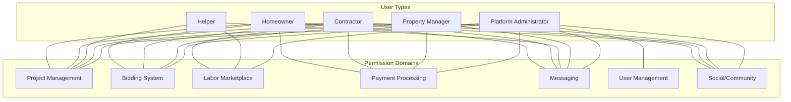

# User Type Capabilities Matrix

This document outlines the capabilities, permissions, and restrictions for each user type within the InstaBids platform. It serves as a comprehensive reference for understanding the role-based access control system and ensuring consistent implementation across the platform.

## Overview

The InstaBids platform supports multiple user types, each with distinct capabilities and permissions. This matrix defines what actions each user type can perform across various domains and features of the platform.



## Permission Levels

Permission levels define the degree of access a user has to a particular capability:

| Level | Symbol | Description |
|-------|--------|-------------|
| Full | ✅ | User has complete access to this capability with no restrictions |
| Limited | ⚠️ | User has access to this capability with certain restrictions or conditions |
| Owner-only | 👤 | User has access only for objects they own or are explicitly granted access to |
| None | ❌ | User has no access to this capability |
| Admin-only | 🔒 | Capability restricted to administrative users only |
| Configurable | ⚙️ | Access level can be configured by administrators or during setup |

## Homeowner Capabilities

Homeowners are individuals who create projects to find contractors for home improvement, construction, and maintenance work.

### Project Management

| Capability | Access Level | Notes |
|------------|--------------|-------|
| Create Projects | ✅ | Can create any type of project |
| Edit Projects | 👤 | Can only edit their own projects |
| Delete Projects | 👤 | Can only delete their own projects |
| View Projects | 👤 | Can view their own projects |
| Add Project Media | 👤 | Can add photos, videos, and documents to their projects |
| Set Budget | ✅ | Can set and update project budgets |
| Define Timeline | ✅ | Can set project timelines and deadlines |
| Create Dream Projects | ✅ | Can create aspirational projects without commitment |
| View Project Analytics | 👤 | Access to basic analytics for their projects |

### Bidding System

| Capability | Access Level | Notes |
|------------|--------------|-------|
| View Bids | 👤 | Can view bids on their own projects |
| Accept/Reject Bids | 👤 | Can accept or reject bids on their projects |
| Request Bid Changes | 👤 | Can request modifications to submitted bids |
| Compare Bids | ✅ | Can use comparison tools for received bids |
| Submit Bids | ❌ | Cannot submit bids (contractor capability) |
| View Contractor Profiles | ✅ | Can view profiles of contractors who bid or are recommended |
| Rate Contractors | 👤 | Can rate contractors after project completion |

### Payment Processing

| Capability | Access Level | Notes |
|------------|--------------|-------|
| Set Up Payment Methods | ✅ | Can add and manage payment methods |
| Make Payments | ✅ | Can make payments to contractors |
| Release Milestone Payments | 👤 | Can release funds for completed milestones |
| View Payment History | 👤 | Can view their payment history |
| Request Refunds | 👤 | Can request refunds for eligible transactions |
| Define Payment Schedule | 👤 | Can set up milestone payment schedules |
| Set Up Escrow | ✅ | Can use escrow services for project payments |

### Messaging

| Capability | Access Level | Notes |
|------------|--------------|-------|
| Message Contractors | ✅ | Can message contractors bidding on or working on their projects |
| Create Group Chats | ✅ | Can create group conversations with multiple contractors |
| Share Files | ✅ | Can share files and documents via messaging |
| Message History | 👤 | Can access their message history |
| Block/Report Users | ✅ | Can block or report problematic users |
| Notification Preferences | ✅ | Can configure notification settings |

### Social & Community Features

| Capability | Access Level | Notes |
|------------|--------------|-------|
| Post Projects to Community | ⚠️ | Can share projects with privacy limitations |
| View Shared Projects | ✅ | Can view projects shared by the community |
| Leave Reviews | 👤 | Can review contractors after project completion |
| Share Project Results | 👤 | Can share completed project details |
| Create/Join Groups | ✅ | Can create or join homeowner groups |
| Refer Friends | ✅ | Can refer others to the platform |

## Contractor Capabilities

Contractors are professionals who bid on and complete projects for homeowners.

### Project Management

| Capability | Access Level | Notes |
|------------|--------------|-------|
| Create Projects | ❌ | Cannot create homeowner projects |
| Edit Projects | ❌ | Cannot edit homeowner projects |
| View Projects | ✅ | Can view available projects that match their skills |
| Project Matching | ✅ | Receive matched projects based on profile and history |
| Track Project Progress | 👤 | Can track progress of awarded projects |
| Define Milestones | 👤 | Can define work milestones for awarded projects |
| Schedule Management | 👤 | Can manage their work schedule and availability |

### Bidding System

| Capability | Access Level | Notes |
|------------|--------------|-------|
| Submit Bids | ✅ | Can submit bids on open projects |
| Edit Bids | 👤 | Can edit their own bids before acceptance |
| Withdraw Bids | 👤 | Can withdraw their own bids before acceptance |
| View Bid Analytics | 👤 | Can see analytics on their bidding performance |
| Create Group Bids | ✅ | Can form contractor teams for complex projects |
| Counteroffer | ✅ | Can make counteroffers to homeowner requests |
| Bid Templates | ✅ | Can create and use bid templates |

### Labor Marketplace

| Capability | Access Level | Notes |
|------------|--------------|-------|
| Create Helper Listings | ✅ | Can create listings to find helpers |
| Hire Helpers | ✅ | Can hire helpers for assistance |
| Define Helper Roles | ✅ | Can specify helper responsibilities |
| Rate Helpers | 👤 | Can rate helpers who worked with them |
| Set Helper Rates | ✅ | Can define payment rates for helpers |
| Helper Schedule Management | ✅ | Can manage helper schedules |

### Payment Processing

| Capability | Access Level | Notes |
|------------|--------------|-------|
| Set Up Payment Methods | ✅ | Can add payment methods for receiving funds |
| View Expected Payments | 👤 | Can view scheduled incoming payments |
| Request Milestone Completion | 👤 | Can request verification of milestone completion |
| Send Invoices | 👤 | Can send additional invoices for approved changes |
| View Payment History | 👤 | Can view their payment history |
| Set Up Tax Information | ✅ | Can configure tax reporting details |

### Messaging

| Capability | Access Level | Notes |
|------------|--------------|-------|
| Message Homeowners | ✅ | Can message homeowners of projects they've bid on |
| Message Helpers | ✅ | Can message helpers they've hired |
| Create Group Chats | ✅ | Can create group conversations with team members |
| Share Files | ✅ | Can share files and documents via messaging |
| Message History | 👤 | Can access their message history |
| Message Templates | ✅ | Can create and use message templates |

### Social & Community Features

| Capability | Access Level | Notes |
|------------|--------------|-------|
| Public Profile | ✅ | Can create and maintain a public profile |
| Portfolio Management | ✅ | Can showcase completed projects |
| Verification & Badges | ✅ | Can earn verification and skill badges |
| Join Contractor Networks | ✅ | Can join professional networks |
| Create/Join Groups | ✅ | Can create or join contractor groups |
| Skill Endorsements | ✅ | Can receive and give skill endorsements |

## Helper Capabilities

Helpers are individuals who assist contractors with specific tasks or projects.

### Project Management

| Capability | Access Level | Notes |
|------------|--------------|-------|
| View Projects | ⚠️ | Limited to projects they're assigned to |
| Track Tasks | 👤 | Can track assigned tasks |
| Update Task Status | 👤 | Can update status of their assigned tasks |
| View Project Timeline | ⚠️ | Limited to their assigned timeframes |
| View Project Documents | ⚠️ | Limited to documents relevant to their tasks |

### Labor Marketplace

| Capability | Access Level | Notes |
|------------|--------------|-------|
| Create Helper Profile | ✅ | Can create and maintain a helper profile |
| Specify Skills | ✅ | Can list their skills and expertise |
| Set Availability | ✅ | Can define their availability calendar |
| Apply to Helper Positions | ✅ | Can apply to open helper listings |
| Rate Contractors | 👤 | Can rate contractors they've worked with |
| View Job History | 👤 | Can view their job history |

### Messaging

| Capability | Access Level | Notes |
|------------|--------------|-------|
| Message Contractors | ✅ | Can message contractors who hired them |
| Message Team Members | ✅ | Can message other helpers on the same project |
| View Message History | 👤 | Can access their message history |
| Notification Preferences | ✅ | Can configure notification settings |

## Property Manager Capabilities

Property managers oversee multiple properties and coordinate projects across them.

### Project Management

| Capability | Access Level | Notes |
|------------|--------------|-------|
| Create Projects | ✅ | Can create projects across managed properties |
| Edit Projects | 👤 | Can edit projects they've created |
| Delete Projects | 👤 | Can delete projects they've created |
| Multi-property Management | ✅ | Can manage projects across multiple properties |
| Client Approval Workflows | ✅ | Can set up approval workflows with property owners |
| Project Templates | ✅ | Can create and use project templates |
| Maintenance Scheduling | ✅ | Can schedule recurring maintenance projects |

### Bidding System

| Capability | Access Level | Notes |
|------------|--------------|-------|
| View Bids | 👤 | Can view bids on their projects |
| Accept/Reject Bids | 👤 | Can accept or reject bids based on approval workflows |
| Preferred Contractor Network | ✅ | Can maintain a network of preferred contractors |
| Bulk Bidding | ✅ | Can request bids for multiple similar projects |
| Compare Bids | ✅ | Can use comparison tools for received bids |
| Contractor Performance Tracking | ✅ | Can track contractor performance across projects |

### Payment Processing

| Capability | Access Level | Notes |
|------------|--------------|-------|
| Set Up Payment Methods | ✅ | Can add and manage payment methods |
| Client Billing | ✅ | Can bill property owners for project costs |
| Release Milestone Payments | 👤 | Can release funds for completed milestones |
| Payment Approval Workflows | ✅ | Can set up payment approval processes |
| Budget Management | ✅ | Can manage budgets across properties |
| Expense Tracking | ✅ | Can track expenses by property and category |

### Messaging

| Capability | Access Level | Notes |
|------------|--------------|-------|
| Message Contractors | ✅ | Can message contractors bidding on or working on their projects |
| Message Property Owners | ✅ | Can message property owners for approvals |
| Create Group Chats | ✅ | Can create group conversations with stakeholders |
| Share Files | ✅ | Can share files and documents via messaging |
| Message Templates | ✅ | Can create and use message templates |
| Communication History | 👤 | Can access communication history by property |

### Social & Community Features

| Capability | Access Level | Notes |
|------------|--------------|-------|
| Company Profile | ✅ | Can maintain a company profile |
| Property Portfolio | ⚠️ | Can showcase managed properties with privacy settings |
| Verified Business Status | ✅ | Can obtain verified business status |
| Join Property Management Networks | ✅ | Can join professional networks |
| Knowledge Base Contribution | ✅ | Can contribute to the knowledge base |
| Community Engagement Tools | ✅ | Can use tools to engage with property communities |

## Platform Administrator Capabilities

Platform administrators manage the InstaBids platform and provide support to users.

### User Management

| Capability | Access Level | Notes |
|------------|--------------|-------|
| User Account Management | 🔒 | Can view and manage user accounts |
| Role Assignment | 🔒 | Can assign roles to users |
| Account Verification | 🔒 | Can verify user accounts and credentials |
| Account Suspension | 🔒 | Can suspend problematic accounts |
| User Support | 🔒 | Can provide support to platform users |
| Permission Management | 🔒 | Can configure user permissions |

### Platform Administration

| Capability | Access Level | Notes |
|------------|--------------|-------|
| System Configuration | 🔒 | Can configure platform settings |
| Content Moderation | 🔒 | Can moderate user-generated content |
| Feature Management | 🔒 | Can enable/disable platform features |
| Analytics Access | 🔒 | Can access platform-wide analytics |
| Notification Management | 🔒 | Can manage system notifications |
| Security Controls | 🔒 | Can manage security settings |

### Content Management

| Capability | Access Level | Notes |
|------------|--------------|-------|
| Knowledge Base Management | 🔒 | Can manage the knowledge base content |
| Template Management | 🔒 | Can create and manage system templates |
| Category Management | 🔒 | Can manage project and skill categories |
| Community Guidelines | 🔒 | Can update community guidelines |
| Featured Content | 🔒 | Can select and manage featured content |

## Cross-Functional Capability Matrix

This matrix provides a quick reference for comparing capabilities across different user types.

| Capability | Homeowner | Contractor | Helper | Property Manager | Admin |
|------------|-----------|------------|--------|-----------------|-------|
| Create Projects | ✅ | ❌ | ❌ | ✅ | 🔒 |
| View Projects | 👤 | ✅ | ⚠️ | 👤 | 🔒 |
| Submit Bids | ❌ | ✅ | ❌ | ❌ | ❌ |
| Accept Bids | 👤 | ❌ | ❌ | 👤 | ❌ |
| Make Payments | ✅ | ❌ | ❌ | ✅ | ❌ |
| Receive Payments | ❌ | ✅ | ✅ | ❌ | ❌ |
| Messaging | ✅ | ✅ | ✅ | ✅ | 🔒 |
| Hire Helpers | ❌ | ✅ | ❌ | ❌ | ❌ |
| User Management | ❌ | ❌ | ❌ | ❌ | 🔒 |
| Rating/Reviews | 👤 | 👤 | 👤 | 👤 | ❌ |
| Public Profile | ✅ | ✅ | ✅ | ✅ | ❌ |
| Social Features | ✅ | ✅ | ⚠️ | ✅ | ❌ |
| System Config | ❌ | ❌ | ❌ | ❌ | 🔒 |

## Capability Implementation

The capabilities defined in this matrix are implemented through the InstaBids authorization framework, which uses a combination of:

1. **Role-Based Access Control (RBAC)**: Basic permissions are assigned based on user type
2. **Attribute-Based Access Control (ABAC)**: Additional permissions are determined by user attributes and context
3. **Resource-Based Access Control**: Ownership and explicit sharing determine access to specific resources

```typescript
// Example implementation of capability check
function hasCapability(
  user: User,
  capability: string,
  resource?: Resource
): boolean {
  // First check if user type has this capability at all
  const userTypeCapabilities = CAPABILITY_MATRIX[user.type];
  const capabilityLevel = userTypeCapabilities?.[capability];
  
  if (!capabilityLevel || capabilityLevel === '❌') {
    return false;
  }
  
  // Full access
  if (capabilityLevel === '✅') {
    return true;
  }
  
  // Admin-only access
  if (capabilityLevel === '🔒') {
    return user.isAdmin;
  }
  
  // Owner-only access - requires resource check
  if (capabilityLevel === '👤') {
    // No resource provided for owner-only capability
    if (!resource) {
      return false;
    }
    
    // Check ownership or explicit access grant
    return (
      resource.ownerId === user.id ||
      resource.sharedWith?.includes(user.id) ||
      user.hasRoleForResource(resource.id, 'manager')
    );
  }
  
  // Limited access - check specific conditions
  if (capabilityLevel === '⚠️') {
    // Implementation depends on the specific capability
    // and would include context-specific checks
    return checkLimitedCapabilityConditions(user, capability, resource);
  }
  
  // Configurable access - check configuration
  if (capabilityLevel === '⚙️') {
    return checkConfigurableAccess(user, capability);
  }
  
  return false;
}
```

## Capability Inheritance

Some user types may inherit capabilities from others in specific contexts:

1. **Property Manager as Homeowner Proxy**: Property managers inherit homeowner capabilities for properties they manage
2. **Helper as Contractor Delegate**: Helpers may be delegated specific contractor capabilities on a per-task basis
3. **Contractor Team Lead**: Team lead contractors have additional capabilities related to team management

## Future Capability Expansion

As the platform evolves, new capabilities will be added to this matrix. Planned capability expansions include:

1. **AI-Assisted Capability Automation**: Allowing certain user types to leverage AI for automated task execution
2. **Cross-Domain Workflow Capabilities**: Enabling seamless transitions between different platform domains
3. **Extended Delegation Model**: More granular capability delegation between user types
4. **Enhanced Analytics Capabilities**: Expanded reporting and insight capabilities for different user types

## Compliance and Regulatory Considerations

Certain capabilities are subject to regulatory requirements:

1. **Payment Processing**: Subject to financial regulations and PCI-DSS requirements
2. **Identity Verification**: Subject to KYC/AML regulations for certain user types
3. **Data Access**: Subject to privacy regulations (GDPR, CCPA)
4. **Professional Certification**: Subject to licensing and certification requirements by jurisdiction
